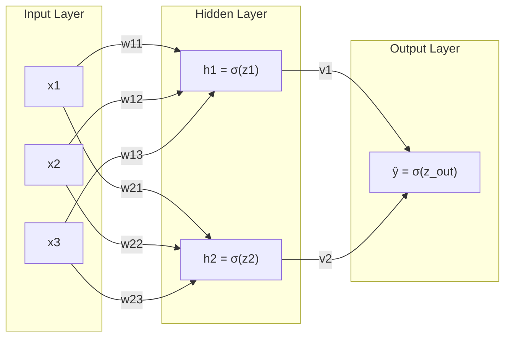
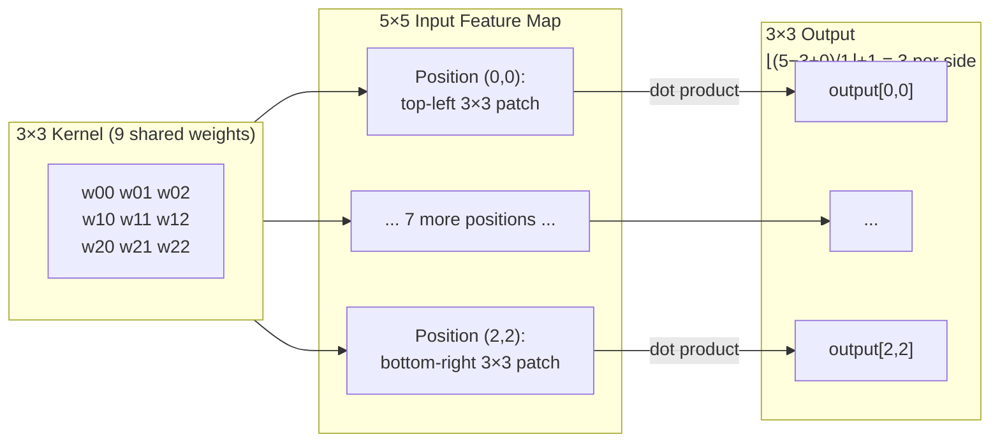
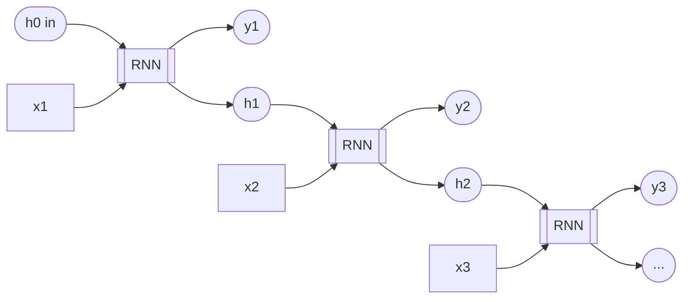
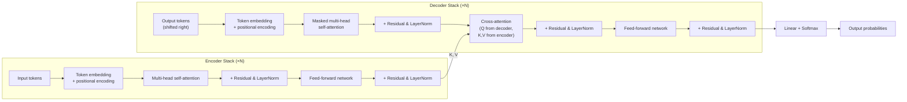

# Deep Learning and Generative AI: A Technical Primer

## Introduction

Deep learning is everywhere, and the explanations of it split into two unhelpful camps. The first treats neural networks as magic black boxes: you feed in data, gradient descent does something mysterious, and out comes a model that recognises faces or writes essays. This is comforting but useless — you cannot debug a black box, you cannot reason about when it will fail, and you certainly cannot build one. The second camp is the primary literature: dense academic papers that assume you already live in this world, written for reviewers rather than learners, with the load-bearing intuition compressed into a single sentence between two pages of notation.

This primer sits in the middle. The goal is full mathematical rigour built up from what you already know. You are not starting from zero — you know classical machine learning. You have trained models with gradient descent, you have fought overfitting with regularisation, you understand the bias-variance tradeoff in your bones, and you can explain why an SVM finds a maximum-margin separator. What you have not done is work with neural networks. So this primer does not re-explain what a loss function is or why you split data into train and validation sets. It explains the things that are genuinely new: what backpropagation actually computes, why depth buys you something width does not, why a transformer pays attention, and how a diffusion model turns noise into an image.

The promise is that you will finish able to reason about deep learning the way you already reason about classical ML — not as a believer in magic, but as someone who knows the failure modes, the design choices, and the mathematics underneath.

### What This Covers

This is a deep reference, not a tutorial. It covers neural network fundamentals — the perceptron, the multilayer perceptron, activation functions, the forward pass, and the training machinery of backpropagation and optimisation. From there it builds up the major architectures: convolutional networks (CNNs) for spatial data, recurrent networks (RNNs) for sequences, and the attention mechanism and transformers that now dominate the field. It covers large language models (LLMs) as the most visible product of that architecture. On the generative side it covers variational autoencoders (VAEs), generative adversarial networks (GANs), and diffusion models — three different answers to the question of how a network learns to produce new data rather than label existing data. It closes with the practical frameworks (PyTorch, JAX, TensorFlow) that turn all of this into running code.

The whole thing is designed for a reader who knows classical ML and wants the next layer down: the equations, the intuitions, and the reasons each design choice exists.

### What This Is Not

This is not a guide to training models from scratch on novel research problems. Reproducing a frontier result is its own discipline involving data pipelines, hyperparameter searches, and a great deal of patience; this primer gives you the conceptual foundation, not the lab notebook. It is also not a replacement for reading the primary papers. When something here matters to your work, the original paper will have details and caveats this document omits by design — read it. This primer does not cover classical ML; it assumes you already have it, and it leans on that assumption constantly. And it does not cover hardware engineering, distributed training infrastructure, or model serving at scale. Those are real and large topics, but they are about running deep learning systems in production, not about understanding what the systems are.

### Assumed Background

You should be comfortable with gradient descent — what a gradient is, why following its negative reduces a loss, and what a learning rate does. You should know loss functions (mean squared error, cross-entropy), regularisation (L1, L2, and the intuition for why penalising weights helps), and the overfitting/underfitting distinction along with the tools to diagnose it (cross-validation, train/validation splits). You should have working knowledge of classical models — at minimum decision trees and SVMs — enough to have an opinion about when a linear model is the wrong choice.

On the mathematics, you need linear algebra and calculus at the level of "knows what a matrix multiplication is and what a derivative means." You do not need to remember how to invert a matrix by hand or to recite the proof of the chain rule. You do need to be willing to read an equation slowly. Every piece of notation introduced here is explained the first time it appears.

### How This Guide Is Structured

The arc runs from foundations to frontier. It opens with why deep learning became viable when it did — a question of data, compute, and algorithms rather than raw cleverness. It then builds the multilayer perceptron from the single neuron up, and works through how such a network is trained: backpropagation, the optimisers, and the failure modes that make training hard. With those foundations in place, it moves to the specialised architectures — convolutional, recurrent, attentional — each motivated by the structure of the data it handles. From transformers it steps up to large language models, then turns to the generative families: VAEs, GANs, and diffusion. It closes on the frameworks and the practical concerns of building real systems. Each section assumes the ones before it, so the vanishing-gradient problem defined while discussing training is the same one that explains why recurrent networks struggle with long sequences.

## Why Deep Learning Now

Neural networks are not new. The perceptron dates to 1958. Backpropagation, the algorithm that trains modern networks, was understood and published in the 1980s. Multilayer networks, the universal approximation theorem, even convolutional architectures — the core ideas were all in the literature decades before deep learning "happened." So the interesting question is not who invented neural networks. It is why they sat largely dormant for thirty years and then, around 2012, abruptly became the most important technology in computing. The answer is not a single breakthrough. It is the simultaneous arrival of three ingredients that had each been missing: data, compute, and a handful of algorithmic fixes that made deep networks trainable in practice.

### Data

A neural network with millions of parameters is a high-capacity model. In classical-ML terms, it sits on the far end of the bias-variance tradeoff: enormous flexibility, and therefore enormous appetite for data. Train such a model on a few thousand examples and it memorises them — textbook overfitting. The capacity that makes deep networks powerful is a liability without data to constrain it.

For most of the field's history, that data did not exist in usable form. The thing that changed was the arrival of large, labelled datasets, and the canonical example is ImageNet. Released in 2009, ImageNet contained 1.2 million labelled training images across 1000 categories, hand-annotated at a scale nobody had attempted before. This mattered for a reason that is easy to undersell: a high-capacity model needs enough labelled examples to pin down its many degrees of freedom, and ImageNet was the first vision dataset large enough to do that for a deep network. Suddenly the model's appetite could be fed.

Once that loop closes, it accelerates. More data trains better models; better models power more useful products; useful products attract more users, who generate more data; and that data trains the next, better model. This virtuous cycle is why the organisations with the most user interaction tend to have the best models — not because their researchers are uniquely brilliant, but because the flywheel has been turning longer.

### Compute

Training a deep network is, computationally, an enormous pile of matrix multiplications. The forward pass multiplies inputs by weight matrices layer after layer; the backward pass multiplies gradients by transposed weight matrices on the way back. A CPU executes these operations more or less sequentially across a handful of cores, and for a large network that is painfully slow.

Graphics processing units (GPUs) turned out to be accidentally perfect for the job. A GPU was designed to render pixels, and rendering is itself matrix math — transforming millions of vertices and shading millions of pixels, all independently and in parallel. To do this, a GPU packs thousands of small arithmetic units that all run at once. A matrix multiplication is the ideal workload for that architecture: every entry of the output matrix is an independent dot product, so thousands of them can be computed simultaneously. Where a CPU steps through the multiplication, a GPU does a huge slab of it in one shot. The same hardware built to draw video-game frames could train neural networks one to two orders of magnitude faster than a CPU.

The moment this became undeniable was AlexNet in 2012, which was trained on two consumer NVIDIA GTX 580 cards. That a pair of gaming GPUs could train a network that crushed the competition was the proof of concept that reorganised the field's relationship with hardware. Since then the specialisation has gone further: Google's Tensor Processing Units (TPUs) are custom chips built specifically for the matrix multiplications and additions that dominate deep learning, stripping away the general-purpose machinery a GPU still carries.

It helps to have a rough sense of scale. Training compute is measured in FLOPs — floating-point operations. Multiplying an $m \times n$ matrix by an $n \times p$ matrix costs roughly $2mnp$ FLOPs (a multiply and an add for each of the $mnp$ inner-product terms). A single forward pass through a large network can be billions of FLOPs; a full training run, repeating that over millions of examples for many epochs, lands in the range of $10^{18}$ to $10^{24}$ FLOPs for modern models. These numbers are why the hardware matters: shaving the cost of a matrix multiply, or running more of them in parallel, is the difference between a training run that finishes in days and one that never finishes at all.

### Algorithms

Data and compute set the stage, but deep networks were still genuinely hard to train, and a cluster of algorithmic fixes — each sounding minor on its own — was collectively what made depth work.

The first was the activation function. Early networks used sigmoid or tanh activations, both of which saturate: push their input far from zero and the output flattens, so the derivative goes to nearly zero. Stack many such layers and the gradients shrink toward nothing as they propagate backward, leaving the early layers learning at a crawl. This is the vanishing gradient problem, derived fully in the training section. The fix was the rectified linear unit, ReLU, which is simply $\max(0, z)$. For any positive input its derivative is exactly 1, so it does not squash gradients on their way back. Swapping sigmoid for ReLU is a one-line change that suddenly made deep networks trainable.

Dropout arrived as a regularisation technique tailored to large networks: during training you randomly switch off a fraction of the neurons on each step, which prevents the network from leaning too hard on any single feature and forces it to build redundant, robust representations. Better weight initialisation schemes (Xavier and He, both covered in the training section) ensured that signals neither vanished nor exploded as they passed through a fresh, untrained network — a problem that had quietly sabotaged earlier attempts at depth. And batch normalisation, introduced in 2015, stabilised the distribution of activations inside the network during training, which let practitioners use higher learning rates and worry less about the exact initialisation. None of these is conceptually deep. Together they are most of the reason a ten-layer network in 2015 trained where a ten-layer network in 1995 would have stalled.

### Why Classical ML Hits a Ceiling

There is a deeper reason all of this matters, and it explains why deep learning did not just speed up classical ML but replaced it on whole categories of problem. Classical models work beautifully on structured, tabular data where the features are already meaningful — income, age, credit score. They struggle on unstructured data: raw images, audio, text. The reason is feature engineering.

A classical image classifier does not see an image; it sees whatever features you extract and hand it. So someone has to decide, in advance, what features matter. For decades this meant hand-designed feature extractors — SIFT for keypoints, HOG for gradient orientations — each a clever piece of engineering encoding a human's guess about what makes an image recognisable. The trouble is that this guess is exactly the hard part. The whole point of an image classifier is to learn what distinguishes a cat from a dog, and hand-designed features bake in a fixed, brittle answer before learning even begins. Change the lighting, the angle, or the scale and the features that worked on the training set fall apart.

Neural networks dissolve this problem by learning the features. The early layers of a trained vision network discover edge detectors and colour-blob detectors; middle layers compose those into textures and parts; late layers assemble parts into objects. Nobody designs this hierarchy — it emerges from gradient descent on the task. Feature extraction stops being a separate, brittle, human-engineered stage and becomes part of the model, learned end-to-end from data. This is the real shift, and it is why deep learning ate computer vision and natural language processing rather than merely improving them.

### The ImageNet Moment

All three ingredients converged in a single, legible event. The ImageNet Large Scale Visual Recognition Challenge (ILSVRC) was an annual competition to classify ImageNet images, and progress had been incremental — entries shaved fractions of a percent off the error rate using ever-more-elaborate hand-engineered pipelines. In 2012 a deep convolutional network called AlexNet won with a top-5 error rate around 16%, against roughly 26% for the second-place entry. A gap of about ten percentage points, in a competition where a single point was hard-won, was not an improvement. It was a different category of result.

What that gap meant to the field was unambiguous: the hand-engineered approach that everyone had been refining was simply outclassed by a network that learned its own features. Within a couple of years the entire competition had switched to deep learning, error rates kept tumbling, and the centre of gravity in computer vision — and soon natural language processing — moved decisively to neural networks. AlexNet did not introduce a fundamentally new idea; convolutional networks and backpropagation were old. What it did was demonstrate, on a benchmark nobody could argue with, that the three ingredients had finally arrived together. That is why deep learning is a story about 2012 and not about 1986.

## Neural Network Fundamentals

### The Perceptron

The neural network's founding metaphor is the biological neuron. A neuron receives signals from other neurons through its dendrites, sums them up, and if the total exceeds some threshold it fires, sending a signal down its axon to the neurons it connects to. Inputs arrive, they are combined, and a thresholded decision comes out. That is the whole picture, and it maps directly onto a piece of mathematics.

The artificial version — the perceptron — takes an input vector $\mathbf{x}$, weights each component by a corresponding weight, sums them, adds a bias, and passes the result through an activation function. Writing the weights as a vector $\mathbf{w}$ and the bias as a scalar $b$, the pre-activation is

$$z = \mathbf{w}^T \mathbf{x} + b,$$

and the output is $\sigma(z)$ for some activation function $\sigma$. The weights are the strengths of the incoming connections, the bias shifts the threshold, and the activation decides how the summed signal becomes an output. If $\sigma$ is a hard step function — output 1 when $z > 0$ and 0 otherwise — you have the original perceptron, a linear classifier that draws a hyperplane $\mathbf{w}^T \mathbf{x} + b = 0$ through the input space and labels everything on one side positive.

This is also where the perceptron's limitation becomes clear, and it is a limitation you can already name from classical ML: a single perceptron can only separate data that is linearly separable. The classic counterexample is XOR. Take two binary inputs and ask the network to output 1 when exactly one input is 1. Plot the four cases and you find the two positive cases sit on one diagonal and the two negatives on the other — there is no single straight line that puts the positives on one side and the negatives on the other. A single perceptron cannot represent XOR, and this is not a quirk of one toy problem. It is the general fact that one linear boundary is not enough for problems whose structure is not linearly separable. The fix is to stop using one neuron.

### From Perceptron to MLP

Stack neurons into layers and you get a multilayer perceptron (MLP). The input layer is just the input vector. One or more hidden layers each take the previous layer's outputs, apply their own weighted sums and activations, and pass the results forward. The output layer produces the final prediction. Each neuron in a layer connects to every neuron in the next — a "fully connected" or "dense" layer.

Two dimensions describe an MLP's size. Width is the number of neurons in a layer; depth is the number of layers. These are not interchangeable. Depth is composition of functions: each layer applies a transformation to the output of the layer below, so a deep network computes $f^{(L)}(\cdots f^{(2)}(f^{(1)}(\mathbf{x})))$. Composition is what makes depth powerful. A single wide layer can only build features directly from the raw input, but a deep network builds features from features — edges into textures into parts into objects — and this hierarchical composition expresses certain functions exponentially more compactly than a single layer ever could. There are functions a deep network represents with a modest number of neurons that a shallow network would need an astronomically larger width to match. Depth is not just more parameters; it is a qualitatively different way of building representations.

Here is a small MLP — three inputs, one hidden layer of two neurons, one output:



The pre-activations are $z_1 = w_{11}x_1 + w_{12}x_2 + w_{13}x_3 + b_1$, $z_2 = w_{21}x_1 + w_{22}x_2 + w_{23}x_3 + b_2$, and $z_\text{out} = v_1 h_1 + v_2 h_2 + b_\text{out}$.

Every arrow carries a weight, every hidden and output neuron adds a bias and applies an activation, and the signal flows strictly left to right. Read top to bottom and you can see the structure that gives the network its power: the hidden units $h_1$ and $h_2$ are intermediate features the network constructs for itself, and the output combines them. With enough hidden units arranged this way, the XOR problem that defeated a single perceptron becomes trivial — one hidden layer is enough to carve the input space into the regions XOR needs.

### Activation Functions

The hidden-layer activation $\sigma$ is not a cosmetic detail; without it the entire network collapses. Suppose every layer were purely linear — just $\mathbf{W}\mathbf{x} + \mathbf{b}$ with no nonlinearity. Then stacking two layers gives $\mathbf{W}^{(2)}(\mathbf{W}^{(1)}\mathbf{x} + \mathbf{b}^{(1)}) + \mathbf{b}^{(2)}$, which multiplies out to $(\mathbf{W}^{(2)}\mathbf{W}^{(1)})\mathbf{x} + (\text{some bias})$ — a single linear transformation. Any number of stacked linear layers is equivalent to one linear layer, so depth would buy you nothing at all. The nonlinearity between layers is precisely what stops this collapse and lets composition build genuinely new functions. Which nonlinearity you choose has consequences, and a few dominate practice.

**Sigmoid.** The classic squashing function,

$$\sigma(z) = \frac{1}{1 + e^{-z}},$$

maps any real input into the open interval $(0, 1)$, with a smooth S-shaped curve that is near 0 for large negative $z$, near 1 for large positive $z$, and passes through $0.5$ at the origin. Its bounded output makes it natural for representing probabilities at the output layer. As a hidden activation it has a fatal flaw: it saturates. When $z$ is large in magnitude the curve flattens, so its derivative is nearly zero. A neuron deep in the flat region passes almost no gradient backward — the first warning sign of the vanishing gradient problem that the training section makes precise.

**Tanh.** The hyperbolic tangent,

$$\tanh(z) = \frac{e^z - e^{-z}}{e^z + e^{-z}},$$

is a rescaled sigmoid that outputs values in $(-1, 1)$ instead of $(0, 1)$. The key improvement is that it is zero-centred: its output averages around zero rather than around $0.5$, which keeps the signal flowing into the next layer balanced and tends to make optimisation better-behaved. It is still an S-curve, though, and it still saturates at both extremes, so the vanishing-gradient problem is reduced but not solved.

**ReLU.** The rectified linear unit,

$$\text{ReLU}(z) = \max(0, z),$$

throws out the S-curve entirely. It is the identity for positive inputs and zero for negative ones — a hinge at the origin. For any positive input its derivative is exactly 1, so it does not squash gradients on the way back, and that single property is most of why deep networks became trainable. It is also trivially cheap to compute: a comparison and nothing else, against the exponentials that sigmoid and tanh require. ReLU has its own failure mode, the dead neuron problem. If a neuron's pre-activation is negative for every input it ever sees, its output is always zero, its gradient is always zero, and it never updates — it is dead, permanently. A large gradient step can knock a neuron into this state and it never recovers. In practice this is mitigated by careful initialisation and variants like leaky ReLU that allow a small negative slope, but the basic ReLU's combination of cheapness and non-saturation made it the default hidden activation for a decade.

**GELU.** The Gaussian error linear unit,

$$\text{GELU}(z) = z \cdot \Phi(z),$$

where $\Phi$ is the cumulative distribution function of the standard normal, is a smooth relative of ReLU. Instead of hard-gating the input with a step at zero, it gates the input by the probability $\Phi(z)$ that a standard normal variable falls below $z$ — so small inputs are softly suppressed and large inputs pass through nearly unchanged. The curve looks like ReLU with the sharp corner rounded off and a slight dip below zero for small negative inputs. That smoothness is the point. ReLU's derivative jumps discontinuously from 0 to 1 at the origin, and a smooth activation gives the optimiser a continuous gradient everywhere, which empirically helps training stability in very large models. GELU is the default activation in the transformer architectures behind BERT and the GPT family, where it consistently edges out plain ReLU.

### The Forward Pass

Putting the pieces together, the forward pass is the computation that turns an input into a prediction. Take a two-layer MLP for a ten-class classification problem — the classic MNIST digit setup. The input is a flattened $28 \times 28$ grayscale image, a 784-dimensional vector $\mathbf{x}$. The hidden layer has 256 units, and the output has 10 (one per digit).

The first layer applies its weights, bias, and activation:

$$\mathbf{h}^{(1)} = \sigma\!\left(\mathbf{W}^{(1)} \mathbf{x} + \mathbf{b}^{(1)}\right).$$

Here $\mathbf{W}^{(1)}$ has shape $256 \times 784$ — one row per hidden unit, one column per input feature — so $\mathbf{W}^{(1)} \mathbf{x}$ takes the 784-dimensional input to a 256-dimensional vector, $\mathbf{b}^{(1)}$ is 256-dimensional, and $\sigma$ applies element-wise to give the 256-dimensional hidden representation $\mathbf{h}^{(1)}$.

The second layer maps that hidden representation to ten class scores and converts them to a probability distribution:

$$\hat{\mathbf{y}} = \text{softmax}\!\left(\mathbf{W}^{(2)} \mathbf{h}^{(1)} + \mathbf{b}^{(2)}\right).$$

Now $\mathbf{W}^{(2)}$ has shape $10 \times 256$, taking the 256-dimensional hidden vector to 10 raw scores (logits), and $\mathbf{b}^{(2)}$ is 10-dimensional. The softmax function turns those ten unbounded scores into ten non-negative numbers that sum to 1:

$$\text{softmax}(\mathbf{z})_i = \frac{e^{z_i}}{\sum_j e^{z_j}}.$$

The result $\hat{\mathbf{y}}$ is a probability distribution over the ten digits, and the largest entry is the network's prediction. That entire chain — multiply, add bias, activate, multiply, add bias, softmax — is the forward pass. Tracking the dimensions ($784 \to 256 \to 10$) is the habit that catches most architecture bugs before they ever run.

### The Universal Approximation Theorem

A natural question is how much an MLP can actually represent. The universal approximation theorem gives a striking answer. Informally: a feedforward network with a single hidden layer, a nonlinear activation, and enough hidden units can approximate any continuous function on a closed, bounded domain to any desired precision. There is no continuous function it fundamentally cannot get arbitrarily close to. In that sense the MLP is a universal function approximator, and this result is often invoked as the reason neural networks are so powerful.

It is worth being precise about what it does and does not say, because it is easily oversold. The theorem is a statement of existence. It guarantees that some set of weights makes the network approximate your target function well. It says nothing about how to find those weights — gradient descent is not mentioned and not promised to succeed. It says nothing about how many hidden units you need, and the honest answer is often "astronomically many" for a single-layer network on a complicated function. This is exactly the gap between existence and efficiency. A shallow network can represent anything in principle, but the width required may be utterly impractical, whereas a deep network — through the function composition discussed earlier — often represents the same function with a fraction of the parameters. So the universal approximation theorem explains why neural networks are not obviously limited, but it does not explain why deep networks work. The reason depth wins in practice is efficiency, not representability: practical depth beats impractical width.

## Training Deep Networks

A network's weights start as random numbers, and the forward pass on a fresh network produces noise. Training is the process of adjusting those weights so the predictions become good — and for a deep network that means computing, for every one of potentially billions of weights, how a small change to it would change the loss, then nudging each weight in the direction that reduces the loss. This section is about how that happens: the loss functions that define "good," the backpropagation algorithm that computes the gradients, the optimisers that apply them, and the many ways the process goes wrong.

### Loss Functions

You already know the loss functions; they carry over from classical ML with no change. The only new wrinkle is that in a neural network the choice of loss and the choice of output activation are linked, and the link is not arbitrary.

For regression — predicting a continuous value — the loss is mean squared error, the average of $(\hat{y} - y)^2$ over the batch, paired with a plain linear output (no activation on the final layer, since the prediction can be any real number). For single-label classification, the loss is cross-entropy,

$$\mathcal{L} = -\sum_i y_i \log \hat{y}_i,$$

where $\mathbf{y}$ is the one-hot true label (1 in the correct class, 0 elsewhere) and $\hat{\mathbf{y}}$ is the predicted distribution. Cross-entropy pairs with a softmax output, because softmax produces exactly the normalised probability distribution that cross-entropy scores. For multi-label classification — where an example can belong to several classes at once — you treat each output independently with a sigmoid activation and apply binary cross-entropy per output, scoring each label as its own yes/no problem.

The pattern is worth stating plainly because it removes a recurring source of confusion: the output activation follows from the loss. Softmax with cross-entropy for single-label classification, linear output with MSE for regression, sigmoid output with binary cross-entropy for multi-label. Pick the loss for your problem and the output activation is determined.

### Backpropagation

Backpropagation is the algorithm that computes the gradient of the loss with respect to every weight in the network. It is the single most important idea in training, and it is not magic — it is the chain rule from calculus, applied systematically. The reason it deserves its own section is that "apply the chain rule" hides a beautiful structure, and seeing that structure is the difference between using a framework and understanding it.

Start with the right mental model: the computation graph. The forward pass is a sequence of operations — matrix multiply, add bias, apply activation, multiply again, softmax, compute loss — and you can draw it as a graph where each node is an operation and edges carry intermediate values from one operation to the next. The loss sits at the far end. Backpropagation traverses this same graph in reverse. Starting from the loss, it walks backward node by node, and at each node it uses the chain rule to convert "how the loss depends on my output" into "how the loss depends on my inputs." The local derivative at each node is something you can write down by hand; the chain rule stitches the local derivatives together into the global gradient. That is the entire algorithm. The forward pass builds the graph; the backward pass differentiates it.

Make it concrete with the two-layer MLP from the forward-pass section. Let the loss be cross-entropy, and define the forward computation as

$$\mathbf{z}^{(1)} = \mathbf{W}^{(1)} \mathbf{x} + \mathbf{b}^{(1)}, \qquad \mathbf{h}^{(1)} = \sigma(\mathbf{z}^{(1)}),$$
$$\mathbf{z}^{(2)} = \mathbf{W}^{(2)} \mathbf{h}^{(1)} + \mathbf{b}^{(2)}, \qquad \hat{\mathbf{y}} = \text{softmax}(\mathbf{z}^{(2)}).$$

We want $\frac{\partial \mathcal{L}}{\partial \mathbf{W}^{(2)}}$ and $\frac{\partial \mathcal{L}}{\partial \mathbf{W}^{(1)}}$. The chain rule tells us to assemble the second-layer gradient from a sequence of local factors:

$$\frac{\partial \mathcal{L}}{\partial \mathbf{W}^{(2)}} = \frac{\partial \mathcal{L}}{\partial \hat{\mathbf{y}}} \cdot \frac{\partial \hat{\mathbf{y}}}{\partial \mathbf{z}^{(2)}} \cdot \frac{\partial \mathbf{z}^{(2)}}{\partial \mathbf{W}^{(2)}}.$$

The first two factors combine into something remarkably clean. Cross-entropy loss composed with softmax has a famous simplification: the gradient of the loss with respect to the logits $\mathbf{z}^{(2)}$ is just the prediction minus the truth,

$$\frac{\partial \mathcal{L}}{\partial \mathbf{z}^{(2)}} = \hat{\mathbf{y}} - \mathbf{y}.$$

This is worth deriving, because it is one of those results that looks too tidy to be real. With a one-hot label, the loss is $\mathcal{L} = -\log \hat{y}_c$ where $c$ is the true class, and $\hat{y}_k = e^{z_k} / \sum_j e^{z_j}$. Differentiating the softmax gives two cases: for the entry $k = i$, $\frac{\partial \hat{y}_i}{\partial z_i} = \hat{y}_i(1 - \hat{y}_i)$, and for $k \neq i$, $\frac{\partial \hat{y}_k}{\partial z_i} = -\hat{y}_k \hat{y}_i$. Now apply the chain rule for the loss with respect to a single logit $z_i$. Only the true class $c$ contributes a $-\log \hat{y}_c$ term, so $\frac{\partial \mathcal{L}}{\partial z_i} = -\frac{1}{\hat{y}_c} \frac{\partial \hat{y}_c}{\partial z_i}$. Substituting the two softmax cases: when $i = c$ this gives $-\frac{1}{\hat{y}_c} \cdot \hat{y}_c(1 - \hat{y}_c) = \hat{y}_c - 1$, and when $i \neq c$ it gives $-\frac{1}{\hat{y}_c} \cdot (-\hat{y}_c \hat{y}_i) = \hat{y}_i$. Stack these over all $i$ and, using $y_i = 1$ for $i = c$ and $0$ otherwise, the whole vector is exactly $\hat{\mathbf{y}} - \mathbf{y}$. The messy softmax and logarithm derivatives cancel and leave the simplest possible signal: the error.

Call that error vector $\boldsymbol{\delta}^{(2)} = \hat{\mathbf{y}} - \mathbf{y}$. Since $\mathbf{z}^{(2)} = \mathbf{W}^{(2)} \mathbf{h}^{(1)} + \mathbf{b}^{(2)}$, the derivative of $\mathbf{z}^{(2)}$ with respect to $\mathbf{W}^{(2)}$ just pulls out $\mathbf{h}^{(1)}$, giving the second-layer weight gradient as an outer product:

$$\frac{\partial \mathcal{L}}{\partial \mathbf{W}^{(2)}} = \boldsymbol{\delta}^{(2)} \, \big(\mathbf{h}^{(1)}\big)^T.$$

This is the structure that makes backpropagation efficient. The error $\boldsymbol{\delta}^{(2)}$ at a layer, times the input that arrived at that layer, gives the gradient for that layer's weights. Now propagate the error backward to the first layer. The chain rule sends $\boldsymbol{\delta}^{(2)}$ back through the second-layer weights and then through the first activation:

$$\boldsymbol{\delta}^{(1)} = \left(\big(\mathbf{W}^{(2)}\big)^T \boldsymbol{\delta}^{(2)}\right) \odot \sigma'(\mathbf{z}^{(1)}),$$

where $\odot$ is element-wise multiplication and $\sigma'$ is the derivative of the hidden activation. Read this carefully because it is the heart of the algorithm. The factor $(\mathbf{W}^{(2)})^T \boldsymbol{\delta}^{(2)}$ takes the error at the output layer and routes it backward through the same weights the forward pass used — each hidden unit gets blamed for the output error in proportion to how strongly it fed into it. The element-wise factor $\sigma'(\mathbf{z}^{(1)})$ then scales that blame by how responsive each hidden unit's activation was. With $\boldsymbol{\delta}^{(1)}$ in hand, the first-layer weight gradient has the identical outer-product form:

$$\frac{\partial \mathcal{L}}{\partial \mathbf{W}^{(1)}} = \boldsymbol{\delta}^{(1)} \, \mathbf{x}^T.$$

The pattern is now visible and it generalises to any depth: compute the error at the output, then repeatedly push it backward one layer at a time by multiplying with the transposed weight matrix and the local activation derivative, reading off each layer's weight gradient as the outer product of that layer's error with that layer's input. The same operation, repeated. That repetition — and the fact that it reuses the forward pass's intermediate values — is why backpropagation computes the gradient for the entire network at roughly the cost of one extra forward pass, rather than the catastrophic cost of perturbing each weight individually.

In practice you will never write this out by hand. Automatic differentiation (autodiff) in PyTorch, JAX, and TensorFlow records the computation graph as the forward pass runs and then applies exactly this backward traversal mechanically, computing the chain rule for whatever operations you composed. But autodiff is not a substitute for understanding backprop — it is backprop, automated. When a gradient is zero where it should not be, or explodes to infinity, the explanation is always somewhere in the chain of local derivatives you just saw, and knowing that chain is how you debug it.

### Vanishing and Exploding Gradients

The backward pass just described has a built-in danger, and it is important enough that several later architectures are designed specifically to escape it. Look again at how the error propagates: at each layer it is multiplied by a weight matrix and by an activation derivative. Repeat that multiplication across many layers and the gradient's magnitude is the product of all those per-layer factors. Products of many numbers behave violently — if the factors are consistently below 1 the product collapses toward zero, and if they are consistently above 1 it blows up.

The vanishing gradient problem is the collapse case. Suppose each layer multiplies the gradient by a factor of about 0.01 — entirely plausible with a saturating activation like sigmoid, whose derivative goes nearly to zero in its flat regions. After $L$ layers the gradient reaching the earliest weights is scaled by $0.01^L$. With ten layers that is $0.01^{10} = 10^{-20}$, effectively zero. The early layers receive no usable gradient signal, so they never learn — the network is deep on paper but only its last few layers actually train. This is the concrete reason sigmoid and tanh stall deep networks, and the reason ReLU, whose positive-region derivative is exactly 1, was such a decisive fix: a factor of 1 does not shrink the product.

The numbers are sobering even without a pathologically small factor. The sigmoid derivative is $\sigma'(z) = \sigma(z)(1 - \sigma(z))$, which is maximised at $z = 0$ where $\sigma(z) = 0.5$ and so $\sigma'(z) = 0.25$. That is the best case — the derivative is at most 0.25 anywhere. After ten sigmoid layers, even at this most favourable value, the gradient is scaled by $0.25^{10} \approx 10^{-6}$. A factor of a million reduction in the learning signal, in the best case, simply from stacking ten layers. Away from $z = 0$ it is far worse.

The exploding gradient problem is the mirror image. If the weights are initialised too large, each layer multiplies the gradient by a factor greater than 1, and the product grows exponentially as it propagates backward. The gradient reaching the early layers becomes enormous, the weight update overshoots wildly, and the loss diverges. The characteristic symptom is a loss that suddenly becomes NaN — the gradients grew past the range of floating-point numbers. Both problems are two faces of the same fact: backpropagation multiplies, and repeated multiplication is unstable in both directions. The fixes — non-saturating activations, careful initialisation, normalisation layers, and gradient clipping — are all, at bottom, ways to keep that per-layer factor near 1. This problem returns with full force in recurrent networks, where the same weight matrix is multiplied not across layers but across time steps, and the later RNN section relies on exactly this analysis without re-deriving it.

### Gradient Descent Variants

Once backpropagation has produced the gradient, an optimiser decides how to use it to update the weights. Plain stochastic gradient descent (SGD) is the baseline you already know: take a mini-batch, compute the gradient of the loss on it, and step the weights against the gradient,

$$\mathbf{w} \leftarrow \mathbf{w} - \eta \, \nabla_{\mathbf{w}} \mathcal{L},$$

with $\eta$ the learning rate. This works, but it is slow and fragile. It crawls through long, gently-sloping valleys, it oscillates across steep narrow ones, and a single noisy mini-batch can knock it sideways. Every other optimiser is an attempt to fix one of those problems.

**Momentum** addresses the crawling and the oscillation by accumulating a velocity that smooths the updates. Instead of stepping by the raw gradient, you maintain a running average of past gradients and step by that:

$$\mathbf{v} \leftarrow \beta \mathbf{v} - \eta \, \nabla_{\mathbf{w}} \mathcal{L}, \qquad \mathbf{w} \leftarrow \mathbf{w} + \mathbf{v}.$$

The coefficient $\beta$ (typically 0.9) controls how much past motion persists. The physical intuition is a ball rolling downhill: it builds speed in directions where the gradient consistently points the same way, and it damps out the back-and-forth in directions where the gradient keeps flipping sign. Momentum accelerates progress along the valley floor and suppresses the oscillation across it.

**RMSProp** addresses a different problem — that one global learning rate is wrong when different weights need different step sizes. It keeps a running average of the squared gradient for each weight and divides the step by the square root of that average:

$$\mathbf{s} \leftarrow \rho \mathbf{s} + (1 - \rho)(\nabla \mathcal{L})^2, \qquad \mathbf{w} \leftarrow \mathbf{w} - \frac{\eta}{\sqrt{\mathbf{s} + \epsilon}} \, \nabla \mathcal{L},$$

with the squaring and division applied element-wise and $\epsilon$ a small constant guarding against division by zero. The effect is a per-weight adaptive learning rate: weights that have seen large gradients get smaller steps, weights that have seen small gradients get larger steps, so the effective rate is normalised across the network.

**Adam** combines both ideas, and it is the default optimiser for most of deep learning today. It maintains a momentum-style running average of the gradient ($\mathbf{m}$, the first moment) and an RMSProp-style running average of the squared gradient ($\mathbf{v}$, the second moment):

$$\mathbf{m} \leftarrow \beta_1 \mathbf{m} + (1 - \beta_1) \nabla \mathcal{L}, \qquad \mathbf{v} \leftarrow \beta_2 \mathbf{v} + (1 - \beta_2)(\nabla \mathcal{L})^2.$$

Both averages start at zero, which biases them toward zero in the early steps before enough gradients have accumulated. Adam corrects this with an explicit bias correction, dividing each by one minus the decay raised to the step count $t$:

$$\hat{\mathbf{m}} = \frac{\mathbf{m}}{1 - \beta_1^t}, \qquad \hat{\mathbf{v}} = \frac{\mathbf{v}}{1 - \beta_2^t}.$$

The update then uses the bias-corrected momentum, scaled by the bias-corrected adaptive rate:

$$\mathbf{w} \leftarrow \mathbf{w} - \frac{\eta}{\sqrt{\hat{\mathbf{v}}} + \epsilon} \, \hat{\mathbf{m}}.$$

The typical defaults — $\beta_1 = 0.9$, $\beta_2 = 0.999$, $\epsilon = 10^{-8}$ — work across an enormous range of problems with little tuning, and that robustness is why Adam is the default. It gives you momentum's acceleration and RMSProp's per-weight adaptation in one optimiser, and it converges quickly and reliably on the kinds of loss surfaces deep networks produce. When in doubt, reach for Adam.

### Weight Initialisation

Before training begins the weights have to be set to something, and the obvious choice — all zeros — is catastrophically wrong. If every weight in a layer is identical, every neuron in that layer computes the same output, receives the same gradient during backpropagation, and updates by the same amount. They stay identical forever. The whole layer collapses to a single neuron's worth of capacity, and no amount of training breaks the tie. This is the symmetry-breaking problem, and the fix is to initialise the weights randomly so each neuron starts in a different place and learns a different feature.

Random is necessary but not sufficient — the scale of the random values matters enormously, because it sets the size of the per-layer multiplicative factor that the vanishing/exploding analysis was all about. Too small and signals shrink to nothing as they pass forward through the network; too large and they blow up. The two standard schemes choose the scale to keep the signal variance roughly constant from layer to layer. Xavier (Glorot) initialisation, designed for sigmoid and tanh, draws weights uniformly with a spread set by the layer's fan-in and fan-out:

$$\mathbf{W} \sim \mathcal{U}\!\left(-\sqrt{\frac{6}{n_{\text{in}} + n_{\text{out}}}}, \; \sqrt{\frac{6}{n_{\text{in}} + n_{\text{out}}}}\right).$$

He initialisation, designed for ReLU layers, accounts for the fact that ReLU zeros out half its inputs on average and so needs a larger scale to compensate, drawing from a normal distribution with variance set by the fan-in:

$$\mathbf{W} \sim \mathcal{N}\!\left(0, \; \frac{2}{n_{\text{in}}}\right).$$

The rule of thumb is simple: He initialisation for ReLU and its relatives, Xavier for sigmoid and tanh. Getting this right is part of why modern deep networks train where older ones stalled — a well-chosen initialisation keeps gradients alive from the very first step.

### Regularisation

The classical regularisers carry straight over. L2 weight decay (penalising the sum of squared weights) and L1 (penalising the sum of absolute weights) work exactly as they do in linear models, shrinking weights toward zero to control capacity. Deep learning adds two regularisers worth knowing well.

Dropout is the signature technique. During training, on each forward pass, you randomly set a fraction $p$ of the activations in a layer to zero — different neurons dropped each step. At inference time you keep all activations but scale them by $(1 - p)$ to compensate for the fact that more units are now active than during training. The reason dropout works is that it prevents co-adaptation. When any neuron might vanish on the next step, the network cannot afford to build features that depend on a precise, fragile combination of specific neurons; it is forced to spread the representation across redundant units so that the answer survives whichever ones are dropped. The effect resembles training a large ensemble of thinned networks that share weights, and the redundancy it forces generalises better than a network that has been allowed to put all its eggs in one basket.

Early stopping is the simplest regulariser of all and you already use it in spirit: monitor the validation loss during training, and stop when it stops improving and starts to rise. The rising validation loss is the signature of overfitting beginning — the model is now learning the training set's noise rather than its signal — and halting at the bottom of the validation curve keeps the model at its best-generalising point. It costs nothing and is essentially always worth doing.

### Batch Normalisation

Batch normalisation is one of the techniques that made very deep networks practical, and it works by normalising the activations as they flow through the network. For a mini-batch $\mathcal{B} = \{x_1, \ldots, x_m\}$ of pre-activation values at some layer, it computes the batch mean $\mu_{\mathcal{B}}$ and variance $\sigma^2_{\mathcal{B}}$, standardises each value, and then applies a learnable scale and shift:

$$\hat{x}_i = \frac{x_i - \mu_{\mathcal{B}}}{\sqrt{\sigma^2_{\mathcal{B}} + \epsilon}}, \qquad y_i = \gamma \hat{x}_i + \beta.$$

The standardisation forces the activations to have zero mean and unit variance across the batch; the learnable parameters $\gamma$ and $\beta$ then let the network rescale and re-shift them to whatever distribution actually serves the task, so normalisation does not throw away representational power. Three benefits follow. First, it counters internal covariate shift — the way the distribution of inputs to a deep layer keeps shifting as the layers below it update — by pinning that distribution to a stable scale, so each layer trains against a more consistent target. Second, it makes training far less sensitive to the learning rate, because the normalisation prevents activations from drifting into extreme ranges, letting you use larger rates and train faster. Third, because the batch statistics inject a little noise (each example is normalised using its randomly-assembled batch), it has a mild regularising effect that sometimes reduces the need for dropout.

The standard placement is after the linear transformation and before the activation function — normalise the pre-activations, then pass them through the nonlinearity. One caveat to carry forward: batch normalisation depends on having a batch of examples to compute statistics over, which makes it awkward for sequence models and small batches. Modern architectures, transformers in particular, mostly use layer normalisation instead, which normalises across the features of a single example rather than across the batch. The reason that change matters becomes clear in the transformer section.

### Learning Rate Schedules

A fixed learning rate is rarely optimal across an entire training run. Early on, the weights are random and the loss surface is treacherous, so large steps can destabilise everything; late on, near a good solution, large steps overshoot and prevent fine convergence. Learning rate schedules vary $\eta$ over training to suit each phase.

Warmup handles the dangerous opening. Instead of starting at the full learning rate, you start small and increase it linearly to the target rate over the first few hundred or few thousand steps. This prevents the early instability that a large rate causes on a freshly initialised network — particularly important for large transformers and for Adam, whose adaptive rate estimates are unreliable before enough gradients have accumulated. Cosine decay handles the long tail. After warmup, the rate is decayed following a cosine curve from its peak down toward a small minimum,

$$\eta_t = \eta_{\min} + \tfrac{1}{2}(\eta_{\max} - \eta_{\min})\left(1 + \cos\frac{\pi t}{T}\right),$$

where $t$ is the current step and $T$ the total. The rate falls slowly at first, accelerates through the middle, and flattens out gently as it approaches the minimum near the end, which empirically lands the model in a better solution than an abrupt drop. Warmup followed by cosine decay is the standard schedule for training large modern models.

### Training Failure Modes

Training rarely goes smoothly the first time, and most failures announce themselves through the shape of the loss curves. The diagnoses below cover the common cases:

- **NaN loss.** Almost always exploding gradients — the gradients grew past the floating-point range and poisoned the weights. The standard fix is gradient clipping, which caps the gradient norm at a threshold before the update, plus checking that the learning rate is not absurdly high.
- **Loss not decreasing at all.** The learning rate may be too small to make visible progress, the initialisation may be poor, or — most often — there is a bug in the data pipeline: mislabelled targets, an input that is all zeros, a forgotten normalisation. Check the data before the model.
- **Train loss low, validation loss high.** Classic overfitting. The model has the capacity to memorise the training set. Add regularisation (dropout, weight decay), get more data, or reduce model size.
- **Both train and validation loss high.** Underfitting. The model is too small to capture the pattern, or the learning rate is too high to let it settle. Increase capacity or lower the rate.
- **Loss decreasing but painfully slowly.** Often a learning rate that is too small, or the wrong optimiser — switching plain SGD to Adam frequently fixes this on its own.

The habit that makes all of this manageable is to watch the training and validation loss curves together from the first epoch. Their relative behaviour — both falling, one diverging from the other, either flatlining or spiking — points directly at which failure mode you are in, and which knob to turn.
## Convolutional Neural Networks

Suppose you want to classify a 224×224 RGB image with an ordinary MLP. The input layer alone needs $224 \times 224 \times 3 = 150{,}528$ neurons, one per colour channel per pixel. If your first hidden layer is a modest 4096 units, that single layer has $150{,}528 \times 4096 \approx 616$ million weights. Before you have done anything interesting, you are already carrying more parameters than most complete models you will ever train. And the absurd part is that those parameters buy you almost nothing useful, because the MLP treats the image as a flat vector of 150,528 unrelated numbers. The pixel at position $(100, 100)$ and the pixel right next to it at $(100, 101)$ are, as far as the network is concerned, two arbitrary coordinates in a long list. The fact that they are physically adjacent — that together they might form part of an edge, a corner, a whisker — is information the architecture throws away on the first line.

That is the problem convolutional neural networks (CNNs) solve. They build the structure of an image directly into the architecture: nearby pixels are related, the same visual pattern can appear anywhere in the frame, and a feature detector that finds vertical edges in the top-left corner should also find them in the bottom-right. Instead of learning a separate weight for every (input pixel, output neuron) pair, a CNN learns a small set of filters and slides them across the whole image. The result is dramatically fewer parameters and a model that actually respects how images are put together.

### The convolution operation

The core operation is the 2D convolution. You have an input feature map $\mathbf{X}$ — for the first layer, this is the image itself — and a small kernel (also called a filter) $\mathbf{K}$ of size $k \times k$, typically $3 \times 3$ or $5 \times 5$. The kernel slides over every position in the input, and at each position it computes a dot product between its weights and the patch of input it currently overlaps:

$$(\mathbf{X} * \mathbf{K})_{i,j} = \sum_{m=0}^{k-1} \sum_{n=0}^{k-1} \mathbf{X}_{i+m,\, j+n} \cdot \mathbf{K}_{m,n}$$

The output at position $(i, j)$ is a single number summarising how strongly the kernel's pattern is present in the patch anchored at $(i, j)$. Run this over every position and you get a new feature map — an "activation map" showing where in the image that particular pattern fired.

Three properties fall out of this design, and each one is doing real work. The first is **parameter sharing**: the same $k \times k$ weights are reused at every position. A $3 \times 3$ kernel has nine weights (plus a bias), and those nine numbers are responsible for the entire output map, however large the image. This is where the parameter savings come from. The second is **local connectivity**: each output value depends only on a small $k \times k$ neighbourhood of the input, not on the entire image. A neuron in a conv layer has a small "receptive field," which matches the reality that low-level visual features are local. The third is **translation equivariance**: if you shift a feature in the input — slide the cat two pixels to the right — the corresponding activation in the output map shifts by the same amount, unchanged in value. The network does not need to relearn the cat at every possible location, because the same kernel detects it wherever it appears.

Two more knobs control how the kernel moves. **Stride** is how far the kernel jumps between applications. A stride of 1 moves it one pixel at a time, producing a dense output; a stride of 2 skips every other position, halving the output size in each dimension and downsampling as it goes. **Padding** is how you handle the edges. Without padding, the kernel cannot be centred on border pixels, so the output map shrinks slightly with every conv layer — stack enough of them and the spatial dimensions vanish. Zero-padding the input (adding a border of zeros) lets you control the output size, and "same" padding is the common choice that keeps the output the same spatial size as the input. The general formula for the output size along one dimension is

$$\left\lfloor \frac{n - k + 2p}{s} \right\rfloor + 1$$

where $n$ is the input size, $k$ the kernel size, $p$ the padding, and $s$ the stride. For a $5 \times 5$ input with a $3 \times 3$ kernel, no padding, and stride 1, you get $\lfloor (5 - 3 + 0)/1 \rfloor + 1 = 3$, a $3 \times 3$ output. Here is that exact case, with the kernel shown in its first and last positions as it slides across the input:



The kernel visits nine positions in total — three across, three down — and each produces one output value, giving the $3 \times 3$ map.

In practice a single kernel is never enough, because one kernel detects exactly one kind of pattern. A real convolutional layer has $C_\text{out}$ separate kernels, and each kernel spans all the input channels: its shape is $C_\text{in} \times k \times k$. So for an RGB input, each kernel is $3 \times k \times k$ and convolves across all three colour channels at once, summing the result into a single output map. With $C_\text{out}$ kernels you get $C_\text{out}$ output feature maps, which become the channels fed to the next layer. Concretely, a conv layer with 64 kernels of size $3 \times 3$ acting on a 3-channel input has $64 \times (3 \times 3 \times 3) + 64 = 1792$ parameters — the $+64$ is one bias per kernel. Compare that with the hundreds of millions an MLP would burn on the equivalent transformation. The parameter count of a conv layer depends on the kernel size and channel counts, and not at all on the image resolution. You can feed it a bigger image and it costs more compute but not one extra weight.

### Pooling layers

Convolution detects features; pooling summarises them and shrinks the spatial dimensions. **Max pooling** slides a window — usually $2 \times 2$ — over the feature map and keeps only the maximum value in each window, discarding the rest. **Average pooling** takes the mean of each window instead. A $2 \times 2$ pool with stride 2 halves both spatial dimensions, cutting the number of values by a factor of four, with no learnable parameters at all. **Global average pooling** is the extreme case: it collapses each entire feature map to a single number by averaging over the whole spatial extent, turning a stack of $C$ feature maps into a length-$C$ vector. Modern architectures often use global average pooling right before the classifier instead of flattening, which avoids a huge fully-connected layer.

Pooling buys you two things. It reduces spatial resolution, which cuts compute and memory for everything downstream and lets later layers see a larger effective region of the original image. And it grants approximate **translation invariance**: if a feature shifts by one pixel, the max within a pooling window often does not change, so small spatial perturbations stop propagating. Note the distinction from the equivariance of convolution — convolution moves the feature in the output, pooling makes the output indifferent to small moves. That is usually what you want for classification, where you care that a cat is present, not exactly which pixel its ear starts on.

### Architecture evolution

The history of CNN architectures is a story of a few key ideas, each unlocking the next level of depth, told across a handful of landmark networks.

**LeNet-5** (LeCun et al., 1989/1998) is the ancestor. Its structure — convolution, pooling, convolution, pooling, then two fully-connected layers and an output — is the template every later CNN still echoes. It had around 60,000 parameters and was trained to read handwritten digits, famously on cheques and postal ZIP codes. It worked, it proved convolution was the right inductive bias for images, and then the field largely stalled for over a decade waiting for data and compute to catch up.

**AlexNet** (Krizhevsky et al., 2012) is where the modern era begins. It is recognisably a scaled-up LeNet: five convolutional layers and three fully-connected layers, roughly 60 million parameters. What made it work was a combination of ingredients arriving at once — ReLU activations throughout (much faster to train than the saturating tanh and sigmoid of the day), dropout in the fully-connected layers to fight overfitting, data augmentation, and training split across two GPUs because the model would not fit on one. It won the 2012 ImageNet Large Scale Visual Recognition Challenge (ILSVRC) by around ten percentage points over the best non-neural competitor, a margin so large it reset the entire field's expectations overnight.

**VGG** (Simonyan & Zisserman, 2014) pushed a single clean idea: keep the design dead simple and just go deeper. Every convolution is $3 \times 3$, every pool is $2 \times 2$, and you stack 16 or 19 of them. The insight is that two stacked $3 \times 3$ convolutions cover the same receptive field as one $5 \times 5$ but with fewer parameters and an extra non-linearity in between, and three stacked $3 \times 3$ convolutions match a $7 \times 7$. Depth, built from small kernels, beats width built from large ones. VGG-16 has around 138 million parameters — most of them, awkwardly, in its first fully-connected layer — but its uniformity made it a favourite backbone for years.

**ResNet** (He et al., 2015) solved the problem that had been quietly blocking everyone: past a certain depth, plain networks got *worse*, not just harder to train. A 56-layer plain network had higher training error than a 20-layer one, which is not overfitting — it is an optimisation failure, the vanishing gradient problem from §4 biting hard once you stack enough layers. ResNet's fix is the skip connection. Instead of asking a block of layers to compute a target transformation directly, you ask it to compute only the *residual* and add the input back:

$$\mathbf{h}^{(l+1)} = \mathcal{F}(\mathbf{h}^{(l)}, \mathbf{W}^{(l)}) + \mathbf{h}^{(l)}$$

Here $\mathcal{F}$ is the block's learned function and the bare $+\,\mathbf{h}^{(l)}$ is the identity shortcut. Two things make this work. First, learning is easier: if the optimal transformation for a block is close to doing nothing — close to the identity — then the residual $\mathcal{F}$ just needs to be close to zero, and driving a stack of weights toward zero is far easier than coaxing them to reproduce the identity exactly. Second, and this is the deeper reason, the gradient gets a free path. During backpropagation the derivative of that $+\,\mathbf{h}^{(l)}$ term passes the gradient straight through to the earlier layer with a coefficient of one, bypassing the chain of multiplications inside $\mathcal{F}$ that would otherwise shrink it toward zero. The skip connection is a gradient highway, and it is the same trick you will see again in the residual connections of the transformer. With it, networks of 152 layers became trainable; ResNet-152 won ILSVRC 2015 with a top-5 error of 3.57%, below the commonly cited human benchmark on the same task.

### Transfer learning

Training a large CNN from scratch needs a lot of labelled data and a lot of compute, and most people have neither for their specific problem. Transfer learning is the standard escape hatch, and it works because of a genuinely useful empirical fact about what CNNs learn. The early layers of an ImageNet-trained network learn general-purpose, low-level features: oriented edge detectors that look strikingly like Gabor filters, colour blobs, simple textures. These are not specific to ImageNet's thousand categories — they are the building blocks of essentially any natural image. As you move deeper, the features grow more abstract and more task-specific: textures combine into motifs, motifs into object parts, parts into whole-object detectors tuned to the training categories.

This layered generality is what you exploit. You take a network pretrained on ImageNet and reuse it on your own, much smaller, dataset. Two strategies sit on a spectrum. In **feature extraction**, you freeze every convolutional layer, throw away the original classification head, and train only a fresh head (often a single linear layer) on top of the frozen features. You are treating the pretrained CNN as a fixed function that turns images into useful vectors. This is fast, needs little data, and works well when your task is visually similar to ImageNet. In **fine-tuning**, you go further: you unfreeze some of the later layers and continue training them, usually at a small learning rate, so the task-specific features can adapt to your domain while the general early-layer features stay put. The rule of thumb follows directly from the generality gradient — freeze the early layers that learned transferable edges and textures, retrain the later layers that need to specialise. The less your data resembles ImageNet (medical scans, satellite imagery), the more layers you will want to unfreeze.

### Vision Transformers, briefly

Convolution is not the only way to process images. The Vision Transformer, or ViT (Dosovitskiy et al., 2020), discards convolution almost entirely. It chops the image into a grid of fixed-size patches — typically $16 \times 16$ pixels — flattens each patch, projects it to an embedding, and then treats the sequence of patch embeddings exactly like a sequence of word tokens fed to a standard transformer (the architecture covered in full in §7). There is no built-in notion of locality or translation equivariance; the model has to learn spatial relationships from data through attention.

That trade-off has a clear shape. Convolution's hard-wired assumptions about images are an *inductive bias*, and inductive bias is most valuable exactly when data is scarce — it is prior knowledge you did not have to learn. So on small and medium datasets, CNNs still win, because the convolutional structure is doing work the ViT would otherwise need millions of extra examples to discover. But give a ViT enough data — and "enough" here means pretraining on hundreds of millions of images — and it overtakes comparable CNNs, because it is not constrained by convolution's assumptions and can learn whatever spatial structure the data actually contains. The headline lesson is that architectural priors and data volume are substitutes: the more data you have, the less you need to bake in by hand.

### When CNNs are the wrong tool

Convolution is a bet that your data has grid-like spatial structure where locality and translation matter. When that bet is wrong, a CNN is the wrong tool. Plain text and most time series have no two-dimensional spatial layout in the relevant sense — a 1D convolution can capture local patterns in a sequence, but the long-range, order-dependent relationships that matter in language are not what convolution is built for, which is why transformers dominate there. On small datasets without any pretraining to lean on, CNNs are data-hungry enough to overfit badly, and you may be better served by classical methods or heavy transfer learning. And data that simply is not grid-shaped — point clouds, molecular graphs, social networks, anything where the relationships between elements are not "lives at fixed coordinates next to its neighbours" — breaks convolution's core assumption entirely. Graph neural networks generalise the idea of convolution to arbitrary graph structure, and transformers handle sets and sequences with learned relationships; for non-grid data, reach for those instead.

### Code: a small ConvNet in three frameworks

Here is the same small CNN — two conv-pool blocks feeding a linear classifier, sized for 28×28 MNIST digits — written idiomatically in three frameworks. The shapes line up across all three: each $2 \times 2$ pool halves the spatial size, so 28 becomes 14 then 7, and the classifier sees $64 \times 7 \times 7$ features.

```python
# PyTorch
import torch
import torch.nn as nn

class SmallCNN(nn.Module):
    def __init__(self, num_classes=10):
        super().__init__()
        self.features = nn.Sequential(
            nn.Conv2d(1, 32, kernel_size=3, padding=1),
            nn.ReLU(),
            nn.MaxPool2d(2),
            nn.Conv2d(32, 64, kernel_size=3, padding=1),
            nn.ReLU(),
            nn.MaxPool2d(2),
        )
        self.classifier = nn.Linear(64 * 7 * 7, num_classes)

    def forward(self, x):
        x = self.features(x)
        return self.classifier(x.flatten(1))

model = SmallCNN()
out = model(torch.randn(8, 1, 28, 28))  # batch of 8 MNIST images
print(out.shape)  # (8, 10)
```

Keras leans on its declarative `Sequential` API, where the model is a list of layers and shapes are inferred. Note that Keras defaults to channels-last (`NHWC`) input, so the batch is shaped `(8, 28, 28, 1)` rather than PyTorch's channels-first `(8, 1, 28, 28)`.

```python
# TensorFlow / Keras
import tensorflow as tf
from tensorflow.keras import layers, Sequential

model = Sequential([
    layers.Conv2D(32, 3, padding="same", activation="relu",
                  input_shape=(28, 28, 1)),
    layers.MaxPooling2D(2),
    layers.Conv2D(64, 3, padding="same", activation="relu"),
    layers.MaxPooling2D(2),
    layers.Flatten(),
    layers.Dense(10),  # logits for 10 classes
])

out = model(tf.random.normal((8, 28, 28, 1)))  # batch of 8
print(out.shape)  # (8, 10)
```

JAX itself is just the numerical engine; the idiomatic way to build a model is through a neural-network library on top of it, here Flax's `linen` API. Flax separates the model *definition* from its *parameters* — you call `init` to get a parameter tree, then pass it explicitly to `apply`. That explicit, functional handling of state is the whole point of the JAX style.

```python
# JAX (Flax linen)
import jax, jax.numpy as jnp
import flax.linen as nn

class SmallCNN(nn.Module):
    num_classes: int = 10

    @nn.compact
    def __call__(self, x):
        x = nn.relu(nn.Conv(32, (3, 3), padding="SAME")(x))
        x = nn.max_pool(x, (2, 2), strides=(2, 2))
        x = nn.relu(nn.Conv(64, (3, 3), padding="SAME")(x))
        x = nn.max_pool(x, (2, 2), strides=(2, 2))
        x = x.reshape((x.shape[0], -1))          # flatten per example
        return nn.Dense(self.num_classes)(x)

model = SmallCNN()
x = jnp.ones((8, 28, 28, 1))                     # channels-last, like Keras
params = model.init(jax.random.PRNGKey(0), x)    # explicit parameter tree
out = model.apply(params, x)
print(out.shape)  # (8, 10)
```

---

## Recurrent Neural Networks

Everything so far has assumed a fixed-size input that arrives all at once. Language does not work that way, and neither does any data with order. Consider "The cat sat on the mat" and "The mat sat on the cat." A bag-of-words representation — count how many times each word appears — gives these two sentences the identical vector, because they contain exactly the same words. Yet they describe opposite scenes. The meaning lives entirely in the order, and any architecture that ignores order is blind to it. An MLP has a further problem on top of this: it takes a fixed-length input vector, but sentences vary in length, and there is no natural way to feed a variable-length sequence into a fixed-size input layer without mangling it.

Recurrent neural networks (RNNs) are built for sequences. The idea is to process the sequence one element at a time while carrying a running summary — a hidden state — that accumulates information from everything seen so far. The same small network is applied at every step, updating that summary as each new element arrives. This handles variable length naturally (just keep stepping until the input runs out) and respects order by construction (the state at step $t$ depends on everything that came before, in order).

### The RNN cell

At each time step $t$, the recurrent cell takes two inputs — the current element of the sequence $\mathbf{x}_t$ and the hidden state from the previous step $\mathbf{h}_{t-1}$ — and produces a new hidden state:

$$\mathbf{h}_t = \tanh(\mathbf{W}_h \mathbf{h}_{t-1} + \mathbf{W}_x \mathbf{x}_t + \mathbf{b})$$

The new state mixes the previous state (through $\mathbf{W}_h$) with the new input (through $\mathbf{W}_x$), squashed through a $\tanh$ to keep it bounded. If the task needs an output at each step — say, predicting the next word — you read it off the hidden state with another linear map:

$$\mathbf{y}_t = \mathbf{W}_y \mathbf{h}_t + \mathbf{b}_y$$

You can picture the RNN by "unrolling" it across time — drawing one copy of the cell per time step, with the hidden state threaded from each copy to the next:



The crucial detail is that every box labelled `[RNN]` is the *same* box — the weight matrices $\mathbf{W}_h$, $\mathbf{W}_x$, and the bias are shared across all time steps. There is one set of parameters, applied repeatedly. This is exactly the parameter-sharing logic of a CNN, just applied along the time axis instead of across spatial positions: a CNN reuses a kernel at every location, an RNN reuses a cell at every step. The shared cell is what lets a single small network handle a sequence of any length.

### Backpropagation through time

To train an RNN you unroll it across the full sequence of $T$ steps, which turns it into a (very deep, but weight-tied) feed-forward network, and then you run ordinary backpropagation over that unrolled graph. This procedure has a name — backpropagation through time, or BPTT — but mechanically it is just the chain rule applied to the unrolled network. Because every step shares the same weights, the gradient contributions from all $T$ steps are summed into a single update for each parameter.

The trouble shows up when you trace how a gradient at the end of the sequence reaches the beginning. The gradient of the loss with respect to an early hidden state has to pass back through every intervening step, and each step contributes a Jacobian factor:

$$\frac{\partial \mathcal{L}}{\partial \mathbf{h}_0} = \left( \prod_{t=1}^{T} \frac{\partial \mathbf{h}_t}{\partial \mathbf{h}_{t-1}} \right) \cdot \frac{\partial \mathcal{L}}{\partial \mathbf{h}_T}$$

That product of $T$ Jacobians is the whole problem.

### The vanishing gradient problem in RNNs

This is the vanishing/exploding gradient phenomenon from §4, and the recurrent structure is where it bites hardest. The reason is the product above. Each Jacobian $\frac{\partial \mathbf{h}_t}{\partial \mathbf{h}_{t-1}}$ folds in the derivative of the $\tanh$, whose maximum value is 1 and is typically well below that, multiplied by the recurrent weight matrix. Multiply $T$ such factors together and, unless they sit in a narrow band right around magnitude 1, the product moves exponentially: factors below 1 drive it toward zero (vanishing), factors above 1 blow it up (exploding). For a sequence of length 100 you are multiplying roughly a hundred of these terms, and the result almost always vanishes.

The practical consequence is sharp. The gradient that should teach the network how step 100 depends on step 1 arrives at step 1 effectively as zero, so the connection is never learned. Vanilla RNNs in practice cannot learn dependencies spanning more than about 10 to 20 steps — they have a short memory, regardless of how long the sequence actually is. Exploding gradients, the other half of the same coin, are easier to patch with gradient clipping (cap the gradient norm), but vanishing gradients need an architectural fix. That fix is gating.

### LSTM

The Long Short-Term Memory network, or LSTM (Hochreiter & Schmidhuber, 1997), attacks the vanishing gradient at its root. It introduces a second piece of state alongside the hidden state: a **cell state** $\mathbf{c}_t$, designed as a kind of conveyor belt that runs straight through time with only gentle, mostly additive modifications. Because the cell state is updated by addition rather than repeated matrix multiplication, gradients can travel along it across many steps without being squeezed toward zero.

The LSTM controls what flows onto and off of that conveyor belt using three gates and a candidate update. Each gate is a small linear layer followed by a sigmoid $\sigma$, producing values between 0 and 1 that act as soft switches — 0 closes the gate, 1 opens it fully. Throughout, $[\mathbf{h}_{t-1}, \mathbf{x}_t]$ denotes the previous hidden state concatenated with the current input.

$$\mathbf{f}_t = \sigma(\mathbf{W}_f [\mathbf{h}_{t-1}, \mathbf{x}_t] + \mathbf{b}_f) \quad \text{(forget gate)}$$
$$\mathbf{i}_t = \sigma(\mathbf{W}_i [\mathbf{h}_{t-1}, \mathbf{x}_t] + \mathbf{b}_i) \quad \text{(input gate)}$$
$$\tilde{\mathbf{c}}_t = \tanh(\mathbf{W}_c [\mathbf{h}_{t-1}, \mathbf{x}_t] + \mathbf{b}_c) \quad \text{(candidate cell state)}$$
$$\mathbf{o}_t = \sigma(\mathbf{W}_o [\mathbf{h}_{t-1}, \mathbf{x}_t] + \mathbf{b}_o) \quad \text{(output gate)}$$

With those in hand, the cell state and hidden state update as:

$$\mathbf{c}_t = \mathbf{f}_t \odot \mathbf{c}_{t-1} + \mathbf{i}_t \odot \tilde{\mathbf{c}}_t$$
$$\mathbf{h}_t = \mathbf{o}_t \odot \tanh(\mathbf{c}_t)$$

Read the gates intuitively. The **forget gate** $\mathbf{f}_t$ looks at the current situation and decides, element by element, how much of the old cell state to keep — close to 1 means "hold on to this memory," close to 0 means "wipe it." The **input gate** $\mathbf{i}_t$ decides how much of the freshly computed candidate $\tilde{\mathbf{c}}_t$ to write into the cell state. Together these two lines say: the new memory is some of the old memory plus some new information, with the network learning how much of each. The **output gate** $\mathbf{o}_t$ then decides how much of the (now updated) cell state to expose as the hidden state that the rest of the network sees and that feeds the next step.

The reason this defeats the vanishing gradient is the additive cell update. Look again at $\mathbf{c}_t = \mathbf{f}_t \odot \mathbf{c}_{t-1} + \mathbf{i}_t \odot \tilde{\mathbf{c}}_t$. When the forget gate is near 1, the cell state is carried forward almost unchanged, and crucially the gradient flowing backward through $\mathbf{c}_t$ is multiplied by roughly $\mathbf{f}_t \approx 1$ at each step rather than by a shrinking $\tanh$ derivative. The network can *learn* to hold the forget gate open exactly when it needs to preserve information over a long span, keeping the gradient highway clear for as many steps as the task demands. The gate gives the network direct control over its own memory's gradient flow, which is what vanilla RNNs lacked.

### GRU

The Gated Recurrent Unit, or GRU (Cho et al., 2014), is a streamlined relative of the LSTM. It keeps the gating idea but uses only two gates and drops the separate cell state, folding everything into the hidden state.

$$\mathbf{r}_t = \sigma(\mathbf{W}_r [\mathbf{h}_{t-1}, \mathbf{x}_t] + \mathbf{b}_r) \quad \text{(reset gate)}$$
$$\mathbf{z}_t = \sigma(\mathbf{W}_z [\mathbf{h}_{t-1}, \mathbf{x}_t] + \mathbf{b}_z) \quad \text{(update gate)}$$
$$\tilde{\mathbf{h}}_t = \tanh(\mathbf{W}_h [\mathbf{r}_t \odot \mathbf{h}_{t-1}, \mathbf{x}_t] + \mathbf{b}_h)$$
$$\mathbf{h}_t = (1 - \mathbf{z}_t) \odot \mathbf{h}_{t-1} + \mathbf{z}_t \odot \tilde{\mathbf{h}}_t$$

The **reset gate** $\mathbf{r}_t$ controls how much of the previous hidden state feeds into the candidate $\tilde{\mathbf{h}}_t$ — closing it lets the cell ignore the past and react freshly to the current input. The **update gate** $\mathbf{z}_t$ does the LSTM's forget-and-input job in one step: the final hidden state is a convex blend of the old state and the new candidate, with $\mathbf{z}_t$ setting the mix. When $\mathbf{z}_t$ is near 0 the old state is carried through almost untouched, which is the same additive, gradient-preserving pathway the LSTM gets from its cell state.

With one fewer gate and no separate cell state, a GRU has fewer parameters than an LSTM and trains a little faster. In practice the two perform comparably on most tasks, and there is no universal winner. Prefer a GRU when you want the lighter, faster option — shorter sequences, tighter compute budgets, or cases where the long-range dependency is real but not the make-or-break factor. Reach for an LSTM when the task hinges on very long-range memory and you want the extra control the separate cell state and dedicated output gate provide. When it genuinely matters, try both.

### When RNNs still earn their place

Transformers (§7) have largely displaced RNNs for natural language, where their parallelism and direct long-range attention win decisively. But RNNs hold onto real niches, and the reasons are structural. The first is streaming and online inference: an RNN processes one element at a time and carries a fixed-size hidden state, so it uses $O(1)$ memory per step regardless of how much history precedes it. Attention, by contrast, attends to all previous tokens, so its per-step cost grows with the sequence. For a model that must consume an unbounded stream — live audio, sensor telemetry — the RNN's constant per-step footprint is exactly right. The second is very long sequences, where attention's quadratic cost in sequence length becomes prohibitive and a linear-cost recurrence is the only thing that fits. The third is edge deployment under tight memory limits, where a small recurrent model beats a transformer you cannot afford to host. And the fourth is data with a genuinely recurrent character — many time-series problems — where the recurrent inductive bias matches the underlying process and helps rather than hinders.

### Code: an LSTM in three frameworks

The same single-layer LSTM classifier in each framework: it consumes a sequence, takes the final hidden state, and maps it to class logits. The shapes follow each framework's convention for sequence batches.

```python
# PyTorch
import torch
import torch.nn as nn

class LSTMClassifier(nn.Module):
    def __init__(self, input_size=16, hidden_size=64, num_classes=5):
        super().__init__()
        self.lstm = nn.LSTM(input_size, hidden_size, batch_first=True)
        self.head = nn.Linear(hidden_size, num_classes)

    def forward(self, x):                 # x: (batch, seq_len, input_size)
        out, (h_n, c_n) = self.lstm(x)
        return self.head(h_n[-1])         # last layer's final hidden state

model = LSTMClassifier()
out = model(torch.randn(8, 20, 16))       # batch 8, 20 steps, 16 features
print(out.shape)  # (8, 5)
```

Keras wraps the whole recurrence in a single `LSTM` layer; by default it returns only the final step's output, so no manual indexing is needed.

```python
# TensorFlow / Keras
import tensorflow as tf
from tensorflow.keras import layers, Sequential

model = Sequential([
    layers.Input(shape=(20, 16)),         # 20 steps, 16 features per step
    layers.LSTM(64),                      # returns final hidden state only
    layers.Dense(5),                      # logits for 5 classes
])

out = model(tf.random.normal((8, 20, 16)))
print(out.shape)  # (8, 5)
```

Flax provides the LSTM as a *cell* that you scan over the time axis, which keeps the recurrence explicit and functional. `nn.RNN` wraps the cell and runs it across the sequence; parameters are initialised and applied separately, as always in the JAX style.

```python
# JAX (Flax linen)
import jax, jax.numpy as jnp
import flax.linen as nn

class LSTMClassifier(nn.Module):
    hidden_size: int = 64
    num_classes: int = 5

    @nn.compact
    def __call__(self, x):                # x: (batch, seq_len, features)
        rnn = nn.RNN(nn.LSTMCell(self.hidden_size))
        out = rnn(x)                      # (batch, seq_len, hidden_size)
        return nn.Dense(self.num_classes)(out[:, -1])   # final step

model = LSTMClassifier()
x = jnp.ones((8, 20, 16))
params = model.init(jax.random.PRNGKey(0), x)
out = model.apply(params, x)
print(out.shape)  # (8, 5)
```

---

## Attention and Transformers

The LSTM tamed the vanishing gradient, but it left a structural bottleneck in place. In a classic sequence-to-sequence setup — translate a sentence, summarise a paragraph — an encoder RNN reads the whole input and compresses it into its final hidden state $\mathbf{h}_T$, and then a decoder RNN must generate the entire output working only from that single fixed-size vector. Every nuance of a fifty-word source sentence has to be funnelled through one hidden state of a few hundred numbers. For short inputs this is fine; for long ones it is a genuine information bottleneck, and translation quality visibly degrades as sentences grow.

Attention removes the bottleneck. The insight is simple: instead of forcing the decoder to rely on one compressed summary, let it look back at *all* of the encoder's hidden states at every step of generation, and take a weighted combination of them where the weights reflect which parts of the input are relevant right now. Generating the verb? Attend heavily to the subject and the source verb. Generating a noun? Attend to the corresponding source noun. Nothing has to be crammed into a single vector, because the decoder can reach back to whatever it needs, whenever it needs it.

### The attention intuition

A clean mental model for attention is a soft dictionary lookup. An ordinary dictionary maps keys to values: you supply a key, find the matching entry, and get back its value. Attention does a soft version of this. You have a **query** $\mathbf{q}$ — a vector describing what you are currently looking for. You have a set of **keys** $\mathbf{k}_1, \ldots, \mathbf{k}_n$, one per item of context, each describing what that item is "about." And you have a set of **values** $\mathbf{v}_1, \ldots, \mathbf{v}_n$, the actual content of each item. Rather than retrieve a single exact match, attention measures how similar the query is to every key, turns those similarities into weights that sum to one, and returns the weighted average of the values. If the query strongly matches one key, the result is dominated by that key's value, approximating a hard lookup; if it matches several keys partially, the result blends their values. The whole thing is differentiable, which is the point — you can train it end to end with backpropagation.

### Scaled dot-product attention

The transformer's specific form of attention packs all the queries, keys, and values into matrices — $\mathbf{Q}$, $\mathbf{K}$, $\mathbf{V}$, one row per position — and computes them all at once:

$$\text{Attention}(\mathbf{Q}, \mathbf{K}, \mathbf{V}) = \text{softmax}\!\left(\frac{\mathbf{Q}\mathbf{K}^T}{\sqrt{d_k}}\right)\mathbf{V}$$

Walk through it piece by piece. The product $\mathbf{Q}\mathbf{K}^T$ computes a similarity score for every query against every key — entry $(i, j)$ is the dot product of query $i$ with key $j$, so the result is a matrix of shape (number of queries × number of keys). A large dot product means the query and key point in similar directions, signalling relevance. Dividing by $\sqrt{d_k}$, where $d_k$ is the dimension of the key vectors, is the "scaled" part, and it matters more than it looks. As $d_k$ grows, dot products are sums of more terms and their variance grows with $d_k$, so without the scaling the scores would get large in magnitude, and large inputs push the softmax into its saturated regime where one entry is near 1 and the rest near 0. In saturation the softmax's gradients are tiny, and learning stalls. Dividing by $\sqrt{d_k}$ rescales the scores so their variance stays around 1, keeping the softmax in a healthy, well-gradiented range. The softmax then converts each row of scores into a probability distribution over the keys — non-negative weights summing to 1. Finally multiplying by $\mathbf{V}$ takes, for each query, the weighted average of the value vectors using those attention weights. Every operation here is smooth and differentiable, so gradients flow cleanly back through the weights to the queries, keys, and values.

It is worth distinguishing two uses of this same machinery. In **self-attention**, the queries, keys, and values all come from the same sequence — each token attends to every token in its own sequence, including itself, to build a context-aware representation. In **cross-attention**, the queries come from one sequence and the keys and values from another — this is how a decoder attends over an encoder's output, which is exactly the bottleneck-removing mechanism we started with.

### Multi-head attention

A single attention operation produces one weighted view of the sequence, but one view is limiting — there are many different kinds of relationship a token might want to track at once. Multi-head attention runs $H$ attention operations in parallel, each with its own learned projection matrices, and combines the results. Each head first projects the queries, keys, and values into its own subspace, then attends within that subspace:

$$\text{head}_i = \text{Attention}(\mathbf{Q}\mathbf{W}_Q^{(i)}, \mathbf{K}\mathbf{W}_K^{(i)}, \mathbf{V}\mathbf{W}_V^{(i)})$$

The heads' outputs are concatenated and passed through a final projection $\mathbf{W}_O$ that mixes them back into a single representation:

$$\text{MultiHead}(\mathbf{Q}, \mathbf{K}, \mathbf{V}) = \text{Concat}(\text{head}_1, \ldots, \text{head}_H)\mathbf{W}_O$$

The motivation is that different heads can specialise. With separate projections, one head is free to learn syntactic relationships — matching a verb to its subject — while another tracks something semantic, like coreference between a pronoun and the noun it refers to, and a third attends to nearby tokens for local context. They run concurrently and independently, and the final projection blends their distinct perspectives into the output. In practice the per-head dimension is set to $d_{\text{model}} / H$, so that splitting $d_{\text{model}}$ across $H$ heads keeps the total computation roughly the same as a single full-width attention — you get the diversity of multiple heads at essentially no extra cost.

### Positional encoding

Self-attention has a property that is both a feature and a problem: it is permutation-equivariant. Because attention computes weighted sums over a *set* of keys and values, with no inherent notion of which came first, shuffling the input tokens produces an identically shuffled output and changes nothing else. The model literally cannot tell "dog bites man" from "man bites dog" on the basis of attention alone — both have the same tokens, and order is invisible to the mechanism. That is fatal for language, where order is meaning.

The fix is to inject position information directly into the token representations, by adding a **positional encoding** $\mathbf{PE}_t$ to each token's embedding before it enters the first attention layer. Now two tokens with the same word but different positions carry different vectors, and attention can pick up on the difference. The original transformer (Vaswani et al., 2017) used a fixed, hand-designed scheme of sinusoids at geometrically spaced frequencies:

$$\text{PE}_{(t, 2i)} = \sin\!\left(\frac{t}{10000^{2i/d_{\text{model}}}}\right), \quad \text{PE}_{(t, 2i+1)} = \cos\!\left(\frac{t}{10000^{2i/d_{\text{model}}}}\right)$$

Each dimension of the encoding is a sinusoid, with low dimensions varying quickly across positions and high dimensions varying slowly, so the full vector gives every position a unique fingerprint. The reasons for choosing sinusoids are practical. They are fixed rather than learned, so they add no parameters. They extrapolate to sequences longer than any seen in training, because the functions are defined for every position. And they encode relative position implicitly: because of the trigonometric identities, the encoding of position $t + k$ is a fixed linear function of the encoding at $t$, so the model can learn to attend "three tokens back" in a position-independent way. Learned positional embeddings — just a trainable vector per position — are a common alternative that often matches or slightly exceeds sinusoidal encodings in practice, at the cost of not extrapolating beyond the trained length.

A more modern approach, **RoPE** (Rotary Position Embedding), is now standard in models like LLaMA and GPT-NeoX. Instead of adding a positional vector, RoPE *rotates* the query and key vectors by an angle proportional to their position before the dot product. Because the dot product of two rotated vectors depends only on the difference of their rotation angles, relative position falls out of the attention scores naturally, and it does so without any additive encoding and with good behaviour as sequences get long.

### The full transformer architecture

The transformer stacks these pieces into an encoder and a decoder. The encoder turns the input sequence into a stack of context-rich representations; the decoder generates the output sequence one token at a time, attending both to what it has generated so far and to the encoder's output. Here is the overall structure:



Each encoder block has two sub-layers: a multi-head self-attention over the input sequence, followed by a position-wise feed-forward network. Each decoder block has three: a *masked* multi-head self-attention over the output generated so far (masked so it cannot peek at future tokens, explained below), a cross-attention whose queries come from the decoder and whose keys and values come from the encoder's output, and a feed-forward network. Stack $N$ of each (the original paper used $N = 6$).

The feed-forward network is two linear layers with a ReLU between them, applied independently to every position:

$$\text{FFN}(\mathbf{x}) = \max(0, \mathbf{x}\mathbf{W}_1 + \mathbf{b}_1)\mathbf{W}_2 + \mathbf{b}_2$$

It is "position-wise" because the same FFN is applied to each token's vector separately, with no interaction between positions — all the cross-position mixing already happened in the attention sub-layer, and the FFN's job is to transform each token's representation on its own. The inner dimension is conventionally four times the model dimension, $d_{\text{ff}} = 4 \times d_{\text{model}}$, giving the block extra capacity to process what attention gathered.

Every sub-layer is wrapped in a residual connection and a layer normalisation, in the form $\text{LayerNorm}(\mathbf{x} + \text{Sublayer}(\mathbf{x}))$. The residual is there for exactly the reason it was in ResNet: the $+\,\mathbf{x}$ gives the gradient a direct path back through the identity, so even a deep stack of blocks trains without the gradient vanishing. Transformers are deep, and they would not train without these skip connections any more than a 152-layer CNN would.

### Layer normalisation

Transformers normalise with layer normalisation rather than the batch normalisation of §4, and the difference is which dimension you normalise over. Batch norm computes its mean and variance over the batch dimension — across all the examples in a mini-batch, for each feature. Layer norm instead computes them over the feature dimension, independently for each single example:

$$\text{LayerNorm}(\mathbf{x}) = \gamma \odot \frac{\mathbf{x} - \mu}{\sigma + \epsilon} + \beta$$

where $\mu$ and $\sigma$ are the mean and standard deviation of the features of that one example, $\epsilon$ is a small constant for numerical stability, and $\gamma$, $\beta$ are learned per-feature scale and shift. Normalising per-example is a much better fit for sequence models. Batch norm's statistics depend on the other examples in the batch, which is awkward when sequences have different lengths and when batches are small, and it behaves differently between training and inference because it must track running statistics. Layer norm sidesteps all of that — each token is normalised using only its own features, so it is independent of batch size, length, and the train/inference distinction.

One detail of placement is worth knowing, because it changed after the original paper. The 2017 transformer used **post-LN**: normalise *after* adding the residual, as written above. Post-LN turned out to be finicky to train at depth, often needing careful learning-rate warm-up. Modern practice has largely shifted to **pre-LN**, applying the norm to the input of each sub-layer *before* attention or the FFN, with the form $\mathbf{x} + \text{Sublayer}(\text{LayerNorm}(\mathbf{x}))$. Pre-LN keeps the residual path completely clean — nothing normalises the signal travelling down the skip connections — which makes deep transformers markedly more stable to train.

### BERT versus GPT

Two model families took the transformer in different directions, and the contrast is the clearest way to understand what the architecture's two halves are each good for. Both use the same building blocks; they differ in which half they keep and what objective they train on.

**BERT** — Bidirectional Encoder Representations from Transformers (Devlin et al., 2018) — keeps only the encoder stack. Its training objective is the masked language model (MLM): take a sentence, randomly hide about 15% of the tokens, and train the model to predict the hidden tokens from everything around them. Because it is an encoder with unmasked self-attention, each token attends to the full sentence — every other token to its left *and* its right. That bidirectionality is the whole point: to fill in a blank well you want context from both sides, and BERT's representations are built from both. This makes BERT strong at tasks that require *understanding* a complete piece of text — classification, named-entity recognition, extractive question answering — where you have the whole input available and want a rich representation of it. What BERT cannot do naturally is generate text left to right, because it was never trained to predict the next token from only the past.

**GPT** — Generative Pre-trained Transformer (Radford et al., 2018) — keeps only the decoder stack, and trains on the causal language model objective: predict the next token given all the tokens before it. This is autoregressive generation, and it is what makes GPT a text generator — completion, summarisation, dialogue all reduce to repeatedly predicting the next token and feeding it back in. The catch is that during training the model must never see the future tokens it is supposed to predict, which is enforced by *causal masking*. Inside the self-attention, after computing the score matrix $\mathbf{Q}\mathbf{K}^T$, you set every entry in the upper triangle — every score where a query at position $t$ would attend to a key at a later position $t' > t$ — to $-\infty$ before the softmax. Softmax turns $-\infty$ into a weight of zero, so token $t$ can attend only to itself and the tokens before it, never ahead. This is why GPT is unidirectional: it sees only left context, which is exactly the constraint that makes left-to-right generation well-defined.

The summary is clean. BERT is an encoder trained bidirectionally for understanding; GPT is a decoder trained causally for generation. The same transformer, pointed at two different objectives, gives you the two dominant families of modern language models — and §8 picks up the GPT line to build out large language models in full.

### Code: self-attention in three frameworks

Here is scaled dot-product self-attention with a single head, implemented from the formula in each framework so the mechanism is visible rather than hidden inside a library call. Each version projects an input sequence to queries, keys, and values, computes scaled scores, softmaxes them, and returns the weighted sum of values.

```python
# PyTorch
import torch
import torch.nn as nn
import torch.nn.functional as F

class SelfAttention(nn.Module):
    def __init__(self, d_model, d_k):
        super().__init__()
        self.q = nn.Linear(d_model, d_k)
        self.k = nn.Linear(d_model, d_k)
        self.v = nn.Linear(d_model, d_k)
        self.d_k = d_k

    def forward(self, x):                          # x: (batch, seq, d_model)
        Q, K, V = self.q(x), self.k(x), self.v(x)
        scores = Q @ K.transpose(-2, -1) / self.d_k ** 0.5
        weights = F.softmax(scores, dim=-1)        # (batch, seq, seq)
        return weights @ V                         # (batch, seq, d_k)

attn = SelfAttention(d_model=32, d_k=16)
out = attn(torch.randn(8, 10, 32))                 # batch 8, seq 10
print(out.shape)  # (8, 10, 16)
```

Keras builds the same module by subclassing `Layer`, creating the projections in `build` and wiring the math in `call`, using `tf` ops for the matrix products and softmax.

```python
# TensorFlow / Keras
import tensorflow as tf
from tensorflow.keras import layers

class SelfAttention(layers.Layer):
    def __init__(self, d_k):
        super().__init__()
        self.q = layers.Dense(d_k)
        self.k = layers.Dense(d_k)
        self.v = layers.Dense(d_k)
        self.d_k = d_k

    def call(self, x):                             # x: (batch, seq, d_model)
        Q, K, V = self.q(x), self.k(x), self.v(x)
        scores = tf.matmul(Q, K, transpose_b=True) / self.d_k ** 0.5
        weights = tf.nn.softmax(scores, axis=-1)   # (batch, seq, seq)
        return tf.matmul(weights, V)               # (batch, seq, d_k)

attn = SelfAttention(d_k=16)
out = attn(tf.random.normal((8, 10, 32)))
print(out.shape)  # (8, 10, 16)
```

In Flax the same logic lives in a `@nn.compact` `__call__`, with the three `nn.Dense` projections declared inline and `jax.nn.softmax` doing the normalisation; parameters are initialised and applied explicitly as always.

```python
# JAX (Flax linen)
import jax, jax.numpy as jnp
import flax.linen as nn

class SelfAttention(nn.Module):
    d_k: int

    @nn.compact
    def __call__(self, x):                         # x: (batch, seq, d_model)
        Q = nn.Dense(self.d_k)(x)
        K = nn.Dense(self.d_k)(x)
        V = nn.Dense(self.d_k)(x)
        scores = Q @ jnp.swapaxes(K, -2, -1) / self.d_k ** 0.5
        weights = jax.nn.softmax(scores, axis=-1)  # (batch, seq, seq)
        return weights @ V                         # (batch, seq, d_k)

attn = SelfAttention(d_k=16)
x = jnp.ones((8, 10, 32))
params = attn.init(jax.random.PRNGKey(0), x)
out = attn.apply(params, x)
print(out.shape)  # (8, 10, 16)
```
## Large Language Models

A large language model is not a new architecture. It is the transformer from §7 — usually the decoder-only half, sometimes the full encoder-decoder — scaled up until the parameter count runs into the billions and the training set runs into trillions of tokens of internet text. Everything mechanical about how an LLM processes a sequence you already know: tokens become embeddings, positional information is added, stacked self-attention layers mix information across positions, and a final linear layer projects back to a distribution over the vocabulary. The architectural insight belongs to §7. The LLM insight is about what happens when you take that machine and make it enormous, then train it on essentially all the text humans have written down.

That distinction matters because it sets your expectations correctly. If you go looking for a clever new layer type that explains why GPT-4 can write code, you will not find one. What you will find is scale, a few engineering refinements to make scale tractable, and a training recipe that turns a raw next-token predictor into something that follows instructions. This section walks through that recipe: how text becomes tokens, what objective the model is trained on, how loss behaves as you add compute, how a pre-trained model is cheaply adapted to a task, how it is taught to follow instructions, and the strange fact that some capabilities only appear once the model is large enough.

### Tokenisation: the model never sees text

Before any of the math in §7 can run, you have to turn a string into a sequence of integers. This step is more consequential than it looks, and it is the first place things quietly go wrong.

The obvious approach — one token per word — collapses immediately at scale. English alone has hundreds of thousands of word forms once you count every inflection ("run", "runs", "running", "ran"), every proper noun, every misspelling, every bit of code and markup that shows up in a web crawl. A word-level vocabulary that covered real internet text would need to be enormous, and it would still fail the moment it met a word it had never seen — the out-of-vocabulary problem. Worse, it would treat "running" and "run" as two unrelated atoms with no shared structure, throwing away the very regularity that makes language learnable. The model would have to learn the meaning of "running" from scratch even after it had thoroughly learned "run".

The fix that won is subword tokenisation, and the dominant algorithm is **Byte Pair Encoding** (BPE). The idea is mechanical and bottom-up. Start with a vocabulary of individual characters, so nothing is ever out-of-vocabulary — in the worst case you can spell any string out one character at a time. Then look at your training corpus, find the most frequent adjacent pair of tokens, and merge it into a single new token. Repeat. Each merge adds one entry to the vocabulary. Common words like "the" get merged all the way up into a single token because the pairs that compose them are everywhere; rare words stay split into the subword fragments they share with other words. After enough merges, "unbelievable" might tokenise as `["un", "believ", "able"]` — three reusable pieces, each of which the model has seen in thousands of other words. Run BPE until the vocabulary reaches some target size, typically 32K to 100K tokens, and stop.

```text
# BPE merge, conceptually, on a tiny corpus
# Start (characters):   l o w   l o w e r   n e w e s t   w i d e s t
# Most frequent pair "e s" -> merge to "es"
#                       l o w   l o w e r   n e w es t   w i d es t
# Next "es t" -> "est"
#                       l o w   l o w e r   n e w est   w i d est
# Next "l o" -> "lo", then "lo w" -> "low", and so on.
# Frequent substrings become single tokens; rare ones stay fragmented.
```

A couple of close relatives are worth knowing by name. **WordPiece**, used by BERT, follows the same merge-driven structure but chooses each merge to maximise the likelihood of the training data under a simple language model, rather than picking the merge by raw frequency. In practice the vocabularies look similar; the selection criterion differs. **SentencePiece** is the one to reach for when your text has no spaces to begin with. BPE and WordPiece both assume words are pre-split on whitespace, which is fine for English but meaningless for Chinese or Japanese, where there are no word boundaries in the written form. SentencePiece treats the raw string — spaces included, encoded as a literal symbol — as the thing to be segmented, which makes it language-agnostic and is why most modern multilingual models use it.

Here is the consequence that bites people. The model never sees your text. It sees token IDs, and those IDs are an artefact of whatever the tokeniser decided. This is exactly why arithmetic is unreliable in LLMs. The string "1234" might be a single token, or "12" + "34", or "1" + "2" + "3" + "4", depending entirely on which digit substrings happened to be frequent in the tokeniser's training corpus. The model has to learn addition on top of a representation that chops numbers into inconsistent chunks, and the chunking changes with context. When an LLM flubs a multiplication, the failure often started here, before the first attention layer ever ran. Tokenisation is a lossy, quirky lens, and everything downstream looks through it.

### Pre-training objectives

Once text is tokens, you need something to train on. There is no labelled data at internet scale, so the objective has to be self-supervised: the text supplies its own targets. Two objectives dominate, and the choice between them determines what the model is good for.

The **Causal Language Model** objective (GPT-style) is to predict the next token given everything before it. You sweep through the corpus and, at every position, ask the model for a distribution over the next token, then penalise it for the probability it assigned to the token that actually came next. Written out, the loss over a sequence of length $T$ is

$$\mathcal{L}_\text{CLM} = -\sum_{t=1}^{T} \log p_\theta(x_t \mid x_1, \ldots, x_{t-1}).$$

The "causal" part is enforced by the attention mask from §7 — each position can attend only to positions at or before it, never ahead — so the model genuinely has to predict, not peek. Every token in the corpus is a free training example, which is what makes this scale so well.

The **Masked Language Model** objective (BERT-style) instead corrupts the input and asks the model to repair it. Take a sequence, randomly choose about 15% of the positions, replace those tokens with a special `[MASK]` symbol, and train the model to recover the originals using context from both sides. The loss is computed only over the masked positions $\mathcal{M}$:

$$\mathcal{L}_\text{MLM} = -\sum_{t \in \mathcal{M}} \log p_\theta(x_t \mid \mathbf{x}_{\backslash \mathcal{M}}),$$

where $\mathbf{x}_{\backslash \mathcal{M}}$ is the sequence with the masked positions hidden. There is no causal mask here; the model sees the whole sequence at once and reads left-and-right context to fill the gap.

The two objectives produce different kinds of model, and the reason is straightforward once you line up training against inference. CLM is trained to do exactly what generation requires — emit one token at a time, conditioned on what came before — so a CLM model is a generative model by construction; you sample from it autoregressively and it just keeps going. MLM is never trained to continue text, so it is awkward as a generator, but the bidirectional context it learns makes it a richer encoder: for understanding a sentence well enough to classify its sentiment or extract its entities, seeing the words on both sides of every position is genuinely more informative than seeing only the left context. So the rough division is CLM for generation, MLM for representation. The headline LLMs you interact with — GPT, Claude, Llama — are decoder-only CLM models, because the product is generation.

### Scaling laws

The defining empirical fact about LLMs is that their loss is predictable. Kaplan et al. (2020) measured how test loss falls as you increase three things — the number of parameters, the size of the dataset, and the amount of compute — and found clean power-law relationships in each, over many orders of magnitude. Double the compute and the loss drops by a predictable amount; the curve on a log-log plot is a straight line. This is unusual and useful. It means you can train small models, fit the curve, and forecast the loss of a model ten times larger before you spend a cent training it.

The first-order practical lesson from Kaplan was that, for a fixed compute budget, you should scale model size and dataset size together rather than pouring everything into a bigger model trained on the same data. The sharper correction came from the **Chinchilla** paper (Hoffmann et al., 2022), which showed that the previous generation of large models — GPT-3 among them — were badly *undertrained*. They were too big for the number of tokens they had seen. Chinchilla's finding, often quoted as a rule of thumb, is that compute-optimal training uses roughly **20 tokens per parameter**. A 70-billion-parameter model wants about 1.4 trillion training tokens to be trained well; a 175-billion model trained on only 300 billion tokens, as GPT-3 was, is leaving capability on the table.

The implication reaches past the training run. A smaller model trained on the compute-optimal amount of data can match a larger model that was undertrained — and the smaller model is cheaper to run for every single inference, forever. Since most of an LLM's lifetime cost is inference, not training, this reframes the whole economics. The question stopped being "how big a model can we afford to train?" and became "what is the smallest model that hits our quality bar, trained on enough data to earn its parameters?" That shift is why the field moved toward smaller, longer-trained models for deployment even as the frontier kept pushing scale at the top end.

### Fine-tuning: adapting without retraining

A pre-trained model is a general next-token predictor. To make it good at a specific task — summarising legal documents, answering medical questions in a house style — you adapt it. The brute-force option is **full fine-tuning**: keep training, updating every parameter on your task data. It works, and for a long time it was the only option, but it has two costs. It is computationally expensive — you need optimiser state for billions of parameters, several times the memory of the model itself — and it risks **catastrophic forgetting**, where the model overwrites general competence while specialising and comes out worse at everything it wasn't fine-tuned on. You also end up with a full-size copy of the model per task, which is a storage and serving nightmare if you have many tasks.

**LoRA** (Low-Rank Adaptation) sidesteps almost all of this with one assumption: the update a task needs is intrinsically low-rank. Freeze the pre-trained weight matrix $\mathbf{W}_0 \in \mathbb{R}^{d \times k}$ entirely. Alongside it, learn a correction expressed as a product of two thin matrices,

$$\mathbf{W}_0 + \Delta\mathbf{W} = \mathbf{W}_0 + \mathbf{B}\mathbf{A}, \qquad \mathbf{B} \in \mathbb{R}^{d \times r}, \quad \mathbf{A} \in \mathbb{R}^{r \times k}, \quad r \ll \min(d, k),$$

and train only $\mathbf{A}$ and $\mathbf{B}$. Because the rank $r$ is small — typically 4 to 64 — the number of trainable parameters collapses. For a weight matrix where $d$ and $k$ are several thousand, you can cut trainable parameters by a factor of ten thousand. At inference you can fold $\mathbf{B}\mathbf{A}$ back into $\mathbf{W}_0$ so there is no added latency, and because the frozen base is shared, swapping tasks is just swapping a tiny pair of matrices. The hypothesis underneath — that $\Delta\mathbf{W}$ lives in a low-dimensional subspace — turns out to hold well enough in practice that LoRA has become the default way to fine-tune large models on modest hardware.

**Prefix tuning** is a different lever on the same goal. Leave every model weight frozen and instead prepend a handful of trainable "virtual tokens" — learned embedding vectors that are not real tokens but occupy positions at the front of the sequence. Only those prefix embeddings are trained. The model reads them through its ordinary attention machinery and they steer its behaviour, much as a well-crafted prompt would, except the steering is learned by gradient descent rather than written by hand. It trains even fewer parameters than LoRA, at the cost of consuming some of the context window.

### RLHF: from completion to instruction-following

A pre-trained CLM model completes text. That is not the same as being helpful. Ask a raw pre-trained model "What is the capital of France?" and a plausible continuation is another question — because in the training data, questions are often followed by more questions — rather than "Paris." The model is doing its job perfectly; its job just isn't what you wanted. **Reinforcement Learning from Human Feedback** (RLHF) is the standard recipe for closing that gap, and it runs in three stages.

The first is **supervised fine-tuning** (SFT). Collect demonstrations of the behaviour you want — prompts paired with high-quality human-written responses — and fine-tune the pre-trained model on them with the ordinary CLM objective. This alone gets you a model that responds to instructions instead of merely continuing them. But demonstrations are expensive and they only show good behaviour; they don't tell the model how wrong a bad answer is, or let it learn from comparisons.

The second stage trains a **reward model** to supply that comparative signal cheaply. For a given prompt, sample two completions $(y_1, y_2)$ from the SFT model and ask a human which one is better. Ranking two options is far easier and more consistent for annotators than writing a gold answer or scoring on an absolute scale. Train a reward model $r_\phi(\mathbf{x}, \mathbf{y})$ — usually the SFT model with a scalar head bolted on — to predict these preferences, using the Bradley-Terry loss

$$\mathcal{L}_{RM} = -\log \sigma\big(r_\phi(\mathbf{x}, y_w) - r_\phi(\mathbf{x}, y_l)\big),$$

where $y_w$ is the preferred ("winning") completion and $y_l$ the rejected one. This pushes the reward of the preferred output above the rejected one by a margin that the sigmoid turns into a probability. Once trained, the reward model can score any new output without a human in the loop, which is what makes the next stage affordable.

The third stage is **policy optimisation**. Treat the language model as a policy $\pi_\theta$ and fine-tune it with reinforcement learning — classically **Proximal Policy Optimisation** (PPO) — to produce outputs the reward model scores highly. The objective is

$$\mathcal{L}_\text{RLHF} = \mathbb{E}\big[r_\phi(\mathbf{x}, \mathbf{y})\big] - \beta \cdot \text{KL}\big[\pi_\theta \| \pi_\text{SFT}\big].$$

The first term is the reward to maximise. The second term is the crucial guardrail: a KL-divergence penalty that keeps the optimised policy close to the SFT model it started from, with $\beta$ controlling how hard the leash pulls.

That KL constraint is not optional decoration, and it is worth understanding why. The reward model is an imperfect proxy for human preference — it was trained on finite data and has blind spots. If you let the policy optimise the reward freely, it will find those blind spots and exploit them. This is **reward hacking**: the policy discovers degenerate outputs that score absurdly high on the reward model while being useless or incoherent to an actual human — repeating flattering phrases, exploiting length biases, drifting into text that games the scorer's quirks. Left unchecked, the policy collapses onto a narrow region of these high-scoring degeneracies. The KL term prevents this by making the policy pay a penalty for straying far from the sensible, fluent SFT distribution. It keeps the model's outputs recognisably language while it climbs the reward, so the optimisation improves helpfulness instead of discovering an adversarial exploit of its own grader. (Newer methods like Direct Preference Optimisation fold these stages together and skip the explicit reward model, but the conceptual structure — preferences supply the signal, a proximity constraint prevents collapse — is the same.)

### Emergent capabilities

The last thing to know about scale is the strangest. At small scale, a language model does roughly what you'd expect: it completes tokens, more or less fluently. At large scale, models exhibit capabilities that nobody trained into them explicitly. **Few-shot learning**: give the model three examples of a task in the prompt — no gradient updates, just text — and it generalises the pattern to a fourth. **Chain-of-thought reasoning**: append "think step by step" and the model lays out intermediate steps and reaches answers it gets wrong when asked to reply immediately. Multi-digit arithmetic, code generation, translation between languages it was never explicitly paired on — these appear without any task-specific objective.

The unsettling part is that several of these capabilities appear *abruptly*. Plot performance on such a task against model scale and you often see a flat line near chance for a long stretch, then a sharp rise once the model crosses some size threshold — not a gradual, smooth improvement. A capability that is essentially absent in a 10-billion-parameter model is solidly present in a 100-billion one, with little warning from the smaller models.

Why this happens is not fully understood, and you should be honest about that rather than pretend otherwise. The leading hypothesis is that an emergent task secretly decomposes into several sub-skills, each with its own scale threshold, and the task only works once *all* of them have come online. Below the last threshold, the chain breaks somewhere and the end-to-end task fails completely, so measured performance stays flat; once the final sub-skill crosses its threshold, the whole chain completes and the capability snaps into existence. There is also an ongoing argument that some of the apparent abruptness is an artefact of harsh, all-or-nothing metrics — measure with a smoother metric and the curve looks more continuous — so part of the mystery may be in how we score, not only in the models. Either way, the practical reality stands: you cannot always predict from a small model which capabilities a large one will have, and that uncertainty is part of what makes scaling both exciting and hard to plan around.

For how these models are actually put to work — wrapped in loops that call tools, hold memory across steps, and execute multi-step workflows as agents — see the AI Agents Primer in this collection (`../building_ai_agents/ai_agents_comprehensive_primer.md`). This section covered what an LLM *is*; that one covers what you *do* with it.

## Variational Autoencoders

Generative modelling is the problem of learning a distribution well enough to draw new samples from it — new faces, new sentences, new molecules. The next three sections cover the three families that dominate it: variational autoencoders, generative adversarial networks, and diffusion models. They make different bargains between sample quality, diversity, training stability, and speed, and the cleanest way to understand each is to see the problem it was built to fix in its predecessor. We start with the VAE, and the cleanest way to motivate it is to look at the problem ordinary autoencoders solve, and then the problem they create.

### Autoencoders, and the gap they leave

An autoencoder is two networks trained as a pair. An **encoder** $q_\phi(\mathbf{z} \mid \mathbf{x})$ takes an input $\mathbf{x}$ — an image, say — and compresses it to a low-dimensional latent code $\mathbf{z}$. A **decoder** $p_\theta(\mathbf{x} \mid \mathbf{z})$ takes that code and tries to reconstruct the original input. You train them jointly to minimise reconstruction error, mean-squared for continuous data or binary cross-entropy for binary data:

$$\mathcal{L}_\text{AE} = \| \mathbf{x} - \hat{\mathbf{x}} \|^2.$$

The bottleneck — the fact that $\mathbf{z}$ is much smaller than $\mathbf{x}$ — forces the network to discard everything except the structure it needs to reconstruct, so the latent code becomes a compressed representation of the data. Autoencoders compress well, and a small variation (the **denoising autoencoder**, which adds noise to the input and asks the network to reconstruct the clean original) makes them denoise well too. What they do *not* do is generate convincingly, and the reason is structural.

The trouble is the latent space they learn. Nothing in the reconstruction objective constrains *where* the encoder places codes. It is free to map each training input to any arbitrary point in $\mathbb{R}^d$, and it will, scattering codes wherever happens to minimise reconstruction error. The result is a latent space full of holes and discontinuities. Two inputs that are similar in data space can land far apart in latent space, and the regions between training codes correspond to nothing the decoder has ever been asked to reconstruct. So if you do the obvious generative thing — sample a random point from the latent space and decode it — you get garbage, because that point almost certainly falls in one of the holes the decoder never learned to handle. Interpolate along a straight line between two valid codes and you pass through the same dead regions, producing nonsense partway across. The autoencoder learned to represent the training data, but it did not learn a latent *distribution* you can sample from. That is the generative gap, and closing it is the entire point of the VAE.

### The latent-variable view

To fix the gap you need a different framing. Stop thinking of the encoder as the primary object and start with a generative story for how data is produced. Imagine that to make a data point, nature first samples a latent vector from a fixed, simple prior — a standard Gaussian, $p(\mathbf{z}) = \mathcal{N}(\mathbf{0}, \mathbf{I})$ — and then passes it through a stochastic decoder $p_\theta(\mathbf{x} \mid \mathbf{z})$ to produce the observed $\mathbf{x}$. If this story is right and we know the prior, generation is trivial: sample $\mathbf{z}$ from the prior, decode, done. The prior is something we *can* sample from, so the holes problem vanishes by construction — there are no holes in a Gaussian.

The probability the model assigns to a real data point is then the marginal likelihood, integrating over every latent that could have produced it:

$$p_\theta(\mathbf{x}) = \int p_\theta(\mathbf{x} \mid \mathbf{z})\, p(\mathbf{z}) \, d\mathbf{z}.$$

We want to find decoder parameters $\theta$ that make this large for the real data — maximum likelihood. The catch is the integral. For a neural-network decoder, $p_\theta(\mathbf{x} \mid \mathbf{z})$ is some wildly nonlinear function of $\mathbf{z}$, and the integral over all of latent space has no closed form and cannot be computed directly. We need a way to optimise the marginal likelihood without ever evaluating that integral.

### The ELBO

The way through is to bring the encoder back, but now with a job defined by the generative story. The true posterior $p(\mathbf{z} \mid \mathbf{x})$ — the distribution over latents that could have produced a given $\mathbf{x}$ — is exactly as intractable as the marginal. So introduce an approximation to it: a **variational posterior** $q_\phi(\mathbf{z} \mid \mathbf{x})$, which is just our encoder, outputting a distribution over $\mathbf{z}$ for each input. Then a short argument using Jensen's inequality (you take the log of the marginal, insert $q_\phi$, and push the log inside the expectation) gives a tractable lower bound on the log-likelihood:

$$\log p_\theta(\mathbf{x}) \geq \mathbb{E}_{q_\phi(\mathbf{z}|\mathbf{x})}\big[\log p_\theta(\mathbf{x} \mid \mathbf{z})\big] - \text{KL}\big(q_\phi(\mathbf{z} \mid \mathbf{x}) \| p(\mathbf{z})\big).$$

This right-hand side is the **Evidence Lower BOund**, the ELBO. Because it sits below the log-likelihood, pushing it up pushes up a guaranteed lower bound on the quantity we actually care about, and — unlike the marginal — every piece of it is computable. Maximise the ELBO over $\theta$ and $\phi$ and you are doing approximate maximum likelihood.

The two terms have clean readings, and together they are exactly the autoencoder objective plus the regulariser it was missing. The first term, $\mathbb{E}_{q_\phi}[\log p_\theta(\mathbf{x} \mid \mathbf{z})]$, is a **reconstruction** term: encode $\mathbf{x}$ to a distribution over $\mathbf{z}$, sample, decode, and reward the decoder for assigning high probability to the original. The second term, $-\text{KL}(q_\phi(\mathbf{z} \mid \mathbf{x}) \| p(\mathbf{z}))$, is a **regularisation** term: it penalises the encoder for placing its codes anywhere the prior wouldn't, pulling every per-input posterior toward the standard Gaussian. That second term is precisely what ordinary autoencoders lacked. It forces the encoder to use the same region of latent space the decoder will be sampling from at generation time, so the holes close and sampling from the prior produces something sensible.

The KL term is also the part you can compute in closed form, which is what makes the whole thing practical. Choose the encoder to output a diagonal Gaussian, $q_\phi = \mathcal{N}(\boldsymbol{\mu}, \text{diag}(\boldsymbol{\sigma}^2))$, and compare it to the standard normal prior. The KL between two Gaussians has a known formula, and for this case it reduces to

$$\text{KL} = \frac{1}{2}\sum_j \left(\mu_j^2 + \sigma_j^2 - \log \sigma_j^2 - 1\right),$$

a sum over latent dimensions of a per-dimension penalty. Each term is minimised at $\mu_j = 0, \sigma_j = 1$ — the prior — and grows as the encoder's mean drifts from zero or its variance from one. No integral, no sampling needed for this term: you read $\boldsymbol{\mu}$ and $\boldsymbol{\sigma}$ straight off the encoder and plug in.

### The reparameterisation trick

There is one obstacle left, and it is in the reconstruction term. To estimate $\mathbb{E}_{q_\phi}[\log p_\theta(\mathbf{x} \mid \mathbf{z})]$ you have to sample $\mathbf{z}$ from $q_\phi(\mathbf{z} \mid \mathbf{x})$ and then decode. But sampling is not a differentiable operation. You cannot backpropagate through a random draw — there is no derivative of "drew this particular sample" with respect to the parameters of the distribution it was drawn from. And $\phi$, the encoder's parameters, are upstream of exactly that draw. Without a gradient path through the sample, the encoder cannot learn.

The **reparameterisation trick** moves the randomness out of the path that needs gradients. Instead of drawing $\mathbf{z}$ directly from $\mathcal{N}(\boldsymbol{\mu}, \text{diag}(\boldsymbol{\sigma}^2))$, draw a fixed-distribution noise vector $\boldsymbol{\epsilon} \sim \mathcal{N}(\mathbf{0}, \mathbf{I})$ — which does not depend on $\phi$ at all — and then compute

$$\mathbf{z} = \boldsymbol{\mu} + \boldsymbol{\sigma} \odot \boldsymbol{\epsilon}.$$

This produces a sample from exactly the right distribution, but now the stochastic part lives entirely in $\boldsymbol{\epsilon}$, which sits outside the computational graph, while the path from $\phi$ to $\mathbf{z}$ — through $\boldsymbol{\mu}$ and $\boldsymbol{\sigma}$ — is a chain of ordinary differentiable operations. Gradients flow straight through $\boldsymbol{\mu}$ and $\boldsymbol{\sigma}$ back into the encoder. The randomness is still there, sample to sample, but it no longer blocks the gradient. This single trick is what makes the VAE trainable end-to-end by gradient descent, and the same idea reappears whenever you need to differentiate through a sampling step.

### Putting it together

In practice the encoder is built to output $\boldsymbol{\mu}$ and $\log \boldsymbol{\sigma}^2$ rather than $\boldsymbol{\sigma}$ directly — predicting the log-variance keeps the value numerically stable and unconstrained in sign, since variance must be positive but a log can range freely. A training step then runs: encode $\mathbf{x}$ to get $\boldsymbol{\mu}$ and $\log \boldsymbol{\sigma}^2$, draw $\boldsymbol{\epsilon}$, form $\mathbf{z} = \boldsymbol{\mu} + \boldsymbol{\sigma} \odot \boldsymbol{\epsilon}$, decode $\mathbf{z}$ to a reconstruction, compute the ELBO (reconstruction term plus the closed-form KL), and backpropagate.

```python
# One VAE training step, schematically (PyTorch-style)
mu, logvar = encoder(x)
std = torch.exp(0.5 * logvar)
eps = torch.randn_like(std)              # noise outside the gradient path
z = mu + std * eps                       # reparameterised sample
x_hat = decoder(z)

recon = mse_loss(x_hat, x, reduction="sum")
kl = -0.5 * torch.sum(1 + logvar - mu.pow(2) - logvar.exp())
loss = recon + kl                        # negative ELBO
loss.backward()
```

To *generate* after training, you throw the encoder away. Sample $\mathbf{z} \sim \mathcal{N}(\mathbf{0}, \mathbf{I})$ straight from the prior and decode — and because the KL term forced the training-time posteriors to cover that prior, the decoder produces something coherent rather than garbage. This is the gap from the start of the section, closed.

The same regularity makes interpolation work, which is the cleanest demonstration that the latent space is now well-behaved. Encode two images to codes $\mathbf{z}_1$ and $\mathbf{z}_2$, walk a straight line between them, $\mathbf{z}_t = (1-t)\mathbf{z}_1 + t\mathbf{z}_2$ for $t$ from 0 to 1, and decode each point along the way. With a plain autoencoder this path crosses dead regions and produces nonsense in the middle. With a VAE the KL regularisation has filled in the space, so the interpolation sweeps smoothly from one image to the other — every intermediate point decodes to something coherent, even if blurry.

### Limitations

That word "blurry" is the VAE's signature weakness, and it falls straight out of the objective. The reconstruction term rewards the decoder for assigning probability to the true $\mathbf{x}$ across the spread of latents that the encoder might sample — and when many plausible outputs are consistent with a code, the loss-minimising choice is to predict their average. Averaging over sharp alternatives gives a smooth, hedged result. So VAE samples come out soft and blurry, lacking the crisp high-frequency detail of the training images; the model is, in effect, declining to commit to any single sharp answer.

The second failure mode is **posterior collapse**. If the KL term comes to dominate — often because the decoder is powerful enough to model the data without help from $\mathbf{z}$ — the optimiser discovers it can drive the KL to near zero by making the encoder ignore its input and output the prior for every $\mathbf{x}$. Once $q_\phi(\mathbf{z} \mid \mathbf{x})$ is the prior regardless of input, $\mathbf{z}$ carries no information about $\mathbf{x}$, and the decoder learns to ignore it entirely. You are left with a model whose latent code is dead weight. Blurriness and posterior collapse together are the main reasons the field looked past VAEs for high-fidelity generation — toward GANs and diffusion models, the next two sections — even though the VAE's structured, samplable latent space remains so useful that it reappears as a component inside latent diffusion at the end of this part.

## Generative Adversarial Networks

The VAE's blurriness traces back to its objective: a likelihood-based loss that rewards hedging toward the average. GANs throw that objective out entirely. Instead of training a generator to maximise a likelihood, you train it to fool an adversary — a second network whose only job is to tell real data from the generator's fakes. There is no explicit density, no reconstruction term averaging over possibilities, nothing pulling toward a blurry mean. The generator improves by being told, repeatedly, exactly how it got caught. The payoff is sharpness; the price, as we'll see, is that the training is genuinely hard to make converge.

### The minimax game

Two networks play against each other. The **generator** $G_\theta$ takes a noise vector $\mathbf{z} \sim p_z$ — typically a standard Gaussian — and maps it to a fake data point $G_\theta(\mathbf{z})$. The **discriminator** $D_\phi$ takes a data point $\mathbf{x}$ and outputs a single number: the probability that $\mathbf{x}$ is real rather than generated. They are trained on opposite objectives, which is the whole idea, and the combined objective is a single minimax expression:

$$\min_\theta \max_\phi \; \mathbb{E}_{\mathbf{x} \sim p_\text{data}}\big[\log D_\phi(\mathbf{x})\big] + \mathbb{E}_{\mathbf{z} \sim p_z}\big[\log\big(1 - D_\phi(G_\theta(\mathbf{z}))\big)\big].$$

Read it from the discriminator's side first. $D_\phi$ wants to *maximise* this: drive $D_\phi(\mathbf{x})$ toward 1 on real data (the first term) and drive $D_\phi(G_\theta(\mathbf{z}))$ toward 0 on fakes (the second term), correctly classifying both. The generator wants to *minimise* it, and it only touches the second term — it has no influence over real data — so its goal is to make $D_\phi(G_\theta(\mathbf{z}))$ large, fooling the discriminator into calling its fakes real. You train them in alternation: a few steps improving $D$, a few steps improving $G$, back and forth.

There is a clean piece of theory underneath that explains what the generator is really chasing. For a fixed generator, the discriminator that maximises the objective has a closed form:

$$D^*(\mathbf{x}) = \frac{p_\text{data}(\mathbf{x})}{p_\text{data}(\mathbf{x}) + p_G(\mathbf{x})},$$

the probability that a point at $\mathbf{x}$ came from the data rather than the generator, given how often each produces it. Substitute this optimal discriminator back into the objective and the generator's problem reduces to minimising the **Jensen-Shannon divergence** between the real data distribution $p_\text{data}$ and the generator's distribution $p_G$. So in principle a GAN drives $p_G$ toward $p_\text{data}$ under a sensible divergence. That is the reassuring theory. The practice is where it gets difficult.

### Why GANs are hard to train

GANs are notorious, and the difficulties are not incidental — they fall out of the minimax structure. Three are worth knowing by name.

The first is **vanishing gradients for the generator**, and it is the cruel irony of the setup. Suppose the discriminator is doing well — it confidently classifies every fake as fake, so $D(G(\mathbf{z})) \approx 0$. Look at the generator's term, $\log(1 - D(G(\mathbf{z})))$: near $D = 0$ this function is almost flat, its gradient nearly zero. Precisely when the discriminator is winning and the generator most needs informative feedback, the gradient signal dries up and the generator stops learning. The standard fix is the **non-saturating loss**: instead of having the generator minimise $\log(1 - D(G(\mathbf{z})))$, have it maximise $\log D(G(\mathbf{z}))$. This has the same fixed point — fool the discriminator — but its gradient is large exactly when the generator is losing badly, so the signal stays strong when it is needed most. Almost every practical GAN uses this version.

The second is **mode collapse**, the most distinctive GAN pathology. The generator's goal is to produce outputs the discriminator accepts — and nothing in that goal demands variety. If the generator finds a single output, or a small cluster of outputs, that reliably fools the current discriminator, it can simply produce those over and over. Train a GAN on a dataset of handwritten digits and a mode-collapsed generator might produce only convincing 7s, ignoring the other nine digits entirely. The generator has converged, the discriminator may even be fooled, but the model has captured a sliver of the data distribution instead of the whole thing. This is the flip side of the VAE's trade-off: where the VAE covers all the modes but blurs them, the GAN renders sharply but can drop modes.

The third is **training oscillation**. Because the two networks chase opposing objectives, improvement in one shifts the target for the other. The discriminator adapts to the generator's current tricks; the generator finds new tricks that beat the updated discriminator; the discriminator adapts again. The two can circle each other indefinitely, the loss curves swinging around without settling, never reaching the equilibrium the theory promises. Unlike ordinary loss minimisation, where the objective falls and stops, an adversarial game has no guarantee of converging at all under gradient descent.

### Wasserstein GAN

A good deal of the instability traces back to the divergence the original GAN minimises. When $p_\text{data}$ and $p_G$ have little overlap — which is exactly the situation early in training, when the generator is bad — the Jensen-Shannon divergence saturates to a constant, and a constant has no useful gradient. The discriminator can perfectly separate real from fake, the JSD is pinned at its maximum, and the generator gets nothing to climb. The **Wasserstein GAN** (Arjovsky et al., 2017) attacks this at the root by changing the distance being minimised.

Instead of JSD it uses the **Earth Mover** or Wasserstein-1 distance, which measures the minimum cost of transporting probability mass to turn one distribution into the other. Crucially, it varies smoothly with the distributions even when they don't overlap — there is always a meaningful "how far apart" even when one distribution sits entirely beside the other, so there is always a gradient. The Wasserstein distance has a dual form that is what you actually compute:

$$W(p_\text{data}, p_G) = \sup_{\|f\|_L \leq 1} \mathbb{E}_{\mathbf{x} \sim p_\text{data}}\big[f(\mathbf{x})\big] - \mathbb{E}_{\mathbf{x} \sim p_G}\big[f(\mathbf{x})\big],$$

a supremum over all 1-Lipschitz functions $f$. In the GAN, that function is the network — now called a **critic** rather than a discriminator, because it outputs an unbounded real-valued score rather than a probability, so the final sigmoid is dropped. The critic is trained to approximate the supremum, and its output becomes a genuine distance estimate. The practical payoff is large: the critic's loss is a meaningful, non-saturating distance metric, so even a well-trained critic hands the generator informative gradients, and — bonus — the loss value actually correlates with sample quality, which the original GAN's loss never did.

The constraint that $f$ be 1-Lipschitz has to be enforced somehow, and how you do it matters. The original WGAN clipped the critic's weights to a small range, which is crude and causes its own problems. The standard improvement, **WGAN-GP**, enforces the Lipschitz condition with a gradient penalty instead: a Lipschitz constant of 1 means the gradient norm should be 1 everywhere, so you add a term penalising departure from that,

$$\mathcal{L}_\text{GP} = \lambda \, \mathbb{E}_{\hat{\mathbf{x}}}\big[(\|\nabla_{\hat{\mathbf{x}}} D(\hat{\mathbf{x}})\|_2 - 1)^2\big],$$

evaluated at points $\hat{\mathbf{x}}$ sampled along lines between real and fake examples. This softly holds the critic's gradient norm near 1 without the pathologies of weight clipping, and it is the recipe most stable GAN training is built on.

### Architecture variants

Several variants are worth recognising. **DCGAN** was the one that made GANs work reliably on images: build both networks from convolutions — transposed convolutions in the generator to upsample noise into an image, ordinary convolutions in the discriminator to downsample an image into a verdict — along with a set of architectural conventions (batch norm, particular activations) that tamed much of the early instability. **Conditional GAN** adds control: feed a class label $\mathbf{y}$ to both networks, $G(\mathbf{z}, \mathbf{y})$ and $D(\mathbf{x}, \mathbf{y})$, and the generator learns to produce a sample of the requested class while the discriminator judges real-versus-fake conditioned on that class — turning an uncontrolled sampler into one you can steer. **StyleGAN** (Karras et al.) pushed photorealism to its peak with adaptive instance normalisation (AdaIN), which injects a learned style vector at every resolution of the generator, giving control over coarse structure and fine detail separately; for several years its faces were the state of the art in photorealistic generation and the source of most "this person does not exist" demonstrations.

### When GANs are still the right tool

Diffusion models have displaced GANs as the default for high-fidelity image generation, but GANs are far from obsolete, and the reasons come down to what the adversarial setup uniquely offers. The biggest is speed: a GAN generates in a **single forward pass**, while diffusion needs many sequential denoising steps, so when you need samples fast — interactive tools, real-time generation, anything latency-sensitive — a GAN's one-shot sampling is a decisive advantage. They remain strong for video, where the single-pass speed compounds across frames and where adversarial losses help enforce temporal consistency. And they own image-to-image translation and domain adaptation — turning horses into zebras, sketches into photos, summer scenes into winter ones — through architectures like CycleGAN and pix2pix, where the adversarial signal directly judges whether a translated image looks like it belongs in the target domain. Wherever you need fast sampling or adversarial feedback on a specific distributional property, the GAN is still the right tool.

## Diffusion Models

Diffusion models come from one disarmingly simple observation. Take an image and add a little Gaussian noise. Add a little more. Keep going for enough steps and the image dissolves into pure, structureless noise — every trace of the original gone. That forward direction is trivial; anyone can destroy an image by adding noise. The bet diffusion makes is that the *reverse* is learnable: train a network to undo one step of noising, and you can run it backward from pure noise, step by step, gradually removing noise until a coherent image emerges from static. This turns out to give the most stable training and the highest sample quality of any generative family, which is why it underpins essentially every state-of-the-art image generator.

### The forward process

The noising is defined as a fixed Markov chain — fixed meaning it has no learned parameters; it is the same recipe for every image. Over $T$ steps it gradually adds Gaussian noise, each step nudging the image toward the noise distribution:

$$q(\mathbf{x}_t \mid \mathbf{x}_{t-1}) = \mathcal{N}\big(\mathbf{x}_t;\, \sqrt{1-\beta_t}\,\mathbf{x}_{t-1},\, \beta_t \mathbf{I}\big).$$

Each step scales the previous image down slightly by $\sqrt{1-\beta_t}$ and injects fresh Gaussian noise with variance $\beta_t$. The schedule $\beta_t$ controls how aggressively, and it is chosen small and increasing — typically from about $\beta_1 \approx 10^{-4}$ at the start to $\beta_T \approx 0.02$ at the end — so the early steps barely touch the image and the later ones do most of the destruction.

Running $T$ steps to noise a single image during training would be painfully slow, and a clever bit of algebra makes it unnecessary. Define $\alpha_t = 1 - \beta_t$ and the running product $\bar{\alpha}_t = \prod_{s=1}^t \alpha_s$. Because each step is Gaussian and they compose, the distribution of $\mathbf{x}_t$ given the *original* $\mathbf{x}_0$ — skipping every intermediate step — also has a closed form:

$$q(\mathbf{x}_t \mid \mathbf{x}_0) = \mathcal{N}\big(\mathbf{x}_t;\, \sqrt{\bar{\alpha}_t}\,\mathbf{x}_0,\, (1 - \bar{\alpha}_t)\mathbf{I}\big).$$

So you can jump straight to any noise level in one shot:

$$\mathbf{x}_t = \sqrt{\bar{\alpha}_t}\,\mathbf{x}_0 + \sqrt{1 - \bar{\alpha}_t}\,\boldsymbol{\epsilon}, \qquad \boldsymbol{\epsilon} \sim \mathcal{N}(\mathbf{0}, \mathbf{I}).$$

This is the workhorse of training. To make one training example you pick a random timestep $t$, draw one noise vector $\boldsymbol{\epsilon}$, and produce $\mathbf{x}_t$ directly — no loop. As $t$ runs from 1 to $T$, $\bar{\alpha}_t$ shrinks from near 1 to near 0, so $\mathbf{x}_t$ slides smoothly from "the original image" to "pure noise", and you can land anywhere on that path instantly.

### The reverse process

To generate, you want to run the chain backwards: given a noisy $\mathbf{x}_t$, produce a slightly less noisy $\mathbf{x}_{t-1}$. The true reverse conditional $p(\mathbf{x}_{t-1} \mid \mathbf{x}_t)$ is intractable — computing it exactly would require knowing the full data distribution, which is the very thing we're trying to learn. So you approximate it with a network. The key parameterisation in DDPM (Ho et al., 2020) is not to predict the denoised image directly but to predict the **noise** that was added: a network $\epsilon_\theta(\mathbf{x}_t, t)$ takes the noisy image and the timestep and outputs its estimate of the $\boldsymbol{\epsilon}$ that produced it. Since the forward equation tells you $\mathbf{x}_t$ is a known mix of $\mathbf{x}_0$ and $\boldsymbol{\epsilon}$, knowing $\boldsymbol{\epsilon}$ is equivalent to knowing $\mathbf{x}_0$ — predicting the noise and predicting the clean image are two views of the same thing, and noise prediction trains more stably.

The training objective that falls out of this is remarkably plain — strip away the theoretical weighting and what remains is a mean-squared error on noise:

$$\mathcal{L}_\text{simple} = \mathbb{E}_{t, \mathbf{x}_0, \boldsymbol{\epsilon}}\!\left[\|\boldsymbol{\epsilon} - \epsilon_\theta(\mathbf{x}_t, t)\|^2\right].$$

Sample an image, sample a timestep, sample noise, form $\mathbf{x}_t$ with the one-shot formula, and train the network to recover the noise you added. That is the entire training loop, and its simplicity — no adversary, no balancing act, just a regression — is a large part of why diffusion training is so stable compared to GANs.

```python
# One diffusion training step (DDPM), schematically
t = torch.randint(0, T, (batch,))                  # random timestep per image
eps = torch.randn_like(x0)                          # the target noise
xt = sqrt_abar[t] * x0 + sqrt_one_minus_abar[t] * eps
eps_pred = model(xt, t)                             # predict the noise
loss = mse_loss(eps_pred, eps)
loss.backward()
```

At generation time you reverse the chain for real. Start from pure noise $\mathbf{x}_T \sim \mathcal{N}(\mathbf{0}, \mathbf{I})$ and step down through $t = T, T-1, \ldots, 1$, at each step using the predicted noise to estimate where to move:

$$\mathbf{x}_{t-1} = \frac{1}{\sqrt{\alpha_t}}\!\left(\mathbf{x}_t - \frac{\beta_t}{\sqrt{1 - \bar{\alpha}_t}}\,\epsilon_\theta(\mathbf{x}_t, t)\right) + \sigma_t \mathbf{z}.$$

The bracketed part removes the network's estimate of the current step's noise; the trailing $\sigma_t \mathbf{z}$ adds a small amount of fresh randomness back in, which keeps the reverse process a proper stochastic sampler rather than a deterministic collapse. Run all the way down and $\mathbf{x}_0$ is your generated image.

### Score matching, briefly

It is worth knowing that this connects to a broader theory, because it explains why the noise-prediction trick works and links diffusion to a whole other line of research. The **score** of a distribution is $\nabla_\mathbf{x} \log p(\mathbf{x})$ — the gradient of log-density, pointing in the direction of steepest increase in probability, i.e. "which way is more like real data from here." If you knew the score everywhere, you could generate by starting somewhere random and repeatedly stepping uphill in density. It turns out the noise the network predicts is, up to a scale factor, the *negative* score of the noised data distribution: predicting $\boldsymbol{\epsilon}$ is equivalent to estimating $\nabla_\mathbf{x} \log p(\mathbf{x})$. So a diffusion model is a score-based model in disguise, and the denoising it learns is really an estimate of the direction toward higher data density at each noise level. This places diffusion inside the family of energy-based and score-based generative models, and the equivalence is more than cosmetic — it is where a lot of the theory and the faster samplers come from.

### DDIM: fewer steps

The DDPM sampler has one serious practical drawback: it wants on the order of 1000 steps, one per noise level, and each step is a full forward pass through a large network. Generating one image takes a thousand network evaluations, which is slow. **DDIM** (Song et al., 2020) fixes this by reformulating the reverse process. It reparameterises the chain as non-Markovian and makes the reverse step *deterministic* — dropping the random $\sigma_t \mathbf{z}$ term — which, somewhat surprisingly, lets you take much larger steps without wrecking quality. You can skip from $t$ to some much earlier timestep directly, and sampling in 10 to 50 steps gives quality comparable to DDPM's thousand. Each DDIM step first reconstructs an estimate of the clean image from the current noisy one and the predicted noise, then re-noises it to the next (lower) level:

$$\mathbf{x}_{t-1} = \sqrt{\bar{\alpha}_{t-1}}\underbrace{\left(\frac{\mathbf{x}_t - \sqrt{1-\bar{\alpha}_t}\,\epsilon_\theta(\mathbf{x}_t,t)}{\sqrt{\bar{\alpha}_t}}\right)}_{\text{predicted }\mathbf{x}_0} + \sqrt{1-\bar{\alpha}_{t-1}}\,\epsilon_\theta(\mathbf{x}_t, t).$$

The braced term is the model's current best guess at the fully denoised image; the second term pushes it partway back toward noise at the next level down. Because the process is deterministic given the starting noise, DDIM also gives you a clean latent-to-image map, which makes interpolation and editing in noise space possible — the same starting noise always produces the same image.

### Classifier-free guidance

Everything so far generates unconditionally — it draws *some* image from the learned distribution, with no way to ask for a specific one. To condition on a class label or a text prompt $\mathbf{c}$, the trick that won is **classifier-free guidance**, and it is elegant because it needs no separate classifier. Train a single model to do both conditional and unconditional denoising: feed it the conditioning $\mathbf{c}$ most of the time, but randomly drop $\mathbf{c}$ (replace it with a null token $\emptyset$) on some fraction of training examples. The one network thus learns both $\epsilon_\theta(\mathbf{x}_t, t, \mathbf{c})$ and $\epsilon_\theta(\mathbf{x}_t, t, \emptyset)$.

At inference you combine the two predictions to amplify the influence of the conditioning:

$$\tilde{\epsilon}_\theta(\mathbf{x}_t, t, \mathbf{c}) = \epsilon_\theta(\mathbf{x}_t, t, \emptyset) + w \cdot \big(\epsilon_\theta(\mathbf{x}_t, t, \mathbf{c}) - \epsilon_\theta(\mathbf{x}_t, t, \emptyset)\big).$$

The difference between the conditional and unconditional predictions is the direction the prompt is pulling; the guidance scale $w$ controls how hard you push in that direction. At $w = 1$ you get ordinary conditional generation. Crank $w$ above 1 and you exaggerate the prompt's influence, producing images that adhere more tightly to the conditioning — but at a cost: higher $w$ trades diversity for fidelity to the prompt, so push it too far and outputs become over-saturated and samey. This single dial is the mechanism behind the prompt control in DALL-E 2, Stable Diffusion, and Imagen, and tuning it is most of what "guidance scale" means in those tools.

### Latent diffusion

There is one more piece, and it is what made high-resolution text-to-image practical rather than a research curiosity. Running diffusion directly in pixel space is brutally expensive: a 256×256 RGB image is roughly 196,000 dimensions, and you need a forward pass over all of them at every one of many sampling steps. **Latent diffusion models** (Rombach et al., 2022, the basis of Stable Diffusion) move the whole process into a compressed space. First, a VAE encoder — exactly the kind from §9 — compresses the image to a much smaller latent, $\mathbf{z} = E(\mathbf{x})$. Run the entire diffusion process, forward and reverse, in that latent space. Then decode the final clean latent back to pixels with the VAE decoder, $\hat{\mathbf{x}} = D(\mathbf{z}_0)$.

The savings are enormous. A typical compression factor is 8× along each spatial dimension, which is 64× fewer elements in the 2D latent grid, so the diffusion network — the expensive part, run hundreds of times — operates on a fraction of the data. The VAE is trained once, separately, then frozen; during diffusion training it just provides the encode/decode bridge between pixels and latents. This is the VAE's structured latent space from §9 earning its keep: too blurry to be a great generator on its own, but an excellent compressor that gives diffusion a small, well-behaved space to work in.

Text conditioning in Stable Diffusion uses machinery you already know from §7. A CLIP text encoder turns the prompt into a sequence of embedding vectors, and those embeddings are injected into the denoising network — a U-Net — through **cross-attention**. The image features supply the queries, the text embeddings supply the keys and values, exactly the encoder-decoder cross-attention pattern from §7, so at every layer the image being denoised "looks up" the parts of the prompt relevant to each spatial location. That is the whole text-to-image pathway: encode the prompt, diffuse in latent space under cross-attention to the prompt, decode to pixels.

### Comparison: VAEs, GANs, Diffusion

Pulling the three families together, each makes a different bargain, and the table below is the cheat sheet. VAEs give you a clean, structured latent space and rock-solid training but blurry samples. GANs give you sharp, fast samples but fragile training and a tendency to drop modes. Diffusion gives you the best quality and diversity with stable training, at the cost of slow, many-step sampling — and, as latent diffusion shows, the three are not really rivals so much as components you can compose.

| | VAE | GAN | Diffusion |
|---|---|---|---|
| Training stability | High | Low | High |
| Sample quality | Low–medium | High | Very high |
| Sample diversity | High | Low (mode collapse) | High |
| Sampling speed | Fast (single pass) | Fast (single pass) | Slow (many steps) |
| Latent space | Structured, interpolatable | Unstructured | None (pixel/latent space) |
| Text conditioning | Moderate | Moderate | Excellent (CFG) |
| Best for | Latent representation, VAE-based latent diffusion | Fast high-quality images, video, domain adaptation | State-of-the-art image/audio/video generation |
## Frameworks and Ecosystem

The mathematics in this primer is framework-agnostic. A convolution is a convolution, backpropagation computes the same gradients, and the Adam update rule is the same arithmetic whether you express it in PyTorch, TensorFlow, or JAX. But the practical experience of training a model — how you debug it, how fast it runs, how much boilerplate stands between you and a result — depends heavily on which abstraction layer you work in. The three major frameworks each made a different bet about what matters most, and those bets shaped their APIs, their performance characteristics, and the communities that grew around them. Knowing which framework fits which job is part of the practical skill, so it is worth understanding what each one is actually optimising for.

### PyTorch

PyTorch came out of Meta AI Research (then Facebook AI Research) in 2016, and its design philosophy is summed up in one phrase: it feels like Python. Operations execute eagerly — immediately, as the Python interpreter runs each line — rather than being staged into a graph for later execution. This sounds like a small implementation detail, but it changes everything about how you work. Because a forward pass is just Python code running top to bottom, you can drop a `print()` in the middle of your model to inspect a tensor's shape, or set a `pdb` breakpoint and step through the computation by hand. The model is not a static object you submit to an engine; it is a program you can interrogate at any point.

The second pillar is dynamic computation graphs. PyTorch builds the graph that tracks operations for differentiation at runtime, on the fly, as the forward pass executes. This means control flow works exactly as it does in ordinary Python: an `if` statement that branches on a tensor's value, a loop that runs a different number of times for each input, a recursive call over a tree-structured input — all of it just works, because the graph is whatever the code happened to do this time through. For research, where you are constantly trying architectures that do not yet have a clean static description, this is liberating, and it is the main reason PyTorch became the dominant framework in research.

The core abstraction is `torch.Tensor`, an n-dimensional array that also carries automatic differentiation through a subsystem called `autograd`. You define a model, run a forward pass to compute a loss, call `loss.backward()`, and gradients accumulate in the `.grad` attribute of every tensor that required them. `torch.nn.Module` is the base class every model inherits from — it handles parameter registration and gives you a clean `forward` method to fill in — and `torch.optim` supplies the optimisers (SGD, Adam, and the rest) that consume those gradients.

For a long time the knock against eager execution was speed: running operations one at a time in Python leaves performance on the table compared to a compiler that can see the whole graph and fuse operations together. PyTorch 2.0 answered this with `torch.compile()`, a just-in-time compiler that traces the computation graph and applies the kind of XLA-style optimisations that used to be JAX's exclusive advantage. It narrows the performance gap substantially while keeping the ergonomic, eager-by-default API for everything else. The ecosystem around PyTorch is the deepest in the field: research papers almost universally ship PyTorch implementations, HuggingFace integration is first-class, and production deployment is handled through TorchScript (which serialises a model into a form runnable without Python) and TorchServe.

### TensorFlow and Keras

TensorFlow arrived first, from Google Brain in 2015, and its original design was the opposite of PyTorch's. Computation graphs were static: you defined the entire graph declaratively, describing the operations and their connections without running anything, and then handed the graph to an execution engine via the `Session.run()` API. The payoff was that the engine could optimise and distribute a graph it could see in full. The cost was that this programming model felt alien to Python programmers — you were writing code that built a description of a computation rather than performing the computation, and debugging meant reasoning about a graph you could not simply step through. TensorFlow 2.0, released in 2019, switched to eager execution by default and adopted Keras as its high-level API, which was a large ergonomic improvement and closed much of the usability gap with PyTorch.

Keras started life as a standalone library and is now the friendly face of TensorFlow. It gives you the sklearn-style training loop — `Model.compile()` to configure the optimiser and loss, `Model.fit()` to train, `Model.evaluate()` to score — that makes the common case trivial. For most production models you never need to drop below this level, and Keras carries far less boilerplate than writing a raw PyTorch training loop by hand. The trade is the usual one: the high-level API is wonderfully concise until you need to do something it did not anticipate, at which point you are reaching under the abstraction.

Where TensorFlow still leads is the production story, which is the strongest in the field. TF Serving handles model deployment behind a stable API; TensorFlow Lite targets mobile and edge devices where memory and compute are tight; TensorFlow.js runs models directly in the browser. The SavedModel format gives you a portable, language-independent serialisation of a trained model. And XLA — Accelerated Linear Algebra, the compiler that fuses and optimises operations for specific hardware — originated here, though it is now shared with JAX. The current balance is clear enough: PyTorch has largely won research, while TensorFlow and Keras hold ground in production, particularly in Google-adjacent stacks, and remain unusually friendly for beginners.

### JAX

JAX, from Google Research in 2018, is the odd one out, and the most interesting if your work strays off the beaten path. It is not really a deep learning framework at all — it is a system for composable function transformations that happens to be extremely good at deep learning. You write ordinary numerical Python (against a NumPy-compatible API), and JAX gives you a small set of transformations you can apply to any pure function and stack on top of each other.

Four primitives carry most of the weight. `jit` just-in-time compiles a function to XLA, which makes it run much faster on accelerators — but it requires the function to be "pure," meaning no side effects and no Python-level branching that depends on the actual values inside arrays, because the compiler traces the function once and bakes the control flow in. `grad` takes the gradient of any function: `grad(f)` returns a new function that computes $\nabla f$, and this is the real insight, because it works on arbitrary Python functions, not just neural networks. Higher-order differentiation falls out for free — `grad(grad(f))` gives you the second derivative, and the same idea extends to Hessians. `vmap` vectorises a function over a batch dimension automatically: you write your model for a single example, with no batch index cluttering the math, and `vmap` transforms it into one that processes a whole batch, generating the batching code for you. `pmap` does the analogous thing across devices, parallelising a computation over multiple GPUs or TPUs transparently.

Neural networks look different in JAX because there is no encapsulated state. Parameters are just nested dictionaries of arrays that you pass into a function explicitly, rather than attributes hidden inside a module object. This functional purity is exactly what makes the transformations compose so cleanly, but it means you lean on libraries to manage the bookkeeping: Flax (Google's neural network library), Haiku (DeepMind's), and Optax (a standalone optimiser library) are the common choices.

The reason JAX is gaining in research is that composable transformations make novel training algorithms easy to express. Anything that involves differentiating through differentiation or batching over batching — meta-learning, Hessian-vector products, custom gradient rules — is a few lines in JAX where it would be significant boilerplate in PyTorch. TPU performance is frequently best in JAX as well, since the whole stack was built around XLA from the start. The gotchas are the flip side of the purity that buys all this: no in-place mutation of arrays, no Python-level control flow that depends on array values (you reach for `jax.lax.cond` and `jax.lax.scan` instead), and stateful randomness handled by threading an explicit PRNG key through every function that needs one. The initial learning curve is the steepest of the three, and it is steepest precisely where JAX is most different from the imperative style everyone arrives with.

### HuggingFace

HuggingFace is not a framework in the same sense — it is a model hub and a library ecosystem layered on top of PyTorch and TensorFlow, and it is most of the reason the practical barrier to using state-of-the-art models collapsed. The `transformers` library provides pre-trained weights and matching tokenisers for thousands of models — BERT, GPT-2, LLaMA, Stable Diffusion, Whisper, and on — behind a single unified API, so switching from one model to another is often a one-line change. The `datasets` library does the same for benchmarks, giving standardised access to common training and evaluation sets. `accelerate` abstracts distributed training so the same code runs on one GPU or many with minimal changes, and `diffusers` packages diffusion model implementations the way `transformers` packages everything else.

The concrete effect is hard to overstate. Getting a pre-trained BERT model ready to fine-tune used to be days of infrastructure work — finding the weights, matching the tokeniser, wiring up the architecture. Now it is two lines:

```python
from transformers import AutoModelForSequenceClassification, AutoTokenizer

model = AutoModelForSequenceClassification.from_pretrained("bert-base-uncased")
tokenizer = AutoTokenizer.from_pretrained("bert-base-uncased")
```

### Choosing Between Them

The three frameworks line up cleanly along a few axes, and the table below is the quick reference. The short version: PyTorch is the default for research and an increasingly strong choice for production; TensorFlow and Keras win when production deployment to mobile, edge, or browser is the priority; JAX wins when you need composable transformations or peak TPU performance and can pay the learning-curve tax.

| | PyTorch | TensorFlow/Keras | JAX |
|---|---|---|---|
| Execution model | Eager (dynamic graph) | Eager (TF2) / static (legacy) | JIT-compiled (XLA) |
| Debugging | Python-native, easy | Similar to PyTorch (TF2) | Harder — JIT traces, no side effects |
| Research adoption | Dominant | Declining in research | Growing rapidly |
| Production deployment | TorchServe, TorchScript | TF Serving, TFLite, TF.js | Less mature |
| Hardware | CPU, GPU, Apple Silicon (MPS) | CPU, GPU, TPU | CPU, GPU, TPU (optimised) |
| High-level API | `torch.nn`, Lightning | Keras | Flax, Haiku |
| Learning curve | Moderate | Low (Keras) / High (raw TF) | High |

The clearest way to feel the difference is to write the same model three times. Here is a two-layer classifier — two linear layers with a ReLU between them, the kind of network you might point at MNIST — in PyTorch:

```python
import torch
import torch.nn as nn
import torch.nn.functional as F

class TwoLayerNet(nn.Module):
    def __init__(self, in_features, hidden, num_classes):
        super().__init__()
        self.fc1 = nn.Linear(in_features, hidden)
        self.fc2 = nn.Linear(hidden, num_classes)

    def forward(self, x):
        return self.fc2(F.relu(self.fc1(x)))

model = TwoLayerNet(784, 256, 10)
x = torch.randn(32, 784)   # batch of 32 MNIST images
logits = model(x)          # shape: (32, 10)
```

The same network in TensorFlow with Keras is far less code, because the high-level API absorbs the model definition into a declarative stack of layers:

```python
import tensorflow as tf
from tensorflow import keras

model = keras.Sequential([
    keras.layers.Dense(256, activation="relu", input_shape=(784,)),
    keras.layers.Dense(10),   # logits; softmax applied in the loss
])

x = tf.random.normal((32, 784))   # batch of 32 MNIST images
logits = model(x)                 # shape: (32, 10)
```

And in JAX with Flax, the model is again a module, but the parameters live outside it. You define the architecture, then call `init` with an explicit random key to produce a parameter tree, and pass that tree into `apply` on every forward pass — the functional, stateless style that makes JAX's transformations compose:

```python
import jax
import jax.numpy as jnp
import flax.linen as nn

class TwoLayerNet(nn.Module):
    hidden: int
    num_classes: int

    @nn.compact
    def __call__(self, x):
        x = nn.relu(nn.Dense(self.hidden)(x))
        return nn.Dense(self.num_classes)(x)

model = TwoLayerNet(hidden=256, num_classes=10)
key = jax.random.PRNGKey(0)
x = jax.random.normal(key, (32, 784))   # batch of 32 MNIST images
params = model.init(key, x)             # parameters live outside the model
logits = model.apply(params, x)         # shape: (32, 10)
```

Three frameworks, one network, three philosophies. PyTorch gives you an object you can poke at with a debugger. Keras gives you the fewest lines and a training loop for free. Flax makes the parameters explicit so the whole thing is a pure function you can differentiate, batch, and parallelise by wrapping it in a transformation. None is wrong; they are answers to different questions.

## When to Use What

This is the synthesis. Everything up to here has been mechanism — what each architecture is and how it trains. This section is the decision guide: not an exhaustive taxonomy of every model that exists, but the handful of questions you actually ask when you sit down to pick an architecture for a real problem. The questions are roughly in the order you should ask them, because the early ones eliminate whole branches of the tree.

### The First Cut: Structured Versus Unstructured Data

Before anything else, look at your data. If it is tabular — rows that are independent of each other, columns that are individually meaningful, the kind of thing that lives comfortably in a spreadsheet or a database — classical machine learning almost always wins. Gradient-boosted trees, logistic regression, and SVMs are not just adequate here; they are usually better. Deep learning brings enormous capacity, and capacity needs data to justify it. On structured data where the features are already engineered and meaningful, that extra capacity buys you little, and the data needed to feed it is often more than you have. This is not a temporary state of affairs that the next architecture will overturn. It is a consequence of what deep learning is good at — discovering features from raw signal — and tabular data is the case where the features are already discovered. Reach for a neural network on tabular data only when you have a specific reason, not by default.

### Images and Spatial Data

For images, the choice is between convolutional networks and Vision Transformers, and it comes down to how much data you have and where the model will run. CNNs are the right call for limited data and deployment-constrained settings: their built-in assumptions about spatial structure (locality and translation invariance) let them learn from fewer examples, and they are lighter to run. Vision Transformers come into their own in large-data regimes and when you are fine-tuning from a big pretrained model, where their lack of built-in spatial bias stops being a handicap and their capacity becomes an asset. For most vision tasks, a ResNet-50 pretrained on ImageNet remains an excellent starting point — old, but still hard to beat as a baseline. The newer foundation models have shifted the floor, though: SAM (the Segment Anything Model) and CLIP bring strong zero-shot capability, meaning useful results on segmentation and image-text matching before you have done any task-specific fine-tuning at all. The first thing to try on a new vision problem is often one of these pretrained models, not a network of your own.

### Sequences and Text

For text and sequences, transformers have almost entirely displaced RNNs, and the practical workflow reflects it. Start with a pretrained transformer: BERT-class models for understanding tasks (classification, extraction, retrieval), GPT-class models for generation. Fine-tune that on your data. Train from scratch only if you have both domain-specific requirements that the pretrained models genuinely cannot meet and a dataset large enough to support training a transformer from nothing — a high bar that most projects do not clear. RNNs are not entirely gone: they retain an edge in streaming and edge settings, where autoregressive transformer inference is too slow or too heavy, and the constant-memory, one-step-at-a-time nature of a recurrent model is exactly what the deployment needs. But for the overwhelming majority of NLP work, the question is which pretrained transformer to fine-tune, not whether to use one.

### Generation: Which Generative Model

When the task is generation, the choice among VAEs, GANs, and diffusion models follows from what you are optimising for, and the trade-offs are distinct enough that the question almost answers itself once you name your priority.

If you want a structured latent space — one you can interpolate through smoothly, or in which the axes of variation are disentangled — reach for a VAE, or a VAE-based latent diffusion model. The regularised latent space is the whole point; it is the asset you are buying, and the slightly blurry samples are the price.

If you want very fast single-pass generation and can tolerate the training instability that comes with it, use a GAN. StyleGAN remains a strong choice for photorealistic images, and GAN-based models are still competitive for video, where their temporal coherence and raw generation speed hold up against diffusion.

If you want state-of-the-art quality and diversity and generation speed is not your primary concern, use a diffusion model. As of 2024 this is the default for image, audio, and video generation — the iterative denoising process is slow, but it produces the best samples, and a great deal of engineering has gone into making the sampling faster.

If you want text generation, the answer is a decoder-only transformer in the GPT style. Diffusion for text is an active research area and an interesting one, but it is not yet the practical choice.

### Compute and Data Requirements

It helps to have a rough sense of what each architecture costs to train from scratch, because the numbers are what make the "use a pretrained model" advice concrete rather than abstract. The table below is approximate — orders of magnitude, not precise figures — but the shape of it is the point.

| Architecture | Minimum data to train from scratch | Typical parameters | Training compute |
|---|---|---|---|
| Small MLP | 1K–10K examples | 10K–10M | CPU feasible |
| CNN (ResNet-50 from scratch) | 100K+ images | 25M | Multi-GPU days |
| LSTM | 100K+ sequences | 1M–100M | Single GPU hours |
| BERT-base from scratch | 1B+ tokens | 110M | TPU weeks |
| GPT-3 from scratch | 300B tokens | 175B | ~$10M compute |
| Diffusion (DDPM, CIFAR) | 50K images | 35M | Single GPU day |
| Stable Diffusion from scratch | LAION-5B (billions of images) | 890M | TPU months |

Read down the right-hand column and the practical lesson is obvious: the gap between "CPU feasible" and "TPU months" is the gap between a weekend project and a budget that only a handful of organisations can field.

### The Practical Starting Point

Which leads to the single most useful piece of advice in this primer: for almost every real application, start with a pretrained model. The compute and data required to train a competitive model from scratch are out of reach for most projects, and the table above is why. The practical skill in modern deep learning is not pre-training — it is fine-tuning a pretrained model on your task and, increasingly, prompting one well. Train from scratch only when three things are all true: your domain is genuinely out-of-distribution from every available pretrained model, so their learned features will not transfer; you actually have the data and the compute to do it; and you have a specific, articulable reason to believe pretrained features will fail you. If you cannot make all three arguments, fine-tune.

### What to Read Next

This primer gives you the conceptual foundation; the papers give you the detail and the caveats it omits by design. The ones worth reading in the original are "Attention Is All You Need" (Vaswani et al., 2017) for the transformer, "Auto-Encoding Variational Bayes" (Kingma & Welling, 2013) for the VAE, "Generative Adversarial Networks" (Goodfellow et al., 2014) for the GAN, "Denoising Diffusion Probabilistic Models" (Ho et al., 2020) for diffusion, "Deep Residual Learning for Image Recognition" (He et al., 2015) for the residual connections that made very deep networks trainable, and "Language Models are Few-Shot Learners" (Brown et al., 2020) for GPT-3 and the in-context learning that came with scale. For structured courses, fast.ai is the best on-ramp to practical deep learning, Stanford's cs231n is the reference for CNNs and computer vision, and Stanford's cs224n covers NLP. Read the papers when a topic touches your work; take the courses when you want the guided path rather than the reference.
