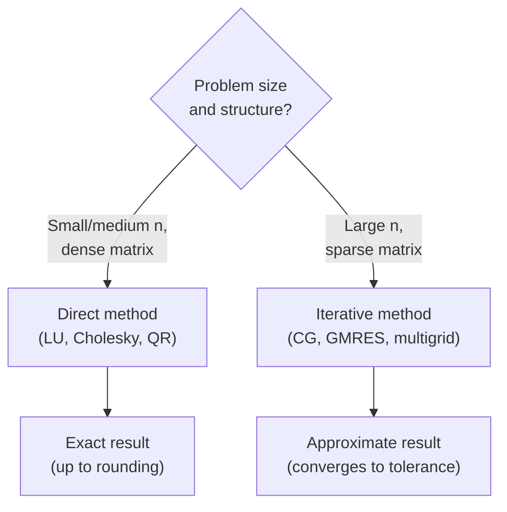
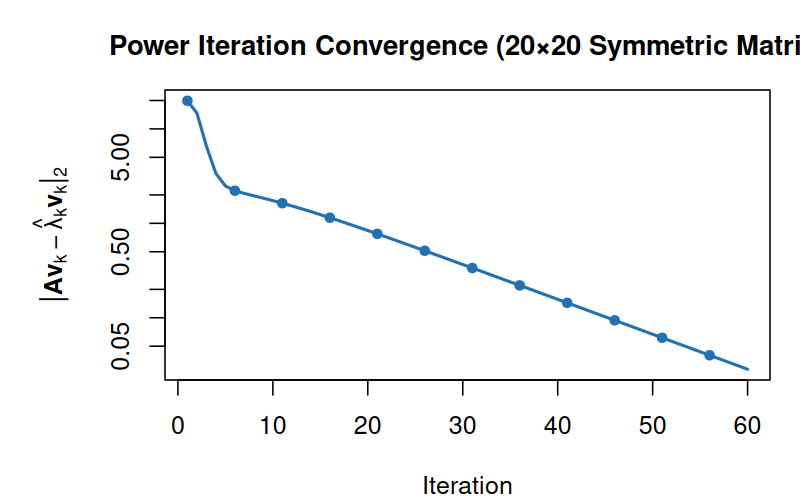
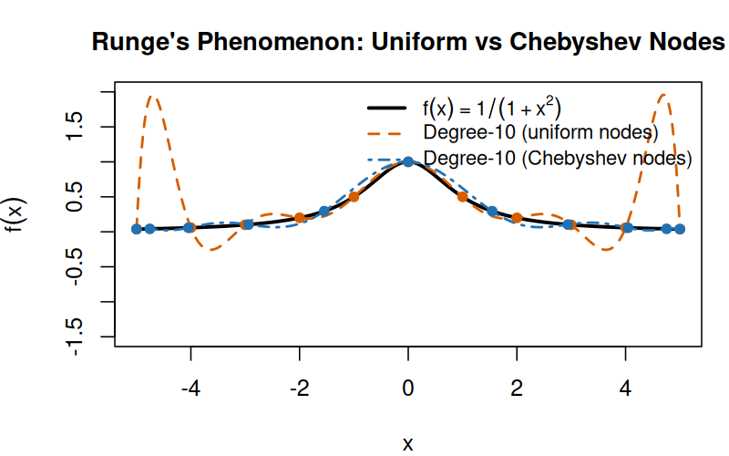
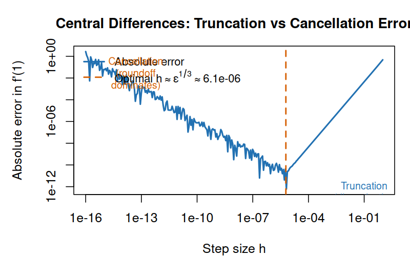
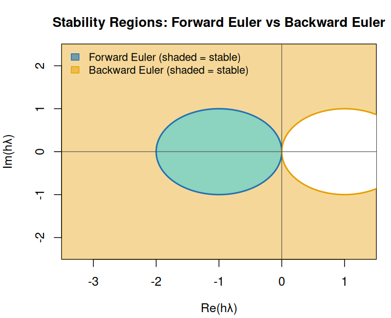
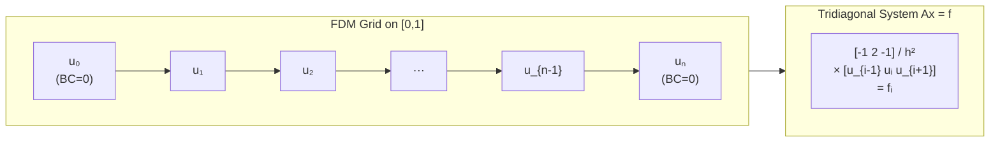
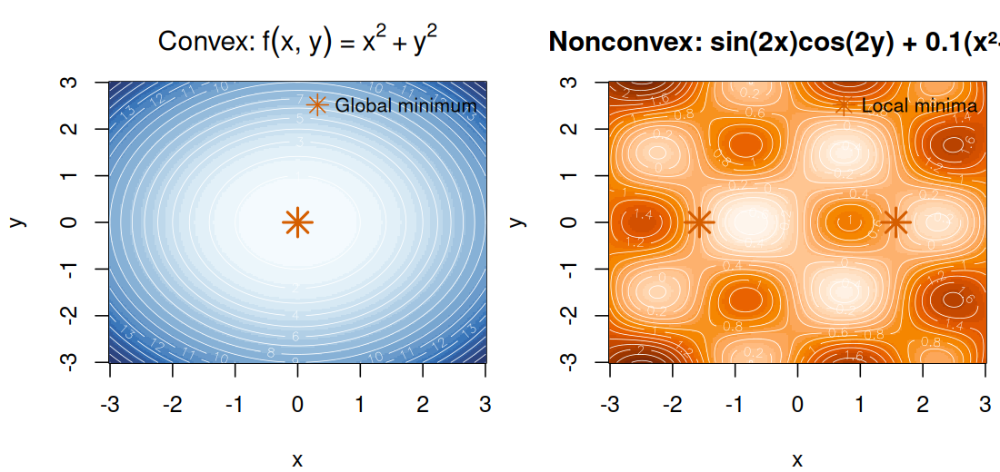
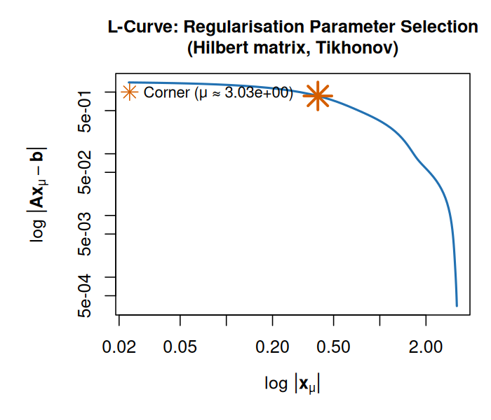

# Numerical Analysis Primer: Practical, Detailed, and Friendly

## 1. Why This Exists

Most introductions to numerical analysis land in one of two camps: short and hand-wavey, easy to read but hard to use, or rigorous and dense to the point where they become difficult to apply in real work. The first type leaves you unable to reason about whether your code is correct. The second type is technically complete but often inaccessible until you already have the background it assumes.

This primer tries to sit in the middle. The goal is not to water anything down. The goal is to explain real numerical ideas in plain language, with enough detail that you can build useful code, understand why it works, and — crucially — know when it might fail.

You will still see math throughout, because numerical analysis is math plus computation and there is no way around that. But the style here is practical and conversational, and every major method comes with examples in Python, R, and Julia written in each language's own idiom rather than a forced one-size-fits-all style.

### What Numerical Analysis Is, Really

Numerical analysis is the craft of getting trustworthy approximate answers to mathematical problems on finite machines.

That single sentence contains three big constraints worth unpacking. First, the answers are approximate, because many important problems simply do not have clean symbolic solutions — nobody is going to write down a closed form for the stress distribution in an irregular turbine blade. Second, the answers must be trustworthy, which means you need to be able to reason about their error: a number you cannot bound or validate is not really an answer, it is an unverified estimate. Third, your machine is finite — it represents real numbers imperfectly, runs in finite time, and has a hard memory ceiling.

If you only remember one thing from this primer, remember this:

> Numerical analysis is not "how to get a number." It is "how to get a number with known behavior under error, time, and resource constraints."

### What This Primer Covers


1. The major approaches to numerical analysis and when each is useful.
2. Error, conditioning, and stability (the non-negotiable foundations).
3. Core method families:
  - Root finding
  - Linear systems and least squares
  - Interpolation and approximation
  - Numerical differentiation and integration
  - Ordinary differential equations (ODEs)
  - Optimization
4. How to choose methods in practice.
5. Idiomatic example implementations in Python, R, and Julia.


### What This Primer Is Not

This is not a full proof-based textbook, and it makes no attempt to be one. If you want the full theoretical machinery — convergence proofs, spectral theory, the Lax Equivalence Theorem with all conditions stated precisely — the reading list at the end will point you to the right books. This primer is also not a replacement for specialized references in PDEs, large-scale sparse computing, or uncertainty quantification; those are deep disciplines in their own right. And it does not pretend that any one language or algorithm is the universal winner — because none of them are.

---

## 2. The Different Approaches to Numerical Analysis

When people say "approaches to numerical analysis," they might mean different things. Sometimes they mean classes of algorithms (direct vs iterative). Sometimes they mean modeling style (deterministic vs stochastic). Sometimes they mean workflow priorities (error-first vs throughput-first).

You should know all of these lenses, because they affect both design and outcomes.

### 2.1 Direct vs Iterative Methods

#### Direct methods
A direct method aims to reach a solution in a finite sequence of operations. In exact arithmetic, Gaussian elimination solves a linear system exactly in finite steps.

In floating-point arithmetic, "exact" becomes "as exact as this arithmetic allows," but the spirit is the same: no outer convergence loop to a limit.

Direct methods are the right tool when the problem is moderate in size and when the matrix has structure you can exploit — symmetry, positive definiteness, or banded form all make factorization significantly cheaper. They are also particularly convenient when you need to solve the same linear system repeatedly with the same coefficient matrix but different right-hand sides, since you can factorize once and reuse the result for each new solve without repeating the expensive decomposition. In exact arithmetic the computation is mathematically complete: a fixed, predictable number of operations, no convergence criterion to manage, and a result that does not depend on an initial guess. In floating-point arithmetic you lose "exact" in the strict sense, but the structure of the computation remains deterministic and bounded. Typical examples are LU factorization for general square systems, QR for overdetermined or least-squares problems, and Cholesky for symmetric positive definite matrices. Computing interpolation coefficients by solving a Vandermonde system also fits this pattern.

#### Iterative methods
Iterative methods produce a sequence of approximations, often improving until a stopping rule is met.

Iterative methods become attractive — and often necessary — when problems outgrow what direct factorization can handle. For very large or sparse systems, forming and storing a dense factorization is simply infeasible: memory costs scale quadratically or worse, and fill-in during factorization can destroy the sparsity that made the problem tractable to begin with. Iterative methods sidestep this by working entirely through matrix-vector products, which remain cheap if the matrix is sparse or structured. The payoff is a controllable trade-off between accuracy and runtime: you can stop early if a rough answer suffices, or iterate longer to tighten the result. Conjugate gradient and GMRES are the two workhorses of iterative linear algebra. Newton iterations, fixed-point iterations, and gradient-based optimization methods all belong in this family too, even when the underlying problem is not a linear system.




The diagram summarises the first design decision in linear algebra: whether you commit to a finite factorisation or build an iteration that converges to a stopping criterion. Problem size and sparsity pattern are the primary signals, but the consequence of the choice — deterministic completion versus controllable approximation — is what matters most downstream.

### 2.2 Deterministic vs Stochastic Methods

#### Deterministic
A deterministic method gives exactly the same result every time it runs with the same input. There are no random draws, no seeds to manage, and no statistical fluctuation in results. This predictability makes verification and debugging straightforward: if a result is wrong, it is reproducibly wrong, which means you can isolate the problem systematically. The trapezoidal rule, classical Runge-Kutta methods, and Newton's method are all deterministic in this sense — given identical floating-point inputs and the same execution path, they produce identical outputs.

#### Stochastic
Stochastic methods deliberately introduce randomness as a core ingredient. Results vary from run to run unless the seed is fixed, and accuracy is characterized statistically — you expect a result within some confidence interval rather than guaranteeing a deterministic bound. Monte Carlo integration, stochastic gradient methods, and randomized linear algebra sketches all work this way. It is worth being direct about something: stochastic methods are not sloppy or imprecise by nature. They are often the only practical choice when deterministic methods cannot scale. High-dimensional integration is the clearest case: Monte Carlo error scales like $1/\sqrt{n}$ regardless of dimension, while deterministic quadrature rules require exponentially more evaluation points as dimension grows — a combinatorial explosion that makes them unusable beyond a handful of dimensions.

### 2.3 Local vs Global Approximation

#### Local approximation
A local method builds its approximation using information near a specific point or within a small neighborhood, without claiming anything about behavior far away. Finite difference derivative estimates use function values at nearby points only. Newton updates linearize the function around the current iterate, ignoring curvature elsewhere. Adaptive mesh refinement makes local decisions about where to place grid points based on estimated error in each cell, independent of distant regions. The strength of local methods is robustness: strange behavior in one part of the domain does not contaminate estimates elsewhere.

#### Global approximation
A global method constructs a single approximation intended to be valid across the entire interval or domain. Polynomial interpolation through all nodes, spectral methods that represent the solution as a sum of basis functions over the whole domain, and spline fits over an entire dataset all operate this way. When the target function is smooth and the basis is well-chosen, global methods can achieve remarkably high accuracy with relatively few degrees of freedom — spectral methods on smooth periodic functions can converge faster than any fixed polynomial rate. The downside is sensitivity: a function with a singularity or rough spot in one region can degrade accuracy everywhere, since global basis functions respond to the entire domain.

### 2.4 Discretization-First vs Model-Reduction-First

#### Discretization-first
The classical path in computational science is to start from governing equations — differential equations, integral equations, conservation laws — and discretize them directly into a finite algebraic system. Finite difference methods replace derivatives with local polynomial approximations on a grid. Finite element and finite volume methods divide the domain into small cells and enforce the equations either locally or via variational principles. The resulting algebraic systems can be large, but the path from model to computation is direct and the numerical behavior is well understood.

#### Model-reduction-first
An alternative path, increasingly important in modern scientific computing, is to reduce the complexity of the model before or during numerical solving. Proper orthogonal decomposition identifies the dominant modes of a high-dimensional system and projects the dynamics onto a much smaller subspace. Krylov subspace projections do something similar during an iterative solve — they look for a good solution in a low-dimensional space built from successive matrix-vector products. Surrogate models and emulators learn cheap approximations to expensive simulations and then optimize or analyze the surrogate instead of running the full model.

This distinction matters especially when full-order simulation is far too expensive to run in a loop — for design optimization, uncertainty propagation, or real-time control — and some accuracy loss from the reduced model is an acceptable trade-off.

### 2.5 Strong-Form vs Weak-Form Thinking

This distinction is especially important in differential equations and becomes unavoidable once you work with partial differential equations seriously.

#### Strong form
In the strong form, the governing equation must hold at every point in the domain — it is enforced pointwise. This is the formulation you typically see when first writing down a differential equation: the equation must be satisfied literally everywhere, which implicitly requires the solution to be sufficiently smooth to make all the derivatives in the equation well-defined.

#### Weak form
In the weak form, the equation is multiplied by a test function and integrated over the domain. The result is an integral condition that the solution must satisfy for all allowable test functions. This approach has two major advantages. First, it reduces the differentiability requirements on the solution, allowing functions that are not smooth enough to satisfy the strong form but are still meaningful in an integral sense. Second, it opens the door to Galerkin-type methods, where you look for the solution in a finite-dimensional subspace — which is precisely how finite element methods work. Weak-form approaches tend to be better suited to complex geometry, natural boundary conditions, and solutions with local roughness.

### 2.6 Forward vs Inverse Problems

#### Forward problems
In a forward problem, you are given a model and its parameters and asked to compute the outputs. You know the governing equations, you know the inputs, and you run the computation forward in the natural causal direction. This is the standard computational science workflow: given the physical law and the initial or boundary conditions, simulate what happens. Forward problems are generally well-posed — small changes in inputs produce proportionally small changes in outputs, and solutions are usually unique.

#### Inverse problems
In an inverse problem, you observe some outputs — often noisy, incomplete, or indirect measurements — and want to infer the underlying parameters, initial conditions, or model structure that would have produced them. You are running the causal chain backwards. Inverse problems tend to be fundamentally harder for several reasons that are mathematical, not just computational. They are often ill-posed: multiple parameter sets can explain the observed data nearly equally well, small amounts of noise in the measurements can correspond to wildly different parameter values, and without additional constraints the problem may have no unique solution. Regularization — adding prior information or smoothness penalties to distinguish plausible solutions — is central to making inverse problems tractable, and choosing the right regularization is often as much an art as a science.

### 2.7 Error-First vs Throughput-First Workflow

#### Error-first workflow
In an error-first workflow, you begin by asking what accuracy your application actually requires, and every other decision follows from that. You choose the method and stopping criteria based on their error behavior, instrument the computation with residual checks and convergence diagnostics, and only benchmark runtime once the accuracy is under control. This sequencing ensures you are not optimizing speed at the expense of correctness, and it forces you to think carefully about what “good enough” means for the problem at hand.

#### Throughput-first workflow
In a throughput-first workflow, you start from operational constraints — time budgets, hardware limits, scale requirements — and choose the fastest method that is plausible. Accuracy verification comes after, and the standard is pragmatic: if the errors are small enough that the downstream system behaves acceptably, the method is good enough.

Both workflows are legitimate depending on context. In safety-critical engineering — aircraft design, nuclear reactor simulation, structural certification — error-first is usually the only professionally defensible approach. In large-scale production systems like recommendation engines or online optimization, throughput-first may be exactly right, provided business metrics confirm the accuracy is adequate. The mistake is applying the throughput-first mentality to domains where it is not appropriate.

### Practical Summary Table

| Lens | Option A | Option B | Typical trade-off |
|---|---|---|---|
| Solve style | Direct | Iterative | Deterministic finite steps vs scalable approximations |
| Randomness | Deterministic | Stochastic | Reproducibility vs high-dimensional tractability |
| Scope | Local | Global | Robustness nearby vs broad smooth approximations |
| Problem type | Forward | Inverse | Simulation ease vs inference difficulty |
| PDE framing | Strong form | Weak form | Pointwise enforcement vs flexible function spaces |
| Workflow | Error-first | Throughput-first | Accuracy guarantees vs operational speed |

If this section feels conceptual, good. This is your method-selection map. The rest of the primer fills in the details behind these choices.

---

## 3. Floating-Point Arithmetic: Why Numbers Behave Strangely

Before algorithms, we need machine arithmetic reality.

### 3.1 Floating-Point in One Minute

Most scientific code uses IEEE 754 floating-point, where a real number is represented roughly as:
$$
(-1)^s \times m \times 2^e
$$
with finite mantissa precision and bounded exponent range.

This representation has a fixed number of bits for the mantissa, which means most real numbers — including familiar decimals like 0.1 — cannot be stored exactly. Every arithmetic operation introduces a small rounding error, because the true result may not be representable in the available mantissa bits. Over the course of a long computation with many operations, these rounding errors can accumulate. One consequence that surprises new practitioners is that the algebraic laws you rely on in pure mathematics no longer hold reliably. Associativity, in particular, can fail:
$$
(a+b)+c \neq a+(b+c)
$$
in floating-point arithmetic, because rounding happens after each operation and the order of additions changes what gets rounded when.

### 3.2 Machine Epsilon and Unit Roundoff

Machine epsilon is often introduced as "the smallest number such that $1 + \epsilon > 1$" in floating-point arithmetic. That definition is useful, but in practice you should think of it as a scale marker: it tells you roughly how much relative precision the format can represent near 1.0.

For double precision, it is about:
$$
\epsilon_{mach} \approx 2.22 \times 10^{-16}
$$

Unit roundoff is closely related and is often defined as half this value under round-to-nearest arithmetic. In either convention, the practical interpretation is similar: a single well-scaled floating-point operation typically incurs a relative error on the order of $10^{-16}$ in double precision.

Why this matters is not that every result is off by exactly that amount, but that this sets the floor for what arithmetic alone can promise. If your algorithm asks for relative tolerances far below this scale, the request is physically meaningless in double precision. If your method performs huge numbers of operations, these tiny errors can accumulate and be amplified by conditioning. As a working rule, solver tolerances in the $10^{-8}$ to $10^{-12}$ range are often sensible in double precision, while claims of stable relative accuracy near $10^{-16}$ across large computations should be treated skeptically unless the problem structure strongly supports it.

### 3.3 Catastrophic Cancellation

Subtracting nearly equal numbers destroys significant digits.

Example:
$$
\sqrt{x+1} - \sqrt{x}
$$
for large $x$ is numerically dangerous in naive form. A more stable algebraic rewrite is:
$$
\frac{1}{\sqrt{x+1}+\sqrt{x}}
$$

Same math, very different floating-point behavior.

### 3.4 Overflow, Underflow, and Subnormals

The finite range of floating-point representation creates boundary conditions that are easy to overlook until they cause problems. **Overflow** occurs when a number is too large to be represented; in IEEE 754 arithmetic, the result typically becomes infinity, which then propagates through subsequent calculations in ways that can be confusing to diagnose. **Underflow** is the opposite problem: a number too close to zero may flush to zero entirely, silently discarding a small but potentially meaningful quantity. Before complete underflow, numbers enter the **subnormal** range, where the mantissa leading bit is no longer assumed to be one, extending the representable range near zero but with progressively fewer significant digits.

These edge cases rarely matter in simple computations, but in long iterative loops — ODE integrators, optimization methods, matrix iterations — they can silently corrupt intermediate quantities in ways that produce plausible-looking but wrong final results. Building checks for infinities and NaNs into iterative code is a cheap safeguard that pays off consistently.


### Single vs Double Precision in Practice

The default in almost all scientific code is double precision (float64), but there are real situations where single precision (float32) is the right call, and a handful where even double is not enough. Knowing the difference matters before you hit one of those situations.

The basic numbers:

| Type | Bits | Exponent bits | Mantissa bits | Approx. range | Machine epsilon | Throughput note |
|---|---|---|---|---|---|---|
| float32 | 32 | 8 | 23 | ±3.4 × 10³⁸ | ~1.2 × 10⁻⁷ | 2–4× faster on GPUs; half memory |
| float64 | 64 | 11 | 52 | ±1.8 × 10³⁰⁸ | ~2.2 × 10⁻¹⁶ | Standard for most scientific work |

Float32 is acceptable when throughput or memory is the binding constraint and you are not accumulating errors over many operations. Machine-learning inference is the clearest case: modern GPUs execute float32 at two to four times the throughput of float64, and cutting precision in half also halves memory bandwidth. For neural-network inference, where you are doing one forward pass on fixed weights, the rounding errors rarely matter. The same logic applies to iterative refinement workflows, where you can run the inner iterations cheaply in float32 and apply a correction pass in float64 — you get most of the speed gain without surrendering final accuracy. Graphics pipelines have used float32 by default for decades for the same reason.

Float64 is non-negotiable in several categories. Any computation where errors accumulate over thousands of steps — ODE integration with tight tolerances, eigenvalue solvers on ill-conditioned matrices, long Markov-chain simulations — benefits from the extra fifteen digits of relative precision. Any problem whose condition number approaches $10^7$ or above is spending float32's entire precision budget just on conditioning, leaving nothing for the computation itself. And whenever you are comparing against published numerical benchmarks, you should match their precision to avoid false discrepancies.

#### Rounding modes

IEEE 754 defines four rounding modes. The default is round-to-nearest-even, sometimes called banker's rounding. The "even" refers to the tiebreaking rule: when a result is exactly halfway between two representable values, the mode rounds to whichever one has a zero in the least-significant mantissa bit. This alternates rounding direction depending on the value and eliminates the systematic upward bias that plain round-half-up produces over many operations.

The other modes are round-toward-zero (truncation toward the origin), round-up (ceiling), and round-down (floor). These are mainly useful in interval arithmetic, where you deliberately round lower bounds down and upper bounds up to guarantee containment. In normal scientific computing, the default round-to-nearest-even is almost always correct, and changing it requires both a deliberate decision and hardware/compiler support that varies across environments.

### 3.5 Idiomatic Language Notes

The three languages in this primer each have a natural style for numerical work, and working against that style usually means slower and less readable code.

In Python, the standard approach is to lean heavily on NumPy arrays and vectorized operations. Pure Python loops over large arrays are slow because Python is interpreted and each loop iteration carries interpreter overhead. NumPy pushes the loop into compiled C or Fortran code, which is orders of magnitude faster. The rule of thumb is: if you can express the computation as array operations, do so; reach for explicit loops only when profiling shows a specific, justified reason.

In R, vectorization is built into the language's DNA. Base R functions are generally vectorized by design, matrix operations are first-class citizens, and the language is heavily optimized around the assumption that you are working with vectors and matrices rather than scalars. Writing explicit loops is not wrong in R, but it is often a sign that a vectorized alternative exists.

In Julia, the situation is strikingly different from both Python and R. Julia's compiler generates native machine code via LLVM, and explicit loops over type-stable arrays run at speeds comparable to C or Fortran. Writing a loop in Julia is idiomatic and efficient — there is no performance penalty for it. This surprises programmers arriving from Python or R, who have internalized “loops are slow” as a reflex. In Julia, that reflex does not apply, and forcing vectorization where a loop is more natural is the wrong trade-off.

### Example: Inspect machine epsilon in all three languages

**Python**
```python
import numpy as np

print(np.finfo(float).eps)
```

**R**
```r
print(.Machine$double.eps)
```

**Julia**
```julia
println(eps(Float64))
```

---

## 4. Error, Conditioning, and Stability: The Core Triangle

You can build beautiful algorithms that still fail in practice if you blur these three concepts.

### 4.1 Absolute vs Relative Error

Given true value $x$ and approximation $\hat{x}$:
$$
\text{absolute error} = |x - \hat{x}|,
\quad
\text{relative error} = \frac{|x - \hat{x}|}{|x|}
$$

Absolute error is scale-dependent. Relative error is usually more meaningful across varying magnitudes.

### 4.2 Forward Error vs Backward Error

The **forward error** is the most intuitive notion of error: it is simply the difference between the computed answer and the true answer. If you compute $\hat{x}$ and the truth is $x^*$, the forward error is $\|\hat{x} - x^*\|$. This is what most people mean when they ask how accurate the result is.

The **backward error** frames the question differently. Instead of asking how far the computed answer is from the true answer, it asks: what is the smallest perturbation to the input data that would make the computed answer exactly correct? In other words, for what nearby problem is the algorithm’s output the exact solution? If the backward error is small, the algorithm is behaving well — it may have introduced errors, but those errors are no larger than what you would get from a tiny change in the input data.

Backward error analysis is one of the most powerful tools in numerical analysis. Its strength is that many stable algorithms can be shown to have small backward error even though the forward error might look worrying at first glance. If the backward error is small and the problem is well-conditioned, the forward error must also be small — because a well-conditioned problem does not amplify small input perturbations into large output changes.

### 4.3 Conditioning: Property of the Problem

Conditioning is a property of the mathematical problem, not of any particular algorithm. It measures how sensitive the output is to small perturbations in the input. A well-conditioned problem has the property that small changes in the data produce proportionally small changes in the answer. An ill-conditioned problem amplifies perturbations: a tiny change in the input can cause a large change in the output.

For linear systems $Ax = b$, the sensitivity is captured by the condition number of the matrix $A$. In a given norm $\|\cdot\|$:
$$
\kappa(A) = \|A\|\,\|A^{-1}\|
$$

When $\kappa(A)$ is large, the matrix is close to singular in a relative sense, and small perturbations in $b$ — or small rounding errors accumulated during the solve — can be amplified by a factor of roughly $\kappa(A)$ in the output. A system with condition number $10^{10}$, for instance, can lose ten decimal digits of accuracy even with a stable algorithm running in double precision, because double precision only provides about sixteen decimal digits of relative accuracy to begin with.

A critical point that often gets missed: conditioning is a property of the problem, not the algorithm. You can use the most stable algorithm in existence and still get poor results if the problem itself is ill-conditioned.

### 4.4 Stability: Property of the Algorithm

Stability is a property of the algorithm rather than the problem. A numerically stable algorithm is one that does not amplify internal rounding errors beyond what the problem’s conditioning warrants. In practice, stability means that the total error in the output is roughly proportional to the product of the condition number and the floating-point unit roundoff — the algorithm does not make things worse than the problem and the arithmetic inherently require.

An important and often-confused point: a stable algorithm applied to an ill-conditioned problem can still produce poor results, and that is not a failure of the algorithm. If the problem amplifies small perturbations by a factor of $10^{10}$ and you are working in double precision, you can expect to lose roughly ten digits of accuracy no matter how careful the implementation is. The algorithm is doing its job; the problem is simply sensitive. The practical implication is that diagnosing numerical failures requires separating the two questions: is the algorithm stable, and is the problem well-conditioned?

### 4.5 Consistency, Stability, Convergence (for Discretizations)

For numerical methods that discretize differential equations — replacing continuous derivatives with finite differences or similar approximations — there is a classical and important theorem that governs their behavior, often called the Lax equivalence theorem in the context of linear problems.

Consistency means that the local truncation error — the error made in approximating the differential equation at a single grid point — goes to zero as the grid spacing is refined. In other words, the discrete equations look increasingly like the true continuous equations as you use a finer grid. This is a necessary condition for the method to make sense, but it is not sufficient for convergence.

Stability is the additional requirement. Roughly, a method is stable if small errors at one step do not grow without bound as they propagate through subsequent steps. You can think of it as a condition that prevents accumulated numerical noise from swamping the true signal.

The key theorem states that for well-posed linear problems: consistency plus stability implies convergence. Equivalently, if a consistent method fails to converge, it must be unstable. This separates the analysis into two tractable pieces and explains why stability analysis — checking stability regions, CFL conditions, and energy estimates — is so central to numerical methods for differential equations. A scheme that is consistent but unstable will diverge as you refine the grid, which is the opposite of the convergence you hoped for.

### 4.6 Practical Error Budgeting

One of the most practically useful habits in numerical work is setting up an error budget before writing a single line of solver code. The total error in a numerical result is not just one thing — it is a sum of contributions from several distinct sources, each of which must be understood and managed separately.

**Modeling error** is the mismatch between the mathematical model you have chosen and the actual physical or real-world process you are studying. No model is perfect, and the gap between the model and reality sets a floor below which further numerical precision is meaningless.

**Discretization and truncation error** arises from replacing continuous equations with finite approximations — grids, step sizes, polynomial degrees, and so on. This is the error that improves as you refine the discretization.

**Floating-point round-off** is introduced at each arithmetic operation and accumulates throughout the computation. For well-conditioned problems in double precision, this is usually small relative to other sources.

**Data noise and measurement error** come from imprecision in the input data. If your data has 1% noise, no solver tolerance tighter than roughly 1% will improve your answer in a meaningful way.

**Solver tolerance and stopping error** is the error from terminating an iterative method before full convergence. This is the one source that is completely under your control.

Setting up this budget explicitly before starting prevents a common and expensive mistake: spending days tightening solver tolerances to $10^{-12}$ when modeling uncertainty or data noise dominates the total error at the $10^{-3}$ level. Numerical precision is only worth pursuing to the point where it is no longer the dominant error source.

### Example: Condition number and solve quality

**Python**
```python
import numpy as np

A = np.array([[1.0, 1.0], [1.0, 1.000001]])
b = np.array([2.0, 2.000001])

x = np.linalg.solve(A, b)
cond_A = np.linalg.cond(A)

print("x =", x)
print("cond(A) =", cond_A)
```

**R**
```r
A <- matrix(c(1, 1, 1, 1.000001), nrow = 2, byrow = TRUE)
b <- c(2, 2.000001)

x <- solve(A, b)
cond_A <- kappa(A)

cat("x =", x, "\n")
cat("cond(A) =", cond_A, "\n")
```

**Julia**
```julia
using LinearAlgebra

A = [1.0 1.0; 1.0 1.000001]
b = [2.0, 2.000001]

x = A \ b
cond_A = cond(A)

println("x = ", x)
println("cond(A) = ", cond_A)
```

---

## 5. Root Finding in Depth

Root finding solves $f(x)=0$. It sounds narrow, but this appears everywhere: equilibrium points, nonlinear constraints, implicit time steps, calibration tasks, and more.

### 5.1 Bisection: Reliable Workhorse

Assume continuous $f$ on $[a,b]$ with opposite signs at endpoints.

By the intermediate value theorem, at least one root exists. Bisection repeatedly halves interval size.

Bisection has a strong convergence guarantee: as long as the initial bracket is valid and $f$ is continuous, the method converges — no initial guess quality to worry about, no tuning of step size, no fragility around derivative behavior. That guarantee is worth a lot in practice. The algorithm is also trivially simple to implement and to reason about, which makes it easy to audit and debug.

The cost is convergence speed. Bisection has linear convergence: each step reduces the interval by exactly half, so after $n$ steps the interval width is $(b-a)/2^n$. To gain one extra decimal digit of accuracy requires roughly 3.3 more iterations. For many problems this is perfectly acceptable. But if you need high precision and the function is smooth, you will eventually want a method with faster convergence. The other practical limitation is the bracketing requirement: you need $a$ and $b$ with opposite signs, which means you need to already know the root lies in a specific interval. Finding a good bracket is sometimes the harder part of the problem.

### 5.2 Newton's Method: Fast but Fragile

Update rule:
$$
x_{n+1} = x_n - \frac{f(x_n)}{f'(x_n)}
$$

Near a simple root with good initial guess, convergence is quadratic.

The geometric picture helps: Newton replaces $f$ near $x_n$ with its tangent line and takes the tangent's $x$-intercept as the next iterate. Near a simple root, that tangent is an excellent local model, so each step removes most of the remaining error. That is where quadratic convergence comes from.

The failure modes of Newton’s method are real and worth taking seriously. If the derivative $f'(x_n)$ is near zero at some iterate, the update step becomes enormous and the method typically diverges. A bad initial guess — far from the root, or on the wrong side of a local maximum or minimum — can send the iterates to entirely the wrong part of the domain. Non-smooth functions can make the derivative discontinuous, invalidating the local linear approximation that the method relies on. In some configurations, Newton’s method cycles between points without converging, or oscillates in a chaotic pattern. The practical lesson is that Newton’s method should be paired with some form of safeguard — a step-length control, a bracket check, or a fallback to bisection — unless you have strong reasons to trust the starting point.

### 5.3 Secant Method: Derivative-Free Newton Flavor

Approximates derivative from two prior points:
$$
x_{n+1}=x_n - f(x_n)\frac{x_n-x_{n-1}}{f(x_n)-f(x_{n-1})}
$$

Convergence is superlinear, often better than bisection and cheaper than Newton when derivatives are unavailable.

The secant method works by replacing the true derivative $f'(x_n)$ with a finite-difference slope through the last two iterates, so each step is a Newton-like step without explicit derivative evaluation. That derivative-free behavior is why it is popular for black-box functions. The tradeoff is weaker robustness than bracketing methods: if $f(x_n)-f(x_{n-1})$ is tiny, the step can explode, and without a maintained bracket the iteration can drift away from the target root.

### 5.4 Hybrids in Production

Production-quality root-finding libraries rarely commit to a single method. The standard approach combines the safety of a bracketing method with the speed of a superlinearly convergent method, switching between them based on the behavior of the iteration. The idea is straightforward: maintain a bracket at all times so that you always know the root lies inside a known interval, but try to take a fast Newton or secant step whenever that step falls within the bracket and looks like genuine progress. If the fast step would fall outside the bracket or the update is suspiciously large, fall back to bisection to guarantee halving the interval.

Brent’s method, implemented in many standard libraries including SciPy’s `brentq` and R’s `uniroot`, is the classic example of this design. It uses inverse quadratic interpolation when the iterates are behaving well and bisection as the safety net. The result is a method that is as fast as Newton-like methods on smooth problems and as reliable as bisection on difficult ones. This “safe and fast” hybrid mentality is good engineering practice for any algorithm that needs to be trusted across a wide range of inputs.

### 5.5 Stopping Criteria That Actually Work

Stopping criteria are a place where even experienced practitioners cut corners, and it tends to bite them later. Stopping on a single condition is almost always wrong.

Checking only that the residual is small — $|f(x_n)| < \tau_f$ — can fail when the function is very flat near the root, because a large step in $x$ can correspond to a tiny change in $f(x)$. You might declare convergence while still far from the actual root.

Checking only that the step size is small can fail when the function has a steep slope near the root, where small steps in $x$ correspond to large residuals.

A robust stopping rule combines both: check that the residual is below tolerance and that the step size is below a relative tolerance (relative to the current scale of $x$), and impose a hard iteration cap as a safety net against infinite loops:

$$|f(x_n)| < \tau_f \quad \text{and} \quad |x_n - x_{n-1}| < \tau_x (1 + |x_n|)$$

The iteration cap should be generous enough that it only triggers for genuinely non-converging runs, not for difficult but solvable problems. And when the cap is hit, the code should signal it clearly rather than silently returning an under-converged result.


### Newton's Method for Systems

Scalar Newton's method generalises cleanly to systems of equations, but the generalisation introduces new failure modes and practical design choices that are worth understanding explicitly.

The problem is: find $\mathbf{x}^* \in \mathbb{R}^n$ such that $F(\mathbf{x}^*) = \mathbf{0}$, where $F : \mathbb{R}^n \to \mathbb{R}^n$. Each component of $F$ is one equation; you have $n$ equations in $n$ unknowns.

The Newton step at iterate $\mathbf{x}_k$ is:

$$\mathbf{J}_F(\mathbf{x}_k)\,\delta\mathbf{x}_k = -F(\mathbf{x}_k), \qquad \mathbf{x}_{k+1} = \mathbf{x}_k + \delta\mathbf{x}_k$$

where $\mathbf{J}_F(\mathbf{x}_k)$ is the $n \times n$ Jacobian matrix with entries $[\mathbf{J}_F]_{ij} = \partial F_i / \partial x_j$. The critical implementation note is that you should never invert the Jacobian. Computing $\mathbf{J}_F^{-1}$ explicitly costs $O(n^3)$, is numerically worse than factorisation, and throws away the structure of the system. Instead, solve the linear system using LU or Cholesky, and if you need multiple right-hand sides with the same Jacobian, factor once and reuse.

**Why it converges quadratically.** Expand $F(\mathbf{x}^*)$ around $\mathbf{x}_k$:

$$\mathbf{0} = F(\mathbf{x}^*) = F(\mathbf{x}_k) + \mathbf{J}_F(\mathbf{x}_k)(\mathbf{x}^* - \mathbf{x}_k) + O(\|\mathbf{x}^* - \mathbf{x}_k\|^2)$$

Rearranging and defining the error $\mathbf{e}_k = \mathbf{x}^* - \mathbf{x}_k$:

$$\mathbf{J}_F(\mathbf{x}_k)\mathbf{e}_k = -F(\mathbf{x}_k) + O(\|\mathbf{e}_k\|^2)$$

The Newton step solves $\mathbf{J}_F(\mathbf{x}_k)\delta\mathbf{x}_k = -F(\mathbf{x}_k)$ exactly, so $\delta\mathbf{x}_k = \mathbf{e}_k + O(\|\mathbf{e}_k\|^2)$, and the error at the next step is $\mathbf{e}_{k+1} = \mathbf{e}_k - \delta\mathbf{x}_k = O(\|\mathbf{e}_k\|^2)$. The error squared is the signature of quadratic convergence.

**Practical pitfalls.** A singular or near-singular Jacobian at some iterate means the linear system is ill-conditioned and the Newton step is unreliable — this happens when the initial guess is poor or the problem itself is degenerate near a bifurcation point. A bad initial guess can send the iteration into a region where the Jacobian is singular or where the quadratic model is misleading; unlike scalar Newton, there is no simple bracketing safety net in multiple dimensions. Global convergence is not guaranteed without additional structure: you can add a line search (accept the step only if it reduces $\|F(\mathbf{x})\|_2$) or a trust-region constraint to the step size, but neither is trivial to implement reliably.

**Broyden's method.** When the Jacobian is expensive to evaluate — perhaps because $F$ involves a simulation or a long numerical computation — you can use a quasi-Newton update that avoids re-evaluating $\mathbf{J}_F$ at each step. Broyden's method maintains an approximate Jacobian $\mathbf{J}_k$ and updates it with a rank-1 correction after each step:

$$\mathbf{J}_{k+1} = \mathbf{J}_k + \frac{\bigl(F(\mathbf{x}_{k+1}) - F(\mathbf{x}_k) - \mathbf{J}_k \mathbf{s}_k\bigr)\mathbf{s}_k^T}{\|\mathbf{s}_k\|^2}$$

where $\mathbf{s}_k = \mathbf{x}_{k+1} - \mathbf{x}_k$. The update is designed so that $\mathbf{J}_{k+1}\mathbf{s}_k = F(\mathbf{x}_{k+1}) - F(\mathbf{x}_k)$, which is the secant condition in multiple dimensions. Convergence is superlinear rather than quadratic, but the cost per step is much lower when Jacobian evaluations are expensive.

**Code examples.** For a concrete system, consider:

$$F_1(x_1, x_2) = x_1^2 + x_2^2 - 4, \qquad F_2(x_1, x_2) = x_1 x_2 - 1$$

**Python**
```python
import numpy as np
from scipy.optimize import fsolve

def F(x):
    return [x[0]**2 + x[1]**2 - 4,
            x[0] * x[1] - 1]

x0 = [1.0, 1.5]
sol = fsolve(F, x0, full_output=True)
print("solution:", sol[0])
print("residual norm:", np.linalg.norm(F(sol[0])))
```

**R**
```r
library(nleqslv)

F <- function(x) {
  c(x[1]^2 + x[2]^2 - 4,
    x[1] * x[2] - 1)
}

sol <- nleqslv(c(1.0, 1.5), F)
cat("solution:", sol$x, "\n")
cat("residual norm:", sqrt(sum(F(sol$x)^2)), "\n")
```

**Julia**
```julia
using NLsolve

function F!(res, x)
    res[1] = x[1]^2 + x[2]^2 - 4
    res[2] = x[1] * x[2] - 1
end

result = nlsolve(F!, [1.0, 1.5])
println("solution: ", result.zero)
println("residual norm: ", norm(result.residual_norm))
```

All three converge to approximately $(1.932, 0.518)$ and its symmetric counterpart. `scipy.optimize.fsolve` uses a hybridised MINPACK routine (essentially Newton with step controls), `nleqslv` defaults to Newton with a line search, and `NLsolve.jl` also defaults to Newton, with the Jacobian estimated by finite differences unless you provide it analytically.

### 5.6 Shared Example: Find root of $f(x)=\cos(x)-x$

This function has a root near $0.739085...$

**Python**
```python
from math import cos, sin


def bisection(f, a, b, tol=1e-12, max_iter=200):
    fa, fb = f(a), f(b)
    if fa * fb > 0:
        raise ValueError("f(a) and f(b) must have opposite signs")

    for _ in range(max_iter):
        c = 0.5 * (a + b)
        fc = f(c)

        if abs(fc) < tol or 0.5 * (b - a) < tol:
            return c

        if fa * fc < 0:
            b, fb = c, fc
        else:
            a, fa = c, fc

    return 0.5 * (a + b)


def newton(f, df, x0, tol=1e-12, max_iter=50):
    x = x0
    for _ in range(max_iter):
        fx = f(x)
        dfx = df(x)
        if dfx == 0:
            raise ZeroDivisionError("Derivative became zero")

        x_new = x - fx / dfx
        if abs(x_new - x) < tol * (1 + abs(x_new)) and abs(f(x_new)) < tol:
            return x_new
        x = x_new
    return x


f = lambda x: cos(x) - x
df = lambda x: -sin(x) - 1

print("bisection:", bisection(f, 0.0, 1.0))
print("newton:", newton(f, df, 0.5))
```

**R**
```r
bisection <- function(f, a, b, tol = 1e-12, max_iter = 200) {
  fa <- f(a)
  fb <- f(b)

  if (fa * fb > 0) {
    stop("f(a) and f(b) must have opposite signs")
  }

  for (i in seq_len(max_iter)) {
    c <- 0.5 * (a + b)
    fc <- f(c)

    if (abs(fc) < tol || 0.5 * (b - a) < tol) {
      return(c)
    }

    if (fa * fc < 0) {
      b <- c
      fb <- fc
    } else {
      a <- c
      fa <- fc
    }
  }

  0.5 * (a + b)
}

newton <- function(f, df, x0, tol = 1e-12, max_iter = 50) {
  x <- x0

  for (i in seq_len(max_iter)) {
    fx <- f(x)
    dfx <- df(x)

    if (dfx == 0) {
      stop("Derivative became zero")
    }

    x_new <- x - fx / dfx

    if (abs(x_new - x) < tol * (1 + abs(x_new)) && abs(f(x_new)) < tol) {
      return(x_new)
    }

    x <- x_new
  }

  x
}

f <- function(x) cos(x) - x
df <- function(x) -sin(x) - 1

cat("bisection:", bisection(f, 0, 1), "\n")
cat("newton:", newton(f, df, 0.5), "\n")
```

**Julia**
```julia
function bisection(f, a, b; tol=1e-12, max_iter=200)
    fa, fb = f(a), f(b)
    fa * fb > 0 && error("f(a) and f(b) must have opposite signs")

    for _ in 1:max_iter
        c = (a + b) / 2
        fc = f(c)

        if abs(fc) < tol || (b - a) / 2 < tol
            return c
        end

        if fa * fc < 0
            b, fb = c, fc
        else
            a, fa = c, fc
        end
    end

    return (a + b) / 2
end

function newton(f, df, x0; tol=1e-12, max_iter=50)
    x = x0
    for _ in 1:max_iter
        fx = f(x)
        dfx = df(x)
        dfx == 0 && error("Derivative became zero")

        x_new = x - fx / dfx

        if abs(x_new - x) < tol * (1 + abs(x_new)) && abs(f(x_new)) < tol
            return x_new
        end

        x = x_new
    end
    return x
end

f(x) = cos(x) - x
df(x) = -sin(x) - 1

println("bisection: ", bisection(f, 0.0, 1.0))
println("newton: ", newton(f, df, 0.5))
```

---

## 6. Numerical Linear Algebra: The Center of Gravity

If numerical analysis had a downtown area, it would be linear algebra.

Why? Because many nonlinear, differential, and optimization problems eventually reduce to solving linear systems or least-squares subproblems.

### 6.1 Dense vs Sparse Thinking

The first design decision in any linear algebra problem is whether the matrix is dense or sparse, and getting this wrong is expensive.

A dense matrix has most of its entries nonzero. The appropriate tools are the BLAS- and LAPACK-backed factorization routines that power NumPy, R's base matrix operations, and Julia's standard library. To understand why this matters, it helps to know what BLAS and LAPACK actually are.

#### 6.1.1 BLAS and LAPACK: The Foundation Layer

**BLAS** (Basic Linear Algebra Subprograms) is a standardized, language-agnostic interface for elementary linear algebra operations. It is not an implementation; it is a specification. Different vendors provide different implementations — OpenBLAS (open-source, widely portable), Intel MKL (proprietary, often the fastest on x86), Apple Accelerate, AMD BLIS — but they all expose the same interface.


BLAS operations are organized into three levels:

  - **Level 1** (vector-vector): dot products, norms, vector scaling. Computational complexity is $O(n)$ with minimal data reuse.
  - **Level 2** (matrix-vector): matrix-vector products, triangular solves. Complexity is $O(n^2)$ but data reuse is still limited.
  - **Level 3** (matrix-matrix): matrix multiplication, triangular factorization. Complexity is $O(n^3)$ with high data reuse; these operations are where vectorization and cache blocking matter most.

When you call `numpy.dot(A, B)` or `A @ B`, you are calling a BLAS Level 3 routine. A hand-written Python loop doing the same operation runs ten to a hundred times slower because it cannot exploit SIMD instructions, cache locality, or multi-threading the way a tuned BLAS library can.

**LAPACK** (Linear Algebra Package) is built on top of BLAS. It provides higher-level routines: LU, Cholesky, QR, SVD, eigenvalue decomposition, and many others. LAPACK delegates the heavy lifting to BLAS Level 3 calls and focuses on the algorithmic structure — pivoting strategies, stability improvements, blocking for cache efficiency — rather than reinventing low-level linear algebra from scratch.

This two-layer design is crucial: it means that when a BLAS vendor releases a faster implementation (tuned for a new CPU, or exploiting a new instruction set), all LAPACK routines and all downstream libraries benefit immediately without recompilation. NumPy, R, Julia, and MATLAB all benefit from the same BLAS and LAPACK development.

#### 6.1.2 Practical Implications

Understanding this layering changes how you write numerical code:


1. **Use library calls, not loops.** A call to `np.linalg.solve(A, b)` hits LAPACK which uses BLAS Level 3 operations. A Python loop over rows of the matrix hits nothing but Python's interpreter. The library call is not just faster; it can be 50–100x faster. This is not premature optimization; it is basic engineering.
2. **Dense matrix operations are highly tuned.** Once your matrix is in the BLAS/LAPACK ecosystem, you can expect performance close to the machine's peak throughput. Modern CPUs can approach 50–100 GFLOP/s (billions of floating-point operations per second) on matrix multiplication, and a good BLAS will hit a significant fraction of that. Hand-written code rarely does.
3. **Different BLAS implementations can have large performance differences.** NumPy compiled against OpenBLAS might be 2–3x faster or slower on a particular operation compared to the same NumPy compiled against MKL, depending on the operation and the CPU. This is usually not something you need to tune, but it is worth knowing when comparing benchmarks across machines or environments.
4. **BLAS Level 1 and 2 operations are memory-bound.** They do not vectorize as efficiently as Level 3. When possible, rephrase a problem to use Level 3 operations (e.g., batch solves instead of many single solves; matrix products instead of sequences of matrix-vector products).


The high-level lesson: dense linear algebra has been carefully engineered at the low level. Use it. Do not reimplement it.

A sparse matrix is mostly zeros — perhaps 99% zeros in a large finite element problem. Storing the zeros wastes memory; multiplying by them wastes time. Sparse matrix formats store only the nonzero entries and their indices, and sparse factorization algorithms exploit the zero structure to avoid unnecessary work. Feeding a million-by-million sparse matrix to a dense BLAS/LAPACK solver will exhaust memory long before producing an answer. This is not an edge case; it is a routine failure mode when solver choices ignore sparsity.


#### Fill-in and reordering

The sparsity of a matrix before factorisation is not the same as the sparsity of its factors. LU of a sparse matrix can produce factors that are much denser — in the worst case fully dense — even when the original matrix has a tiny fraction of nonzero entries. This creation of new nonzeros during factorisation is called fill-in, and it is the central cost concern in sparse direct solvers.

A concrete illustration: a tridiagonal $n \times n$ matrix has $3n - 2$ nonzeros, and its LU factorisation is also tridiagonal with $O(n)$ nonzeros. This is the best case — structure is preserved. An arrow matrix (dense first row and column, diagonal elsewhere) can fill completely during naive Gaussian elimination, producing $O(n^2)$ nonzeros from $O(n)$ originals. The fill-in pattern depends on the order in which variables are eliminated, and reordering the unknowns before factorisation is one of the highest-leverage steps in sparse solver engineering.

Two reordering strategies dominate in practice. **Minimum-degree reordering** eliminates the variable connected to the fewest other variables first, deferring dense regions until last, where they can be handled more compactly. It is cheap to compute and effective on many unstructured problems. **Nested dissection** recursively partitions the sparsity graph into subsets separated by small separators, exploiting the fact that eliminating separator variables last limits communication between subproblems. For 2D grid problems, nested dissection gives $O(n^{3/2})$ fill-in and $O(n^{3/2})$ operation count compared to $O(n^2)$ for natural row ordering — a decisive win on large grids.

#### Sparse Cholesky vs sparse LU

If your matrix is symmetric positive definite, use sparse Cholesky, not sparse LU. The SPD structure guarantees positive pivots, so no pivoting is needed — the factorisation is stable by construction. This halves the work and memory compared to LU, and the absence of pivoting means the sparsity structure is fully determined by the symbolic step and is consistent across different right-hand sides. For general nonsymmetric matrices, sparse LU with partial pivoting is necessary, though you pay for pivoting with less predictable fill patterns and some memory overhead.

#### Code

Python's `scipy.sparse.linalg` covers the common use cases directly:

```python
import numpy as np
import scipy.sparse as sp
import scipy.sparse.linalg as spla
import matplotlib.pyplot as plt

# Assemble 1D Poisson tridiagonal: -u_{i-1} + 2u_i - u_{i+1} = h^2 f_i
n = 50
h = 1.0 / (n + 1)
diagonals = [np.full(n - 1, -1.0), np.full(n, 2.0), np.full(n - 1, -1.0)]
A = sp.diags(diagonals, [-1, 0, 1], format="csr")

f = np.ones(n)
rhs = h**2 * f

# Direct sparse solve
u = spla.spsolve(A, rhs)

# Factor once, solve multiple right-hand sides
lu = spla.splu(A)
u2 = lu.solve(rhs)
u3 = lu.solve(2 * rhs)   # second right-hand side, no re-factorisation

# Sparsity pattern
plt.spy(A, markersize=3)
plt.title("Tridiagonal sparsity pattern")
plt.savefig("figures/tridiagonal_spy.png", dpi=120, bbox_inches="tight")
```

`spla.spsolve` picks Cholesky if the matrix is SPD and LU otherwise. `spla.splu` exposes the factors directly so you can solve multiple right-hand sides cheaply — factorisation is the expensive step; each additional solve costs only $O(\text{nnz})$ once the factors exist.

In Julia, the `\` operator dispatches automatically:

```julia
using SparseArrays, LinearAlgebra

n = 50
h = 1.0 / (n + 1)
A = spdiagm(-1 => fill(-1.0, n-1), 0 => fill(2.0, n), 1 => fill(-1.0, n-1))
rhs = h^2 * ones(n)

# Julia's \ detects sparsity and SPD structure, calls CHOLMOD for SPD sparse
u = A \ rhs

# Factor explicitly for multiple solves
F = cholesky(A)
u2 = F \ rhs
u3 = F \ (2 * rhs)
```

For symmetric positive definite sparse matrices Julia's `cholesky` calls CHOLMOD, which includes reordering (nested dissection by default) and delivers competitive fill-in on 2D and 3D grid problems without any explicit reordering call from your code.

### 6.2 Factorization Choices

Not all factorizations are created equal, and the choice matters for both efficiency and numerical conditioning.

**LU decomposition** is the general-purpose factorization for square systems. With partial pivoting it is stable for most practical matrices, and it is the default under the hood of `numpy.linalg.solve`, R's `solve`, and Julia's `\` operator.

In plain terms, LU rewrites the system as
$$
PA = LU,
$$
where $P$ is a row-permutation matrix, $L$ is lower triangular, and $U$ is upper triangular. The intuition is simple: Gaussian elimination is a sequence of row operations, and LU stores that sequence compactly. The practical payoff is even simpler: factor once, then each new right-hand side is just two cheap triangular solves (forward and backward substitution).

**Cholesky decomposition** is available when the matrix is symmetric positive definite — common in statistics, physics, and optimization. It is roughly twice as fast as LU and numerically cleaner. If your matrix qualifies, use it.

Cholesky writes
$$
A = LL^T
$$
(or $A=R^TR$), using only one triangular factor because symmetry removes duplicate work. Under the hood, positive definiteness gives stable positive pivots, so you do not need pivoting. In practice that means less memory, fewer flops, and often cleaner numerical behavior than LU.

**QR decomposition** is the right choice for overdetermined systems and least-squares problems. It avoids the condition number squaring that comes with the normal equations approach.

QR writes
$$
A = QR,
$$
with $Q$ orthonormal and $R$ upper triangular. The key idea is that orthonormal transforms preserve lengths, so minimizing $\|Ax-b\|_2$ turns into minimizing $\|Rx-Q^Tb\|_2$, which is a stable triangular solve. That is why QR usually beats normal equations numerically: you avoid forming $A^TA$, which can magnify round-off.

**Singular value decomposition (SVD)** is the most informative and most expensive. It reveals rank structure, gives the best low-rank approximation, provides numerically safe pseudo-inverses for rank-deficient systems, and is indispensable for diagnostic work. When a matrix is ill-conditioned and you need to understand why, the SVD tells you which directions are causing trouble and by how much.

SVD writes
$$
A = U\Sigma V^T,
$$
where diagonal entries of $\Sigma$ are singular values. A useful mental model is: SVD rotates coordinates so the matrix acts like pure scaling along orthogonal directions. Once you see those scales, rank deficiency and ill-conditioning stop being mysterious; they become directly visible.

### 6.3 Least Squares: Better Than Forcing Exact Fit

Given overdetermined system $Ax \approx b$, least squares solves:
$$
\min_x \|Ax-b\|_2
$$

The naive approach is the normal equations $A^T A x = A^T b$, a square system you can solve directly. This works, but it squares the condition number: if $\kappa(A) = 10^6$, then $\kappa(A^T A) = 10^{12}$, and you have lost twelve decimal digits of accuracy before solving a single equation. QR factorization applied directly to $A$ — as implemented in `numpy.linalg.lstsq`, R's `lm`, and Julia's `\` for tall matrices — solves the same problem without this numerical hazard and should almost always be preferred.

### 6.4 Iterative Solvers for Large Systems

When matrices are large and sparse, direct methods become impractical and iterative solvers take over.

**Conjugate gradient (CG)** is the classic choice for symmetric positive definite systems. It converges in at most $n$ steps in exact arithmetic, requires only matrix-vector products (not the matrix in explicit form), and its convergence rate is controlled by the condition number.

What CG is doing under the hood: each iterate minimizes the quadratic energy
$$
\phi(x)=\tfrac12 x^TAx-b^Tx
$$
over an expanding Krylov subspace, and search directions are made $A$-conjugate so later steps do not undo earlier progress. In exact arithmetic you can finish in at most $n$ steps; in floating-point that ideal is softened, but performance is still excellent on well-conditioned SPD systems.

**GMRES** (generalized minimum residual) handles general nonsymmetric matrices. It is more memory-intensive than CG because it builds an expanding Krylov subspace, but it is far more broadly applicable.

What GMRES is doing: at iteration $k$, it picks $x_k$ in the Krylov space to directly minimize $\|b-Ax_k\|_2$. That residual-first strategy is why it is reliable on many nonsymmetric problems. The tradeoff is memory and orthogonalization cost growing with $k$, so restarted versions (like GMRES(m)) are common in real code.

**Preconditioning** is often the decisive factor in practice. A preconditioner is an approximation to the inverse of the matrix, applied at each iteration to transform the system into one with a much smaller condition number. The difference between conjugate gradient on a raw problem and conjugate gradient with a good preconditioner can be factors of hundreds or thousands in iteration count. Finding or constructing a good preconditioner is often the hard engineering problem in large-scale linear algebra.

A practical way to think about preconditioning: you are not changing the true solution, you are reshaping the problem so the iteration has an easier geometry. In left-preconditioned form, you solve
$$
M^{-1}Ax = M^{-1}b
$$
with $M^{-1}A$ easier to iterate on than $A$. A good preconditioner strikes a balance: close enough to improve conditioning, cheap enough that applying it every iteration is still worth it.

So how do you actually find one in practice? Usually you do not "discover" a perfect $M$ from first principles; you pick a family that matches matrix structure, then tune cost-vs-quality.

Common choices:

- **Jacobi / diagonal scaling**: cheapest baseline. Works when row/column scaling is the main problem, but rarely enough by itself for hard systems.
- **SSOR / block-Jacobi**: useful when there is local coupling by blocks (for example, multiple variables per grid cell).
- **Incomplete factorizations (ILU, IC)**: the workhorse for many sparse problems. You keep a sparse approximation of LU/Cholesky by dropping fill entries below a threshold or beyond a pattern.
- **Algebraic multigrid (AMG)**: often excellent for elliptic PDE-type systems (Poisson-like operators). More setup cost, but can reduce iteration counts dramatically.
- **Domain decomposition / Schwarz methods**: natural for distributed-memory parallel runs and subdomain-based discretizations.

A practical selection loop looks like this:

1. Start with the matrix class: SPD, nonsymmetric, block-structured, PDE-like, graph-like.
2. Choose a solver-compatible baseline: IC/AMG for CG on SPD systems, ILU/AMG for GMRES/BiCGSTAB on nonsymmetric systems.
3. Measure two costs separately: preconditioner setup time and per-iteration apply time.
4. Tune one knob at a time (drop tolerance, fill level, restart size, AMG coarsening/smoother) and track total time-to-solution, not just iteration count.
5. Validate robustness across representative right-hand sides and parameter regimes; a preconditioner that is fast on one case but brittle on nearby cases is risky in production.

The key engineering tradeoff is this: stronger preconditioners reduce iterations but cost more to build/apply. The winner is the one that minimizes wall-clock time for your real workload, not the one with the fewest Krylov iterations on a toy case.

### 6.5 Shared Example A: Solve a system and compute residual

Use:
$$
A = \begin{bmatrix}
4 & 1 & 0 \\
1 & 3 & 1 \\
0 & 1 & 2
\end{bmatrix},
\quad
b = \begin{bmatrix}1 \\ 2 \\ 0\end{bmatrix}
$$

**Python**
```python
import numpy as np

A = np.array(
    [
        [4.0, 1.0, 0.0],
        [1.0, 3.0, 1.0],
        [0.0, 1.0, 2.0],
    ]
)
b = np.array([1.0, 2.0, 0.0])

x = np.linalg.solve(A, b)
residual = np.linalg.norm(A @ x - b)

print("x:", x)
print("residual norm:", residual)
```

**R**
```r
A <- matrix(
  c(4, 1, 0,
    1, 3, 1,
    0, 1, 2),
  nrow = 3,
  byrow = TRUE
)
b <- c(1, 2, 0)

x <- solve(A, b)
residual <- norm(A %*% x - b, type = "2")

cat("x:", x, "\n")
cat("residual norm:", residual, "\n")
```

**Julia**
```julia
using LinearAlgebra

A = [4.0 1.0 0.0;
     1.0 3.0 1.0;
     0.0 1.0 2.0]
b = [1.0, 2.0, 0.0]

x = A \ b
residual = norm(A * x - b)

println("x: ", x)
println("residual norm: ", residual)
```

### 6.6 Shared Example B: Least squares line fit

Fit $y \approx \beta_0 + \beta_1 x$ to data.

**Python**
```python
import numpy as np

x = np.array([0, 1, 2, 3, 4], dtype=float)
y = np.array([1.0, 1.9, 3.2, 3.9, 5.1], dtype=float)

X = np.column_stack([np.ones_like(x), x])
beta, *_ = np.linalg.lstsq(X, y, rcond=None)

print("beta0, beta1:", beta)
```

**R**
```r
x <- c(0, 1, 2, 3, 4)
y <- c(1.0, 1.9, 3.2, 3.9, 5.1)

fit <- lm(y ~ x)
print(coef(fit))
```

**Julia**
```julia
using LinearAlgebra

x = [0.0, 1.0, 2.0, 3.0, 4.0]
y = [1.0, 1.9, 3.2, 3.9, 5.1]

X = hcat(ones(length(x)), x)
beta = X \ y

println("beta0, beta1: ", beta)
```

---

## Eigenvalue Problems

The previous section treated linear algebra mostly as "solve **A****x** = **b**." That is the right problem when you know the right-hand side. But many important problems instead ask: for what values of $\lambda$ does **A****x** = $\lambda$**x** have a nontrivial solution? This is the eigenvalue problem, and it shows up everywhere — not as a mathematical curiosity, but as the natural formulation of questions about stability, dominant behaviour, vibration, and information structure.

### Why Eigenvalue Problems Matter

The eigenvalue equation $\mathbf{A}\mathbf{x} = \lambda\mathbf{x}$ says that **x** is a direction that **A** does not rotate — it only scales. The scalar $\lambda$ is the eigenvalue and **x** is the corresponding eigenvector. For a general $n \times n$ matrix there are at most $n$ such pairs, though they may be complex and may not all be distinct.

That abstract statement connects to concrete phenomena in several domains.

**Stability analysis.** If you discretise a differential equation $\dot{\mathbf{u}} = \mathbf{A}\mathbf{u}$, the solution is $\mathbf{u}(t) = e^{\mathbf{A}t}\mathbf{u}(0)$, and the eigenvalues of **A** determine whether that solution grows or decays. Any eigenvalue with positive real part drives exponential growth — an unstable mode. Checking eigenvalue signs is therefore the standard test for linear stability, and it is why control engineers, fluid dynamicists, and numerical ODE designers all reach for eigenvalue routines constantly.

**Principal Component Analysis (PCA).** PCA computes the eigendecomposition of a data covariance matrix. The eigenvector corresponding to the largest eigenvalue $\lambda_1$ is the direction of maximum variance in the data; the eigenvector for $\lambda_2$ is the direction of maximum remaining variance orthogonal to the first, and so on. The eigenvalues tell you how much variance each direction explains, which is how you decide how many components to keep. At its core, PCA is a matrix diagonalisation problem — eigen routines are doing the heavy lifting whenever you call `sklearn.decomposition.PCA`.

**Vibration modes.** In structural mechanics, the natural frequencies of a structure are the square roots of the eigenvalues of a mass-normalised stiffness matrix. Each eigenvector is the corresponding mode shape — the pattern of motion at that frequency. Knowing that a bridge resonates at 1.2 Hz or that an aircraft wing has a flutter mode near cruise speed is directly a question about eigenvalues, and getting it wrong has obvious engineering consequences.

**PageRank.** Google's original PageRank algorithm boils down to finding the dominant eigenvector of a large, sparse, column-stochastic matrix describing the web's link structure. The eigenvector corresponding to eigenvalue $\lambda_1 = 1$ tells you the stationary distribution of a random walk over web pages — which is the page's rank. The web graph has billions of nodes; computing this eigenvector efficiently on a sparse matrix is exactly why fast iterative eigensolvers matter.

These are not contrived examples. They are reasons why eigenvalue code is in every serious numerical computing library and why understanding it — including its failure modes — is worth your time.

### Power Iteration

Power iteration is the simplest eigenvalue algorithm and the one that builds the clearest intuition. Start with a random vector **v**, multiply by **A** repeatedly, and normalise at each step:

```text
v = random unit vector
for k = 1, 2, 3, ...:
    w = A @ v
    v = w / ||w||_2
    lambda = v^T @ A @ v   # Rayleigh quotient
```

After enough iterations, **v** converges to the eigenvector corresponding to the eigenvalue with the largest absolute value — the dominant eigenvector — and the Rayleigh quotient $\mathbf{v}^T \mathbf{A}\mathbf{v}$ converges to $\lambda_1$.

**Why it converges.** Expand the initial random vector in the eigenbasis of **A**: $\mathbf{v}_0 = \sum_i c_i \mathbf{q}_i$, where $\mathbf{q}_i$ are the eigenvectors and $c_i$ are coordinates. After $k$ multiplications by **A**:

$$\mathbf{A}^k \mathbf{v}_0 = \sum_i c_i \lambda_i^k \mathbf{q}_i = \lambda_1^k \left( c_1 \mathbf{q}_1 + \sum_{i>1} c_i \left(\frac{\lambda_i}{\lambda_1}\right)^k \mathbf{q}_i \right)$$

Every component with $i > 1$ carries a factor $(\lambda_i / \lambda_1)^k$. Since $|\lambda_1|$ is the largest by assumption, $|\lambda_i / \lambda_1| < 1$ for all other eigenvalues, and those components shrink geometrically. After normalising, what remains is dominated more and more by $\mathbf{q}_1$. The convergence rate per iteration is $|\lambda_2 / \lambda_1|$ — the ratio of the second-largest to the largest eigenvalue in absolute value. If these are close, convergence is slow; if they are well-separated, it is fast.

This ratio is the key number to think about when power iteration is struggling. A matrix with $|\lambda_1| = 100$ and $|\lambda_2| = 99$ will converge painfully slowly — about 1% error reduction per step. The same matrix with $|\lambda_2| = 1$ converges in a handful of iterations.



**Deflation.** Power iteration only gives you the dominant eigenvalue. To find the next one, you deflate: once $\lambda_1$ and $\mathbf{q}_1$ are known, subtract out their contribution from **A** to get a deflated matrix $\mathbf{A}' = \mathbf{A} - \lambda_1 \mathbf{q}_1 \mathbf{q}_1^T$. Power iteration on $\mathbf{A}'$ converges to $\lambda_2$. You can repeat this to peel off further eigenvalues one by one. In practice, deflation accumulates rounding errors, so it is mostly useful conceptually or for finding a small number of extreme eigenvalues. For finding many eigenvalues the QR algorithm or Krylov methods are more robust.

**Inverse iteration and shift-and-invert.** Power iteration converges to the largest-magnitude eigenvalue. What if you want the smallest, or one near a specific value $\sigma$? Replace **A** with $(\mathbf{A} - \sigma \mathbf{I})^{-1}$. The eigenvalues of this shifted-inverted matrix are $1/(\lambda_i - \sigma)$, so the eigenvalue of **A** nearest $\sigma$ becomes the dominant eigenvalue of the transformed problem. Power iteration on $(\mathbf{A} - \sigma \mathbf{I})^{-1}$ — meaning: solve a linear system $(\mathbf{A} - \sigma \mathbf{I})\mathbf{w} = \mathbf{v}$ at each step instead of multiplying — then converges to the eigenpair nearest $\sigma$. This is inverse iteration. The convergence rate becomes $|\lambda_{\text{near}} - \sigma| / |\lambda_{\text{next}} - \sigma|$, which can be extraordinary when $\sigma$ is close to a target eigenvalue. A single shift close to the target often gives convergence in fewer than ten steps.

### The QR Algorithm

Power iteration is instructive but limited. The QR algorithm is the workhorse for computing all eigenvalues of a dense matrix, and it is what is running inside `numpy.linalg.eig`, R's `eigen()`, and Julia's `LinearAlgebra.eigen()`.

The core idea is iterated QR factorisation. At each step, factorise the current matrix $\mathbf{A}_k = \mathbf{Q}_k \mathbf{R}_k$, then form the next iterate by reversing the factors:

$$\mathbf{A}_{k+1} = \mathbf{R}_k \mathbf{Q}_k$$

This is an orthogonal similarity transformation: $\mathbf{A}_{k+1} = \mathbf{Q}_k^T \mathbf{A}_k \mathbf{Q}_k$, so all $\mathbf{A}_k$ share the same eigenvalues. Under mild conditions, $\mathbf{A}_k$ converges to Schur form — upper triangular (for general matrices) or diagonal (for symmetric matrices) — with the eigenvalues on the diagonal. The eigenvectors appear in the product of all the $\mathbf{Q}_k$ matrices accumulated along the way.

**Why it works at all** is non-obvious. Heuristically, each QR step is doing something like a step of power iteration on each column simultaneously, using orthogonality to keep the directions from collapsing. The formal explanation requires more machinery, but the practical point is: it converges, it is stable, and Schur form is a numerically clean representation of eigenstructure.

**Shift acceleration.** Without shifts, convergence is controlled by eigenvalue ratios in the same way as power iteration — potentially slow. The standard fix is Wilkinson shifts: at each step, shift by an estimate of the smallest eigenvalue (computed from the bottom $2 \times 2$ corner of the current matrix), run one QR step, then unshift. This drives the subdiagonal entries toward zero much faster and usually gives cubic convergence near the end of the process. In practice, the shifted QR algorithm finishes in $O(n)$ iterations on most matrices, so the total cost is dominated by the QR factorisations: $O(n^3)$ overall.

**Symmetric vs general.** When **A** is symmetric, the Schur form is diagonal with real eigenvalues — a full eigendecomposition. The standard path is to first reduce **A** to symmetric tridiagonal form (Householder reflections, $O(n^3)$ but with a small constant), then run QR on the tridiagonal, which is much cheaper at $O(n^2)$ per iteration. The LAPACK routine is `dsyev` (or `dsyevd` for the divide-and-conquer variant, which is often faster). When **A** is general (non-symmetric), eigenvalues may be complex, and the Schur form is quasi-upper-triangular with $1 \times 1$ and $2 \times 2$ diagonal blocks. The LAPACK routine is `dgeev`. All three language libraries call these routines through their standard eigenvalue functions — you do not need to invoke LAPACK directly, but knowing the symmetric path exists means you should always tell the solver when your matrix is symmetric, because it is faster and gives guaranteed real eigenvalues.

Do not implement the QR algorithm yourself. It is numerically subtle — getting the shift strategy right, handling near-deflations, maintaining orthogonality — and the library implementations have decades of work in them. Use `numpy.linalg.eigh` for symmetric, `numpy.linalg.eig` for general, and let LAPACK do its job.

### Krylov Methods for Large Sparse Problems

The QR algorithm is $O(n^3)$. For a $10^6 \times 10^6$ sparse matrix — the kind that arises routinely in finite element analysis, network problems, and machine learning — computing all eigenvalues is not just slow; it is not even a sensible goal. You typically want only the $k$ eigenvalues with the largest magnitude, or the $k$ smallest, where $k$ is perhaps 10 or 100, not $10^6$.

This is where Krylov subspace methods come in. Instead of transforming the full matrix, they build a low-dimensional subspace that captures the action of **A** well for the eigenvalues you care about.

The Krylov subspace of dimension $m$ starting from vector **v** is:

$$K_m(\mathbf{A}, \mathbf{v}) = \text{span}\{\mathbf{v},\, \mathbf{A}\mathbf{v},\, \mathbf{A}^2\mathbf{v},\, \ldots,\, \mathbf{A}^{m-1}\mathbf{v}\}$$

The key point is that you never need to store or factorise **A** explicitly. You only need to compute matrix-vector products **A****w** for various **w**. For a large sparse matrix, that product costs $O(\text{nnz})$ — proportional to the number of nonzero entries, which for sparse matrices is far smaller than $n^2$. The Krylov subspace implicitly captures the dominant action of **A** through those products, and you extract eigenvalue approximations (called Ritz values) by solving a small $m \times m$ eigenproblem on the projected matrix.

**Lanczos iteration** (for symmetric matrices) builds an orthonormal basis for the Krylov subspace using a short three-term recurrence. The projected matrix is tridiagonal, which is cheap to diagonalise. Convergence for extreme eigenvalues (largest and smallest) is typically fast, and the algorithm is memory-efficient.

**Arnoldi iteration** (for general non-symmetric matrices) builds the same Krylov subspace but the recurrence is longer — each new basis vector must be orthogonalised against all previous ones, which is more expensive. The projected matrix is upper Hessenberg. GMRES (which you met in the linear systems section) is actually Arnoldi applied to the residual minimisation problem, so there is a deep algorithmic connection between large-scale eigensolvers and large-scale linear solvers.

**ARPACK** (ARnoldi PACKage) is the standard implementation of the implicitly restarted Arnoldi method, which addresses a practical problem: a full Krylov basis of dimension $m$ requires storing $m$ vectors of length $n$ and $O(m^2)$ orthogonalisation work, which gets expensive as $m$ grows. Restarting with a compressed basis keeps memory bounded while retaining convergence progress. ARPACK has been the workhorse for large sparse eigenvalue computations for decades. When you call `scipy.sparse.linalg.eigs` in Python, you are calling ARPACK. When you use `Arpack.eigs` in Julia, same thing. In R, the base `eigen()` function only handles dense matrices; for large sparse problems, the `RSpectra` package wraps ARPACK cleanly.

The practical usage pattern is: specify how many eigenvalues you want (`k`), which ones (largest magnitude, smallest real part, near a shift $\sigma$), and supply either a sparse matrix or a function that computes matrix-vector products. The solver handles everything else. Shift-and-invert is again your friend here: to find eigenvalues near a target $\sigma$ in a large sparse problem, use `sigma=sigma` in `scipy.sparse.linalg.eigs`, which internally factors $(\mathbf{A} - \sigma \mathbf{I})$ and applies shift-and-invert.

### Generalised Eigenproblems

The standard eigenproblem has **A****x** = $\lambda$**x**. The generalised eigenproblem is:

$$\mathbf{A}\mathbf{x} = \lambda \mathbf{B}\mathbf{x}$$

This arises naturally in structural mechanics (stiffness matrix **A** and mass matrix **B**), in stability analysis of discretised PDEs, and in any problem where two bilinear forms compete. When **B** is the identity, you recover the standard problem.

The generalised problem looks like a minor generalisation but has some subtle wrinkles. If **B** is singular, there can be infinite eigenvalues. If **B** is indefinite, eigenvalues can be complex even when **A** is symmetric. The most tractable and common case is when **B** is symmetric positive definite (SPD).

When **B** is SPD, you can reduce the generalised problem to a standard one without losing symmetry. Factor $\mathbf{B} = \mathbf{L}\mathbf{L}^T$ (Cholesky). Then **x** = $\mathbf{L}^{-T}$**y** transforms the system:

$$\mathbf{A}\mathbf{L}^{-T}\mathbf{y} = \lambda \mathbf{L}\mathbf{L}^T \mathbf{L}^{-T}\mathbf{y}$$

$$\mathbf{L}^{-1}\mathbf{A}\mathbf{L}^{-T}\mathbf{y} = \lambda \mathbf{y}$$

The transformed matrix $\mathbf{L}^{-1}\mathbf{A}\mathbf{L}^{-T}$ is symmetric (when **A** is symmetric) and the standard symmetric eigensolver applies. You can then recover the original eigenvectors as $\mathbf{x}_i = \mathbf{L}^{-T}\mathbf{y}_i$. This is not something you need to do by hand — `scipy.linalg.eigh(A, B)` handles the Cholesky reduction internally and returns correctly normalised eigenvectors — but understanding the transformation tells you why SPD **B** is a special, well-behaved case and what breaks when **B** is merely positive semidefinite (ill-conditioned near the boundary of the SPD cone).

For non-SPD **B**, you fall back to the general LAPACK routine `dggev`, exposed as `scipy.linalg.eig(A, B)` with two matrix arguments. It is slower and less numerically clean, but it handles the full generalised problem.

### Code

The examples below show the most common eigenvalue computations in each language. Each uses the appropriate specialist function rather than a generic solver, and shows how to check the result.

**Python**

For a dense symmetric matrix, `numpy.linalg.eigh` is the right call — it is faster than `eig`, returns real eigenvalues sorted in ascending order, and is numerically more stable:

```python
import numpy as np
from scipy.sparse.linalg import eigs
from scipy.sparse import diags

# Dense symmetric problem
A = np.array([[4.0, 1.0, 0.0],
              [1.0, 3.0, 1.0],
              [0.0, 1.0, 2.0]])

eigenvalues, eigenvectors = np.linalg.eigh(A)
print("eigenvalues (ascending):", eigenvalues)

# Verify: A @ v ≈ lambda * v for first eigenpair
lam, v = eigenvalues[0], eigenvectors[:, 0]
residual = np.linalg.norm(A @ v - lam * v)
print("residual ||Av - λv||:", residual)

# Dense general (non-symmetric) problem
B = np.array([[0.0, -1.0], [1.0, 0.0]])  # rotation — complex eigenvalues
vals, vecs = np.linalg.eig(B)
print("eigenvalues of rotation matrix:", vals)  # expect ±1j

# Large sparse problem — 5 largest-magnitude eigenvalues
n = 1000
diag_vals = np.arange(1.0, n + 1)
A_sparse = diags(diag_vals)  # diagonal sparse matrix, eigenvalues are the diag entries
vals_sparse, vecs_sparse = eigs(A_sparse, k=5, which="LM")
print("5 largest eigenvalues:", np.sort(np.real(vals_sparse))[::-1])
```

For a generalised eigenproblem with SPD **B**:

```python
from scipy.linalg import eigh

A = np.array([[2.0, 1.0], [1.0, 3.0]])
B = np.array([[4.0, 1.0], [1.0, 2.0]])  # SPD

eigenvalues, eigenvectors = eigh(A, B)
print("generalised eigenvalues:", eigenvalues)
```

**R**

R's base `eigen()` handles dense matrices. For large sparse problems, `RSpectra` wraps ARPACK and is the standard choice:

```r
library(Matrix)    # sparse matrix support
library(RSpectra)  # ARPACK wrapper for large sparse eigenproblems

# Dense symmetric matrix
A <- matrix(c(4, 1, 0,
              1, 3, 1,
              0, 1, 2),
            nrow = 3, byrow = TRUE)

result <- eigen(A, symmetric = TRUE)
cat("eigenvalues:", result$values, "\n")

# Verify first eigenpair
lam <- result$values[1]
v   <- result$vectors[, 1]
cat("residual:", norm(A %*% v - lam * v, type = "2"), "\n")

# Large sparse problem — 5 largest eigenvalues
n <- 1000
A_sparse <- Diagonal(x = 1:n)  # sparse diagonal matrix

result_sparse <- eigs_sym(A_sparse, k = 5, which = "LM")
cat("5 largest eigenvalues:", sort(result_sparse$values, decreasing = TRUE), "\n")
```

Note that `eigen(A, symmetric = TRUE)` is meaningfully faster than `eigen(A)` on symmetric matrices and guarantees real output — always set this flag when you know your matrix is symmetric.

**Julia**

Julia's `LinearAlgebra` standard library provides `eigen` (dense) and the `Arpack` package handles large sparse problems:

```julia
using LinearAlgebra
using SparseArrays
using Arpack

# Dense symmetric matrix
A = [4.0  1.0  0.0;
     1.0  3.0  1.0;
     0.0  1.0  2.0]

F = eigen(Symmetric(A))     # Symmetric wrapper signals symmetric path
println("eigenvalues: ", F.values)

# Verify first eigenpair
λ, v = F.values[1], F.vectors[:, 1]
println("residual: ", norm(A * v - λ * v))

# Dense general (non-symmetric) matrix
B = [0.0 -1.0; 1.0 0.0]
G = eigen(B)
println("complex eigenvalues: ", G.values)   # expect 0±1im

# Large sparse problem — 5 largest-magnitude eigenvalues
n = 1000
A_sparse = spdiagm(0 => Float64.(1:n))

vals, vecs = eigs(A_sparse, nev=5, which=:LM)
println("5 largest eigenvalues: ", sort(real.(vals), rev=true))
```

Using `Symmetric(A)` in Julia is the equivalent of `symmetric=TRUE` in R or `eigh` in NumPy: it invokes the symmetric LAPACK path, returns sorted real eigenvalues, and is faster. When you know the matrix is symmetric, always say so.

**A note on output conventions.** NumPy's `eigh` returns eigenvalues in ascending order; R's `eigen` returns them in descending order; Julia's `eigen` on a `Symmetric` matrix returns them ascending. This is a frequent source of off-by-one mistakes when porting code across languages. Always check the sort order, especially when you only want the top-$k$ eigenvalues and are indexing into the result array by position.

---

---

## 7. Interpolation and Approximation

Interpolation asks for a function that matches known data points exactly.
Approximation allows mismatch and optimizes some criterion.

### 7.1 Polynomial Interpolation and Runge's Phenomenon

The natural first instinct is to use a single polynomial of degree $n-1$ through $n$ data points. By Lagrange's theorem, such a polynomial always exists and is unique. So far so good.

The problem is that high-degree polynomials on uniform grids can oscillate wildly, particularly near the boundaries of the interval. The canonical example is interpolating $f(x) = 1/(1+25x^2)$ on equally spaced nodes on $[-1,1]$: as you increase the number of nodes, the polynomial fit at the endpoints gets dramatically worse rather than better. This is Runge's phenomenon.

The lesson is not that polynomial interpolation is always bad — it is that high-degree polynomial interpolation on equally spaced nodes is often bad. The oscillations are a consequence of this particular combination of basis, node placement, and degree, not an inherent failure of polynomials.


#### Cubic spline coefficient construction

The practical value of understanding what a spline solver actually does is that it demystifies the boundary condition choices and explains why those choices can change the interpolant noticeably near the endpoints.

A natural cubic spline on knots $x_0 < x_1 < \cdots < x_n$ with values $y_0, \ldots, y_n$ is fully determined once you know the second derivatives $M_i = S''(x_i)$ at each knot. The $C^2$ continuity condition at each interior knot produces one equation per interior point, giving a system for $M_1, \ldots, M_{n-1}$. With $h_i = x_{i+1} - x_i$, the equation at knot $i$ is:

$$h_{i-1} M_{i-1} + 2(h_{i-1} + h_i) M_i + h_i M_{i+1} = 6\left(\frac{y_{i+1} - y_i}{h_i} - \frac{y_i - y_{i-1}}{h_{i-1}}\right)$$

This is a tridiagonal linear system, which can be solved in $O(n)$ time by Thomas's algorithm (the tridiagonal specialisation of Gaussian elimination). Tridiagonality is not an accident — each equation involves only the three consecutive second derivatives at knots $i-1$, $i$, and $i+1$, reflecting the purely local coupling of cubic pieces.

The remaining two degrees of freedom are fixed by boundary conditions, which modify the first and last equations of the system:

- **Natural (free) boundary:** $M_0 = M_n = 0$. The spline has zero curvature at the endpoints, which is a sensible default when the data provides no information about endpoint derivatives. The visual effect is that the curve enters and exits the data range "straight."
- **Clamped boundary:** you specify $S'(x_0)$ and $S'(x_n)$. The first and last equations are replaced by constraints that match the given slopes. This reduces oscillation near the endpoints if the true derivatives are known.
- **Not-a-knot condition:** the third derivative is forced to be continuous at the second knot ($x_1$) and the second-to-last knot ($x_{n-1}$), effectively merging the first two and last two cubic pieces. This is the default in `scipy.interpolate.CubicSpline` and tends to give the most visually natural result when endpoint derivatives are unknown.

When you call `scipy.interpolate.CubicSpline(x, y)`, what happens under the hood is exactly this: the tridiagonal system is assembled, the not-a-knot conditions are applied to the first and last rows, and the result is solved for the $M_i$. The cubic polynomial on each subinterval is then constructed from $M_i$, $M_{i+1}$, $y_i$, $y_{i+1}$, and $h_i$ using the standard Hermite interpolation formula.

### 7.2 Better Choices: Piecewise and Orthogonal Bases

There are several well-established ways to avoid Runge's phenomenon while still getting high-quality approximations.

**Piecewise polynomials (splines)** divide the domain into subintervals and fit a low-degree polynomial on each piece, with smoothness conditions at the joints. Cubic splines — piecewise cubic, twice continuously differentiable — are the most common. The oscillation problem is avoided because each piece is a low-degree polynomial, not a high-degree global one.

**Chebyshev nodes** are a node placement strategy that dramatically reduces oscillation for global polynomial interpolation. Instead of equally spaced points, you cluster them near the endpoints according to a cosine distribution. With Chebyshev nodes, global polynomial interpolation converges far more reliably for smooth functions.

**Least-squares polynomial approximation** is the right tool when data is noisy. Rather than requiring the polynomial to pass through every data point exactly, you fit the best polynomial of a fixed degree in the least-squares sense. The degree acts as a regularization parameter: low degree gives a smooth, robust fit; high degree risks fitting the noise.


#### Legendre, Chebyshev, and Hermite polynomials

The monomial basis $\{1, x, x^2, \ldots\}$ works conceptually but becomes ill-conditioned at high degree because the basis vectors are nearly parallel in the relevant inner-product sense. Orthogonal polynomial families replace monomials with functions that are mutually orthogonal with respect to a specific inner product, which dramatically improves the conditioning of approximation problems and often reveals natural structure.

**Legendre polynomials** $P_n(x)$ are orthogonal on $[-1, 1]$ with weight function 1:

$$\int_{-1}^{1} P_m(x) P_n(x)\, dx = 0 \quad (m \neq n)$$

They are generated by the Rodrigues formula $P_n(x) = \frac{1}{2^n n!}\frac{d^n}{dx^n}(x^2-1)^n$ and satisfy the three-term recurrence $(n+1)P_{n+1}(x) = (2n+1)xP_n(x) - nP_{n-1}(x)$, which is the stable way to evaluate them numerically. Gauss-Legendre quadrature chooses nodes at the roots of $P_n$ and achieves the maximum possible polynomial exactness ($2n-1$) with $n$ function evaluations.

**Chebyshev polynomials** $T_n(x) = \cos(n \arccos x)$ on $[-1, 1]$ are orthogonal with weight $(1-x^2)^{-1/2}$. The cosine definition might look circular, but it is the key to their properties: the recurrence $T_{n+1}(x) = 2xT_n(x) - T_{n-1}(x)$ follows directly, and the roots are the Chebyshev nodes

$$x_k = \cos\!\left(\frac{(2k-1)\pi}{2n}\right), \quad k = 1, \ldots, n$$

These nodes cluster toward $\pm 1$ in a way that controls the Runge oscillations that destroy uniform-node interpolation. The Lebesgue constant — which measures the worst-case amplification of data errors into interpolation errors — grows only logarithmically with $n$ for Chebyshev nodes, compared to exponential growth for uniform nodes. This means Chebyshev interpolation is nearly as good as the best possible interpolation scheme, while uniform-node interpolation can diverge even for perfectly smooth functions.

**Hermite polynomials** $H_n(x) = (-1)^n e^{x^2} \frac{d^n}{dx^n} e^{-x^2}$ are orthogonal on $(-\infty, \infty)$ with Gaussian weight $e^{-x^2}$. They are the natural basis for integrals against a Gaussian — Gauss-Hermite quadrature is the right method when your integrand is the product of a smooth function and a Gaussian, which appears constantly in probability, statistics, and quantum mechanics.

**Convergence.** For analytic functions (functions with convergent Taylor series in a neighbourhood of the real line), Chebyshev interpolation at $n$ nodes achieves geometric (exponential) convergence: the maximum error decays like $r^{-n}$ for some $r > 1$ depending on the width of the analyticity strip. Uniform-node polynomial interpolation for the same function can diverge — the maximum error actually grows with $n$ for smooth functions with the wrong global structure, as Runge's phenomenon illustrates.



### 7.3 Basis Choice Matters

Any approximation is implicitly a statement about which basis functions you believe the target function lives in. When you fit a polynomial, you are claiming the function is well-approximated by a linear combination of $\{1, x, x^2, \ldots\}$. When you fit a spline, you are working in a piecewise-polynomial space. When you use Fourier series, you are assuming periodic structure.

The monomial basis $\{1, x, x^2, \ldots\}$ is conceptually simple but can be numerically ill-conditioned at high degree — the basis functions become nearly linearly dependent. Orthogonal polynomial families — Legendre, Chebyshev, Hermite — are better conditioned and arise naturally from the structure of the approximation problem. Spline bases have local support, meaning each basis function is nonzero only on a small part of the domain, leading to sparse matrices and local control. Radial basis functions are particularly useful for scattered data in multiple dimensions where regular grids may not be available.

### 7.4 Error Perspective

Understanding interpolation error requires thinking about several interacting factors.

**Data noise** is the first consideration. If the data contains measurement errors, exact interpolation through each point builds the noise directly into the approximation. In that case, smoothing or regularized approximation is almost always the right approach.

**Node placement** shapes the error distribution, as Runge's phenomenon illustrates. Chebyshev nodes minimize the worst-case interpolation error for global polynomial approximation over an interval.

**Function smoothness** determines how well polynomial approximation can work — the smoother the function, the faster convergence as degree increases.

**Extrapolation** is perhaps the most underappreciated danger. Polynomial and spline fits can behave unpredictably outside the range of the data, and the further you extrapolate, the worse it gets. Any numerical result claimed outside the fitting domain should be treated with strong skepticism.

### 7.5 Shared Example: Compare linear interpolation and cubic spline at a target point

Data: sample $\sin(x)$ on coarse grid and estimate at intermediate points.

**Python**
```python
import numpy as np
from scipy.interpolate import interp1d, CubicSpline

x = np.linspace(0, np.pi, 7)
y = np.sin(x)

xq = np.array([0.35, 1.1, 2.4])

linear_interp = interp1d(x, y, kind="linear")
spline_interp = CubicSpline(x, y)

print("linear:", linear_interp(xq))
print("spline:", spline_interp(xq))
print("truth:", np.sin(xq))
```

**R**
```r
x <- seq(0, pi, length.out = 7)
y <- sin(x)

xq <- c(0.35, 1.1, 2.4)

linear_vals <- approx(x, y, xout = xq, method = "linear")$y
spline_vals <- spline(x, y, xout = xq, method = "natural")$y

cat("linear:", linear_vals, "\n")
cat("spline:", spline_vals, "\n")
cat("truth:", sin(xq), "\n")
```

**Julia**
```julia
using Interpolations

x = range(0.0, pi; length=7)
y = sin.(x)

xq = [0.35, 1.1, 2.4]

# Interpolations.jl expects values on a grid; use scaled interpolation for physical x-values.
itp_linear = scale(interpolate(y, BSpline(Linear())), x)
itp_cubic = scale(interpolate(y, BSpline(Cubic(Line(OnGrid())))), x)

linear_vals = [itp_linear(xi) for xi in xq]
cubic_vals = [itp_cubic(xi) for xi in xq]

println("linear: ", linear_vals)
println("cubic: ", cubic_vals)
println("truth: ", sin.(xq))
```

---

## 8. Numerical Differentiation and Integration (Quadrature)

These are dual ideas in calculus, but numerically they have very different pain points.

### 8.1 Numerical Differentiation Is Noise-Amplifying

Finite differences approximate derivatives by evaluating the function at nearby points. The standard forward difference is:
$$
f'(x) \approx \frac{f(x+h)-f(x)}{h}
$$

There are two sources of error that push in opposite directions. Truncation error — the error from using a finite difference instead of the true limit — decreases as $h$ decreases, scaling like $O(h)$ for the forward difference. But round-off and cancellation error increases as $h$ decreases: when $h$ is very small, $f(x+h)$ and $f(x)$ are nearly equal, and their difference suffers catastrophic cancellation. The result is an optimal step size that balances these two effects — typically around $\sqrt{\epsilon_{mach}} \approx 10^{-8}$ for the forward difference in double precision.

The central difference improves the truncation order to $O(h^2)$:
$$
f'(x) \approx \frac{f(x+h)-f(x-h)}{2h}
$$

This allows a larger optimal $h$ (around $\epsilon_{mach}^{1/3} \approx 10^{-5}$ for double precision) and is generally preferred for smooth functions. When derivative accuracy is critical, automatic differentiation — which computes exact derivatives of the code rather than approximating them — is often a better choice than any finite difference scheme.


The optimal step size for central differences is not arbitrary. Truncation error from the Taylor expansion scales as $O(h^2)$. Cancellation error arises because computing $f(x+h) - f(x-h)$ in floating-point loses roughly $h/\varepsilon_\text{mach}$ digits to catastrophic cancellation, giving a cancellation error of $O(\varepsilon_\text{mach}/h)$. The total error is minimised when $h^2 \approx \varepsilon_\text{mach}/h$, giving optimal $h \approx \varepsilon_\text{mach}^{1/3} \approx 6 \times 10^{-6}$ for double precision. You cannot make $h$ arbitrarily small — doing so makes cancellation dominate and the error actually grows. This is exactly why automatic differentiation (covered later) is preferable: it achieves machine-precision derivatives with no step-size tuning whatsoever.



### 8.2 Numerical Integration Is Smoothing

Integration tends to average out noise and local irregularities, making quadrature far more forgiving and robust than differentiation in practice.

The **trapezoidal rule** approximates the area under a curve by summing trapezoids. For smooth non-periodic functions it is second-order accurate; for smooth periodic functions it achieves spectral convergence, which is remarkable and makes it the method of choice for periodic integrands.

On each small interval, replacing the curve by a straight line introduces an error tied to local curvature, and those local errors accumulate like $O(h^2)$ globally. For smooth periodic functions, endpoint mismatch disappears and leading error terms cancel, so convergence can be much faster than the usual algebraic rate suggests.

**Simpson's rule** uses parabolic arcs instead of straight lines for each subinterval, typically achieving fourth-order accuracy for smooth enough functions.

The reason it performs better is that fitting a quadratic over each pair of subintervals captures curvature explicitly, so leading truncation terms cancel at higher order. You spend a few more function evaluations than trapezoid, but often get much better accuracy per evaluation on smooth integrands.

**Gaussian quadrature** takes a different approach: rather than using evenly spaced nodes, it chooses both nodes and weights optimally for integrating polynomials exactly. With $n$ Gaussian nodes, the rule integrates polynomials of degree up to $2n-1$ exactly, giving spectacular accuracy for smooth integrands.

**Adaptive quadrature** automatically subdivides the integration interval in regions where the function is difficult — steep, oscillatory, or nearly singular — and uses coarser spacing where the function is smooth. Most production integration libraries use some form of adaptive quadrature as their default strategy.

### 8.3 Error Orders and Practical Meaning

When a method has error $O(h^p)$, halving the step size reduces the error roughly by a factor of $2^p$ in the asymptotic regime. This is a useful practical diagnostic: run the method at a few step sizes and observe how fast the error decreases. A factor of 4 per halving suggests second-order convergence; a factor of 16 suggests fourth-order.

But the asymptotic regime requires a fine enough grid to resolve the function's features. On coarse grids, or for rough functions with discontinuities or kinks, the theoretical order may not yet be visible. Observing the expected convergence rate is itself a form of verification — it tells you the method is working correctly and the grid is in the asymptotic regime. If the rate looks wrong, the most likely causes are an implementation error, a function feature the grid is not resolving, or a problem that is rougher than expected.

### 8.4 Shared Example A: Central difference derivative of $\exp(x)$ at $x=1$

**Python**
```python
import math


def central_diff(f, x, h):
    return (f(x + h) - f(x - h)) / (2 * h)

x0 = 1.0
true_val = math.exp(x0)

for h in [1e-1, 1e-3, 1e-5, 1e-7]:
    approx = central_diff(math.exp, x0, h)
    err = abs(approx - true_val)
    print(f"h={h:1.0e}, approx={approx:.12f}, err={err:.3e}")
```

**R**
```r
central_diff <- function(f, x, h) {
  (f(x + h) - f(x - h)) / (2 * h)
}

x0 <- 1
true_val <- exp(x0)

for (h in c(1e-1, 1e-3, 1e-5, 1e-7)) {
  approx <- central_diff(exp, x0, h)
  err <- abs(approx - true_val)
  cat(sprintf("h=%1.0e, approx=%.12f, err=%.3e\n", h, approx, err))
}
```

**Julia**
```julia
central_diff(f, x, h) = (f(x + h) - f(x - h)) / (2h)

x0 = 1.0
true_val = exp(x0)

for h in (1e-1, 1e-3, 1e-5, 1e-7)
    approx = central_diff(exp, x0, h)
    err = abs(approx - true_val)
    println("h=$(h), approx=$(round(approx, digits=12)), err=$(err)")
end
```

### 8.5 Shared Example B: Integrate $\exp(-x^2)$ on $[0,1]$

No elementary antiderivative, ideal for quadrature demo.

**Python**
```python
import math
from scipy.integrate import quad


def trapezoid(f, a, b, n):
    x = [a + i * (b - a) / n for i in range(n + 1)]
    y = [f(xi) for xi in x]
    h = (b - a) / n
    return h * (0.5 * y[0] + sum(y[1:-1]) + 0.5 * y[-1])

f = lambda t: math.exp(-t * t)

print("trapezoid n=1000:", trapezoid(f, 0.0, 1.0, 1000))
print("scipy quad:", quad(f, 0.0, 1.0)[0])
```

**R**
```r
trapezoid <- function(f, a, b, n) {
  x <- seq(a, b, length.out = n + 1)
  y <- f(x)
  h <- (b - a) / n
  h * (0.5 * y[1] + sum(y[2:n]) + 0.5 * y[n + 1])
}

f <- function(t) exp(-t^2)

cat("trapezoid n=1000:", trapezoid(f, 0, 1, 1000), "\n")
cat("integrate():", integrate(f, lower = 0, upper = 1)$value, "\n")
```

**Julia**
```julia
using QuadGK

function trapezoid(f, a, b, n)
    h = (b - a) / n
    s = 0.5 * (f(a) + f(b))
    for i in 1:(n - 1)
        s += f(a + i * h)
    end
    return h * s
end

f(t) = exp(-t^2)

println("trapezoid n=1000: ", trapezoid(f, 0.0, 1.0, 1000))
val, _ = quadgk(f, 0.0, 1.0)
println("quadgk: ", val)
```

---

## Automatic Differentiation

Getting derivatives out of code is one of those problems that looks solved until you actually think about what the options are.

The naive approach is finite differences: evaluate your function at $x$ and $x+h$, subtract, divide by $h$. The primer's differentiation section already shows why this is unpleasant. You have to choose $h$, and $h$ too large means truncation error, $h$ too small means catastrophic cancellation. For a scalar function you can usually muddle through, but for a function of $n$ inputs you need $n$ function evaluations per gradient — and you are still fighting the step-size tradeoff the whole time.

The other apparent alternative is symbolic differentiation: feed the expression to a computer algebra system and get an analytic formula for the derivative. That works for textbook examples. For real code — branchy, loopy, calling external routines — it either does not apply or produces symbolic expressions that grow exponentially with the depth of the computation. This is called expression swell, and it is why symbolic differentiation is not a general engineering tool.

### What AD Is Not

Automatic differentiation (AD) is neither of these things, and the distinction matters enough to state clearly before getting into mechanics.

It is not finite differences. AD computes derivatives that are exact to machine precision — not approximate. There is no step size to tune, no truncation error, no cancellation problem. You do not get a derivative-like number that happens to be close to the true derivative; you get the derivative, computed to the same floating-point accuracy as the function evaluation itself.

It is not symbolic differentiation either. AD does not manipulate mathematical expressions. It works at the level of the program: the actual sequence of floating-point operations your code executes. Expression swell cannot happen because AD never constructs a symbolic expression at all.

What AD does is apply the chain rule mechanically and automatically to the sequence of primitive operations that make up your function — additions, multiplications, transcendentals, whatever the function actually does — and accumulate exact derivative information alongside the function evaluation. The result is exact derivatives at the cost of a constant multiple of the original computation, with no tuning required.

### Forward Mode: Dual Numbers

The cleanest way to understand forward-mode AD is through dual numbers.

A dual number has the form $\hat{a} = a + a'\varepsilon$, where $a$ is the primal value and $a'$ is the tangent (derivative seed), and $\varepsilon$ is a formal symbol satisfying $\varepsilon^2 = 0$ but $\varepsilon \neq 0$. That single rule — $\varepsilon^2 = 0$ — is what makes the whole thing work.

With this rule, arithmetic on dual numbers propagates derivatives automatically through the chain rule. Work out the rules for the basic operations:

$$\hat{a} + \hat{b} = (a + b) + (a' + b')\varepsilon$$

$$\hat{a} \cdot \hat{b} = ab + (ab' + a'b)\varepsilon$$

The product rule falls out of ordinary multiplication once you drop $\varepsilon^2$ terms. For transcendentals, Taylor expansion around the primal value does the work. Since $\varepsilon^2 = 0$, every higher-order term vanishes:

$$\sin(\hat{a}) = \sin(a + a'\varepsilon) = \sin(a) + a'\cos(a)\varepsilon$$

$$\exp(\hat{a}) = \exp(a + a'\varepsilon) = \exp(a) + a'\exp(a)\varepsilon$$

In each case, the $\varepsilon$ coefficient of the result is exactly what the chain rule would give you.

To compute $f'(x)$ at a point $x_0$, you evaluate $f(\hat{x})$ where $\hat{x} = x_0 + 1 \cdot \varepsilon$ (seed the tangent to 1). The $\varepsilon$ coefficient of the output is $f'(x_0)$.

**Worked example: $f(x) = \sin(x^2)$ at $x_0 = \pi/4$.**

Seed: $\hat{x} = x_0 + 1 \cdot \varepsilon$.

Step 1 — square: $\hat{x}^2 = x_0^2 + 2x_0\varepsilon$. The tangent of $x^2$ is $2x$, as expected.

Step 2 — sine: $\sin(\hat{x}^2) = \sin(x_0^2) + 2x_0 \cos(x_0^2)\varepsilon$.

So $f'(x_0) = 2x_0 \cos(x_0^2)$, which is exactly what the chain rule gives. No step size. No truncation. One pass through the function.

The cost of forward mode is straightforward: one dual-number pass computes both $f(x)$ and $Jv$ — the Jacobian times a tangent vector $v$. To get the full Jacobian of a function $F: \mathbb{R}^n \to \mathbb{R}^m$, you need $n$ passes (one per input dimension, each with a different seed). Forward mode is the right choice when $n \ll m$.

### Reverse Mode

Forward mode propagates tangents from inputs to outputs. Reverse mode goes the other way: it propagates sensitivity — how much each intermediate quantity affects the output — from outputs back to inputs.

The mechanism is a Wengert tape, also called a computation graph. During the forward pass, every elementary operation is recorded along with its local partial derivatives. No function values are thrown away; the tape stores everything needed to trace the computation backwards.

Once the forward pass completes, the backward pass walks the tape in reverse order. It starts by seeding the output sensitivity (typically set to 1 for a scalar loss), and at each node it multiplies the incoming sensitivity by the stored local derivative and accumulates it into the upstream operands' gradients. This is the chain rule, executed in reverse, automatically.

**Short example: $f(x_1, x_2) = x_1 \cdot x_2 + \sin(x_1)$ at $(x_1, x_2) = (2, 3)$.**

Forward pass nodes:
- $v_1 = x_1 \cdot x_2 = 6$, storing local partials $\partial v_1/\partial x_1 = x_2 = 3$, $\partial v_1/\partial x_2 = x_1 = 2$.
- $v_2 = \sin(x_1) = \sin(2)$, storing local partial $\partial v_2/\partial x_1 = \cos(2)$.
- $f = v_1 + v_2$, with $\partial f/\partial v_1 = 1$, $\partial f/\partial v_2 = 1$.

Backward pass (seed $\bar{f} = 1$):
- $\bar{v}_1 = 1$, $\bar{v}_2 = 1$.
- $\bar{x}_1 \mathrel{+}= \bar{v}_1 \cdot x_2 = 3$ (from the product node).
- $\bar{x}_2 \mathrel{+}= \bar{v}_1 \cdot x_1 = 2$ (from the product node).
- $\bar{x}_1 \mathrel{+}= \bar{v}_2 \cdot \cos(x_1) = \cos(2)$ (from the sine node).

Result: $\partial f/\partial x_1 = 3 + \cos(2)$, $\partial f/\partial x_2 = 2$. One forward pass plus one backward pass, for both partial derivatives simultaneously.

The cost of reverse mode: one forward pass plus one backward pass computes the full gradient $\nabla f$ for a scalar $f: \mathbb{R}^n \to \mathbb{R}$, regardless of $n$. To get the full Jacobian for a function $F: \mathbb{R}^n \to \mathbb{R}^m$, you need $m$ backward passes (one per output dimension). Reverse mode is the right choice when $m \ll n$.

### Forward vs Reverse: When to Use Which

The decision comes down to the shape of the Jacobian $\mathbf{J} \in \mathbb{R}^{m \times n}$.

| Situation | Preferred mode | Passes needed |
|---|---|---|
| $n$ inputs, $m$ outputs, $n \ll m$ | Forward | $n$ forward passes |
| $n$ inputs, $m$ outputs, $m \ll n$ | Reverse | $m$ backward passes |
| Scalar output ($m = 1$) | Reverse | 1 forward + 1 backward |
| Scalar input ($n = 1$) | Forward | 1 forward |

The canonical engineering case for reverse mode is a scalar loss function over many parameters — exactly the shape of neural network training, where $m = 1$ and $n$ might be millions. The canonical case for forward mode is a single-input function with many outputs, such as a trajectory simulation where you want the full sensitivity of all state variables to a single initial condition.

For square Jacobians where $n \approx m$, the two modes cost roughly the same per Jacobian entry, and other factors — tape overhead, memory usage, implementation maturity — drive the choice.

### Connection to Backpropagation

If you have worked with neural networks, reverse-mode AD should look familiar: it is backpropagation. Not analogous to backpropagation — it literally is the same algorithm, described more generally.

In neural network training, the computation graph is the network itself: layers, activations, loss function. The forward pass computes predictions and records operations. The backward pass accumulates gradients layer by layer. The "delta" terms that propagate backwards in classical backpropagation derivations are exactly the adjoints accumulated on the Wengert tape.

The contribution of the AD framing is that it makes clear backpropagation is not special to neural networks. It is the right algorithm for differentiating any scalar function of many inputs, regardless of the structure of the computation. For more on the ML-specific context, see the deep learning primer.

### Code

**Python (JAX)**

JAX provides clean, composable AD. `jax.grad` gives reverse-mode gradients; `jax.jacfwd` and `jax.jacrev` give full Jacobians in forward and reverse mode respectively.

```python
import jax
import jax.numpy as jnp

def f(x):
    return jnp.sin(x ** 2)

# Reverse-mode gradient (scalar output)
df = jax.grad(f)
print(df(jnp.array(jnp.pi / 4)))  # exact to machine precision

# Full Jacobian of a vector function
def F(x):
    return jnp.array([jnp.sin(x[0]), x[0] * x[1], jnp.exp(x[1])])

x0 = jnp.array([1.0, 2.0])
print(jax.jacfwd(F)(x0))   # forward mode: 2 inputs, so 2 passes
print(jax.jacrev(F)(x0))   # reverse mode: 3 outputs, so 3 passes
```

**Julia (ForwardDiff.jl / Zygote.jl)**

Julia's ecosystem has mature, production-quality AD libraries for both modes.

```julia
using ForwardDiff, Zygote

f(x) = sin(x^2)

# Forward mode — exact derivative
println(ForwardDiff.derivative(f, π/4))

# Reverse mode via Zygote
println(f'(π/4))  # Zygote hooks into Julia's function composition syntax

# Jacobian of a vector function — forward mode
F(x) = [sin(x[1]), x[1]*x[2], exp(x[2])]
x0 = [1.0, 2.0]
println(ForwardDiff.jacobian(F, x0))
```

**R: what you would have used before AD, and why it is worse**

R does not have a mature AD library. The standard tool is `numDeriv::grad`, which uses finite differences — exactly what the primer's differentiation section warned you about.

```r
library(numDeriv)

f <- function(x) sin(x^2)

x0 <- pi / 4
true_deriv <- 2 * x0 * cos(x0^2)   # analytic: chain rule by hand

fd_deriv <- grad(f, x0)

cat(sprintf("True derivative : %.15f\n", true_deriv))
cat(sprintf("numDeriv result : %.15f\n", fd_deriv))
cat(sprintf("Absolute error  : %.3e\n", abs(fd_deriv - true_deriv)))
```

Typical output shows error around $10^{-8}$ — consistent with the $O(\sqrt{\epsilon_\text{mach}})$ floor from the cancellation-vs-truncation tradeoff described earlier. For a single smooth scalar function this is often tolerable. For a gradient of a loss over thousands of parameters, accumulated finite-difference errors become a real problem, and the $n$ function evaluations per gradient become expensive. This is the concrete cost of not having AD: you pay in both accuracy and computation.

---

## 9. ODEs: Turning Dynamics Into Computation

Ordinary differential equations model change:
$$
\frac{dy}{dt} = f(t,y), \quad y(t_0)=y_0
$$

### 9.1 Explicit vs Implicit Methods

#### Explicit
An explicit method computes the next state using only current and past information. Forward Euler is the simplest:
$$
y_{n+1}=y_n+h f(t_n,y_n)
$$

Explicit methods are straightforward to implement and cheap per step — you just evaluate $f$ at known quantities and take a step. The limitation is stability: for stiff problems, maintaining stability requires the step size $h$ to be extremely small, even when the solution of interest is changing slowly.

On the scalar test equation $y'=\lambda y$, forward Euler gives $y_{n+1}=(1+h\lambda)y_n$. Stability therefore requires $|1+h\lambda|<1$, which severely limits $h$ when $\lambda$ has a large negative real part (the signature of stiffness).

#### Implicit
An implicit method involves the next state on both sides of the equation. Backward Euler is the simplest:
$$
y_{n+1}=y_n+h f(t_{n+1},y_{n+1})
$$

Since $y_{n+1}$ appears inside $f$ on the right-hand side, each step requires solving a (possibly nonlinear) system of equations. This adds complexity and cost per step, but the payoff is dramatically better stability. Implicit methods can take much larger steps for the same accuracy on stiff problems, making them far more efficient overall when explicit methods are constrained to tiny steps.

For the same test equation, backward Euler gives $y_{n+1}=\frac{1}{1-h\lambda}y_n$. For $\operatorname{Re}(\lambda)<0$, this is stable for any positive step size, which is the key reason implicit methods dominate stiff dynamics despite higher per-step cost.


#### BDF methods and implicit Runge-Kutta

Backward Euler — implicit, first-order, A-stable — is the entry point to a whole family of implicit multistep methods called backward differentiation formulae (BDF). BDF($k$) approximates $y'(t_{n+1})$ using a $k$-step backward difference of the solution values themselves. BDF(1) is backward Euler. BDF(2) is

$$\frac{3}{2}y_{n+1} - 2y_n + \frac{1}{2}y_{n-1} = h f(t_{n+1}, y_{n+1})$$

BDF methods are A-stable up to order 2, which guarantees stability for any step size on dissipative problems. Orders 3 through 6 are A($\alpha$)-stable — stable in a wedge-shaped region of the left half-plane — so they require some care on highly oscillatory problems but remain effective for most stiff systems encountered in practice. BDF(6) is the practical upper limit; higher-order BDF methods are unstable.

In Python: `scipy.integrate.solve_ivp(method='BDF')` uses an adaptive-order BDF implementation that adjusts both step size and order during the integration. MATLAB's `ode15s` is based on the same family. Both are good defaults for stiff problems in the moderate-accuracy regime ($10^{-3}$ to $10^{-8}$ tolerances).

For higher accuracy on stiff problems, implicit Runge-Kutta methods — Gauss-Legendre and Radau — are worth knowing. These are fully implicit methods: all stage values are coupled and must be solved simultaneously, so each step requires solving a nonlinear system of size $s \times n$ (where $s$ is the number of stages). That is expensive per step, but the methods are A-stable or L-stable (meaning stability is maintained even in the stiff limit where $h|\lambda| \to \infty$) and can achieve high order with large steps. Radau IIA in particular is L-stable at all orders and is the basis for the well-regarded `radau` solver in Fortran and the `Radau` method in `scipy.integrate.solve_ivp`. For problems requiring relative tolerances tighter than $10^{-8}$, Radau often beats BDF on stiff problems because its stability properties allow genuinely large steps where BDF's lower-order accuracy limits the practical step size.

The practical selection rule: reach for BDF first on stiff problems; move to Radau when you need high accuracy or when the problem's stiffness ratio is extreme.



### 9.2 Stiffness: Why Tiny Steps Sometimes Appear

A stiff system contains multiple time scales — some fast, some slow — where the fast time scale forces explicit integrators to take tiny steps even when you only care about the slow dynamics.

A chemical reaction network is a classic example: some species react on microsecond timescales while the overall behavior of interest evolves over seconds. An explicit solver must resolve the fast timescale everywhere, even when nothing interesting is happening there. An implicit solver can stride over the fast timescale and track only the slow evolution, using step sizes orders of magnitude larger.

Identifying stiffness is not always obvious upfront. Symptoms include explicit methods requiring unreasonably small step sizes, error estimates behaving inconsistently, or the solver working extremely hard on what should be a simple problem. When these signs appear, switching to an implicit or stiff-aware solver is usually the right move. For stiff problems, providing an analytical Jacobian rather than relying on finite-difference approximations can give large speedups, since implicit steps require solving a linear system involving the Jacobian at each iteration.

### 9.3 Local and Global Error

The **local truncation error** is the error introduced in a single step, assuming the previous step was exact. It determines the method's order: a fourth-order method has local truncation error $O(h^5)$, so halving the step size reduces it by a factor of 32.

The **global error** is what you actually care about — the total accumulated error over the entire integration interval. Global error is roughly the local error per step times the number of steps, so it scales one order lower: a fourth-order method typically has global error $O(h^4)$.

Step-size control matters as much as method order in practice. Adaptive solvers continuously estimate the local error at each step and adjust $h$ to keep it within a specified tolerance, taking large steps where the solution is smooth and small steps where it is changing rapidly. This delivers the desired accuracy with far fewer function evaluations than a fixed-step method.

### 9.4 PDE Discretization Basics: Finite Difference, Finite Volume, Finite Element

You are absolutely right to care about this distinction because these three methods often solve "the same" PDE with very different tradeoffs.

**Finite difference (FDM)** starts from the strong form and replaces derivatives with stencil formulas on a grid. For example, in 1D,
$$
u''(x_i) \approx \frac{u_{i+1}-2u_i+u_{i-1}}{h^2}.
$$
Why people like it: easy to implement, very fast on structured grids, and great for rectangular domains with simple boundary conditions. Where it struggles: irregular geometry, complex boundaries, and local mesh adaptation are less natural.

**Finite volume (FVM)** writes the PDE in conservation form, integrates over each control volume, and balances fluxes across faces. Unknowns are typically cell averages. Why it matters: conservation is built in by construction, which is why FVM is dominant in CFD and transport problems. If flux leaves one cell, it enters the neighbor; global conservation follows naturally.

**Finite element (FEM)** starts from a weak form, chooses basis/test functions on each element, and assembles a global system from local element contributions. Why it is powerful: it handles complex geometry and mixed boundary conditions cleanly, supports high-order basis functions, and works naturally with adaptive mesh refinement. That flexibility is why FEM is standard in structural mechanics and many multiphysics problems.

How to choose in practice:

1. If geometry is simple and you want fast prototyping: start with FDM.
2. If local/global conservation is non-negotiable (mass, momentum, energy): prefer FVM.
3. If geometry/materials are complex or weak-form machinery is natural: prefer FEM.

All three discretize a continuous PDE into algebraic equations. The right one is usually the method whose assumptions best match your domain geometry, conservation requirements, and software ecosystem.

#### 9.4.1 Which problem types map to which method?

If you think in terms of problem archetypes rather than method names, method choice becomes much clearer:

| Problem type | Typical first choice | Why this choice is common |
|---|---|---|
| Heat diffusion on a rectangular plate (simple geometry) | FDM | Structured grids and simple second-derivative stencils make implementation and debugging fast. |
| Incompressible or compressible flow, advection-dominated transport, shock-containing conservation laws | FVM | Conservative flux balances at cell faces preserve mass/momentum/energy in a physically meaningful way. |
| Structural deformation, elasticity, stress analysis in complex parts | FEM | Weak-form framework and unstructured meshes handle curved geometry, mixed materials, and boundary conditions naturally. |
| Electromagnetics in complicated 3D domains | FEM | Basis functions on unstructured elements are flexible for irregular domains and heterogeneous media. |
| Porous-media flow on mostly regular grids | FDM or FVM | FDM is fast when geometry is simple; FVM is preferred when strict local conservation is required. |
| Multiphysics coupling (for example thermo-mechanics) | FEM (often) | Variational formulation and modular element assembly are well suited to coupling multiple field equations. |

A practical way to use this table:

1. Start from the physics: is conservation the dominant requirement, or is geometry the dominant challenge?
2. If conservation is non-negotiable, bias toward FVM.
3. If geometry and boundary complexity dominate, bias toward FEM.
4. If both are simple and you need speed-to-first-result, FDM is often the fastest path.
5. Re-evaluate after a prototype: the best final method is the one that meets accuracy and runtime targets on your real problem, not the one that sounds best in theory.


#### 1D Poisson equation: FDM, FEM, and FVM in detail

The 1D Poisson equation

$$-u''(x) = f(x), \quad x \in [0, 1], \quad u(0) = u(1) = 0$$

is the simplest second-order boundary value problem and a good template for understanding all three major PDE discretisation approaches.

**Finite difference discretisation.** Divide $[0,1]$ into $n$ equal subintervals with $h = 1/n$ and interior nodes $x_i = ih$ for $i = 1, \ldots, n-1$. Replacing $u''(x_i)$ with the central-difference approximation gives

$$\frac{-u_{i-1} + 2u_i - u_{i+1}}{h^2} = f_i, \quad i = 1, \ldots, n-1$$

with $u_0 = u_n = 0$ imposed directly. For $n-1 = 3$ interior points this system reads

$$\frac{1}{h^2}\begin{bmatrix} 2 & -1 & 0 \\ -1 & 2 & -1 \\ 0 & -1 & 2 \end{bmatrix} \begin{bmatrix} u_1 \\ u_2 \\ u_3 \end{bmatrix} = \begin{bmatrix} f_1 \\ f_2 \\ f_3 \end{bmatrix}$$

The tridiagonal structure follows directly from the local stencil: each equation couples only adjacent unknowns.



**Finite element weak form.** Multiply the strong form by a test function $v$ and integrate over $[0, 1]$:

$$\int_0^1 u'' v\, dx = -\int_0^1 f v\, dx$$

Integrating by parts and using $v(0) = v(1) = 0$:

$$\int_0^1 u' v'\, dx = \int_0^1 f v\, dx$$

This is the weak form. Choose piecewise linear basis functions $\phi_i$ centred at node $i$, where $\phi_i(x_j) = \delta_{ij}$. The stiffness matrix entries are

$$K_{ij} = \int_0^1 \phi_i'(x) \phi_j'(x)\, dx$$

Since $\phi_i'$ is nonzero only on the two intervals adjacent to node $i$, $K_{ij} = 0$ whenever $|i-j| > 1$. The matrix is again tridiagonal. On a uniform mesh with piecewise linears, evaluating the integrals analytically gives $K_{ii} = 2/h$ and $K_{i,i\pm 1} = -1/h$, which is identical to the FDM matrix (up to the factor of $1/h^2$ absorbed into scaling). This is not a coincidence: for this particular combination of uniform mesh, second-order operator, and piecewise linear basis, FDM and FEM produce the same algebraic system.

In general — non-uniform meshes, higher-order bases, higher-dimensional problems — FDM and FEM diverge. FEM handles irregular geometry and mixed boundary conditions more cleanly because the variational formulation is flexible; the stiffness matrix entries become integrals over each element that accommodate any geometry and any basis functions.

**Finite volume pointer.** For the Poisson equation, FVM integrates $-u'' = f$ over each control volume $[x_{i-1/2}, x_{i+1/2}]$ and enforces flux balance at the faces. For 1D on a uniform mesh the resulting discrete equations are again identical to FDM. The FVM perspective becomes indispensable when the PDE is in conservation form — advection, compressible flow, hyperbolic systems — where flux conservation between cells is a physical constraint, not just a mathematical convenience.

**Python code: FDM for 1D Poisson.**

```python
import numpy as np
import scipy.sparse as sp
import scipy.sparse.linalg as spla
import matplotlib.pyplot as plt

n = 99                          # number of interior points
h = 1.0 / (n + 1)
x = np.linspace(h, 1 - h, n)   # interior nodes

# Assemble tridiagonal system
diag_main = np.full(n,  2.0)
diag_off  = np.full(n - 1, -1.0)
A = sp.diags([diag_off, diag_main, diag_off], [-1, 0, 1], format="csr") / h**2

# Right-hand side: f(x) = pi^2 sin(pi x), exact solution u(x) = sin(pi x)
f = np.pi**2 * np.sin(np.pi * x)
u = spla.spsolve(A, f)

u_exact = np.sin(np.pi * x)
print(f"Max error: {np.max(np.abs(u - u_exact)):.3e}")

plt.plot(x, u,       label="FDM")
plt.plot(x, u_exact, label="Exact", linestyle="--")
plt.legend()
plt.xlabel("x")
plt.ylabel("u(x)")
plt.title("1D Poisson: FDM solution")
plt.savefig("figures/poisson_fdm.png", dpi=120, bbox_inches="tight")
```

**Julia code: FDM for 1D Poisson.**

```julia
using SparseArrays, LinearAlgebra
import Plots

n = 99
h = 1.0 / (n + 1)
x = range(h, 1 - h; length=n)

A = spdiagm(-1 => fill(-1.0, n-1),
             0 => fill( 2.0, n),
             1 => fill(-1.0, n-1)) ./ h^2

f = π^2 .* sin.(π .* collect(x))
u = A \ f

u_exact = sin.(π .* collect(x))
println("Max error: $(maximum(abs.(u - u_exact)))")

Plots.plot(collect(x), [u u_exact]; label=["FDM" "Exact"],
           linestyle=[:solid :dash], xlabel="x", ylabel="u(x)")
Plots.savefig("figures/poisson_fdm_julia.png")
```

For this problem ($f(x) = \pi^2 \sin(\pi x)$, exact solution $u(x) = \sin(\pi x)$), the FDM error scales as $O(h^2)$: with $n = 99$ interior points the maximum error is around $8 \times 10^{-5}$, and halving $h$ should reduce it to about $2 \times 10^{-5}$.

### 9.5 Shared Example A: Non-stiff IVP, compare Euler and RK4

Problem:
$$
y'=-2y, \quad y(0)=1, \quad y(1)=e^{-2}
$$

Euler and RK4 are worth comparing because they represent two different philosophies. Euler uses one slope evaluation per step and is first-order accurate globally, so errors shrink linearly with $h$. Classical RK4 uses four carefully weighted slope evaluations per step; those weights are chosen so low-order truncation terms cancel, giving fourth-order global accuracy on smooth problems. In practice, RK4 usually delivers far smaller error at the same step size, while Euler is mainly useful as a baseline and for intuition.

**Python**
```python
import math


def euler(f, t0, y0, h, n_steps):
    t, y = t0, y0
    for _ in range(n_steps):
        y += h * f(t, y)
        t += h
    return y


def rk4(f, t0, y0, h, n_steps):
    t, y = t0, y0
    for _ in range(n_steps):
        k1 = f(t, y)
        k2 = f(t + 0.5 * h, y + 0.5 * h * k1)
        k3 = f(t + 0.5 * h, y + 0.5 * h * k2)
        k4 = f(t + h, y + h * k3)
        y += (h / 6.0) * (k1 + 2 * k2 + 2 * k3 + k4)
        t += h
    return y

f = lambda t, y: -2.0 * y
h = 0.1
n = int(1.0 / h)

y_euler = euler(f, 0.0, 1.0, h, n)
y_rk4 = rk4(f, 0.0, 1.0, h, n)
y_true = math.exp(-2.0)

print("Euler:", y_euler, "error:", abs(y_euler - y_true))
print("RK4  :", y_rk4, "error:", abs(y_rk4 - y_true))
```

**R**
```r
euler <- function(f, t0, y0, h, n_steps) {
  t <- t0
  y <- y0
  for (i in seq_len(n_steps)) {
    y <- y + h * f(t, y)
    t <- t + h
  }
  y
}

rk4 <- function(f, t0, y0, h, n_steps) {
  t <- t0
  y <- y0
  for (i in seq_len(n_steps)) {
    k1 <- f(t, y)
    k2 <- f(t + 0.5 * h, y + 0.5 * h * k1)
    k3 <- f(t + 0.5 * h, y + 0.5 * h * k2)
    k4 <- f(t + h, y + h * k3)
    y <- y + (h / 6) * (k1 + 2 * k2 + 2 * k3 + k4)
    t <- t + h
  }
  y
}

f <- function(t, y) -2 * y
h <- 0.1
n <- as.integer(1 / h)

y_euler <- euler(f, 0, 1, h, n)
y_rk4 <- rk4(f, 0, 1, h, n)
y_true <- exp(-2)

cat("Euler:", y_euler, "error:", abs(y_euler - y_true), "\n")
cat("RK4  :", y_rk4, "error:", abs(y_rk4 - y_true), "\n")
```

**Julia**
```julia
function euler(f, t0, y0, h, n_steps)
    t, y = t0, y0
    for _ in 1:n_steps
        y += h * f(t, y)
        t += h
    end
    return y
end

function rk4(f, t0, y0, h, n_steps)
    t, y = t0, y0
    for _ in 1:n_steps
        k1 = f(t, y)
        k2 = f(t + h / 2, y + h * k1 / 2)
        k3 = f(t + h / 2, y + h * k2 / 2)
        k4 = f(t + h, y + h * k3)
        y += h * (k1 + 2k2 + 2k3 + k4) / 6
        t += h
    end
    return y
end

f(t, y) = -2.0 * y
h = 0.1
n = Int(round(1 / h))

y_euler = euler(f, 0.0, 1.0, h, n)
y_rk4 = rk4(f, 0.0, 1.0, h, n)
y_true = exp(-2.0)

println("Euler: ", y_euler, " error: ", abs(y_euler - y_true))
println("RK4  : ", y_rk4, " error: ", abs(y_rk4 - y_true))
```

### 9.6 Shared Example B: Use ecosystem solver with adaptivity

This is where idiomatic language differences shine.

**Python (SciPy)**
```python
import numpy as np
from scipy.integrate import solve_ivp


def f(t, y):
    return -2.0 * y

sol = solve_ivp(f, (0.0, 1.0), [1.0], method="RK45", rtol=1e-8, atol=1e-10)
print("y(1) ~", sol.y[0, -1])
print("steps:", len(sol.t) - 1)
```

**R (deSolve)**
```r
library(deSolve)

rhs <- function(t, y, parms) {
  list(-2 * y)
}

times <- c(0, 1)
out <- ode(y = c(y = 1), times = times, func = rhs, parms = NULL, method = "rk4")
print(out)
```

**Julia (DifferentialEquations.jl)**
```julia
using DifferentialEquations

f!(du, u, p, t) = (du[1] = -2.0 * u[1])

u0 = [1.0]
tspan = (0.0, 1.0)
prob = ODEProblem(f!, u0, tspan)
sol = solve(prob, Tsit5(); reltol=1e-8, abstol=1e-10)

println("y(1) ~ ", sol(1.0)[1])
println("accepted steps: ", length(sol.t) - 1)
```

---

## 10. Optimization: Finding Good Decisions Numerically

Optimization is numerical analysis with objectives and constraints.

### 10.1 Unconstrained Basics

Given a differentiable objective function $f(x)$, unconstrained optimization seeks:
$$
\min_x f(x)
$$

**Gradient descent** repeatedly steps in the direction of steepest descent, $-\nabla f(x)$. It is simple to implement and broadly applicable, but it can be slow when the objective landscape has long narrow valleys, because the gradient points perpendicular to the valley walls rather than down the valley floor.

A practical intuition: for small enough steps, the first-order model points downhill, so the objective drops. The reason it can feel slow is curvature blindness: gradient descent sees slope but not shape, so it zig-zags in narrow valleys.

**Newton's method** for optimization uses second-order information — the Hessian matrix of second derivatives — to build a quadratic model near the current point and jump to its minimum. This gives quadratic convergence near a solution, but computing and inverting the Hessian is expensive for large problems.

Near a well-behaved minimizer, the objective looks almost quadratic, and Newton is basically solving that local quadratic directly. That is where the fast convergence comes from. Farther away, raw Newton can overshoot or even point uphill, which is why production solvers add damping, line search, or trust-region safeguards.

**Quasi-Newton methods: BFGS and L-BFGS**

BFGS — named for Broyden, Fletcher, Goldfarb, and Shanno — is the practical workhorse for smooth unconstrained optimization. The core idea is to approximate the *inverse* Hessian $\mathbf{H}^{-1}$ directly, so that each iteration requires only a matrix-vector product rather than a linear solve. At each step the approximation is updated using information from the most recent gradient change, without ever computing a second derivative.

The update rule is derived from the secant condition: the new Hessian approximation must satisfy $\mathbf{H}_{k+1} \mathbf{s}_k = \mathbf{y}_k$, where $\mathbf{s}_k = \mathbf{x}_{k+1} - \mathbf{x}_k$ is the step taken and $\mathbf{y}_k = \nabla f(\mathbf{x}_{k+1}) - \nabla f(\mathbf{x}_k)$ is the corresponding change in gradient. This says: the approximate Hessian must agree with the true curvature along the direction you just moved. Applied to the inverse Hessian approximation, this gives the rank-2 update

$$
\mathbf{H}_{k+1}^{-1} = \left(\mathbf{I} - \rho_k \mathbf{s}_k \mathbf{y}_k^T\right)\mathbf{H}_k^{-1}\left(\mathbf{I} - \rho_k \mathbf{y}_k \mathbf{s}_k^T\right) + \rho_k \mathbf{s}_k \mathbf{s}_k^T
$$

where $\rho_k = 1/(\mathbf{y}_k^T \mathbf{s}_k)$. Each iteration adds two rank-1 outer products to the previous approximation — hence "rank-2 update." This structure guarantees the approximation stays symmetric and, under the Wolfe conditions on line search, stays positive definite. That last property matters: it means the search direction $-\mathbf{H}_k^{-1} \nabla f(\mathbf{x}_k)$ always points downhill.

Why BFGS converges fast: as the iterates approach the solution, the accumulated curvature information makes the approximation increasingly accurate, and the algorithm transitions from linear to *superlinear* convergence — each step roughly squares the error. You get much of Newton's speed without ever touching second derivatives.

The catch is memory. Storing $\mathbf{H}_k^{-1}$ for a problem with $n$ variables requires $O(n^2)$ space. For problems in the thousands of variables this is fine. For problems in the millions — which is routine in machine learning and PDE-constrained optimization — it is not.

**L-BFGS** (Limited-memory BFGS) solves this by storing only the last $m$ pairs $(\mathbf{s}_k, \mathbf{y}_k)$, typically $m \in [5, 20]$. Instead of maintaining the dense matrix, the algorithm reconstructs the Hessian-vector product on the fly using a *two-loop recursion* over the stored pairs. Memory drops from $O(n^2)$ to $O(mn)$, which is entirely negligible. The convergence is slightly weaker than full BFGS — you are using less history — but in practice L-BFGS is competitive on a wide range of large smooth problems, and it is the standard choice whenever $n$ is large.

In Python, both are a one-line call:

```python
from scipy.optimize import minimize

# Full BFGS — suitable for moderate n
result = minimize(f, x0, jac=grad_f, method='BFGS')

# L-BFGS-B — large n, optional bound constraints
result = minimize(f, x0, jac=grad_f, method='L-BFGS-B',
                  bounds=[(-5, 5)] * len(x0))
```

In Julia, `Optim.jl` exposes both directly:

```julia
using Optim

result = optimize(f, grad_f!, x0, BFGS())
result = optimize(f, grad_f!, x0, LBFGS(m=10))
```

The `m` parameter in `LBFGS` controls history length; the default of 10 is a reasonable starting point for most problems.

**Derivative-free methods** like Nelder-Mead or Powell are the fallback when gradients are unavailable or unreliable — for instance when the objective is noisy or computed by a legacy simulation code.

Why they matter: they use geometric or directional probes instead of derivatives, so they still work for black-box objectives where gradients are unavailable or too noisy. The tradeoff is that they usually scale worse and come with weaker guarantees in high dimensions.

### 10.2 Step Size and Line Search

Even with a good search direction, taking the wrong step size can ruin the iteration. A step that is too long may overshoot and land somewhere worse. A step that is too short wastes iterations on marginal progress.

**Line search methods** find a step size satisfying conditions that guarantee sufficient decrease in the objective — the Armijo condition — and ideally sufficient curvature — the Wolfe conditions. These are widely implemented and add modest overhead.

**Trust-region methods** take a different approach: rather than searching along a fixed direction, they define a region around the current point within which a quadratic model is trusted, and find the best step within that region. Trust-region methods tend to be more robust on difficult problems where line search methods struggle, and they are particularly useful when the Hessian approximation is poor or the objective is not smooth.

### 10.3 Convex vs Nonconvex Landscape

In **convex optimization**, the objective function and feasible set are both convex. Any local minimum is a global minimum, and standard gradient-based methods cannot be permanently trapped in suboptimal regions. Strong theoretical convergence guarantees exist, and solvers can be certified to find the global solution. Linear programming, quadratic programming, and many statistical estimation problems fall in this category.

In **nonconvex optimization**, the objective landscape may have many local minima, saddle points, and flat regions. Standard gradient-based methods can get stuck in local optima that are arbitrarily far from the global solution. In practice this is handled by running the optimizer from multiple starting points, using stochastic methods that can escape local minima, or accepting a good local solution when the problem does not require the global one. For many engineering and machine learning applications, a good local solution is entirely adequate.

### 10.4 Constraints

Real-world optimization problems almost always come with constraints. **Equality constraints** fix the value of some function of the variables. **Inequality constraints** restrict variables to a region. **Bound constraints** simply clamp each variable to a range. The differences between these categories matter for which algorithms work well, but the underlying theory runs through a single set of conditions.

**KKT conditions.** The first-order optimality conditions for a constrained problem are the Karush-Kuhn-Tucker (KKT) conditions. For a problem with equality constraints $c_i(\mathbf{x}) = 0$ and inequality constraints $g_j(\mathbf{x}) \leq 0$, a feasible point $\mathbf{x}^*$ is a local minimum only if there exist multipliers $\lambda_i$ and $\mu_j \geq 0$ satisfying: stationarity of the Lagrangian $\nabla f(\mathbf{x}^*) + \sum \lambda_i \nabla c_i(\mathbf{x}^*) + \sum \mu_j \nabla g_j(\mathbf{x}^*) = 0$; primal feasibility ($c_i = 0$, $g_j \leq 0$); dual feasibility ($\mu_j \geq 0$); and complementary slackness ($\mu_j g_j(\mathbf{x}^*) = 0$ — each inequality is either active or its multiplier is zero). These conditions tell you what a solution must look like. They do not tell you how to find one — that is the job of the algorithm.

**Sequential quadratic programming (SQP).** SQP applies Newton-like ideas directly to the KKT system. At each iterate $\mathbf{x}_k$, the algorithm constructs a quadratic subproblem: a quadratic approximation to the Lagrangian as the objective, with the constraints linearised around $\mathbf{x}_k$. Solving that subproblem gives a step that makes progress on both the objective and constraint satisfaction simultaneously. Because the local quadratic model becomes exact near a solution, SQP converges fast — typically superlinearly — when derivatives are accurate and the starting point is reasonable.

The standard Python implementation is `scipy.optimize.minimize(method='SLSQP')`, which handles equality and inequality constraints together:

```python
from scipy.optimize import minimize

constraints = [
    {'type': 'eq',   'fun': lambda x: x[0] + x[1] - 1.0},   # x0 + x1 = 1
    {'type': 'ineq', 'fun': lambda x: x[0] - 0.1},           # x0 >= 0.1
]
result = minimize(f, x0, method='SLSQP', constraints=constraints,
                  jac=grad_f)
```

SLSQP is a good default for small-to-medium nonlinear problems with a mix of constraint types.

**Interior-point (barrier) methods.** For large or highly constrained problems, interior-point methods are usually faster. The idea is to replace each inequality constraint $g_j(\mathbf{x}) \leq 0$ with a logarithmic barrier term $-\mu \log(-g_j(\mathbf{x}))$ added to the objective, where the barrier parameter $\mu > 0$ controls how hard the constraint is enforced. As $\mu \to 0$, the barrier pushes the solution toward the true constrained optimum along what is called the *central path*. The key advantage is that iterates are always strictly feasible, and the barrier converts a hard constrained problem into a sequence of smooth unconstrained-like subproblems.

Interior-point methods scale remarkably well with the number of constraints — adding thousands of inequality constraints does not fundamentally change the per-iteration cost, because the barrier terms add smoothly to the objective rather than fragmenting the problem structure. This makes them the standard approach for linear and second-order cone programming. In Python:

```python
from scipy.optimize import linprog
import cvxpy as cp

# Linear program via scipy
res = linprog(c, A_ub=A, b_ub=b, method='highs')

# Convex program via cvxpy — specify structure, let solver pick method
x = cp.Variable(n)
prob = cp.Problem(cp.Minimize(cp.quad_form(x, P)),
                  [A @ x <= b])
prob.solve()
```

`cvxpy` is particularly useful because it lets you express the problem structure symbolically and then hands off to an appropriate interior-point solver automatically.

**Augmented Lagrangian methods.** A third major approach combines penalty terms with Lagrange multipliers. The augmented Lagrangian for equality constraints is

$$
L_\rho(\mathbf{x}, \boldsymbol{\lambda}) = f(\mathbf{x}) + \boldsymbol{\lambda}^T c(\mathbf{x}) + \frac{\rho}{2}\|c(\mathbf{x})\|^2
$$

where $\boldsymbol{\lambda}$ is the multiplier vector and $\rho > 0$ is a penalty parameter. Each outer iteration minimises $L_\rho$ over $\mathbf{x}$ with $\boldsymbol{\lambda}$ fixed, then updates $\boldsymbol{\lambda} \leftarrow \boldsymbol{\lambda} + \rho \, c(\mathbf{x})$. The key difference from pure penalty methods ($\boldsymbol{\lambda} = 0$, just the quadratic term) is that the multiplier update means a finite $\rho$ is sufficient — you do not need to drive $\rho \to \infty$ to enforce the constraint, which is what causes ill-conditioning in pure penalty methods. The method tolerates more flexibility in the inner solve and tends to be robust when the constraint structure is complex or the problem is not smooth everywhere.

ADMM (Alternating Direction Method of Multipliers) is a closely related splitting variant that has become particularly popular for distributed optimization and problems with separable structure. The idea is to split the variable set and alternate minimisation steps over each part while enforcing consensus through augmented Lagrangian multiplier updates.

### 10.5 Stochastic Optimisation



The methods in the preceding sections all assume you can evaluate $f(\mathbf{x})$ and $\nabla f(\mathbf{x})$ exactly. In machine learning and large-scale data fitting, that assumption breaks. When the objective is a sum over $n$ data points — $f(\mathbf{x}) = \frac{1}{n}\sum_{i=1}^n f_i(\mathbf{x})$ — computing the exact gradient requires a pass over the entire dataset, which may contain millions or billions of examples. Stochastic optimisation replaces the exact gradient with a cheap noisy estimate and accepts that the noise is the price of tractability.

**Mini-batch gradient descent** estimates the gradient from a small random subset (a mini-batch) of the data:

$$
g_k \approx \frac{1}{|B|}\sum_{i \in B} \nabla f_i(\mathbf{x}_k)
$$

where $B$ is a randomly sampled batch. This estimate is unbiased — its expectation is the true gradient — but it has variance that shrinks with batch size. The variance-versus-progress tradeoff is the central tension: a larger batch gives a more accurate gradient but costs more computation per step. A smaller batch gives noisier steps but lets you take many more of them for the same compute budget.

That noise turns out to have a useful side effect. Because the gradient estimate is random, the iterates do not converge to a fixed point but wander around the neighbourhood of a minimum. This wandering can help escape shallow local minima and saddle points that would trap a deterministic method. There is a growing body of evidence that noisy gradients act as implicit regularisation for overparameterised models, nudging the solution toward flatter minima that generalise better.

**Convergence with noisy gradients.** The fundamental difference from deterministic gradient descent is that convergence guarantees now hold in expectation, not deterministically. For a convex objective with a fixed learning rate $\eta$, SGD (stochastic gradient descent with batch size 1) converges to a neighbourhood of the minimum — not the minimum itself. The radius of that neighbourhood is proportional to $\eta$. To achieve exact convergence you need a decreasing learning rate schedule, $\eta_k \to 0$, but then the convergence rate slows down compared to what a fixed rate would give in the early iterations. The headline comparison: SGD with a fixed rate converges at $O(1/k)$ for convex problems; deterministic gradient descent converges linearly, $O(\rho^k)$ for $\rho < 1$. The gap is the cost of stochastic noise, and closing it is the subject of the variance reduction methods in the next subsection.

**Learning rate is the key parameter.** Set it too large and the iterates diverge or oscillate. Set it too small and progress is painfully slow. In practice you tune it by watching the loss curve: a learning rate that is too large produces spiky, increasing loss; one that is too small produces a curve that barely moves. Common schedules include step decay (halve the rate every fixed number of epochs), exponential decay, and cosine annealing, which cycles the rate smoothly from a maximum down to near zero and optionally restarts. Adaptive methods like Adam, RMSProp, and AdaGrad adjust the effective learning rate per parameter using accumulated gradient statistics — these are covered in depth in the deep learning primer and are not repeated here.

For scientific computing applications outside the machine learning context, stochastic optimisation is less common, but it does arise when the objective involves Monte Carlo estimates or when evaluating the gradient is itself a sampling process. In those settings `scipy.optimize.minimize` with a numerical gradient estimate is often sufficient. In Python with PyTorch for a machine learning sketch:

```python
import torch

optimizer = torch.optim.SGD(model.parameters(), lr=0.01, momentum=0.9)

for x_batch, y_batch in dataloader:
    optimizer.zero_grad()
    loss = criterion(model(x_batch), y_batch)
    loss.backward()   # computes stochastic gradient
    optimizer.step()
```

In Julia, `Flux.jl` provides an equivalent:

```julia
using Flux

opt = Descent(0.01)   # plain SGD; Flux.Momentum, Flux.Adam also available

Flux.train!(loss, params(model), data_loader, opt)
```

For scientific objectives without an automatic differentiation framework available, use `minimize` with `method='L-BFGS-B'` and a numerical Jacobian, or add noise explicitly to the objective to simulate stochastic behaviour.

### 10.6 Variance Reduction

The gap between SGD and full gradient descent is not just a theoretical curiosity. For convex problems, full gradient descent converges *linearly* — each step reduces the error by a constant factor, so you need $O(\log(1/\varepsilon))$ iterations to reach precision $\varepsilon$. SGD with a fixed learning rate converges at $O(1/k)$, which is sublinear — you need $O(1/\varepsilon)$ iterations for the same precision. That is an enormous practical difference when $\varepsilon$ is small. Variance reduction methods close this gap by reducing the gradient noise without paying the full cost of an exact gradient.

**SVRG (Stochastic Variance Reduced Gradient).** The key observation is that the noise in an SGD step comes from the difference between the full gradient and the single-sample estimate. SVRG makes this explicit. At the start of each outer epoch, compute and store a full gradient checkpoint $\tilde{\nabla} f(\tilde{\mathbf{x}})$ at the current iterate $\tilde{\mathbf{x}}$. Then each inner stochastic step uses the corrected estimate

$$
g_k = \nabla f_i(\mathbf{x}_k) - \nabla f_i(\tilde{\mathbf{x}}) + \tilde{\nabla} f(\tilde{\mathbf{x}})
$$

The correction term subtracts the same sample's contribution at the checkpoint and adds back the full gradient at the checkpoint. When $\mathbf{x}_k$ is close to $\tilde{\mathbf{x}}$, the two single-sample terms nearly cancel and the estimate is dominated by the full gradient $\tilde{\nabla} f(\tilde{\mathbf{x}})$ — which is accurate. As the iterates move further from the checkpoint, the variance grows, which is why you periodically refresh the checkpoint. The result is that for strongly convex objectives SVRG restores linear convergence, the same rate as full gradient descent, while paying only one full gradient pass per epoch rather than one per step.

**SAG (Stochastic Average Gradient).** SAG takes a different approach: maintain a table of the most recent gradient evaluated for each data point $i$. Each step picks a random index $i$, computes a fresh gradient for that index, updates the table, and takes a step using the average of all stored gradients. Because the average is smooth and updates incrementally, the variance of the step direction decreases over time. SAG converges at $O(1/k)$ for strongly convex objectives, with a constant significantly better than plain SGD — and the constant improves as the algorithm accumulates more accurate per-example gradient estimates.

The cost is memory: storing one gradient per data point requires $O(n \cdot d)$ memory, where $d$ is the number of parameters. For large $n$ and small $d$ this is entirely feasible. For neural networks where $d$ is in the millions this is typically not.

**When to use variance reduction.** The honest answer is that variance reduction is worth the overhead in a specific niche: large-$n$ convex or mildly nonconvex objectives where you can afford to store per-example gradient information and you care about precise convergence rather than approximate solutions. Statistical learning problems — logistic regression, SVMs, regularised least squares — fit well. For deep learning the situation is different: the objectives are nonconvex, $n$ is often enormous, per-example gradient storage is impractical, and Adam-family methods with adaptive learning rates empirically outperform SVRG-style methods without requiring the checkpoint overhead. The convergence theory for variance reduction in nonconvex settings is also substantially weaker, so the practical case for it in deep learning is thin.

### 10.7 Shared Example: Fit exponential decay model

Model:
$$
y_i \approx a e^{-b t_i}
$$

Estimate parameters $(a,b)$ from noisy data.

**Python**
```python
import numpy as np
from scipy.optimize import least_squares


t = np.array([0, 1, 2, 3, 4], dtype=float)
y = np.array([5.1, 3.0, 1.9, 1.2, 0.8], dtype=float)


def residuals(params):
    a, b = params
    return a * np.exp(-b * t) - y

res = least_squares(residuals, x0=np.array([5.0, 0.5]))
print("a, b:", res.x)
```

**R**
```r
t <- c(0, 1, 2, 3, 4)
y <- c(5.1, 3.0, 1.9, 1.2, 0.8)

fit <- nls(y ~ a * exp(-b * t), start = list(a = 5, b = 0.5))
print(coef(fit))
```

**Julia**
```julia
using LsqFit

t = [0.0, 1.0, 2.0, 3.0, 4.0]
y = [5.1, 3.0, 1.9, 1.2, 0.8]

model(t, p) = p[1] .* exp.(-p[2] .* t)
p0 = [5.0, 0.5]
fit = curve_fit(model, t, y, p0)

println("a, b: ", coef(fit))
```

---

## Regularisation

Most of the linear algebra treatment so far has assumed your system is well-conditioned and has a unique solution. When those assumptions break down — as they do constantly in real problems — you need a different approach. That is what regularisation provides.

### Motivation: Ill-Conditioned Systems

Recall from the conditioning discussion in section 4: the condition number $\kappa(\mathbf{A})$ bounds how much a relative perturbation in the data $\mathbf{b}$ can be amplified in the solution $\mathbf{x}$. When $\kappa(\mathbf{A})$ is large, small noise in $\mathbf{b}$ translates to enormous noise in $\mathbf{x}$.

The SVD makes this visible. Section 6 covered that the SVD writes $\mathbf{A} = \mathbf{U}\mathbf{\Sigma}\mathbf{V}^T$, where the diagonal entries of $\mathbf{\Sigma}$ are the singular values $\sigma_1 \geq \sigma_2 \geq \cdots \geq \sigma_n \geq 0$. The pseudo-inverse solution is:

$$\mathbf{x} = \mathbf{V}\mathbf{\Sigma}^{-1}\mathbf{U}^T\mathbf{b} = \sum_{i=1}^{n} \frac{\mathbf{u}_i^T \mathbf{b}}{\sigma_i} \mathbf{v}_i$$

Each term amplifies the component of $\mathbf{b}$ aligned with $\mathbf{u}_i$ by the factor $1/\sigma_i$. When some $\sigma_i$ are very small — near-rank-deficiency — the corresponding terms blow up. A tiny amount of noise in $\mathbf{b}$ in a nearly null-space direction gets amplified by $1/\sigma_{\min}$, which for an ill-conditioned problem can be enormous.

This is not an algorithmic deficiency; it is a property of the problem. No algorithm can stably solve a system where the problem itself is ill-posed. The solutions are: throw away the ill-conditioned directions (truncated SVD), penalise large solutions (Tikhonov), or promote sparse solutions ($\ell_1$ regularisation). Each is a different way of trading solution fidelity for stability.

### Truncated SVD

The simplest regularisation is to throw away the problem's bad directions entirely.

If you keep only the $k$ largest singular values — those large enough to be trusted — the truncated solution is:

$$\mathbf{x}_k = \sum_{i=1}^{k} \frac{\mathbf{u}_i^T \mathbf{b}}{\sigma_i} \mathbf{v}_i$$

The remaining singular components, where $\sigma_i < \sigma_{\min}^{\text{thresh}}$, are simply set to zero in the pseudo-inverse rather than amplifying noise. The result is stable but biased: you are effectively solving a projected version of the original problem.

Choosing the truncation threshold $k$ is the hard part. The right signal is a gap in the singular value spectrum: if $\sigma_1 \geq \cdots \geq \sigma_k \gg \sigma_{k+1} \approx \cdots \approx \sigma_n$, the gap at index $k$ tells you the problem has effective rank $k$, and truncating there is natural. If the singular values decay smoothly with no gap, truncated SVD is a blunt instrument and Tikhonov regularisation is usually a better choice.

Truncated SVD appears throughout applied mathematics under different names — it is the basis of PCA, low-rank approximation in data compression, and latent semantic analysis in text retrieval. The numerical idea is always the same: project onto the subspace where the operator is well-conditioned.

### Tikhonov Regularisation

Rather than making a hard threshold decision, Tikhonov regularisation adds a penalty on solution size to the least-squares objective:

$$\min_{\mathbf{x}} \|\mathbf{A}\mathbf{x} - \mathbf{b}\|_2^2 + \mu\|\mathbf{x}\|_2^2$$

The parameter $\mu > 0$ controls the tradeoff: large $\mu$ shrinks the solution toward zero but degrades the fit; small $\mu$ approaches the unregularised least-squares solution. Differentiating and setting to zero gives the regularised normal equations:

$$(\mathbf{A}^T\mathbf{A} + \mu\mathbf{I})\mathbf{x} = \mathbf{A}^T\mathbf{b}$$

The effect on singular value amplification is illuminating. In the SVD frame, the unregularised pseudo-inverse amplifies the $i$-th singular component by $1/\sigma_i$. The Tikhonov solution replaces this with:

$$\frac{\sigma_i}{\sigma_i^2 + \mu}$$

For large singular values where $\sigma_i^2 \gg \mu$, the factor is approximately $1/\sigma_i$ — nearly the same as the unregularised solution. For small singular values where $\sigma_i^2 \ll \mu$, the factor is approximately $\sigma_i/\mu$, which is small and bounded. Tikhonov does not discard the small-$\sigma$ directions; it damps them smoothly, in proportion to how untrustworthy they are.

In statistics, this is ridge regression: the $\mu\|\mathbf{x}\|_2^2$ penalty shrinks the coefficient vector and reduces variance at the cost of introducing bias. The bias-variance tradeoff is the same story: $\mu = 0$ gives the minimum-bias (maximum-variance) solution; increasing $\mu$ reduces variance but moves the estimator away from the true coefficients.

### $\ell_1$ Regularisation (LASSO)

Tikhonov's $\ell_2$ penalty shrinks all coefficients toward zero, but it never sets any of them exactly to zero. When you believe the true solution is sparse — only a few coefficients are genuinely nonzero — Tikhonov is the wrong tool. LASSO uses an $\ell_1$ penalty instead:

$$\min_{\mathbf{x}} \|\mathbf{A}\mathbf{x} - \mathbf{b}\|_2^2 + \mu\|\mathbf{x}\|_1$$

The $\ell_1$ penalty is not smooth at zero, which turns out to be its key feature rather than a drawback.

The geometry explains why. The $\ell_2$ ball $\|\mathbf{x}\|_2 \leq c$ is a sphere — smooth everywhere, no vertices. The $\ell_1$ ball $\|\mathbf{x}\|_1 \leq c$ is a diamond (in 2D) or cross-polytope (in higher dimensions), with corners sitting exactly on the coordinate axes. When the residual contours of the data term intersect the constraint set, they are far more likely to hit a corner of the diamond than a smooth point on the sphere. A corner corresponds to a solution where all coordinates except one or two are exactly zero — that is sparsity.

This is not just geometric intuition: the subdifferential structure of $\|\cdot\|_1$ means that the optimality conditions force many coefficients to land exactly at zero, in contrast to $\ell_2$ which only drives coefficients to small values.

LASSO beats ridge regression when the true underlying problem is sparse — feature selection in high-dimensional regression, compressed sensing, sparse signal recovery. When most predictors are genuinely relevant and the true coefficient vector is dense, LASSO's preference for zeros works against you and ridge is better. In practice, elastic net (a linear combination of $\ell_1$ and $\ell_2$ penalties) handles both cases and is a robust default when you are unsure.

### Choosing $\mu$: the L-Curve

Both Tikhonov and LASSO require you to choose $\mu$. This is the central practical difficulty.

The L-curve method plots $\log\|\mathbf{A}\mathbf{x}_\mu - \mathbf{b}\|_2$ (residual norm) against $\log\|\mathbf{x}_\mu\|$ (solution norm) as $\mu$ varies from very small to very large. The resulting curve typically has an L-shape: for small $\mu$, the solution norm is large (the fit is good but the solution is wild); for large $\mu$, the residual is large (the solution is small but the fit is poor). The corner of the L is where both quantities are simultaneously reasonable — the natural operating point.



The L-curve corner can be located numerically by finding the point of maximum curvature. In practice, the curve is not always a clean L — for severely ill-conditioned problems with coloured noise, it can be flat or have multiple inflection points — but it remains a useful diagnostic even when the corner is ambiguous.

**Cross-validation** treats $\mu$ as a hyperparameter and selects it by held-out prediction error. Split the data, fit the regularised model at a grid of $\mu$ values on the training portion, evaluate prediction error on the held-out portion, and pick the $\mu$ that minimises it. This is computationally heavier than the L-curve but directly optimises the quantity you actually care about, and it is the standard approach in statistical learning contexts.

The **discrepancy principle** is appropriate when you have a reliable estimate of the noise level $\delta$ in $\mathbf{b}$. The idea is to choose $\mu$ so that the residual $\|\mathbf{A}\mathbf{x}_\mu - \mathbf{b}\|_2$ matches the expected noise magnitude. Fitting below the noise level is overfit regardless of how small the regularisation looks: you are modelling noise, not signal. The discrepancy principle enforces this boundary directly.

### Code

**Python**

```python
import numpy as np
from scipy.sparse.linalg import lsqr
from sklearn.linear_model import Ridge, Lasso

# Tikhonov via scipy — 'damp' is the sqrt of the mu coefficient
# (scipy minimises ||Ax - b||^2 + damp^2 ||x||^2)
result = lsqr(A, b, damp=np.sqrt(mu))
x_tikhonov = result[0]

# Ridge via sklearn — equivalent for dense problems
ridge = Ridge(alpha=mu, fit_intercept=False)
ridge.fit(A, b)

# LASSO
lasso = Lasso(alpha=mu / (2 * len(b)), fit_intercept=False)
lasso.fit(A, b)
```

Note the factor convention: `scipy.sparse.linalg.lsqr` uses `damp` as $\sqrt{\mu}$ in the objective $\|\mathbf{A}\mathbf{x} - \mathbf{b}\|_2^2 + \text{damp}^2\|\mathbf{x}\|_2^2$, and `sklearn.linear_model.Lasso` uses a slightly different scaling by default — check the docstring before assuming parameters are comparable across libraries.

**R**

The `glmnet` package handles both ridge and LASSO cleanly, including automatic $\mu$ selection by cross-validation.

```r
library(glmnet)

# Fit ridge (alpha=0) or LASSO (alpha=1) across a path of lambda values
# glmnet uses lambda for what this primer calls mu
fit_ridge <- glmnet(A, b, alpha = 0, intercept = FALSE)
fit_lasso <- glmnet(A, b, alpha = 1, intercept = FALSE)

# Cross-validated mu selection
cv_fit <- cv.glmnet(A, b, alpha = 1, intercept = FALSE)
best_mu <- cv_fit$lambda.min
x_lasso_cv <- coef(cv_fit, s = "lambda.min")
```

Note that `glmnet` uses `lambda` where this primer uses $\mu$ — the two are the same thing. The package normalises the penalty internally, so `lambda` values are not directly comparable to $\mu$ in the theoretical formulas above without accounting for the scaling.

**Julia**

```julia
using Lasso, GLM

# LASSO path — returns coefficients at multiple penalty values
X = Matrix(A)
y = vec(b)

fit = fit(LassoPath, X, y, intercept=false)
# Select a specific penalty strength from the path
coef(fit)[:, end]   # most-penalised (sparsest) solution

# Or specify a single lambda value
fit_single = fit(LassoPath, X, y, lambda=[mu], intercept=false)
```

For ridge regression in Julia, `GLM.jl` does not natively support ridge, but `MultivariateStats.jl` provides `ridge(X, y, mu)` directly, and Tikhonov can always be computed manually by augmenting the system: stack $\sqrt{\mu}\mathbf{I}$ below $\mathbf{A}$ and zeros below $\mathbf{b}$, then solve with the ordinary least-squares solver.

---

## 11. Choosing Methods in Practice: A Real Workflow

Method choice is almost never about picking the fanciest algorithm. It is mostly about matching constraints.

### 11.1 A Practical Decision Checklist

Before locking in a method, run through a short diagnostic checklist.

**What problem class is this?** Root finding, linear solve, ODE, optimization, quadrature, or inverse problem. The method families are not interchangeable, and misidentifying the problem type is a common source of unnecessary difficulty.

**How big is it?** A 500-by-500 dense linear system is trivial on modern hardware. A 500,000-by-500,000 sparse system requires a fundamentally different approach. Getting this wrong by even one order of magnitude can turn a ten-second computation into an overnight job.

**What accuracy is needed?** One significant figure is a different problem from twelve. Trying to achieve unnecessary precision wastes time and can introduce numerical difficulties that a looser tolerance would avoid.

**Is the data noisy?** If so, exact interpolation is almost certainly the wrong approach. Smoothing or regularized methods are appropriate instead.

**Can you compute derivatives?** If not, Newton-type methods require modification or replacement. Automatic differentiation tools often solve this cleanly.

**What are the runtime and memory budgets?** These hard constraints rule out entire families of methods for large problems.

**Is reproducibility critical?** Stochastic methods need seed control and statistical error reporting if results must be reproduced exactly.

**What is the cost of a wrong answer?** If wrong answers have serious consequences, robust conservative methods and careful validation are worth their additional cost.

### 11.2 Example Method Selection Heuristics


1. **Small dense linear system**: direct LU/QR solve. You get predictable runtime and strong library support.
2. **Huge sparse SPD system**: CG plus a preconditioner. Sparse mat-vecs stay cheap; preconditioning controls iteration count.
3. **Single smooth root with bracket**: hybrid bracketing/Newton method. You keep safety while still getting fast local steps.
4. **Noisy tabular data**: smoothing splines or regularized regression. Exact high-degree interpolation usually fits noise, not signal.
5. **Non-stiff ODE**: adaptive explicit RK. Excellent accuracy per function call when stability is not the bottleneck.
6. **Stiff ODE**: stiff-aware implicit solver (BDF, Rosenbrock, etc.). Bigger stable steps usually win despite heavier individual steps.
7. **High-dimensional integration**: Monte Carlo or quasi-Monte Carlo. Grid-based quadrature scales poorly as dimension grows.


### 11.3 Validate Before You Trust

Any numerical result should be accompanied by at least basic validation before you rely on it.

**Unit tests on known analytical cases** are the most direct form of validation: if the method gives the right answer on a problem where you know the answer, you have evidence it is working correctly.

**Convergence tests** — running at multiple step sizes or tolerances and verifying the error decreases at the expected rate — validate not just correctness but order of accuracy.

**Residual checks** confirm that the computed solution actually satisfies the equations you intended to solve.

**Sensitivity tests** show how the output changes under small input perturbations, giving an empirical estimate of the problem's conditioning.

**Cross-checking with a second solver** is the gold standard: if two independent methods with different algorithms agree to within expected tolerances, you have strong grounds for confidence.

### 11.4 Report Uncertainty, Not Just Point Estimates

Good numerical practice does not end with producing a number. Professional work should document the tolerances used, report residual norms or error estimates alongside results, note any conditioning or stability diagnostics that were checked, and describe the runtime and computational context.

The difference between "the answer is 3.1416" and "the answer is $3.1416 \pm 10^{-4}$, computed with adaptive quadrature at relative tolerance $10^{-6}$, cross-checked against a second method with agreement to $10^{-7}$" is the difference between a guess and an engineering result. That evidence trail is not paperwork; it is what makes the number defensible.

---

## 12. Idiomatic Coding Differences: Python vs R vs Julia

The point of this section is to respect each language's native style instead of forcing one uniform template.

### 12.1 Python Style in Scientific Work

Python scientific computing is built around NumPy and SciPy. The usual style is to express work as array operations, not Python-level element loops. The reason is practical: Python loop overhead is expensive, while NumPy hands the heavy lifting to compiled kernels. Good rule of thumb: vectorize first, then only drop to explicit loops if profiling says it is worth it.

### 12.2 R Style in Numerical and Statistical Work

R was built for statistics, and its style reflects that. Vectorization in R is not a micro-optimization; it is the default way to write clear code. Vectors, matrices, and data frames are first-class, and core functions are built around them. The formula interface (`lm`, `nls`, and friends) is especially useful because model code stays close to the math.

### 12.3 Julia Style for Performance and Clarity

Julia was designed so readable numerical code can still run fast. Its JIT compiler means code that looks close to mathematical pseudocode often runs near C speed. The practical consequence is important: explicit loops are fine in Julia. Broadcasting with `.` remains useful for concise array expressions, but you do not have to contort code just to avoid loops.

### 12.4 Shared Concept, Different Idioms

Seeing the same algorithm in all three languages exposes something that is easy to miss when you work in just one: the underlying numerical method is language-agnostic, but the shape of the code that implements it reveals what each language values. The algorithm here is bisection — simple enough that no library machinery is needed, but concrete enough that idiomatic choices are visible.

**Python**

```python
# Explicit loop
def bisect(f, a, b, tol=1e-10):
    while (b - a) / 2 > tol:
        mid = (a + b) / 2
        if f(mid) == 0:
            return mid
        elif f(a) * f(mid) < 0:
            b = mid
        else:
            a = mid
    return (a + b) / 2

# Idiomatic one-liner
from scipy.optimize import brentq
root = brentq(lambda x: x**3 - 2, 0, 2)
```

The `brentq` one-liner is how you would actually solve this in production Python. The loop version demonstrates that Python has no built-in type constraints — `f` is any callable, `a` and `b` are any comparable values, and the function applies to floats, complex numbers, or anything else that supports the arithmetic without any declaration change.

**R**

```r
# Explicit loop
bisect <- function(f, a, b, tol = 1e-10) {
  while ((b - a) / 2 > tol) {
    mid <- (a + b) / 2
    if (f(mid) == 0) return(mid)
    else if (f(a) * f(mid) < 0) b <- mid
    else a <- mid
  }
  (a + b) / 2
}

# Idiomatic one-liner
root <- uniroot(function(x) x^3 - 2, c(0, 2))$root
```

Notice that `uniroot` returns a list, not a scalar — you extract `$root` explicitly. R functions almost always return structured objects, and this is a deliberate design choice: the return value carries convergence diagnostics alongside the answer, so you pay attention to what the solver actually found. The `<-` assignment operator is functionally equivalent to `=` here, but it is a strong community norm and you will see it in all idiomatic R code.

**Julia**

```julia
# Explicit loop
function bisect(f, a, b, tol=1e-10)
    while (b - a) / 2 > tol
        mid = (a + b) / 2
        f(mid) == 0 && return mid
        f(a) * f(mid) < 0 ? (b = mid) : (a = mid)
    end
    return (a + b) / 2
end

# Idiomatic one-liner
using Roots
root = find_zero(x -> x^3 - 2, (0.0, 2.0))
```

The explicit loop in Julia runs at speeds comparable to a C implementation — the JIT compiler generates native code for this kind of type-stable, loop-heavy arithmetic. The `&&` short-circuit and the ternary expression are idiomatic Julia: they are not clever tricks to avoid loop overhead (there is no such overhead), they are just compact ways to express conditional flow that the compiler handles efficiently. `find_zero` from Roots.jl dispatches to Brent's method when given an interval, giving the same robustness as `brentq` with Julia's multiple-dispatch design.

---

## 13. Case Study: Building Confidence in a Numerical Result

Let us run a small, realistic workflow around one concrete question:

"Estimate
$$
I = \int_0^1 e^{-x^2}dx
$$
and quantify confidence."

### 13.1 First Pass

Start with a moderate trapezoidal grid, say $n = 100$ subintervals. That gives you a quick baseline and a place to begin a refinement study. Do not overthink accuracy yet; that comes in the next step.

### 13.2 Refinement Study

Run the trapezoidal rule at $n = 100, 200, 400, 800, 1600$ and record the results. For a smooth function on a smooth interval, trapezoid is second-order, so doubling $n$ should cut error by about a factor of 4.

Look at consecutive differences: $|I_{2n} - I_n|$ should shrink by about 4 each time. If that pattern holds, you are in the asymptotic regime and your extrapolation is on solid ground. If it does not, either the grid is missing important structure or the implementation needs another look.


Here is the refinement study in code. The target is $I = \int_0^1 e^{-x^2}\, dx$; the true value is available from `scipy.integrate.quad` (Python), `integrate` (R), or `quadgk` (Julia) at near-machine-precision accuracy.

**Python**

```python
import numpy as np
from scipy.integrate import quad

def trapezoid(f, a, b, n):
    x = np.linspace(a, b, n + 1)
    y = f(x)
    h = (b - a) / n
    return h * (y[0]/2 + np.sum(y[1:-1]) + y[-1]/2)

f = lambda x: np.exp(-x**2)
true_val, _ = quad(f, 0, 1)

h0 = 0.1
print(f"{'h':>10}  {'T(h)':>18}  {'Error':>12}  {'Ratio':>8}")
prev_err = None
T_prev = None
for k in range(5):
    n = int(1 / (h0 / 2**k))
    T = trapezoid(f, 0, 1, n)
    err = abs(T - true_val)
    ratio = prev_err / err if prev_err else float('nan')
    print(f"{h0/2**k:>10.5f}  {T:>18.15f}  {err:>12.3e}  {ratio:>8.2f}")
    prev_err = err
    T_prev2, T_prev = T_prev, T

# Richardson extrapolation
T_rich = T_prev + (T_prev - T_prev2) / 3
print(f"\nRichardson extrapolation: {T_rich:.15f}")
print(f"Richardson error:         {abs(T_rich - true_val):.3e}")
```

The ratio column should converge toward 4, confirming second-order convergence. Richardson extrapolation takes two consecutive estimates $T(h)$ and $T(h/2)$ and cancels the leading $O(h^2)$ error term:

$$T^* = T(h/2) + \frac{T(h/2) - T(h)}{3}$$

The factor of 3 comes from the fact that halving $h$ reduces the leading error term by 4, so $T(h/2) = I + c(h/2)^2 + \cdots$ and $T(h) = I + ch^2 + \cdots$, giving $T^* = T(h/2) + (T(h/2) - T(h))/3 = I + O(h^4)$. Richardson extrapolation essentially buys you two extra orders of accuracy from two second-order estimates, which is why the error typically drops by a factor of 16 or more beyond what the finest grid alone achieves.

**R**

```r
trapezoid <- function(f, a, b, n) {
  x <- seq(a, b, length.out = n + 1)
  y <- f(x)
  h <- (b - a) / n
  h * (y[1]/2 + sum(y[2:n]) + y[n+1]/2)
}

f <- function(x) exp(-x^2)
true_val <- integrate(f, 0, 1)$value

h0 <- 0.1
cat(sprintf("%10s  %18s  %12s  %8s\n", "h", "T(h)", "Error", "Ratio"))
prev_err <- NULL
T_prev <- NULL
T_prev2 <- NULL

for (k in seq(0, 4)) {
  n <- as.integer(1 / (h0 / 2^k))
  T <- trapezoid(f, 0, 1, n)
  err <- abs(T - true_val)
  ratio <- if (!is.null(prev_err)) prev_err / err else NaN
  cat(sprintf("%10.5f  %18.15f  %12.3e  %8.2f\n", h0/2^k, T, err, ratio))
  prev_err <- err
  T_prev2 <- T_prev
  T_prev <- T
}

T_rich <- T_prev + (T_prev - T_prev2) / 3
cat(sprintf("\nRichardson extrapolation: %.15f\n", T_rich))
cat(sprintf("Richardson error:         %.3e\n", abs(T_rich - true_val)))
```

**Julia**

```julia
using QuadGK

function trapezoid(f, a, b, n)
    h = (b - a) / n
    s = 0.5 * (f(a) + f(b))
    for i in 1:(n - 1)
        s += f(a + i * h)
    end
    return h * s
end

f(x) = exp(-x^2)
true_val, _ = quadgk(f, 0.0, 1.0; rtol=1e-14)

h0 = 0.1
@printf("%10s  %18s  %12s  %8s\n", "h", "T(h)", "Error", "Ratio")
prev_err = NaN
T_prev2 = NaN
T_prev = NaN

for k in 0:4
    n = Int(round(1 / (h0 / 2^k)))
    T = trapezoid(f, 0.0, 1.0, n)
    err = abs(T - true_val)
    ratio = isnan(prev_err) ? NaN : prev_err / err
    @printf("%10.5f  %18.15f  %12.3e  %8.2f\n", h0/2^k, T, err, ratio)
    prev_err = err
    T_prev2 = T_prev
    T_prev = T
end

T_rich = T_prev + (T_prev - T_prev2) / 3
@printf("\nRichardson extrapolation: %.15f\n", T_rich)
@printf("Richardson error:         %.3e\n", abs(T_rich - true_val))
```

All three implementations should produce the same convergence table. The ratio column landing near 4.00 for each halving is your convergence confirmation. The Richardson extrapolation result should be accurate to near machine precision, demonstrating that two second-order estimates, properly combined, can match what a much finer grid would achieve directly.

### 13.3 Cross-Check

Cross-check your trapezoidal estimate against an adaptive library integrator: `scipy.integrate.quad` in Python, `integrate` in R, or `quadgk` in Julia. Since these use different algorithms, a big mismatch is a useful warning sign. For this smooth, bounded integrand on a finite interval, they should agree to near machine precision.

### 13.4 Conditioning Note

Integration of a smooth, bounded function over a finite interval is usually well-conditioned: small changes in the integrand cause small changes in the integral. That is the opposite of numerical differentiation, which is often poorly conditioned. In this example, truncation error from quadrature dominates, and you can see and control it directly by refining the grid.

### 13.5 Reporting the Result

A solid report here includes the final estimate, the grid sequence with observed convergence rate, a cross-check against an adaptive integrator, and runtime context when it matters. You are not just stating a number; you are showing the evidence behind it.

---

## 14. Common Failure Patterns (and Fixes)

### 14.1 Blind Trust in Defaults

Every solver ships with default tolerances, iteration limits, and method choices. They are decent generic starting points, but often wrong for your specific problem. A default relative tolerance of $10^{-6}$ might be much tighter than necessary (wasting compute) or too loose for your use case (silently reducing accuracy).

**Fix**: inspect the solver's diagnostic output — residuals, iteration counts, convergence flags — before trusting the result. If the solver hit its iteration limit without converging, that is information you need to act on.

### 14.2 Ignoring Scaling

Optimization and linear algebra methods care a lot about variable scales. If some variables live in $[0,1]$ while others live in $[0,10^9]$, many algorithms behave badly because gradients and curvature are dominated by the largest scales.

**Fix**: non-dimensionalize your problem before solving it. Choose characteristic scales for each variable and divide through so that all variables are order 1. This often improves conditioning by orders of magnitude.

### 14.3 Solving Ill-Conditioned Formulations Directly

The normal equations approach to least squares ($A^T A x = A^T b$) squares the condition number of $A$. If $A$ is mildly ill-conditioned with $\kappa(A) = 10^6$, then $A^T A$ has condition number $10^{12}$, and you have lost twelve decimal digits of accuracy before solving anything. Similarly, computing $A^{-1}$ explicitly to solve $Ax = b$ is always wrong numerically — it is slower than factorization and less accurate.

**Fix**: use QR or SVD directly on $A$ for least squares. Use factorization-based solves rather than explicit inverses. If the problem is ill-conditioned by nature, regularization may be the right tool rather than a more stable algorithm.

### 14.4 Overfitting Noisy Data with Exact Interpolation

If data is noisy and you force exact interpolation (high-degree polynomial or a spline knot at every point), you usually fit the noise as well as the signal. The curve hits every observed point, but can oscillate badly between points and behave unpredictably outside the data range.

**Fix**: use smoothing splines, regularized regression, or low-degree polynomial fits. The degree of smoothing acts as a regularization parameter that should be chosen based on an estimate of the noise level or by cross-validation.

### 14.5 Weak Stopping Criteria

Stopping purely on iteration count does not guarantee convergence. Stopping purely on step size can declare success when the iterate has stalled rather than converged. Stopping purely on residual can miss roots or solutions where the function is flat nearby.

**Fix**: combine at least two conditions — residual below tolerance and step below relative tolerance — and impose a hard iteration cap as a safety net. When the cap fires, signal it clearly rather than silently returning an under-converged result.

### 14.6 No Validation Harness

Numerical code that has never been checked against a known answer can be quietly wrong. It runs, returns plausible numbers, and never crashes, which makes the error hard to notice and easy to trust.

**Fix**: build at least a minimal validation harness before scaling up. Start with a simpler version of the problem that has an exact solution, verify your code reproduces it, then gradually increase complexity. This habit catches implementation errors early, before they compound into results you have already acted on.

---

## 15. Extended Multi-Language Example: A Small End-to-End Pipeline

Goal: solve an ODE, then fit a simple model to noisy observations generated from that solution.

This example is compact, but it mirrors real work: simulation followed by parameter estimation.

### 15.1 Problem Setup

Dynamics:
$$
y'(t) = -k y(t), \quad y(0)=2
$$
Generate noisy observations at fixed times, then estimate $k$ from those observations.

### 15.2 Python

```python
import numpy as np
from scipy.integrate import solve_ivp
from scipy.optimize import least_squares

rng = np.random.default_rng(42)
true_k = 0.8


def rhs(t, y, k):
    return -k * y

# Simulate ground truth
obs_t = np.linspace(0, 4, 9)
sol = solve_ivp(lambda t, y: rhs(t, y, true_k), (0, 4), [2.0], t_eval=obs_t)
y_clean = sol.y[0]
y_obs = y_clean + rng.normal(0.0, 0.03, size=y_clean.shape)

# Fit parameter k by least squares
def residuals(p):
    k = p[0]
    pred = solve_ivp(lambda t, y: rhs(t, y, k), (0, 4), [2.0], t_eval=obs_t).y[0]
    return pred - y_obs

fit = least_squares(residuals, x0=np.array([0.5]))
print("true k:", true_k)
print("estimated k:", fit.x[0])
```

### 15.3 R

```r
library(deSolve)

set.seed(42)
true_k <- 0.8

rhs <- function(t, y, parms) {
  k <- parms$k
  list(-k * y)
}

obs_t <- seq(0, 4, by = 0.5)
out_true <- ode(y = c(y = 2), times = obs_t, func = rhs, parms = list(k = true_k))
y_clean <- out_true[, "y"]
y_obs <- y_clean + rnorm(length(y_clean), mean = 0, sd = 0.03)

objective <- function(k) {
  out <- ode(y = c(y = 2), times = obs_t, func = rhs, parms = list(k = k))
  pred <- out[, "y"]
  sum((pred - y_obs)^2)
}

fit <- optim(par = 0.5, fn = objective, method = "L-BFGS-B", lower = 0)
cat("true k:", true_k, "\n")
cat("estimated k:", fit$par, "\n")
```

### 15.4 Julia

```julia
using DifferentialEquations
using Optim
using Random

Random.seed!(42)
true_k = 0.8

function make_solution(k, obs_t)
    f!(du, u, p, t) = (du[1] = -k * u[1])
    prob = ODEProblem(f!, [2.0], (0.0, 4.0))
    sol = solve(prob, Tsit5(); saveat=obs_t, reltol=1e-8, abstol=1e-10)
    return [u[1] for u in sol.u]
end

obs_t = collect(0.0:0.5:4.0)
y_clean = make_solution(true_k, obs_t)
y_obs = y_clean .+ 0.03 .* randn(length(y_clean))

obj(k) = sum((make_solution(k[1], obs_t) .- y_obs).^2)
result = optimize(obj, [0.5], LBFGS(); autodiff=:forward)

println("true k: ", true_k)
println("estimated k: ", Optim.minimizer(result)[1])
```

### 15.5 Why This Pattern Matters

This tiny pipeline captures a very common real-world pattern: you have a model with unknown parameters, noisy data, and a fitting loop that updates parameters to reduce mismatch. The ODE here is simple, but the structure scales directly. Swap in a larger dynamical system, more parameters, and practical constraints, and you are in systems biology, climate calibration, or pharmacokinetics. The loop remains the same: solve forward, compare with data, update parameters, repeat.

---

## 16. Where to Go Deeper Next

Each topic in this primer is a doorway into a much larger field.

**PDE numerics** is the natural extension of ODE methods to problems with spatial variation. Finite difference, finite volume, and finite element methods each have rich theories. The CFL stability condition — which links time step size to grid spacing for explicit PDE schemes — is one of the most important and most widely violated ideas in computational science.

**Advanced linear algebra** covers Krylov subspace theory in depth, preconditioner design, iterative refinement, and randomized methods for large-scale matrix problems. Trefethen and Bau is the best single reference.

**Inverse problems and regularization** covers Tikhonov regularization, Bayesian inference, total variation methods, and the theory of ill-posed problems. Any time you are fitting a model to data, you are brushing up against this.

**Uncertainty quantification** addresses how to propagate uncertainty from inputs to outputs, covering Monte Carlo methods, polynomial chaos expansions, and sensitivity analysis. It is increasingly central to any serious computational modeling workflow.

**Automatic differentiation** has transformed numerical optimization and machine learning by making exact derivative computation of essentially arbitrary programs practical. Understanding forward and reverse mode AD gives you a much clearer picture of what tools like PyTorch and JAX are actually doing under the hood.

**High-performance computing** covers everything that happens when problems are too large for a single core: memory hierarchy effects, cache-friendly data layouts, parallelization strategies, and GPU-aware algorithms.

---

## 17. Reading List (Practical + Rigorous)

For rigorous theoretical foundations:


1. Burden and Faires, *Numerical Analysis* — the standard undergraduate text; broad, accessible, and proof-based.
2. Trefethen and Bau, *Numerical Linear Algebra* — beautifully written, focused on the linear algebra core, short enough to read cover-to-cover.
3. Golub and Van Loan, *Matrix Computations* — the comprehensive reference for everything matrix-related.
4. Sauer, *Numerical Analysis* — a good alternative undergraduate text with more computational flavor.
5. Hairer, Norsett, and Wanner, *Solving Ordinary Differential Equations I* — the definitive treatment of non-stiff ODE methods.
6. Quarteroni, Sacco, and Saleri, *Numerical Mathematics* — rigorous and broad, good for graduate study.


For practical coding references:

1. NumPy and SciPy official documentation — well-written and full of worked examples.
2. R documentation for base numerical routines, plus the deSolve and optim package vignettes.
3. Julia documentation, plus the DifferentialEquations.jl, Optim.jl, and LsqFit.jl package docs — often the most detailed and most modern of the three.


---

## 18. Closing Notes

Numerical analysis can look intimidating at first because it sits at the intersection of mathematics, software engineering, and domain modeling. The notation can be dense, the failure modes are subtle, and a lot of the literature assumes significant mathematical background.

But the core ideas are fewer than they seem. Once they click, the field feels less like a pile of disconnected algorithms and more like recurring design patterns. Discretize carefully, track your errors, match the method to the problem structure, and validate before trusting results. Those principles show up everywhere: root finding, linear algebra, quadrature, differential equations, and optimization.

The biggest shift is from asking "did I get a number?" to asking "how much should I trust this number, and why?" Once that becomes instinctive, you are doing numerical analysis rather than just running code and hoping.

Five questions worth keeping in your head:

1. What error am I controlling, and do my stopping criteria actually control it?
2. Is this problem well-conditioned, or is the answer inherently sensitive to small input changes?
3. Is my algorithm stable enough for this problem and this precision requirement?
4. Do my diagnostics — residuals, convergence rates, cross-checks — support trusting this result?
5. Given the structure, scale, and constraints, is there a better-suited approach I haven't considered?


Ask these every time. The answers are not always comfortable, but they are almost always useful.
