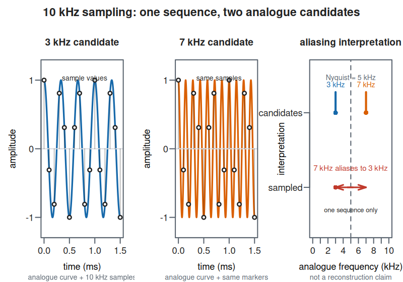
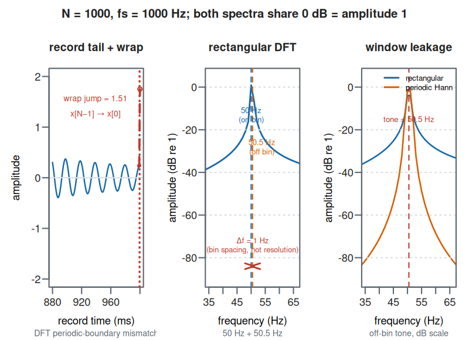
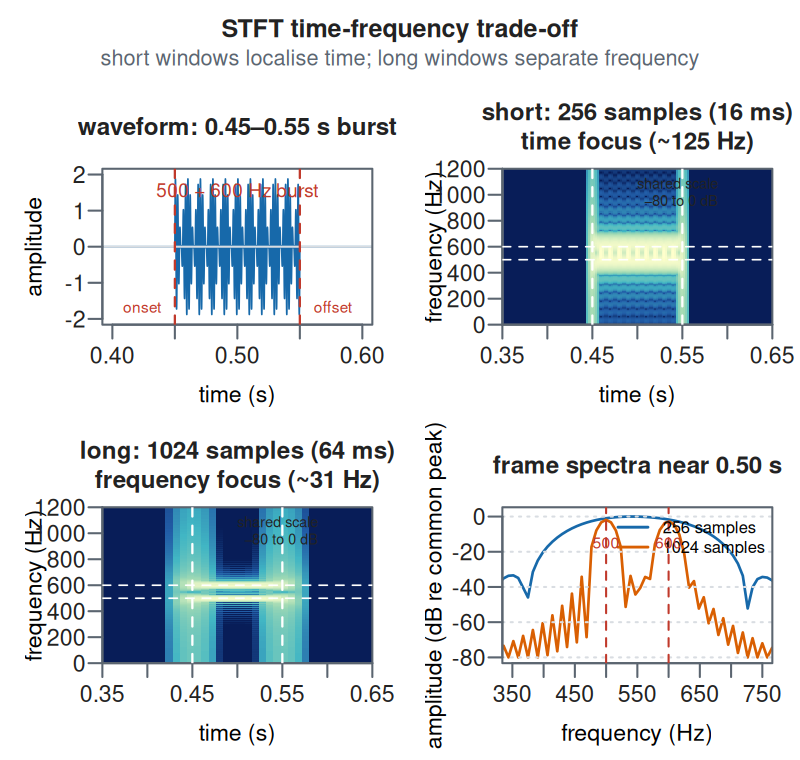

# Digital Signal Processing: A Technical Primer

## Introduction

Digital signal processing (DSP) is often introduced as a bag of transforms: take a Fourier transform, multiply by a filter response, and transform back. That description is mathematically correct and practically incomplete. Real DSP is the discipline of turning a physical measurement into a sequence of numbers, deciding what information matters, transforming or estimating that information, and producing an output whose timing, phase, noise, and numerical error are acceptable. The Fourier transform is one of its most useful coordinate systems, not the whole subject.

This primer builds a working model from first principles. It starts with what a signal and a system mean, derives the consequences of sampling, and then develops convolution, Fourier and $z$-domain analysis, digital filter design, multirate processing, spectral estimation, and common adaptive and time-frequency methods. It connects the mathematics to implementation details: finite records, windows, latency, state, floating-point arithmetic, fixed-point overflow, and the difference between an attractive plot and a correct measurement.

### What This Primer Covers

You will learn how a continuous-time waveform becomes a discrete-time sequence; why the Nyquist rate is a statement about bandwidth rather than a magic property of a device; how linear time-invariant systems are completely described by an impulse response; and why convolution in time becomes multiplication in frequency. You will derive the discrete Fourier transform (DFT), see why the fast Fourier transform (FFT) is an algorithm rather than a different transform, and use the $z$-transform to reason about poles, zeros, causality, and stability.

The filter sections cover finite impulse response (FIR) and infinite impulse response (IIR) structures, design from frequency specifications, phase and group delay, bilinear-transform frequency warping, numerical implementation with second-order sections, and the choices involved in real-time versus offline filtering. Later sections cover decimation and interpolation, power spectral density, Welch estimation, matched and adaptive filtering, analytic signals, short-time Fourier analysis, image processing, and an end-to-end Python workflow using NumPy and SciPy.

### What This Primer Is Not

This is not a replacement for a signals-and-systems or DSP textbook. It does not prove every convergence theorem, derive every window's closed-form transform, or give a complete treatment of communication theory, control, radar, biomedical instrumentation, or audio perception. Those subjects use the machinery developed here but deserve primers of their own. It is also not a catalogue of library calls. A library can design a filter in one line; it cannot decide whether the cutoff should be specified before or after decimation, whether phase distortion is acceptable, or whether the spectrum you plotted is scaled correctly.

### Assumed Background

You should be comfortable with algebra, complex numbers, functions, and basic calculus. You need to know what a vector and matrix are, but not to have taken an electrical-engineering course. The text introduces the notation it uses. A small amount of probability helps for the sections on noise and spectral estimation. The code examples use Python with NumPy and SciPy; the concepts apply equally to MATLAB, R, Julia, C, and embedded DSP libraries.

### A Mental Model: DSP as Controlled Information Flow

Keep this pipeline in mind:

```text
physical phenomenon
        ↓ sensor and analogue conditioning
continuous-time voltage/current or transducer output
        ↓ anti-aliasing filter + sample-and-hold + quantiser
finite-precision discrete-time sequence x[n]
        ↓ algorithm with state, parameters, and latency
discrete-time sequence y[n]
        ↓ optional reconstruction and analogue conditioning
actuator, display, storage, or decision
```

Every arrow can lose information or introduce error. A low-pass filter before an analogue-to-digital converter (ADC) prevents frequencies above the usable band from folding into it. A quantiser replaces a continuum of amplitudes with a finite set of codes. A causal filter cannot use samples that have not arrived yet, so phase and latency are design constraints rather than afterthoughts. A spectrum computed from a finite record is an estimate with a window, not a direct photograph of an infinite signal.

The central DSP question is therefore not “which transform should I call?” It is “what information is present, what information do I need, and what operations preserve or deliberately discard it?”

## Signals, Systems, and Convolution

Start with the objects DSP operates on: sequences, systems, impulses, recurrences, and the convolution and correlation operations that connect them.

### What Is a Signal?

A signal is a quantity that varies over an independent variable and carries information. For a microphone, the independent variable is time and the signal may be acoustic pressure or voltage. For an image, the independent variables are two spatial coordinates. For a sensor network, the signal may be indexed by time and sensor number. DSP usually denotes a continuous-time signal by $x(t)$ and a discrete-time sequence by $x[n]$, where $n$ is an integer sample index.

The distinction is important. A discrete-time signal is indexed only at integer positions; it is not automatically quantised in amplitude. A sequence such as

$$
x[n] = \sin(0.2\pi n)
$$

has discrete time but real-valued amplitude. A digital signal normally has both discrete time and finite-precision amplitude because a computer or converter stores a finite representation. Keeping time discretisation and amplitude discretisation separate prevents many sloppy explanations of sampling.

Signals can be classified along several axes. A deterministic signal is specified by a rule or known record; a stochastic process is described by probability distributions and statistical properties. A periodic sequence repeats exactly, while an aperiodic sequence does not. An energy signal has finite total energy,

$$
E_x = \sum_{n=-\infty}^{\infty} |x[n]|^2 < \infty,
$$

whereas a power signal has finite nonzero average power,

$$
P_x = \lim_{N\to\infty}\frac{1}{2N+1}
\sum_{n=-N}^{N}|x[n]|^2.
$$

The categories overlap imperfectly in practical finite records. A finite audio clip is an energy signal in the mathematical model; a stationary noise process is usually discussed through its power spectral density. The classification tells you which normalisation and convergence ideas are appropriate.

### Common Discrete-Time Operations

The basic operations are simple but form the vocabulary of every later derivation:

* **Shift:** $x[n-n_0]$ delays a sequence by $n_0$ samples; $x[n+n_0]$ advances it.
* **Reversal:** $x[-n]$ reflects the sequence around $n=0$.
* **Scaling:** $A x[n]$ changes amplitude; $x[Mn]$ keeps every $M$th sample and is decimation without anti-alias filtering.
* **Expansion:** $x[\frac{n}{L}]$ when $n$ is a multiple of $L$, with zeros elsewhere, is upsampling by $L$.
* **Difference:** $x[n]-x[n-1]$ emphasises changes and approximates a derivative after scaling by the sample interval.
* **Running sum:** $\sum_{k=-\infty}^{n}x[k]$ approximates integration and is the discrete-time accumulator.

The notation $x[2n]$ does not mean “make the signal twice as fast” in isolation. It selects an even-indexed subsequence and changes the sampling rate's interpretation only when a physical sample interval is attached to the sequence.

### Systems and Their Properties

A system maps an input signal to an output: $y = \mathcal{T}\{x\}$. Four properties matter constantly.

* **Linearity:** $\mathcal{T}\{a x_1 + b x_2\}=a\mathcal{T}\{x_1\}+b\mathcal{T}\{x_2\}$.
* **Time invariance:** delaying the input delays the output by the same amount. If $y[n]=\mathcal{T}\{x[n]\}$, then $\mathcal{T}\{x[n-n_0]\}=y[n-n_0]$.
* **Causality:** $y[n]$ depends only on samples at or before $n$. A noncausal system can use future samples and is possible for an offline record, but not for a live stream without adding delay.
* **Stability:** in the bounded-input, bounded-output (BIBO) sense, every bounded input produces a bounded output.

Linear time-invariant (LTI) systems are the centre of classical DSP because they are both expressive and analyzable. A nonlinear or time-varying system can be useful, but its behaviour cannot be inferred from one impulse response and one frequency-response curve.

You can test these properties with numbers before introducing transforms. Consider $\mathcal{T}\{x\}[n]=2x[n]-x[n-1]$, taking samples before the record to be zero. For $x_1=[1,2,0]$, the first three outputs are $[2,3,-2]$; for $x_2=[0,1,3]$, they are $[0,2,5]$. Form $3x_1-2x_2=[3,4,-6]$. Filtering this combination gives $[6,5,-16]$, exactly the same as $3[2,3,-2]-2[0,2,5]$. The tail at the next sample also agrees: it is $6$. Superposition must hold across the whole output support, not only where the input arrays overlap. A single successful test does not establish linearity for all inputs, but a failed test disproves it immediately.

Now add an offset: $\mathcal{S}\{x\}[n]=2x[n]-x[n-1]+1$. This system maps zero input to one, so it is affine rather than linear. At sample zero, $\mathcal{S}\{3x_1-2x_2\}=7$ while $3\mathcal{S}\{x_1\}-2\mathcal{S}\{x_2\}=7$ happens to agree because the two scalar weights sum to one. That particular test would miss the fault. With weights one and one, the separate offsets add to two while the combined-input output has only one offset. Include a zero-input check and weights whose sum is not one when testing a purportedly linear implementation. Clipping and adaptive coefficient updates require additional tests at different amplitudes and histories.

Causality is a comparison between inputs with the same past. Let $a=[1,2,3]$ and $b=[1,2,99]$. At index one, both have the same samples through that index. The causal rule $2x[n]-x[n-1]$ gives $3$ for either input. A centred smoother $\frac{x[n-1]+x[n]+x[n+1]}{3}$ instead gives $2$ for $a$ and $34$ for $b$: the changed future sample changes the present output. You can implement the centred operation online by waiting one sample and assigning the result to the earlier timestamp. That adds one sample of latency; relabelling timestamps without actually waiting does not remove the dependence on future data.

Time invariance needs the same boundary model in both experiments. Delaying $[1,2,0]$ by one sample gives $[0,1,2,0]$, and the causal rule returns $[0,2,3,-2]$ plus the appropriate tail: the original output delayed by one sample. If a block filter uses reflected padding at the beginning of each array, shifting the array can change the artificial past and spoil this comparison. The operation may be LTI in the interior while the finite-record wrapper is not. Test the wrapper separately rather than blaming the recurrence.

For stability, the same two-tap rule gives $|y[n]|\le3A$ whenever $|x[n]|\le A$, because its absolute coefficient sum is three. An accumulator fed the bounded sequence $x[n]=1$ gives $y[n]=n+1$, so it fails BIBO stability. The distinction matters for sensors: removing high-frequency noise with a stable filter is different from integrating a small constant bias into a displacement estimate that grows without bound.

Now replace the rule by $y[n]=x^2[n]$. With scalar inputs 1 and 2, the separate outputs sum to $1+4=5$, whereas the output of their sum is 9. Squaring fails superposition even though it remains causal and time-invariant. The rule $y[n]=n x[n]$ passes superposition but fails time invariance: a unit impulse at zero produces zero, while delaying that input to index three produces an output of 3 there. These examples separate properties that are often mistakenly bundled together.

Causality and stability are independent. The centred average above is noncausal but stable because $|x[n]|\le A$ implies $|y[n]|\le A$. The accumulator is causal but unstable. A finite record never literally reaches infinity; increasing record lengths exposes the lack of any duration-independent output bound.

For an absolutely summable impulse response, the triangle inequality gives the useful engineering bound

$$
|y[n]|\le \|x\|_\infty\sum_k|h[k]|.
$$

This bound measures worst-case amplitude gain, rather than the gain at DC. The FIR $h=[1,-2,1]$ has zero DC gain but an absolute-coefficient sum of 4. At a chosen output instant, an input history with signs $[1,-1,1]$ produces output 4 while every input sample has magnitude one. A DC test alone would completely miss this internal-range requirement. For a finite FIR, selecting input signs to align with its coefficients makes the bound attainable at an instant; for a general IIR, a long sign-aligned history can approach it when the absolute sum converges.

### The Unit Impulse and the Impulse Response

The discrete-time unit impulse is

$$
\delta[n] =
\begin{cases}
1, & n=0,\\
0, & n\ne 0.
\end{cases}
$$

Every sequence can be decomposed into shifted, scaled impulses:

$$
x[n] = \sum_{k=-\infty}^{\infty}x[k]\delta[n-k].
$$

If an LTI system's response to $\delta[n]$ is $h[n]$, linearity and time invariance give its response to $x[n]$:

$$
y[n] = x[n]*h[n]
     = \sum_{k=-\infty}^{\infty} x[k]h[n-k].
$$

The sequence $h[n]$ is the impulse response. This is not merely a convenient formula. It says that an LTI system is completely characterised by how it responds to one impulse, provided the relevant sums converge. A short $h[n]$ gives a finite impulse response filter; an impulse response that continues forever gives an infinite impulse response filter.

For a causal filter, $h[n]=0$ for $n<0$, and the convolution can be evaluated online as

$$
y[n] = \sum_{k=0}^{\infty} h[k]x[n-k].
$$

If $h[n]$ is absolutely summable,

$$
\sum_{n=-\infty}^{\infty}|h[n]| < \infty,
$$

the filter is BIBO stable. A practical FIR is automatically stable; an IIR requires its poles to lie inside the unit circle for the usual causal realisation.

### Convolution as a Sliding Weighted Sum

For a finite impulse response $h[0],\ldots,h[M]$, convolution is a dot product between the current input window and the reversed coefficient vector:

$$
y[n] = h[0]x[n] + h[1]x[n-1]+\cdots+h[M]x[n-M].
$$

The coefficients are not “the frequencies to keep.” They are time-domain weights whose collective response determines the frequency behaviour. A moving average with $M$ taps,

$$
h[k]=\frac{1}{M},\qquad 0\le k<M,
$$

reduces rapid variation because neighbouring samples are averaged. It also delays the signal by approximately $\frac{M-1}{2}$ samples if interpreted as a linear-phase FIR, attenuates some frequencies, and introduces a frequency response with sidelobes. The smoothing is never free.

**Concrete example.** Let the three-tap filter be $h=[\frac14,\frac12,\frac14]$, and suppose the input begins $x=[2,4,8,6]$ with zero samples before the record. The first outputs are $y[0]=0.5$, $y[1]=2.0$, $y[2]=4.5$, and $y[3]=6.5$. For example, $y[2]=\frac14 8+\frac12 4+\frac14 2=4.5$. Each output is a weighted view of the current and previous samples; no frequency-domain operation is required to run the filter.

If the input returns to zero after its fourth sample, the complete linear convolution is $[0.5,2,4.5,6.5,5,1.5]$. The final two values are the filter tail, not extra measurements. Their inclusion makes another identity visible: $\sum_n y[n]=(\sum_nx[n])(\sum_nh[n])=20$. Returning only four values gives a legitimate same-length streaming prefix, but its sum is 13.5 because the tail has not yet been emitted. When checking conservation or comparing libraries, distinguish the full convolution, its causal prefix, and a centred crop. They differ in support and time origin even with identical coefficients.

Convolution is commutative and associative where the sums exist:

$$
x*h=h*x,\qquad (x*h)*g=x*(h*g).
$$

This lets you combine cascaded LTI filters into one equivalent impulse response. In implementation, however, direct convolution may be a poor choice for long filters: FFT-based overlap-save or polyphase structures, which group coefficients by sample-index residues, can reduce the cost.

### Correlation and Matched Similarity

Correlation compares one sequence with shifted versions of another. A common convention for cross-correlation is

$$
r_{xy}[\ell] = \sum_n x^*[n]y[n+\ell],
$$

where $^*$ denotes complex conjugation. Autocorrelation sets $x=y$ and measures similarity with shifted copies of the same signal. Correlation is closely related to convolution: cross-correlation is convolution with a time-reversed conjugated sequence.

This distinction matters in detection. A matched filter uses a time-reversed, conjugated copy of the expected waveform, so the output peaks when the waveform is aligned. Calling every correlation a convolution produces the wrong phase and often the wrong lag sign.

### Difference Equations

Many digital filters are described by a linear constant-coefficient difference equation:

$$
y[n]+a_1y[n-1]+\cdots+a_Ny[n-N]
=b_0x[n]+b_1x[n-1]+\cdots+b_Mx[n-M].
$$

The $b_k$ coefficients form the feed-forward path and the $a_k$ coefficients form feedback. If all feedback coefficients are zero, the filter is FIR. If feedback is present, the impulse response generally continues indefinitely and the filter is IIR.

The equation is a computational specification only after initial conditions are defined. For a stream, the previous input and output states come from the preceding block. For a finite record, setting all states to zero creates a startup transient; setting them to a steady-state value can reduce the transient for particular inputs. A block implementation that silently resets state at every block is not equivalent to one continuous stream.

### Causality, Stability, and Poles in the Time Domain

An IIR recurrence can look harmless and still be unstable. The first-order system

$$
y[n]=0.99y[n-1]+x[n]
$$

is a stable smoother; replacing $0.99$ with $1.01$ causes the homogeneous response to grow as $1.01^n$. The distinction is visible directly from the pole location: the pole is at $z=0.99$ or $z=1.01$.

In a finite-precision implementation, a pole theoretically inside the unit circle can still behave badly if coefficient quantisation moves it outside, if internal states overflow, or if denormal values cause unacceptable performance. Stability analysis must cover both the mathematical transfer function and the chosen realisation.

## Fourier Representations and Frequency Response

Once the time-domain model is in place, Fourier representations provide a second coordinate system. The same operations can then be understood as changes in amplitude, phase, and frequency.

### Complex Exponentials Are Eigenfunctions of LTI Systems

For an LTI system with frequency response $H(e^{j\omega})$, a complex exponential input $x[n]=e^{j\omega n}$ produces

$$
y[n]=\sum_k h[k]e^{j\omega(n-k)}
=e^{j\omega n}\sum_k h[k]e^{-j\omega k}
=H(e^{j\omega})e^{j\omega n}.
$$

The system changes only amplitude and phase; it does not create new frequencies. This is why frequency response is so useful. A real sinusoid is the sum of positive- and negative-frequency complex exponentials, and real filters preserve the conjugate symmetry needed to produce a real output.

### The Discrete-Time Fourier Transform

The discrete-time Fourier transform (DTFT) of $x[n]$ is

$$
X(e^{j\omega})=\sum_{n=-\infty}^{\infty}x[n]e^{-j\omega n},
$$

with inverse

$$
x[n]=\frac{1}{2\pi}\int_{-\pi}^{\pi}
X(e^{j\omega})e^{j\omega n}\,d\omega.
$$

The DTFT is continuous in $\omega$ but periodic with period $2\pi$. Normalized frequency $\omega$ is radians per sample. If the sample rate is $f_s$, physical frequency is $f=\frac{\omega f_s}{2\pi}$, and the interval $[-\pi,\pi)$ corresponds to $[-\frac{f_s}{2},\frac{f_s}{2})$.

For an LTI system,

$$
y[n]=x[n]*h[n]
\quad\Longleftrightarrow\quad
Y(e^{j\omega})=X(e^{j\omega})H(e^{j\omega}).
$$

The convolution theorem is the mathematical basis for filtering in the frequency domain. It also explains why a frequency-domain filter is not merely “delete bins”: if $X$ is a finite-record DFT, multiplying by a smooth frequency response corresponds to circular convolution in the finite-dimensional model unless overlap-save or overlap-add is used correctly.

### Fourier Series and the Continuous-Time Transform

The Fourier series represents a periodic continuous-time signal as harmonics of its fundamental frequency:

$$
x(t)=\sum_{k=-\infty}^{\infty}c_ke^{jk\omega_0t},
\qquad
c_k=\frac{1}{T_0}\int_{T_0}x(t)e^{-jk\omega_0t}\,dt.
$$

The continuous-time Fourier transform (CTFT) generalises this to aperiodic signals:

$$
X(f)=\int_{-\infty}^{\infty}x(t)e^{-j2\pi ft}\,dt,
\qquad
x(t)=\int_{-\infty}^{\infty}X(f)e^{j2\pi ft}\,df.
$$

The four Fourier representations differ in what is discrete, periodic, finite, or continuous. Confusing them causes unit and scaling errors:

| Representation | Time/domain index | Frequency/domain index | Frequency periodic? |
|---|---|---|---|
| Fourier series | continuous and periodic | discrete harmonics | no, discrete set |
| CTFT | continuous and aperiodic | continuous | no |
| DTFT | discrete and generally aperiodic | continuous | yes, $2\pi$ |
| DFT | finite discrete record | finite discrete bins | implicit periodic extension |

### Time and Frequency Shifts

The DTFT shift property follows directly:

$$
x[n-n_0]\quad\Longleftrightarrow\quad
e^{-j\omega n_0}X(e^{j\omega}).
$$

The magnitude is unchanged; the phase gains a linear term. This is why delay can be measured from phase slope, and why a pure delay is all-pass in magnitude. For a noninteger delay, the ideal response is $e^{-j\omega D}$, but a finite causal filter can only approximate it over a specified band.

Modulation and convolution form a dual pair. Multiplying a signal by a sinusoid shifts its spectrum; convolving in time with a short pulse smooths or shapes the spectrum according to the pulse's transform. These properties let you predict a filter's output before simulating it.

### Differentiation and Integration

The backward difference filter has

$$
H(e^{j\omega})=1-e^{-j\omega}
 =2j e^{-j\frac{\omega}{2}}\sin\left(\frac{\omega}{2}\right).
$$

At low frequencies its magnitude is approximately $|\omega|$, so it approximates a derivative. At high frequencies it amplifies relative high-frequency content and has a zero at DC. The accumulator has a pole at $z=1$, so it integrates but is not BIBO stable: a bounded nonzero-mean input can produce an unbounded ramp.

In numerical work, differentiation amplifies measurement noise and integration accumulates bias. A high-pass filter or detrending may be needed before differentiation; leakage control, drift removal, or a physical reference may be needed before integration. Choosing a discrete approximation without considering the noise spectrum is a common source of false dynamics.

### Why the Moving Average Is Not an Ideal Filter

For a length-$M$ moving average,

$$
H(e^{j\omega})=\frac{1}{M}\sum_{k=0}^{M-1}e^{-j\omega k}
 =e^{-j\frac{\omega(M-1)}{2}}
\frac{\sin\left(\frac{M\omega}{2}\right)}{M\sin\left(\frac{\omega}{2}\right)}.
$$

The magnitude has a main lobe and sidelobes. It attenuates high frequencies but also passes some stopband frequencies through sidelobes. Increasing $M$ narrows the main lobe and increases delay. This one formula is a useful antidote to the phrase “averaging removes noise”: averaging suppresses components according to a known response, and the response has trade-offs.

## Sampling, Reconstruction, and Acquisition Limits

Sampling is where the physical signal chain meets discrete-time mathematics. The following chapter treats aliasing, reconstruction, quantisation, and timing error as acquisition constraints, not as details to repair later.

### Sampling Is Multiplication by an Impulse Train

Suppose a continuous signal $x(t)$ is sampled every $T$ seconds, at sampling frequency $f_s=\frac{1}{T}$. An idealised sampled signal is

$$
x_s(t)=x(t)\sum_{n=-\infty}^{\infty}\delta(t-nT)
       =\sum_{n=-\infty}^{\infty}x(nT)\delta(t-nT).
$$

The discrete sequence is $x[n]=x(nT)$. A physical ADC is not an ideal impulse-train multiplier: it includes a sample-and-hold, finite aperture, analogue front-end, clock jitter, and quantisation. The ideal model isolates the fundamental question: can the original band-limited signal be reconstructed from its samples?

### What Sampling Does in Frequency

Multiplication in time becomes convolution in frequency. The Fourier transform of the impulse train is another impulse train, so sampling replicates the continuous-time spectrum every $f_s$:

$$
X_s(f)=\frac{1}{T}\sum_{k=-\infty}^{\infty}X(f-kf_s).
$$

If the replicas do not overlap, an analogue low-pass reconstruction filter can select the central copy. If they overlap, the sum in the overlap is irreversible: different continuous-time frequencies have produced the same samples. This is aliasing.

The same fact appears for a sampled sinusoid. Since

$$
\cos(2\pi f_0 nT)=\cos\left(2\pi\frac{f_0}{f_s}n\right),
$$

frequencies that differ by integer multiples of $f_s$ produce identical discrete-time sequences. Also, $f_0$ and $-f_0$ produce the same real cosine. Discrete-time frequency is periodic modulo $2\pi$ radians per sample.

It helps to separate the frequency of interest from the sampling frequency. Suppose the analogue signal contains a wanted 3 kHz tone and an unwanted 7 kHz tone. At $f_s=10$ kHz, the Nyquist frequency is 5 kHz. The 3 kHz tone is inside the nominal baseband, but the 7 kHz tone is outside it and folds to $|7-10|=3$ kHz. The ADC output can therefore contain two contributions at the same digital frequency. A digital low-pass filter cannot retain the wanted 3 kHz tone while removing the aliased 7 kHz tone, because after sampling they are the same sequence up to amplitude and phase.

The same example shows why “sample at twice the signal frequency” is not a useful specification when the signal contains more than one component. If the requirement is to measure everything through 3 kHz, $f_s=10$ kHz leaves a 2 kHz transition region between the passband edge and Nyquist. A concrete analogue anti-alias requirement might be: passband $0$--$3$ kHz with gain ripple no more than $0.1$ dB, and attenuation at least $80$ dB from $5$ kHz through the analogue front-end bandwidth. The 7 kHz interferer then reaches the ADC at least 80 dB lower, while the 3 kHz measurement remains within its gain tolerance. The exact edges and attenuation belong to the measurement's error budget; “add an anti-alias filter” is not enough without numbers.

There is a second, independent acquisition choice in a zero-order hold. If a DAC holds each sample for $T=\frac{1}{f_s}$, its frequency response contains

$$
H_{\mathrm{ZOH}}(f)=T\,\operatorname{sinc}(fT)e^{-j\pi fT},
\qquad \operatorname{sinc}(u)=\frac{\sin(\pi u)}{\pi u}.
$$

The phase term is a delay of half a sample and the sinc term causes passband droop. At 3 kHz with $f_s=10$ kHz, the magnitude factor is $\operatorname{sinc}(0.3)\approx0.858$, or about $-1.33$ dB. A reconstruction filter or digital equaliser can compensate some of this droop, but the compensation must not amplify noise or images near Nyquist. The hold response does not cause the 7 kHz aliasing example; that ambiguity was created earlier, at the ADC sampling operation.

### The Sampling Theorem, Precisely Enough

If $x(t)$ is strictly band-limited to $|f|<B$ and sampled at $f_s>2B$, ideal sinc interpolation reconstructs it exactly:

$$
x(t)=\sum_{n=-\infty}^{\infty}x[n]
\operatorname{sinc}\left(\frac{t-nT}{T}\right),
\qquad \operatorname{sinc}(u)=\frac{\sin(\pi u)}{\pi u}.
$$

The inequality is strict in practical systems because real filters have finite transition bands and real signals are not perfectly band-limited. “Nyquist frequency” means $\frac{f_s}{2}$, the boundary of the principal frequency interval for a real baseband sampled system; “Nyquist rate” conventionally means twice the highest occupied frequency for a low-pass signal. They are not the same phrase. A bandpass signal can admit lower sampling rates under additional support constraints, so do not turn the low-pass rule into a universal statement about occupied bandwidth.

The theorem is about representation, not about the quality of a reconstruction filter or the absence of noise. It does not say that sampling at just over twice a vaguely defined centre frequency is safe. For a bandpass signal, bandpass sampling can use a lower rate if the spectral replicas are deliberately arranged not to overlap, but the allowable bands and analogue filtering must be engineered.

Take a real signal known to occupy only the positive-frequency band $[f_L,f_H]=[70,90]$ kHz and its negative-frequency mirror. Its occupied positive bandwidth is 20 kHz. For an integer zone index $m\ge2$, one ideal nonoverlap interval is

$$
\frac{2f_H}{m}\le f_s\le\frac{2f_L}{m-1}.
$$

The index must give a nonempty interval; strict margins are needed for a real filter. With $m=3$, the allowable ideal interval is 60--70 kHz. Choose 64 kHz. Frequencies from 70 to 90 kHz map, after subtracting one sampling frequency, to 6--26 kHz. The negative band maps to its mirror, and neither reaches the 32 kHz Nyquist boundary. A reconstruction algorithm that knows the original band can recover that bandpass interpretation. A baseband reconstruction would instead produce a 6--26 kHz interpretation of the same samples. The band constraint supplies information the samples alone do not contain.

The condition $f_s>2(f_H-f_L)$ is necessary in this real-band model but is not sufficient. At 50 kHz, 70--90 kHz maps through 20--40 kHz, crosses the 25 kHz folding boundary, and overlaps its reflected copy. An arbitrary band waveform cannot be recovered even though 50 kHz exceeds twice the bandwidth. Also track spectral orientation: a band entirely in an even-numbered Nyquist zone folds with its frequency order reversed. For example, at 60 kHz a band from 40 to 50 kHz becomes 20 down to 10 kHz. Tone labels, quadrature phase, and modulation interpretation must account for that reversal.

Bandpass sampling requires an analogue **bandpass** acquisition filter that isolates the intended band and rejects all other bands that land in the same digital frequencies. A low-pass filter below 32 kHz would remove the wanted 70--90 kHz signal. The ADC's analogue input bandwidth must reach 90 kHz despite its 64 kHz sample rate, and its clock quality must be evaluated at the original analogue frequency. Undersampling changes the digital frequency label; it does not reduce the slope of the voltage arriving at the sampling aperture.

For a real signal supported only in $[f_L,f_H]$ and its negative-frequency mirror, an ideal undersampling interval for $m\ge2$ is

$$
\frac{2f_H}{m}\le f_s\le\frac{2f_L}{m-1},
\qquad
2\le m\le\left\lfloor\frac{f_H}{f_H-f_L}\right\rfloor.
$$

The ordinary low-pass case is separate: choose $f_s\ge2f_H$ when the band begins at DC. These intervals arrange the positive and negative spectral copies without overlap. Equality leaves no guard for filter transitions, frequency drift, or energy at a band edge; choose an interior operating point in hardware. A rate merely above twice the occupied bandwidth is necessary for this ideal real-band model but does not guarantee that the copies fit at that particular rate.

Suppose a receiver has isolated the analogue band 70--90 MHz. Its occupied bandwidth is 20 MHz. Choosing $m=4$ gives $45\le f_s\le46.667$ MHz, so 46 MHz is a candidate even though it is much smaller than 180 MHz. The positive band maps, after subtracting 92 MHz, to -22 through -2 MHz. Its negative mirror maps to +2 through +22 MHz inside the principal interval -23 through +23 MHz. There is a 2 MHz guard on each side of DC (4 MHz total gap) and a 1 MHz guard at each Nyquist boundary. The frequency order is reversed when interpreted as a positive-frequency real band: an 80 MHz cosine appears at $|80-92|=12$ MHz. This spectral inversion must be included in demodulation and frequency labelling.

Sampling this same band at 44 MHz fails despite exceeding 40 MHz: after subtracting 88 MHz, the band extends from -18 to +2 MHz and overlaps its negative-frequency mirror around zero. Sampling at 50 MHz also fails: reflected pieces overlap near the Nyquist boundary. You cannot fix either overlap with a digital channel filter. The interval calculation concerns the actual support after analogue selection, not the centre frequency written on the receiver box.

An undersampling ADC must still acquire a 90 MHz waveform. Its analogue input bandwidth, track-and-hold settling, aperture, and jitter are therefore specified at radio frequency, even though its sample clock is only 46 MHz. A low-pass anti-alias filter at 23 MHz would remove the wanted signal. This application requires an analogue bandpass preselector that suppresses every other band capable of folding into the desired digital interval. Its transition regions consume the ideal guards above. Nonlinear distortion generated after the preselector also needs attention: a protected spectral interval at the sensor is no guarantee that the ADC driver leaves it protected.

### Aliasing Is a Design Failure Once It Happens

Consider a 7 kHz tone sampled at 10 kHz. Its aliases appear at frequencies equivalent modulo 10 kHz; in the baseband it appears at $|7-10|=3$ kHz. A later digital low-pass filter can remove a 3 kHz tone only by also removing genuine 3 kHz content. The filter cannot determine whether the sample sequence came from a 3 kHz or 7 kHz analogue sinusoid.

You can see the irreversibility directly from the samples. The R version
uses the base `cos` and vectorised arithmetic:

::: {.code-group}

**Python**

```python
import numpy as np

n = np.arange(12)
x_7k = np.cos(2 * np.pi * 7_000 / 10_000 * n)
x_3k = np.cos(2 * np.pi * 3_000 / 10_000 * n)
print(np.max(np.abs(x_7k - x_3k)))  # approximately 0
```

**R**

```r
n <- 0:11
x_7k <- cos(2 * pi * 7000 / 10000 * n)
x_3k <- cos(2 * pi * 3000 / 10000 * n)
print(max(abs(x_7k - x_3k)))  # approximately 0
```

:::

The two analogue explanations produce the same real-valued sequence. Once the ADC has emitted those numbers, no digital filter can choose the correct explanation.



*Figure: Unit-amplitude 3 kHz and 7 kHz analogue cosine candidates sampled at 10 kHz. Each candidate passes through the same sample values; they are alternative analogue interpretations, not simultaneous reconstructions of one baseband signal. The frequency view shows spectral folding across the 5 kHz Nyquist boundary. An acquisition chain must suppress the unwanted candidate before sampling because the digital samples alone cannot distinguish them.*

The anti-aliasing filter must therefore be analogue, or must occur before the sampling operation at an earlier, faster sampling rate. In a practical acquisition chain:

1. define the highest signal frequency you care about;
2. select $f_s$ with room for a transition band;
3. design the analogue anti-aliasing filter to meet the required attenuation at every analogue frequency that aliases into the retained digital band;
4. account for the sensor, amplifier, filter, ADC aperture, clock, and quantisation together;
5. verify the actual spectrum with a test signal and a calibrated measurement path.

Oversampling makes the analogue filter easier: a larger gap between the signal band and Nyquist frequency permits a gentler transition. It does not make aliasing impossible; it moves the engineering boundary.

Turn the attenuation requirement into an amplitude budget. If the wanted 3 kHz component is 10 mV RMS and the 7 kHz blocker is 1 V RMS, requiring its alias to be below 1% of the wanted amplitude means reducing it below 0.1 mV RMS. The necessary attenuation is $20\log_{10}\left(\frac{1}{10^{-4}}\right)=80$ dB. A 60 dB filter leaves 1 mV RMS, a 10% contaminant. If both components are coherent after folding, their phases can produce constructive or destructive amplitude error; adding their powers as though they were independent noise is wrong.

For a measurement retaining only 0--3 kHz at a 10 kHz rate, the first out-of-band frequencies that fold directly into that retained interval begin at 7 kHz. Attenuation from 5 kHz onward is a conservative requirement when the entire principal interval must be clean. A design can instead exploit an unused 3--5 kHz guard band, provided it models all aliases and discards that digital guard band later. In either case, the analogue front end must avoid overload before filtering: a clipped amplifier creates in-band products that an otherwise adequate anti-alias filter cannot remove.

### Reconstruction and the Zero-Order Hold

The ideal sinc interpolator is noncausal and infinitely long. A digital-to-analogue converter (DAC) commonly holds each sample until the next update, producing a zero-order-hold waveform. In frequency, the hold contributes a sinc-shaped envelope and the staircase contains images at multiples of $f_s$. An analogue reconstruction filter removes those images and often compensates, approximately, for the hold's passband droop.

When DSP documentation says “the output is a 1 kHz sine,” ask whether it means the discrete sequence has a normalized digital frequency, the DAC output has a 1 kHz analogue component, or the entire reconstruction chain has been characterised. Those are related but not identical statements.

### Quantisation and Signal-to-Quantisation-Noise Ratio

An ideal $B$-bit uniform quantiser maps an amplitude range into $2^B$ levels with step size $\Delta$. The error $e[n]=x_q[n]-x[n]$ is bounded approximately by $\pm\frac{\Delta}{2}$ when the input is not overloaded. Under common assumptions—error uncorrelated with the signal and approximately uniform—the error power is $\frac{\Delta^2}{12}$.

For a full-scale sine wave into an ideal $B$-bit ADC, the familiar approximation is

$$
\mathrm{SNR}_{\mathrm{q}}\approx 6.02B+1.76\ \mathrm{dB}.
$$

This is a reference, not a guarantee. Missing codes, nonlinearity, thermal noise, clock jitter, reference noise, and analogue distortion reduce real effective number of bits (ENOB). A low-amplitude signal also uses fewer quantisation levels and therefore has worse signal-to-quantisation-noise ratio relative to its own amplitude. Dither can decorrelate quantisation error from the signal, replacing deterministic distortion with noise whose statistics are easier to model.

**Small quantiser example.** Take a 3-bit mid-rise quantiser whose input range is $[-1,1)$, so there are eight codes and $\Delta=\frac{2}{8}=0.25$. The reconstruction levels are

$$
-0.875,-0.625,-0.375,-0.125,
0.125,0.375,0.625,0.875.
$$

The inputs $[-0.90,-0.62,-0.10,0.12]$ map approximately to $[-0.875,-0.625,-0.125,0.125]$. Taking error to mean reconstructed value minus input, the errors are $[0.025,-0.005,-0.025,0.005]$. An input of $0.75$ lies exactly on a decision boundary: depending on the endpoint convention it maps to $0.625$ or $0.875$, with error $-0.125$ or $+0.125$. Values at or beyond the range need a specified overload rule, usually clipping or saturation. Once overloaded, the error is no longer bounded by $\frac{\Delta}{2}$, and the distortion is signal-dependent rather than well modelled as independent white noise.

The same scale issue appears in fixed-point arithmetic. In signed Q1.3 notation, the stored integer $q$ represents $q\,2^{-3}$, so $0.75$ is stored as $6$ and $0.625$ as $5$. Their exact product is represented by the integer product $6\cdot5=30$ on a scale of $2^{-6}$, which equals $0.46875$. To return to Q1.3, divide by $2^3$ and round: $\frac{30}{8}=3.75$ becomes stored integer $4$, or $0.5$. The $0.03125$ rounding error is one-quarter of a Q1.3 LSB, visible in this tiny example. A real multiply therefore needs a wider accumulator, a rounding policy, and a rule for values outside the destination range; “use fixed point” does not specify those choices. Dither can make repeated truncation less correlated with the signal, but it cannot recover bits discarded by an overloaded or poorly scaled operation.

For a less toy-like budget, take a 12-bit ADC spanning -1 to +1 V. Its step is $\frac{2}{4096}=488.3$ $\mu$V and ideal quantisation-noise RMS is $\frac{\Delta}{\sqrt{12}}=141.0$ $\mu$V. A near-full-scale 1 V peak sine has RMS $0.7071$ V and ideal quantisation SNR about 74.0 dB. A 10 mV peak sine has RMS 7.071 mV and only about 34.0 dB relative to the same noise floor. Amplifying the small signal before conversion can use more codes, but the amplifier's noise, gain uncertainty, and overload margin then enter the budget. Digital gain afterward scales the signal and the already acquired errors together.

If uncorrelated front-end noise contributes 100 $\mu$V RMS, combining it with the ideal quantisation noise gives $\sqrt{141^2+100^2}=172.9$ $\mu$V RMS. This root-sum-square addition applies to independent or uncorrelated random errors. It does not justify combining deterministic spurs, calibration bias, or coherent interference in the same way. Integrating a measured noise density over the actual analogue bandwidth is preferable to borrowing a quoted RMS noise measured in an unspecified bandwidth.

ENOB derived from signal-to-noise-and-distortion ratio (SINAD) uses $\frac{\mathrm{SINAD}-1.76}{6.02}$ for the full-scale-sine reference. A measured 68 dB SINAD corresponds to about 11.0 effective bits under that convention. SINAD includes distortion power as well as noise; SNR measurements often exclude harmonics. Quoting ENOB without the input frequency, amplitude, bandwidth, and harmonic treatment conceals the conditions of the measurement. An ADC may achieve a higher ENOB at low frequency than near its analogue bandwidth limit.

The uniform independent-error model is especially weak for quiet or coherent inputs. A constant voltage between two decision thresholds always maps to the same code; a low-level sine can generate a repeating, harmonic-rich error sequence. Dither deliberately randomises threshold crossings. A subtractive scheme adds a known random signal before quantisation and subtracts it afterward; with an appropriate uniform dither and no overload, the residual error can be uniform and independent of the input. A common nonsubtractive triangular dither, formed by summing two independent uniforms each spanning one LSB peak-to-peak, suppresses important signal-dependent error effects but raises the noise floor. Do not attribute the subtractive scheme's unchanged error variance to every dither implementation. Dither trades distortion for controlled noise and needs headroom of its own.

For a reduced-level sine test, a full-scale-referred ENOB convention adds the level correction to SINAD before calculating bits; silently doing that changes the meaning of the number. Averaging reduces uncorrelated noise but cannot average away a repeatable harmonic, missing-code distortion, or clipping.

Dither is deliberate randomness added before a quantising operation. Without it, a slowly varying sub-LSB signal may remain on one code for many samples and then jump; its error is locked to the signal, so a white-noise model is false. For an ideal rounding quantiser with infinite range, non-subtractive triangular probability density function (TPDF) dither can be formed by adding two independent uniform variables on $[-\frac{\Delta}{2},\frac{\Delta}{2}]$. Its support is $[-\Delta,\Delta]$ and variance is $\frac{\Delta^2}{6}$. The total output error relative to the original undithered input has variance $\frac{\Delta^2}{4}$, with zero mean and signal-independent first two moments under the standard ideal assumptions. That is three times the usual $\frac{\Delta^2}{12}$ noise power, a 4.77 dB increase. The benefit is predictable low-order error statistics and less deterministic distortion, paid for with additional noise. This does not make every aspect of the error statistically independent of the input.

Subtractive dither is different: add a known dither before quantisation and subtract that same value afterward. With suitable independent uniform dither, the remaining error can be uniform and independent with variance $\frac{\Delta^2}{12}$. An ADC usually cannot remove analogue dither perfectly because the exact voltage perturbation is not available as a digital reference. In software, subtraction is feasible if both ends share the dither sequence and there is no overload. Keep enough headroom for the added dither; clipping invalidates the ideal guarantees. For low-level measurement, averaging dithered samples can reveal a mean below one LSB, but each sample remains quantised and the bandwidth and uncertainty of that average still have to be reported.

### Clock Jitter and Aperture Effects

Sampling time errors matter more at high frequency and high slew rate. If the intended sample time is $t_n=nT$ but the actual time is $t_n+\epsilon_n$, then to first order

$$
x(t_n+\epsilon_n)\approx x(t_n)+\epsilon_n x'(t_n).
$$

For a sinusoid, timing jitter creates amplitude error proportional to frequency. A useful approximate jitter-limited signal-to-noise ratio is

$$
\mathrm{SNR}_{\mathrm{jitter}}\approx -20\log_{10}(2\pi f_{\mathrm{in}}\sigma_t),
$$

where $\sigma_t$ is the RMS timing uncertainty. This is why a converter can have enough nominal bits but still fail at radio frequencies: the clock may be the limiting component.

For $\sigma_t=1$ ps, a 3 kHz sine has a jitter limit of about 154.5 dB, usually far below other acquisition errors. At 70 MHz the same uncertainty limits SNR to about 67.1 dB, or roughly 10.9 bits if jitter were the only SINAD contribution. A 90 dB jitter target at 70 MHz requires $\sigma_t\le\frac{10^{-\frac{90}{20}}}{2\pi\,70\times10^6}\approx72$ femtoseconds. If independent clock jitter is 800 fs RMS and ADC aperture jitter is 600 fs RMS, their combined uncertainty is $\sqrt{800^2+600^2}=1000$ fs RMS. Add independent error **powers**, rather than adding their SNR values in decibels. Correlated timing errors require a covariance model, and periodic jitter can produce sidebands rather than a white noise floor.

A fixed aperture delay shifts the effective sample time and may be calibrated; random variation of that time is aperture jitter. Aperture duration describes the interval over which the circuit acquires the voltage and can cause a deterministic bandwidth response. [Analog Devices' aperture tutorial](https://www.analog.com/media/en/training-seminars/tutorials/mt-007.pdf) distinguishes these timing quantities. They require separate error-budget entries even when a data sheet groups them under sampling specifications.

These errors interact with the analogue filter. If an unwanted sine is 1 V peak and the allowed aliased contribution is 100 microvolts peak, the filter needs at least 80 dB attenuation at that sine's original frequency. If several interferers alias into the same bin with stable phase, their amplitudes can add; independent broadband contributions add in power. A quoted attenuation at Nyquist alone does not certify rejection at every frequency that folds into the retained measurement band. Test the entire analogue input range relevant to the sensor and interference environment.

With $\sigma_t=1$ ps RMS, the jitter limit is about 104 dB for a 1 MHz input and 64 dB for a 100 MHz input. Achieving 80 dB at 100 MHz requires $\sigma_t\le\frac{10^{-\frac{80}{20}}}{2\pi10^8}=159$ fs RMS in the relevant jitter bandwidth. Undersampling that input does not replace $f_{\mathrm{in}}$ by its low digital alias in this equation: the timing error acts on the analogue waveform's slope before folding. Independent clock and aperture jitter contributions can be combined in quadrature; periodic timing modulation produces spurs rather than a flat noise floor.

A finite averaging aperture is a different effect. In an ideal rectangular-aperture model of width $\tau_a$, the sampled value is an average over that interval, with amplitude response $\operatorname{sinc}(f\tau_a)$ and a timing phase determined by whether the aperture is centred or begins at the stated sample time. At 100 MHz, a 1 ns aperture gives $\operatorname{sinc}(0.1)=0.9836$, about -0.143 dB. A deterministic aperture droop can be calibrated within a usable band; random jitter cannot be undone from the sample sequence alone. Real track-and-hold circuits are not necessarily rectangular averagers, so use this model to distinguish effects and measure the actual response.

Sample-rate error changes the frequency axis even when individual sample jitter is tiny. A 20 parts-per-million clock error produces a 0.2 Hz error when labelling a 10 kHz tone. Over a minute, two such independently clocked streams can drift by milliseconds. A precision measurement needs a calibrated timebase; a long-running multidevice stream may need asynchronous rate conversion or explicit timestamp-based alignment.

## The DFT, FFT, and Fast Convolution

The DTFT is continuous in frequency; real programs operate on finite records. This chapter develops the finite transform, its geometry and calibration, the FFT algorithm, and the boundary rules needed for fast convolution.

### Orthogonality of the DFT Basis

Let $W_N=e^{-j\frac{2\pi}{N}}$. The DFT basis vector for bin $k$ has entries $W_N^{kn}$. For bins $k$ and $r$,

$$
\sum_{n=0}^{N-1}W_N^{kn}(W_N^{rn})^*
=\sum_{n=0}^{N-1}e^{j\frac{2\pi(r-k)n}{N}}.
$$

If $r=k$, the sum is $N$. If $r\ne k$, it is a finite geometric series whose numerator is $1-e^{j2\pi(r-k)}=0$ while the denominator is nonzero, so the sum is zero. The DFT coefficient is the projection of the data onto one of these orthogonal basis vectors.

This explains exact bin alignment. A bin-centred complex exponential occupies one synthesis basis direction; a real sinusoid occupies a conjugate pair, except at DC and Nyquist. It is orthogonal to the remaining directions over the record. An off-bin sinusoid does not fit that grid, so its coefficients are distributed across it. Leakage is a geometry problem before it is a window problem.

### The DFT

For a length-$N$ sequence, the DFT is

$$
X[k]=\sum_{n=0}^{N-1}x[n]e^{-j\frac{2\pi kn}{N}},
\qquad k=0,\ldots,N-1,
$$

with inverse

$$
x[n]=\frac{1}{N}\sum_{k=0}^{N-1}X[k]e^{j\frac{2\pi kn}{N}}.
$$

The DFT treats the input as one period of a periodic sequence, so index zero follows index $N-1$. Leakage occurs when the observed waveform does not continue consistently across this assumed period. Do not diagnose it merely by testing $x[N-1]=x[0]$: an exactly on-bin sinusoid normally has unequal adjacent endpoint samples and still has no rectangular-window leakage. Its next sample at index $N$ agrees with sample zero, which is the relevant periodic continuation. An off-bin sinusoid instead cannot be represented by one periodic basis component and spreads across bins. Abruptly joining incompatible waveform continuations is useful intuition for that spread, rather than a necessary endpoint-equality test.

The bin spacing is $\Delta f=\frac{f_s}{N}$. This is the spacing between evaluated frequencies, not automatically the smallest frequency difference the data can resolve. Resolution depends on record duration $T=\frac{N}{f_s}$, window shape, signal-to-noise ratio, and the separation and relative amplitudes of the components. Zero-padding increases the density of plotted samples in the interpolated spectrum; it does not increase the information or the fundamental main-lobe width.

### A Complete Four-Point DFT

Take $x=[1,2,3,4]$ and use the unnormalised forward convention above. The four basis angles are $0$, $\frac{\pi}{2}$, $\pi$, and $\frac{3\pi}{2}$. The coefficients are

$$
\begin{aligned}
X[0]&=1+2+3+4=10,\\
X[1]&=1+2e^{-j\frac{\pi}{2}}+3e^{-j\pi}+4e^{-j\frac{3\pi}{2}}=-2+2j,\\
X[2]&=1-2+3-4=-2,\\
X[3]&=1+2e^{-j\frac{3\pi}{2}}+3e^{-j3\pi}+4e^{-j\frac{9\pi}{2}}=-2-2j.
\end{aligned}
$$

The DC coefficient is the sum, so the average value is $\frac{X[0]}{N}=2.5$. The other coefficients describe departures from that average in the basis directions. If the sample rate is $f_s=8$ kHz, bin $k$ is evaluated at $f_k=\frac{kf_s}{N}$: the bins are $0$, $2$ kHz, $4$ kHz, and $6$ kHz. For a real sequence, the last bin is conventionally read as $-2$ kHz because $6$ kHz and $-2$ kHz differ by the sampling rate. Thus the complex pair $X[1]$ and $X[3]$ describes a 2 kHz oscillatory component with a phase determined by the coefficient angle, while $X[2]$ is the Nyquist component.

The inverse transform makes the scaling visible. For example,

$$
x[0]=\frac14\left(10+(-2+2j)+(-2)+(-2-2j)\right)=1,
$$

and the same $\frac{1}{4}$ factor combines all four coefficients to recover each other sample. The forward transform has no $\frac{1}{N}$ factor, so the inverse must have it. A library that places the factor elsewhere can be equally valid, but the product of the forward and inverse scaling conventions must still reconstruct the samples.

This small result also exhibits conjugate symmetry: $X[3]=X[1]^*$, and $X[0]$ and $X[2]$ are real because they are their own conjugate partners. Parseval provides an independent numerical check:

$$
\sum_{n=0}^{3}|x[n]|^2=1+4+9+16=30,
$$

whereas

$$
\frac14\sum_{k=0}^{3}|X[k]|^2
=\frac14(100+8+4+8)=30.
$$

If a hand-written FFT returns coefficients whose squared magnitudes fail this identity, inspect the sign, indexing, and scale before interpreting any peaks. The identity is not just a theorem for ideal real arithmetic; it is a useful test oracle.

Four quantities that are often conflated are visible even in this four-point example. At 8 kHz, four samples span $T=\frac{4}{f_s}=0.5$ ms and give $\Delta f=\frac{1}{T}=2$ kHz. Padding the same four samples with twelve zeros to make a 16-point FFT gives a 500 Hz plotting grid, but the observation is still 0.5 ms and two tones separated by less than the original record's effective main-lobe width have not become distinguishable. The unnormalised coefficients at the original frequency grid are consistent with the shorter record; for a tone-amplitude estimate, divide by the number of actual non-padded samples and by any window coherent gain, not automatically by 16. For a PSD, use the window power denominator based on the samples that contain data, while using the padded FFT only to evaluate the density on a finer frequency grid.

Windowing adds a different calibration issue. If $x[n]=A\cos\left(2\pi\frac{k_0n}{N}\right)$ is on a bin and a window $w[n]$ is applied, the positive-frequency coefficient is approximately $\frac{ANG}{2}$, where $G=N^{-1}\sum_nw[n]$ is the coherent gain. Recovering peak amplitude therefore uses $\frac{2|X_w[k_0]|}{NG}$, with the DC and Nyquist exceptions. The window's mean-square factor, not its coherent gain, belongs in a noise PSD normalisation. Record duration determines the information and nominal bin spacing; zero-padding determines the density of evaluated points; coherent gain calibrates a deterministic on-bin amplitude; mean-square window energy calibrates noise power. They solve different problems.

The four-point result also shows why a coefficient is not itself an amplitude in physical units. $X[1]=-2+2j$ has magnitude $2\sqrt{2}$, but it is a projection accumulated over four samples. The corresponding average complex sinusoid coefficient is $\frac{X[1]}{N}$, and a real sinusoid's positive-frequency peak amplitude uses an additional factor of two because its energy is split between positive and negative frequencies. If the samples are in volts, the discrete coefficient is also in volts under this convention; the $\frac{1}{N}$ factor changes its numerical normalisation, not its physical dimension. If the sample interval is included in a continuous-time Fourier-integral approximation, an additional factor of $T_s$ introduces volt-seconds. State which quantity is being calibrated before attaching engineering units to a plot.

A useful sanity check is to change only one knob at a time. Doubling $f_s$ while holding $N$ fixed doubles the observed bandwidth and doubles $\Delta f$ because the record becomes half as long. Doubling the duration while holding $f_s$ fixed doubles $N$ and halves $\Delta f$. Doubling the FFT length by appending zeros changes neither of those physical facts. Applying a Hann window changes coherent gain and noise bandwidth but not the sample times. These distinctions prevent a visually denser zero-padded curve from being reported as a higher-resolution measurement.

### Conjugate Symmetry and One-Sided Spectra

For real $x[n]$,

$$
X[N-k]=X[k]^*.
$$

The negative-frequency half is redundant. For even $N$, the DC bin $k=0$ and Nyquist bin $k=\frac{N}{2}$ are self-conjugate and real-valued. A one-sided amplitude spectrum normally doubles the magnitude of interior positive-frequency bins but not DC or Nyquist. The exact factor depends on whether the transform is peak amplitude, RMS amplitude, power, or a density per hertz.

For a real signal with a sinusoid of peak amplitude $A$ exactly on a positive-frequency bin, a common one-sided peak-amplitude estimate is

$$
A_{\mathrm{estimate}}=\frac{2|X[k]|}{N},
$$

with the doubling exception for DC and Nyquist. Windowing requires coherent-gain correction for an isolated on-bin tone; an off-bin tone also needs a treatment of scalloping and leakage if you want an amplitude estimate.

Consider a calibration signal in volts, $x[n]=0.2+0.8\cos\left(2\pi\frac{50n}{1000}\right)$ for $0\le n<1000$, sampled at 1000 Hz. With a rectangular window, $X[0]=200$ V and $X[50]=X[950]=400$ V. The DC amplitude is 0.2 V, the tone's peak amplitude is $\frac{2(400)}{1000}=0.8$ V, its RMS amplitude is $\frac{0.8}{\sqrt2}=0.5657$ V, and its mean-square contribution is $0.32$ V$^2$. Total mean square is $0.2^2+0.32=0.36$ V$^2$; variance after removing the mean is $0.32$ V$^2$. A PSD including DC must not be compared with mean-removed variance without accounting for that difference.

For even $N$, a Nyquist cosine $A\cos(\pi n)=A(-1)^n$ has one self-conjugate coefficient $X[\frac{N}{2}]=NA$. Its sampled RMS is $|A|$, not $\frac{|A|}{\sqrt2}$, because its squared samples are always $A^2$. The Nyquist sine $A\sin(\pi n)$ is identically zero, exposing the phase ambiguity at the sampling boundary. For odd $N$, the last `rfft` bin has a distinct negative-frequency partner and must be doubled like the other positive-frequency bins.

Now use the periodic Hann window $w[n]=\frac{1-\cos\left(2\pi\frac{n}{N}\right)}{2}$. Here $\sum w=500$ and $\sum w^2=375$. The on-bin 50 Hz tone has centre coefficient magnitude 200 V, so $\frac{2|X_w[50]|}{\sum w}=0.8$ V recovers peak amplitude. Its adjacent Hann coefficients have magnitude 100 V. With PSD denominator $f_s\sum w^2=375{,}000$, the one-sided densities at 49, 50, and 51 Hz are $0.05333$, $0.21333$, and $0.05333$ V$^2$/Hz. Summing these times the 1 Hz bin width returns the tone power $0.32$ V$^2$. Using only the centre density loses one third of it.

The rectangular centre density is $0.32$ V$^2$/Hz. The Hann peak is lower because power occupies a wider lobe, although tone amplitude and power are unchanged. Window equivalent noise bandwidth is

$$
B_w=f_s\frac{\sum_nw^2[n]}{|\sum_nw[n]|^2}.
$$

It is 1 Hz for this rectangular record and 1.5 Hz for the periodic Hann. Multiplying an isolated on-bin tone's Hann centre PSD by $B_w$ gives its RMS-squared amplitude. Multiplying every PSD bin by $B_w$ and summing does not conserve total power: overlapping lobes would be counted repeatedly. A density integrates with frequency-grid spacing; an amplitude-calibrated squared spectrum uses a different normalization.

This implementation separates actual window length from FFT length, handles odd and even endpoint conventions, and checks the exact weighted-record Parseval identity.

The equivalent R version uses `fft`, whose forward transform has the same
unnormalised convention as NumPy's forward FFT. The slice keeps the
nonnegative frequencies for this real-valued record:

::: {.code-group}

**Python**

```python
import numpy as np
from scipy import signal

fs = 1000.0
N = 1000
n = np.arange(N)
x = 0.2 + 0.8 * np.cos(2 * np.pi * 50 * n / fs)
w = signal.windows.hann(N, sym=False)
nfft = 4000
Xw = np.fft.rfft(w * x, n=nfft)
f = np.fft.rfftfreq(nfft, d=1 / fs)
fold = np.full(len(Xw), 2.0)
fold[0] = 1.0
if nfft % 2 == 0:
    fold[-1] = 1.0
peak_amplitude = fold * np.abs(Xw) / w.sum()
psd = fold * np.abs(Xw)**2 / (fs * np.sum(w**2))
df = fs / nfft
weighted_mean_square = np.sum((w * x)**2) / np.sum(w**2)
assert np.isclose(psd.sum() * df, weighted_mean_square)
assert np.isclose(peak_amplitude[np.argmin(abs(f - 50))], 0.8)
```

**R**

```r
fs <- 1000.0
N <- 1000
n <- 0:(N - 1)
x <- 0.2 + 0.8 * cos(2 * pi * 50 * n / fs)
w <- 0.5 * (1 - cos(2 * pi * n / N))  # periodic Hann
nfft <- 4000
Xw <- fft(c(w * x, rep(0, nfft - N)))[1:(nfft / 2 + 1)]
f <- (0:(nfft / 2)) * fs / nfft
fold <- rep(2.0, length(Xw))
fold[1] <- 1.0
fold[length(fold)] <- 1.0  # even-length FFT: Nyquist is self-conjugate
peak_amplitude <- fold * Mod(Xw) / sum(w)
psd <- fold * Mod(Xw)^2 / (fs * sum(w^2))
df <- fs / nfft
weighted_mean_square <- sum((w * x)^2) / sum(w^2)
stopifnot(abs(sum(psd) * df - weighted_mean_square) < 1e-12)
stopifnot(abs(peak_amplitude[which.min(abs(f - 50))] - 0.8) < 1e-12)
```

:::

The exact discrete identity uses $\sum_k\hat S[k]\Delta f$. Trapezoidal integration halves endpoint contributions and can differ substantially for DC or Nyquist energy. It is useful for approximating a continuous band integral on a smooth curve, but it is not the exact discrete Parseval check. Report whether a band power uses whole bins, interpolated boundaries, or a line-spectrum model. The [SciPy periodogram documentation](https://docs.scipy.org/doc/scipy/reference/generated/scipy.signal.periodogram.html) distinguishes density and squared-spectrum scaling explicitly.

### Parseval's Theorem

With the DFT convention above,

$$
\sum_{n=0}^{N-1}|x[n]|^2
=\frac{1}{N}\sum_{k=0}^{N-1}|X[k]|^2.
$$

This is a conservation law for energy under the transform, subject to the chosen normalization. It is one of the best validation checks for custom FFT code, window corrections, and power calculations. If a spectrum's integrated power does not agree with time-domain mean-square power after accounting for the window and normalization, do not trust the plot.

### Windowing and Leakage

Multiplying a finite record by a window $w[n]$ changes its transform from a sharp but leaky rectangular-record spectrum to

$$
X_w(e^{j\omega})=X(e^{j\omega})*W(e^{j\omega})
$$

up to the transform's normalization. The window's main lobe controls how close two components can be before they merge; sidelobes control how much a strong component masks nearby weak components.

Common windows encode different trade-offs:

* **Rectangular:** narrowest main lobe for a given record, but high sidelobes. Suitable when the record contains an integer number of cycles and leakage is not a problem.
* **Hann:** good general-purpose reduction of sidelobes with moderate main-lobe widening.
* **Hamming:** lower first sidelobe than rectangular, with a different sidelobe decay pattern.
* **Blackman:** stronger sidelobe suppression at the cost of wider peaks.
* **Kaiser:** adjustable parameter that makes the trade-off explicit.

Use a window because you can state what trade-off you want, not because a plotting recipe says to. For amplitude measurement, correct for coherent gain. For power spectral density, use the window's mean-square normalization and the sampling rate.

Coherent gain and scalloping loss are separate. Coherent gain is $G=N^{-1}\sum_nw[n]$, the response to a tone evaluated at its own frequency. Scalloping is the reduced response when that tone lies between the frequencies you evaluate. For an isolated complex tone offset by $\delta$ bins, the nearest-bin amplitude after coherent-gain correction is multiplied by

$$
L_w(\delta)=\frac{\left|\sum_{n=0}^{N-1}w[n]e^{j\frac{2\pi\delta n}{N}}\right|}{\sum_nw[n]}.
$$

For a rectangular window and a half-bin offset, this tends to $\frac{2}{\pi}=0.6366$, or $-3.92$ dB. A periodic Hann window has $G=0.5$, but correcting that factor still leaves a half-bin response of approximately $0.8488$, or $-1.42$ dB. Thus an isolated 1 V peak real tone well away from DC and Nyquist at 50.5 Hz in a one-second record can give a nearest-bin estimate around 0.849 V with Hann, despite correct coherent-gain scaling. Near the endpoints or with nearby tones, the positive- and negative-frequency lobes interact, so those simple isolated-tone figures are approximations.

Zero-padding by an even factor puts the exact half-bin frequency on the denser grid and can remove the grid mismatch in this clean example. It does not narrow the window lobe or separate two unresolved tones. Frequency fitting, correctly calibrated interpolation, or a flat-top window may be better for amplitude metrology. A flat-top window reduces scalloping over a bin at the expense of a broader main lobe and higher noise bandwidth. Integrating a tone's full leakage lobe is another option, but that estimates power using the power normalisation and includes any neighbouring noise. Dividing one off-bin maximum by coherent gain alone is not a complete amplitude measurement.

### Spectral Leakage Worked Example

Suppose $f_s=1000$ Hz and you record $N=1000$ samples. The bin spacing is 1 Hz. A 50 Hz sine completes exactly 50 cycles and aligns with a bin; a 50.5 Hz sine does not. Under a rectangular window, the second signal is represented by a Dirichlet-kernel-shaped lobe spread across many bins. It has not acquired extra frequencies in the physical world; the finite observation and implicit periodic extension make the basis functions unable to represent its frequency with one coefficient.

The correct response depends on the question. If you need to estimate a known sinusoid's amplitude and frequency, fit a sinusoidal model or use an estimator designed for that task. If you need a robust view of broadband noise, use a windowed PSD estimate. If you need to inspect transients, a single long FFT hides their timing and a short-time method is more appropriate.



*Figure: DFT boundary behaviour and leakage at a 1 kHz sample rate with a 1,000-sample record. The 50 Hz tone lies on the 1 Hz bin grid; the 50.5 Hz tone lies halfway between bins. The repeated-record view exposes their different boundary continuations. Rectangular and Hann spectra use a shared dB reference and coherent-gain amplitude correction, showing Hann sidelobe suppression and main-lobe widening. Windowing changes the finite-observation response; it does not create physical tones or extend the observation duration.*

### Why the Naive DFT Is Expensive

The direct DFT evaluates $N$ sums, each with $N$ terms, for $O(N^2)$ complex operations. For $N=1,048,576$, that is on the order of a trillion pairwise contributions. The FFT computes the same mathematical DFT in roughly $O(N\log_2N)$ operations by reusing subexpressions.

### Radix-2 Decimation in Time

For even $N$, split the input into even and odd samples:

$$
X[k]=\sum_{m=0}^{\frac{N}{2}-1}x[2m]e^{-j\frac{2\pi k(2m)}{N}}
+\sum_{m=0}^{\frac{N}{2}-1}x[2m+1]e^{-j\frac{2\pi k(2m+1)}{N}}.
$$

Define the length-$\frac{N}{2}$ transforms of the even and odd subsequences as $E[k]$ and $O[k]$, and let $W_N^k=e^{-j2\pi\frac{k}{N}}$. Then

$$
X[k]=E[k]+W_N^kO[k],
$$

$$
X\left[k+\frac{N}{2}\right]=E[k]-W_N^kO[k],
\qquad 0\le k<\frac{N}{2}.
$$

The pair of additions is the butterfly. Recursing until transforms of length one gives $\log_2N$ stages, each doing $N$-scale work. This is the Cooley–Tukey decomposition published in 1965; related decompositions were known earlier, but the algorithm made the speedup operationally important.

The FFT is not an approximation to the DFT. Apart from roundoff and implementation details, it produces the same DFT values. A larger FFT does not magically improve the underlying record's resolution; it only changes how efficiently and densely you evaluate the transform.

### Practical FFT Details

Libraries choose conventions for sign, normalization, array ordering, and treatment of real input. Check them. In NumPy, `fft` returns the unnormalised forward transform and `ifft` applies the $\frac{1}{N}$ scaling; `rfft` exploits Hermitian symmetry for real input. `fftfreq` returns signed bin frequencies, while `rfftfreq` returns the nonnegative frequencies corresponding to `rfft`.

The same FFT conventions can be made explicit in base R:

::: {.code-group}

**Python**

```python
import numpy as np

fs = 2_000.0
duration = 1.0
t = np.arange(0.0, duration, 1.0 / fs)
x = 0.7 * np.sin(2 * np.pi * 123.0 * t)

window = 0.5 * (1 - np.cos(2 * np.pi * np.arange(len(x)) / len(x)))
X = np.fft.rfft(x * window)
f = np.fft.rfftfreq(len(x), d=1.0 / fs)

# Magnitude, corrected for the window's coherent gain.
coherent_gain = window.mean()
amplitude = 2 * np.abs(X) / (len(x) * coherent_gain)
amplitude[[0, -1]] /= 2  # DC and Nyquist are not doubled.
peak_frequency = f[np.argmax(amplitude)]
print(f"peak ~= {peak_frequency:.1f} Hz")
```

**R**

```r
fs <- 2000.0
duration <- 1.0
t <- seq(0.0, duration - 1.0 / fs, by = 1.0 / fs)
x <- 0.7 * sin(2 * pi * 123.0 * t)

window <- 0.5 * (1 - cos(2 * pi * (0:(length(x) - 1)) / length(x)))
X <- fft(x * window)[1:(length(x) / 2 + 1)]
f <- (0:(length(x) / 2)) * fs / length(x)

# Magnitude, corrected for the window's coherent gain.
coherent_gain <- mean(window)
amplitude <- 2 * Mod(X) / (length(x) * coherent_gain)
amplitude[c(1, length(amplitude))] <-
  amplitude[c(1, length(amplitude))] / 2
peak_frequency <- f[which.max(amplitude)]
cat(sprintf("peak ~= %.1f Hz\n", peak_frequency))
```

:::

The code uses an exactly on-bin sinusoid and a periodic Hann window. If the input frequency is not aligned with a bin, the maximum bin is only a quantised estimate of the peak and remains subject to scalloping after coherent-gain correction. Interpolating nearby bins may improve a frequency estimate for a clean sinusoid, but it is not a general cure for leakage.

### Circular Versus Linear Convolution

The inverse DFT of a product of two length-$N$ DFTs is circular convolution:

$$
y[n]=\sum_{k=0}^{N-1}x[k]h[(n-k)\bmod N].
$$

If you need linear convolution of sequences of lengths $L$ and $M$, zero-pad both to at least $L+M-1$ before multiplying their FFTs. For streaming signals, overlap-add and overlap-save divide the input into blocks, manage the boundary samples, and reuse one filter transform. Forgetting this distinction creates wraparound artifacts that can look like instability or ringing.

Here is the wraparound in a sequence small enough to calculate by hand. Let $x=[1,2,3]$ and $h=[10,1]$. Their linear convolution is

$$
y_{\mathrm{lin}}=[10,21,32,3],
$$

because the last input sample contributes $3$ one sample beyond the end of $x$. If we instead use a length-three circular convolution, we embed $h$ as $[10,1,0]$ and obtain

$$
y_{\mathrm{circ}}=[13,21,32].
$$

The first value is $13$ rather than $10$ because the linear-convolution value $3$ at index 3 wraps modulo 3 into index 0. That extra term is not a resonant response or a filter transient; it is the boundary condition imposed by the length-three DFT.

The fix is to use $N\ge L+M-1=4$. With zero-padded sequences $x_z=[1,2,3,0]$ and $h_z=[10,1,0,0]$, multiplication of their four-point DFTs followed by the inverse DFT gives

$$
\operatorname{IFFT}_4\{\operatorname{DFT}_4(x_z)\operatorname{DFT}_4(h_z)\}
=[10,21,32,3].
$$

The zeros create enough unused positions that no nonzero linear-convolution output wraps into the useful interval. In overlap-save, the same fact is managed by discarding the first $M-1$ circular outputs of each block; in overlap-add, each block's tail is added to the next block. The algorithm is correct only when the padding or discarded-sample rule matches the assumed convolution boundary.

### FFT Numerical Error and Performance

Floating-point FFTs accumulate roundoff. The error is normally small relative to the transform, but very large dynamic ranges can bury weak components. Use double precision when the noise floor matters, avoid repeated forward/inverse transforms when a single operation will do, and validate with Parseval and known tones.

Performance depends on factorisation, memory layout, cache, SIMD, threading, and whether real-input routines can be used. Powers of two are convenient but not mandatory; modern libraries handle mixed-radix lengths well. Padding to a convenient length can improve speed or visual interpolation. It changes the transform grid, but it does not change the observation duration; amplitude and PSD scaling must still refer to the actual data and window energy rather than treating the appended zeros as new measurements.

### Parseval, Inner Products, and Matched Filters

The DFT is a change of orthogonal coordinates. With the unnormalised forward transform used here, the inner product is

$$
\langle x,y\rangle=\sum_nx[n]y^*[n]
=\frac{1}{N}\sum_kX[k]Y^*[k].
$$

The $\frac{1}{N}$ is required because the forward transform has no scale and the inverse carries $\frac{1}{N}$. If both transforms use the unitary factor $\frac{1}{\sqrt{N}}$, the same identity has no factor. This distinction matters in matched-filter code: omitting the factor changes a correlation score and any threshold derived from it, even when the peak location looks correct.

Correlation with a template is therefore a projection onto shifted template vectors. Matched filtering is not a mysterious “pattern recognizer”; it is a projection weighted according to the noise geometry. If the noise covariance is $R$, the relevant inner product is $x^HR^{-1}y$. Whitening transforms that inner product back into the ordinary Euclidean one.

Whitening means filtering or linearly transforming data so that the noise covariance is approximately the identity: after transformation, different coordinates have equal variance and no correlation in the model. In the frequency domain, an approximate implementation divides by the square root of the noise PSD, with care where that PSD is small. It is a change of metric for detection, not a claim that the physical noise has disappeared.

### Toeplitz and Circulant Operators

Linear convolution by a fixed finite sequence can be written as multiplication by a Toeplitz matrix, meaning that each descending diagonal contains the same coefficient. The matrix is banded for a short FIR. Circular convolution is multiplication by a circulant matrix, whose rows are cyclic shifts of one another, and the DFT diagonalises every circulant matrix:

$$
C=F^{-1}\Lambda F.
$$

This is the linear-algebra reason FFT convolution works. The input and filter must be embedded into a large enough circulant system to reproduce the desired Toeplitz multiplication. Padding is not a cosmetic implementation detail; it changes which operator you are applying.

## The Z-Transform, Poles, Zeros, and Stability

The Fourier transform describes steady-state frequency behaviour. The $z$-transform adds growth and decay, making causality, transients, stability, and invertibility explicit.

### Definition and Region of Convergence

The bilateral $z$-transform of $x[n]$ is

$$
X(z)=\sum_{n=-\infty}^{\infty}x[n]z^{-n}.
$$

The region of convergence (ROC) is the set of complex $z$ values where the sum converges. The same algebraic rational expression can represent different sequences if the ROC differs. For example,

$$
\frac{1}{1-az^{-1}}
$$

represents the right-sided sequence $a^nu[n]$ when $|z|>|a|$, and a left-sided sequence $-a^nu[-n-1]$ when $|z|<|a|$.

The $z$-transform adds growth or decay to the Fourier analysis through $z=re^{j\omega}$. The DTFT is the $z$-transform evaluated on the unit circle, $z=e^{j\omega}$, when the ROC includes that circle.

The right-sided and left-sided cases are easiest to see by checking the geometric series rather than memorising the picture. For $|a|<1$,

$$
\sum_{n=0}^{\infty}a^nz^{-n}=\sum_{n=0}^{\infty}\left(\frac{a}{z}\right)^n
$$

converges when $|z|>|a|$. The samples live at $n=0,1,2,\ldots$, so this is a causal, right-sided sequence: the ROC extends outward from the pole and includes $z=\infty$. For the left-sided sequence, write $n=-m$ with $m=1,2,\ldots$:

$$
-\sum_{m=1}^{\infty}a^{-m}z^m=-\sum_{m=1}^{\infty}\left(\frac{z}{a}\right)^m,
$$

which converges when $|z|<|a|$. Its samples live at $n=-1,-2,\ldots$, so the ROC extends inward toward $z=0$ and includes the origin. The algebraic fraction is the same, but the time direction is not. A rational expression without its ROC is therefore incomplete information.

For a two-sided rational sequence, the ROC is usually an annulus between pole radii. For example, combining a right-sided term with a pole at radius $0.5$ and a left-sided term with a pole at radius $1.5$ gives an ROC of roughly $0.5<|z|<1.5$. It excludes the poles themselves because the corresponding geometric terms diverge there. The unit circle is inside this annulus, so the sequence can have a well-defined DTFT even though it is neither causal nor purely right-sided. In contrast, a causal system with outermost pole radius $0.9$ has ROC $|z|>0.9$, which includes the unit circle and is BIBO stable; a causal pole at radius $1.02$ gives an ROC outside $1.02$, excludes the unit circle, and has an impulse response that grows.

This is also why “the poles are inside the unit circle” is shorthand that assumes causality. Stability itself means that the unit circle lies in the ROC. Causality selects the outside ROC; anti-causality selects the inside ROC. The same pole locations can describe a stable left-sided sequence or an unstable right-sided sequence depending on that selection.

Make the annulus example explicit with

$$
h[n]=(0.5)^n u[n]-(1.5)^n u[-n-1].
$$

Its transform is $H(z)=\frac{1}{1-0.5z^{-1}}+\frac{1}{1-1.5z^{-1}}$, with ROC exactly $0.5<|z|<1.5$. Its right-sided absolute sum is 2, and its left-sided absolute sum is $\sum_{m=1}^\infty(1.5)^{-m}=2$, so it is BIBO stable despite having a pole outside the unit circle. It is noncausal: earlier output values can depend on future input values. Selecting the outside ROC $|z|>1.5$ for the same fraction instead gives two right-sided modes, one growing as $1.5^n$, and an unstable causal system. The fraction and pole plot alone do not distinguish them.

Initial conditions add another distinction. The transfer function describes the zero-state response; a recurrence with stored nonzero state also has a zero-input response. For $y[n]=0.9y[n-1]+x[n]$ and $y[-1]=2$, that extra response is $2(0.9)^{n+1}$ for $n\ge0$. Writing $Y=HX$ without this term erases the stored energy. A unilateral $z$-transform, summing from zero onward, brings initial-state terms into the transformed recurrence explicitly. Use the bilateral transform for support and ROC reasoning and the unilateral form or state equations when solving a startup problem.

### Transfer Functions, Poles, and Zeros

For an LTI system with zero initial conditions,

$$
H(z)=\frac{Y(z)}{X(z)}=\frac{\sum_{k=0}^{M}b_kz^{-k}}
{1+\sum_{k=1}^{N}a_kz^{-k}}.
$$

Zeros are roots of the numerator; poles are roots of the denominator. Evaluating $H(z)$ on the unit circle gives the frequency response. A zero near a unit-circle angle suppresses that frequency. A pole near the unit circle boosts the response and lengthens the transient. The pole-zero plot is therefore a geometric summary of a filter's frequency selectivity and time behaviour.

The geometry is literal. If a rational transfer function is written in factored form, then on $z=e^{j\omega}$ its magnitude is proportional to the product of distances from the point on the unit circle to the zeros, divided by the product of distances to the poles:

$$
|H(e^{j\omega})|\propto
\frac{\prod_i|e^{j\omega}-z_i|}{\prod_i|e^{j\omega}-p_i|}.
$$

At the angle of a zero on the unit circle, the numerator distance is zero and the response has an exact notch. A zero at that angle but away from the circle reduces the distance without forcing cancellation. Near a pole's angle, a small denominator distance can produce a peak, limited by its radius and any numerator cancellation. The angle locates the mode; the radius determines persistence. The exact peak can shift from the pole angle because other poles and zeros also contribute. A pole near zero decays rapidly; a pole near one retains a mode for many samples.

For a real-coefficient filter, non-real poles and zeros occur in conjugate pairs. A point at angle $\omega_0$ therefore has a partner at $-\omega_0$, producing a pair of equal-magnitude features at positive and negative frequency. This is the pole-zero counterpart of conjugate symmetry in the DFT. Moving around the unit circle asks “how much does the system respond at this sinusoidal frequency?” Moving radially asks “what growth or decay rate is present in the transient?”

For a causal rational filter, the ROC is outside the outermost pole. BIBO stability requires the unit circle to lie in the ROC, which for the causal case means all poles are strictly inside it. A pole exactly on the unit circle is a boundary case: it may produce a bounded response for some inputs but is not BIBO stable.

### Difference Equations from $H(z)$

Starting with

$$
H(z)=\frac{b_0+b_1z^{-1}+b_2z^{-2}}
{1+a_1z^{-1}+a_2z^{-2}},
$$

cross-multiplication gives

$$
y[n]+a_1y[n-1]+a_2y[n-2]
=b_0x[n]+b_1x[n-1]+b_2x[n-2].
$$

The sign convention is worth checking: libraries often store denominator coefficients `[1, a1, a2]` but implement the feedback subtraction implied by moving the delayed output terms to the right-hand side. A sign error can turn a stable low-pass into an unstable oscillator.

**Concrete example.** Consider the first-order smoother $y[n]=0.9y[n-1]+x[n]$ with zero initial state and a unit-step input. Its output is

$$
y[n]=10(1-0.9^{n+1}).
$$

It reaches 90% of its final value at sample $n=21$, and its discrete-time time constant is approximately $-\frac{1}{\ln(0.9)}=9.5$ samples. At a 1 kHz sample rate that is about 9.5 ms. The pole location is therefore not just a stability label: it predicts both the level and the time the filter takes to settle.

### Resonators and a Pole Pair

A complex-conjugate pole pair at radius $r$ and angle $\omega_0$ produces a real resonator. As $r$ approaches 1, the resonance becomes narrower and the ring-down lasts longer. The approximate quality factor grows as the pole approaches the unit circle, but high selectivity raises sensitivity to coefficient quantisation and frequency drift.

This is the same trade-off seen in analogue circuits. The $z$-plane does not eliminate physics; it gives a convenient coordinate system for discrete-time dynamics.

Put numbers on the trade-off. Let a second-order resonator have poles at

$$
p_{1,2}=r e^{\pm j\omega_0},\qquad \omega_0=0.2\pi,
$$

and let the sample rate be 1 kHz. The centre frequency is then $f_0=\frac{\omega_0f_s}{2\pi}=100$ Hz. Its denominator is

$$
1-2r\cos(0.2\pi)z^{-1}+r^2z^{-2},
$$

or, in the time domain,

$$
y[n]=2r\cos(0.2\pi)y[n-1]-r^2y[n-2]+x[n].
$$

With a unit impulse and zero state, the response is an oscillation at approximately 100 Hz whose envelope decays like $r^n$. For $r=0.9$, the envelope time constant is

$$
n_{1/e}=-\frac{1}{\ln(0.9)}\approx9.5\text{ samples},
$$

and it falls by 60 dB after $\frac{\ln(10^{-3})}{\ln(0.9)}\approx66$ samples, or 66 ms. For $r=0.99$, the corresponding values are about 99.5 samples and 688 samples, or 688 ms. Both systems are stable, but the second can audibly or measurably ring for nearly a second after a short impulse.

Near resonance, a useful approximation for the full-width half-power bandwidth is

$$
\mathrm{BW}_{3\mathrm{dB}}\approx\frac{(1-r)f_s}{\pi}
$$

when the numerator is slowly varying around $\omega_0$. That gives roughly 31.8 Hz for $r=0.9$ and 3.18 Hz for $r=0.99$, with approximate quality factors $Q\approx3.1$ and $Q\approx31$. The approximation is for intuition; evaluate the actual response for a design. Raising $r$ improves selectivity but makes coefficient quantisation, frequency drift, overload, and startup state more consequential. A practical resonator must specify both its desired bandwidth and its allowed ring-down, not just its centre frequency.

### Minimum Phase and Invertibility

A causal stable rational system with all finite zeros strictly inside the unit circle and a nonzero direct term $h[0]$ has a causal stable inverse and is minimum phase in that strict sense. The direct-term condition excludes a hidden pure delay. Among causal stable systems with a given magnitude response, the minimum-phase version has the smallest group delay in a useful sense. Moving a zero outside the unit circle to its reciprocal conjugate preserves the *shape* of the magnitude response on the unit circle, but reciprocal replacement alone changes the magnitude by a constant factor. Renormalise the gain if the absolute passband level must also be preserved; do not treat “same magnitude response” as automatic without that gain adjustment.

For example, $H(z)=1-0.5z^{-1}$ has inverse $\frac{1}{1-0.5z^{-1}}$, a causal stable recurrence. Its minimum magnitude is 0.5, so exact inversion amplifies some components by at most two. Changing 0.5 to 0.999 leaves the inverse stable but permits a gain of 1000 near DC: mathematical invertibility does not promise usable noise performance. In contrast, $1-2z^{-1}$ has a causal inverse whose impulse response grows as $2^n$. You can choose a stable anti-causal inverse offline, but that choice needs future samples and a boundary model.

Now include a transport delay: $H(z)=z^{-3}(1-0.5z^{-1})$. The nondelay factor is minimum phase, but $\frac{1}{H(z)}=\frac{z^3}{1-0.5z^{-1}}$ advances by three samples and is not causal. A causal inverse can recover the input **with** three samples of retained delay, or an offline inverse can advance a stored record while handling its ends. Some references call such a system minimum phase “up to a delay”; state that convention explicitly whenever you claim a causal inverse. Zeros on the unit circle are also excluded because they become inverse poles on the stability boundary.

Exact inversion is safe only when the inverse is stable and the signal does not contain frequencies where the original response is near zero. Deconvolution that divides by tiny spectral values amplifies noise. Regularisation is often the correct answer: replace a fragile inverse with a controlled estimate.

## Designing Digital Filters

A filter design is an approximation problem with requirements for magnitude, phase, delay, transients, and resource use. Start with those requirements, then choose FIR or IIR and a design method.

### FIR Linear Phase

A real FIR filter with symmetric coefficients,

$$
h[n]=h[M-n],\qquad 0\le n\le M,
$$

has a frequency response whose phase is linear apart from sign changes. Its group delay is approximately $\frac{M}{2}$ samples. Antisymmetric coefficients provide other linear-phase responses useful for differentiators and Hilbert transformers. Linear phase means all frequencies experience the same delay; it does not mean zero delay.

The exact, zero-phase ideal low-pass filter has a two-sided sinc impulse response and therefore cannot run in real time without an approximation and delay. Offline forward-backward filtering can cancel phase, but it squares the magnitude response and introduces edge-handling choices. “Zero phase” is a property of an offline procedure, not a free causal filter design.

### Start with a Specification

“Remove the noise” is not a filter specification. A usable specification states the signal band, unwanted band, acceptable gain error, attenuation, phase or delay requirement, sample rate, available computation, and whether the system is causal.

For a low-pass filter, write down at least:

* passband edge $f_p$;
* stopband edge $f_s$ (use a different symbol from sampling frequency when documenting; $f_{\mathrm{stop}}$ is clearer);
* maximum passband ripple $R_p$ in dB;
* minimum stopband attenuation $A_s$ in dB;
* allowed group delay and transient length;
* sample rate and expected coefficient representation.

The transition width $f_{\mathrm{stop}}-f_p$ controls the order. A narrower transition needs more taps for an FIR or a higher order for an IIR. Increasing stopband attenuation also costs order. If the specification does not mention the transition band, the design problem is underspecified.

Here is a compact specification-to-verification example. Suppose a 48 kHz measurement path must preserve content through $f_p=4$ kHz and reject interference from $f_{\mathrm{stop}}=6$ kHz upward. Set the acceptance criteria to passband ripple no greater than $R_p=0.10$ dB over $0$--$4$ kHz, stopband attenuation at least $A_s=80$ dB over $6$--$24$ kHz, and group delay no greater than 2.0 ms with variation no greater than 0.05 ms across the passband. The 2 kHz transition band is part of the requirement, as are the delay limits. A candidate that meets the magnitude numbers but has 5 ms of delay fails this measurement path; a candidate with flat magnitude but a stopband floor of $-65$ dB also fails.

Verification should evaluate the actual coefficients, not only the design request. On a dense frequency grid, compute $20\log_{10}|H(e^{j\omega})|$ and check the maximum and minimum passband values, the worst stopband value, and the unwrapped phase derivative in the passband. Also test frequencies exactly at both edges and a finer grid around every local extremum, because a coarse grid can skip a narrow ripple peak. Then measure an impulse and a step: the impulse exposes coefficient ordering and unexpected long tails, while the step exposes startup and overshoot. Finally run a full-scale sine at 3 kHz and a 7 kHz sine through the deployed numeric structure; the first checks calibrated passband gain and the second checks the implemented attenuation, including quantisation and saturation. Acceptance criteria must apply to the production coefficient format and causal boundary policy.

For example, a linear-phase FIR candidate with delay $80$ samples has delay $\frac{80}{48{,}000}=1.667$ ms, so it has room under the 2.0 ms limit. Its passband phase should be approximately $-\omega\,80$ radians, giving nearly constant group delay. An IIR candidate may use fewer operations and have lower nominal delay, but it must be checked for frequency-dependent group delay and for whether its startup transient violates the measurement's settling rule. The specification does not select the filter family by itself; it defines what a candidate has to prove.

Magnitude and phase are separate requirements. A filter can have an excellent magnitude response and unacceptable waveform distortion. Conversely, an all-pole IIR may meet a magnitude specification at a fraction of the FIR cost while adding frequency-dependent delay. The correct choice follows the signal's meaning: a detection system may care about matched response and timing, a measurement system may need calibrated amplitude and phase, and a monitoring display may accept substantial delay.

Complete the 4 kHz/6 kHz example with a candidate you can actually accept. Use 181 taps, a 5 kHz midpoint cutoff, and a Kaiser window with $\beta=9$. The 90-sample delay is 1.875 ms, below the 2 ms limit. Define the passband level tolerance as $-0.05$ to $+0.05$ dB in addition to the 0.10 dB peak-to-peak ripple requirement; ripple alone would accept a perfectly flat response at the wrong gain. For startup, require a constant input to settle to its final output within $10^{-12}$ in normalised floating-point units after 180 samples, with zero prehistory. This is a finite-support settling test, not an assertion that every waveform is undistorted.

This base R version constructs the same windowed-sinc candidate directly,
then evaluates its response on a dense grid. For a symmetric FIR, the group
delay is known from its length; measuring it from the unwrapped phase is also
appropriate when the production coefficients are not exactly symmetric.

::: {.code-group}

**Python**

```python
import numpy as np
from scipy import signal

fs_design = 48_000.0
h_design = signal.firwin(
    181, 5_000.0, window=("kaiser", 9.0), fs=fs_design, scale=True
)
# Include both specified edges and Nyquist explicitly.
f_grid = np.unique(np.r_[np.linspace(0, fs_design / 2, 262_145),
                         4_000.0, 6_000.0])
_, response = signal.freqz(h_design, worN=f_grid, fs=fs_design)
db = 20 * np.log10(np.maximum(np.abs(response), np.finfo(float).tiny))
pass_db = db[f_grid <= 4_000.0]
stop_db = db[f_grid >= 6_000.0]
ripple_db = np.ptp(pass_db)
attenuation_db = -stop_db.max()
f_delay = np.linspace(0, 4_000.0, 8_193)
_, delay_samples = signal.group_delay(
    (h_design, [1.0]), w=f_delay, fs=fs_design
)
delay_ms = 1_000 * delay_samples / fs_design

assert pass_db.min() >= -0.05 and pass_db.max() <= 0.05
assert ripple_db <= 0.10
assert attenuation_db >= 80.0
assert delay_ms.max() <= 2.0
assert np.ptp(delay_ms) <= 0.05
np.testing.assert_allclose(h_design, h_design[::-1], atol=1e-15, rtol=0)
np.testing.assert_allclose(h_design.sum(), 1.0, atol=1e-14, rtol=0)
step = signal.lfilter(h_design, [1.0], np.ones(1_000))
np.testing.assert_allclose(step[180:], 1.0, atol=1e-12, rtol=0)
print(pass_db.min(), pass_db.max(), ripple_db, attenuation_db,
      delay_ms.min(), delay_ms.max())
```

**R**

```r
fs_design <- 48000.0
numtaps <- 181
n <- 0:(numtaps - 1)
m <- n - (numtaps - 1) / 2
sinc <- function(z) ifelse(abs(z) < 1e-14, 1, sin(pi * z) / (pi * z))

fc <- 5000.0 / fs_design
kaiser <- besselI(9.0 * sqrt(pmax(0, 1 - ((2 * n / (numtaps - 1)) - 1)^2)), 0) /
  besselI(9.0, 0)
h_design <- 2 * fc * sinc(2 * fc * m) * kaiser
h_design <- h_design / sum(h_design)

f_grid <- sort(unique(c(seq(0, fs_design / 2, length.out = 32769),
                        4000.0, 6000.0)))
response_at <- function(freq) {
  vapply(freq, function(frequency) {
    sum(h_design * exp(-2i * pi * frequency * n / fs_design))
  }, complex(1))
}
response <- response_at(f_grid)
db <- 20 * log10(pmax(Mod(response), .Machine$double.xmin))
pass_db <- db[f_grid <= 4000.0]
stop_db <- db[f_grid >= 6000.0]
ripple_db <- diff(range(pass_db))
attenuation_db <- -max(stop_db)
delay_ms <- 1000 * (numtaps - 1) / 2 / fs_design

stopifnot(min(pass_db) >= -0.05, max(pass_db) <= 0.05)
stopifnot(ripple_db <= 0.10, attenuation_db >= 80.0)
stopifnot(delay_ms <= 2.0)
stopifnot(max(abs(h_design - rev(h_design))) < 1e-14)
stopifnot(abs(sum(h_design) - 1.0) < 1e-14)
step <- filter(rep(1, 1000), h_design, sides = 1)
stopifnot(max(abs(step[181:1000] - 1.0)) < 1e-12)
print(c(min(pass_db), max(pass_db), ripple_db, attenuation_db, delay_ms))
```

:::

The rounded measured passband extrema are approximately $-0.000177$ and $+0.000184$ dB; peak-to-peak ripple is 0.00036 dB, worst stopband attenuation is about 92.2 dB, and group delay is 1.875 ms throughout the passband within numerical precision. Every stated magnitude and delay criterion passes. A dense grid is a numerical acceptance check, not a symbolic bound between grid points; refine local extrema if a candidate approaches a limit. This candidate has enough margin that small grid refinement does not decide acceptance. Do not infer an optimal tap count from this result: the window design buys comfortable margin at a known computational cost.

To test the implementation rather than just its coefficients, filter 3 kHz and 7 kHz sinusoids separately, discard the first 180 outputs, and fit sine and cosine components at each known frequency. Their fitted gains should match direct evaluation of $H$ to the selected numeric tolerance. The 7 kHz test avoids mistaking startup energy for stopband leakage, while a test at 6 kHz exercises the actual specified edge. For the FIR, an impulse returns the coefficients and the last nonzero output is at index 180. That predicts both the startup horizon and how many zeros a finite-record implementation must append to emit the full tail. A live application normally returns one output per input and preserves the tail in state until later samples arrive.

This acceptance applies to the stated floating-point FIR. If production rounds coefficients, recompute the same measurements and test the actual arithmetic. Its absolute coefficient sum is about 1.942, so $|x[n]|\le1$ guarantees only $|y[n]|\le1.942$, despite unity DC gain. Reserve headroom or lower the input bound if the destination saturates at one. A gain-normalised filter can still overshoot, and a final saturation step would invalidate the linear response assumptions used by the acceptance code.

### FIR Versus IIR

An FIR filter computes a weighted finite sum. It is inherently stable for finite coefficients, can have exact linear phase, and is straightforward to restart or parallelise. Its cost is often a long impulse response, especially when the transition band is narrow at a high sample rate. A causal symmetric FIR has a delay of about half its length.

An IIR filter reuses previous outputs. It can achieve sharp magnitude transitions with far fewer multiplications and lower delay, but its feedback makes stability, quantisation sensitivity, startup state, and phase more complicated. High-order IIR filters should almost never be implemented as one polynomial numerator and denominator in floating point, and especially not in a narrow fixed-point format. Use cascaded second-order sections (biquads) and test the actual implementation.

Neither class dominates. A multirate system may use a linear-phase FIR as an anti-alias filter because the rate reduction makes its cost manageable. A low-latency embedded monitor may choose a biquad cascade. An offline scientific pipeline may use forward-backward IIR filtering, accepting its noncausality and changed magnitude response.

### Windowed-Sinc FIR Design

The ideal discrete-time low-pass frequency response with cutoff $\omega_c$ has impulse response

$$
h_{\mathrm{ideal}}[n]
=\begin{cases}
\dfrac{\omega_c}{\pi}, & n=0,\\[6pt]
\dfrac{\sin(\omega_c n)}{\pi n}, & n\ne0.
\end{cases}
$$

It is two-sided and infinite. A length-$M+1$ causal FIR shifts a symmetric section by $\frac{M}{2}$ and multiplies it by a window:

$$
h[n]=h_{\mathrm{ideal}}\left[n-\frac{M}{2}\right]w[n],\qquad 0\le n\le M.
$$

Truncation causes Gibbs-like ripples. The window controls the compromise between transition width and sidelobe height. A Kaiser window is useful when you want a continuously adjustable parameter rather than a fixed named window. This method is transparent and often good enough; it does not produce the minimax-optimal filter for arbitrary weighted bands.

The corresponding base R calculation uses the same transparent
windowed-sinc construction and a zero-padded FFT for the response grid:

::: {.code-group}

**Python**

```python
import numpy as np
from scipy import signal

fs = 48_000.0
numtaps = 161
cutoff = 8_000.0

h = signal.firwin(
    numtaps=numtaps,
    cutoff=cutoff,
    window="hann",
    fs=fs,
)
w, H = signal.freqz(h, worN=16_384, fs=fs)
passband = np.abs(H[w <= 7_000])
stopband = np.abs(H[w >= 10_000])
print("passband ripple (dB):", 20 * np.log10(passband.max() / passband.min()))
print("stopband attenuation (dB):", -20 * np.log10(stopband.max()))
```

**R**

```r
fs <- 48000.0
numtaps <- 161
cutoff <- 8000.0
n <- 0:(numtaps - 1)
m <- n - (numtaps - 1) / 2
sinc <- function(z) ifelse(abs(z) < 1e-14, 1, sin(pi * z) / (pi * z))
h <- 2 * cutoff / fs * sinc(2 * cutoff / fs * m) *
  (0.5 - 0.5 * cos(2 * pi * n / (numtaps - 1)))
h <- h / sum(h)
nfft <- 32768
H <- fft(c(h, rep(0, nfft - numtaps)))[1:(nfft / 2 + 1)]
w <- (0:(nfft / 2)) * fs / nfft
passband <- Mod(H[w <= 7000])
stopband <- Mod(H[w >= 10000])
cat("passband ripple (dB):", 20 * log10(max(passband) / min(passband)), "\n")
cat("stopband attenuation (dB):", -20 * log10(max(stopband)), "\n")
```

:::

The measured edges in this example are deliberately different from the design cutoff. A filter whose nominal cutoff is 8 kHz is not a brick wall at 8 kHz. Always measure the response against the actual passband and stopband limits.

### Equiripple and Least-Squares FIR Design

The Parks–McClellan, or Remez, design treats the filter as a weighted approximation problem. In a typical low-pass design it minimises the maximum weighted error over passband and stopband. The resulting error alternates between positive and negative extrema of equal weighted magnitude. This equiripple property is a minimax certificate and usually gives a shorter filter than a simple windowed design for the same worst-case specification.

Least-squares design instead minimises an integrated squared error. It may give a smaller average error while allowing larger local peaks. The choice is a loss-function choice, not a matter of one algorithm being universally better. Weight bands according to the consequences of error. A stopband containing a dangerous interferer may need a much higher weight than a passband where a small ripple is harmless.

### Phase, Group Delay, and Transients

For a frequency response $H(e^{j\omega})=|H(e^{j\omega})|e^{j\phi(\omega)}$, group delay is

$$
\tau_g(\omega)=-\frac{d\phi(\omega)}{d\omega}.
$$

It is measured in samples when $\omega$ is radians per sample, and in seconds after division by $f_s$. Constant group delay preserves waveform alignment across frequencies. Rapidly varying delay can smear transients even when the magnitude response looks acceptable.

An FIR's step response reveals overshoot and settling behaviour. A filter with a narrow transition and high stopband attenuation often rings around sharp edges because a finite filter cannot be both sharply band-limited and compact in time. That ringing is not necessarily an implementation bug; it is the time-domain cost of the frequency-domain specification. The question is whether the ringing is acceptable for the signal and decision being made.

### Analog Prototypes and IIR Designs

Classical IIR designs begin with an analogue low-pass prototype and map it to a digital filter. Butterworth filters are maximally flat at DC: their magnitude has zero derivatives of the permitted orders at zero frequency, but the response still rolls off toward the cutoff and is not flat throughout the passband. Chebyshev type I trades passband ripple for a sharper transition. Type II puts ripple in the stopband. Elliptic filters ripple in both and achieve the smallest order for given magnitude constraints, at the cost of more complicated phase and pole-zero geometry.

The bilinear transform is

$$
s=\frac{2}{T}\frac{1-z^{-1}}{1+z^{-1}},
$$

which maps the stable left half of the $s$-plane inside the unit circle. Its frequency mapping is nonlinear:

$$
\Omega=\frac{2}{T}\tan\left(\frac{\omega}{2}\right).
$$

To place a digital edge at $\omega_p$, prewarp the analogue prototype edge to $\Omega_p=\frac{2}{T}\tan\left(\frac{\omega_p}{2}\right)$. If you skip prewarping at a high fraction of the sample rate, the realised cutoff can be materially displaced.

For a numerical check, use $f_s=48$ kHz and a desired digital passband edge of 4 kHz. Then $T=\frac{1}{48{,}000}$ s and $\omega_p=2\pi\left(\frac{4{,}000}{48{,}000}\right)=\frac{\pi}{6}$. The prewarped analogue frequency is

$$
\Omega_p=2f_s\tan\left(\frac{\omega_p}{2}\right)
 =96{,}000\tan\left(\frac{\pi}{12}\right)
 \approx25{,}723\ \mathrm{rad/s},
$$

which is $\frac{\Omega_p}{2\pi}\approx4{,}094$ Hz in ordinary analogue frequency units. If the 6 kHz stopband edge is also used in an order calculation, its prewarped value is $96{,}000\tan(\frac{\pi}{8})\approx39{,}764$ rad/s, or about 6,330 Hz. The analogue prototype therefore sees 4,094 and 6,330 Hz, not 4,000 and 6,000 Hz. Applying the inverse bilinear mapping sends those prewarped edges back to exactly 4 and 6 kHz in the ideal floating-point design; measure again after coefficient quantisation.

Impulse invariance maps analogue impulse-response samples into the digital filter. It preserves time-domain samples but replicates the analogue spectrum, so high-frequency analogue content aliases. It is attractive for low-pass designs well below Nyquist and unsafe when the analogue prototype has meaningful energy near or above half the sampling rate.

### Notches and Resonators Directly in the $z$-Plane

To make a notch at $\omega_0$, place zeros at $e^{\pm j\omega_0}$. To control the notch width, place poles at $r e^{\pm j\omega_0}$ with $r<1$:

$$
H(z)=K\frac{1-2\cos(\omega_0)z^{-1}+z^{-2}}
{1-2r\cos(\omega_0)z^{-1}+r^2z^{-2}}.
$$

The zeros force exact cancellation at the target frequency in exact arithmetic. The nearby poles restore gain around the notch and determine selectivity. In finite precision, the zero angle and coefficient values are quantised, so the measured notch depth may be much shallower than the mathematical one. Normalize $K$ at the frequency where unity gain matters; do not assume the unscaled numerator has the desired passband gain.

## Implementing Filters: State, Precision, and Real-Time Constraints

A transfer function is not yet a production implementation. Realisations, state management, coefficient formats, and deadlines determine whether the mathematical filter survives contact with a stream and a processor.

### Direct Forms and Biquad Cascades

A transfer function can be implemented in several algebraically equivalent ways. Direct Form I keeps separate input and output delay lines. Direct Form II combines them to reduce storage but may increase internal dynamic range. Transposed forms often have better numerical behaviour and map well to multiply-accumulate hardware.

For a high-order IIR, factor the denominator and numerator into first- and second-order sections:

$$
H(z)=g\prod_{m=1}^{K}
\frac{b_{0,m}+b_{1,m}z^{-1}+b_{2,m}z^{-2}}
{1+a_{1,m}z^{-1}+a_{2,m}z^{-2}}.
$$

The biquad is the natural unit because complex poles and zeros occur in conjugate pairs for real filters. It limits the sensitivity of each section and makes section-by-section scaling possible.

### State Is Part of the Filter

For a streaming filter, the internal delay elements are state. Processing an array in one call and processing the same array in chunks should produce the same output if the state is carried between chunks. Resetting the state at every callback changes the system and often produces clicks, blocks of transient response, or incorrect low-frequency levels.

Python uses a sixth-order Butterworth low-pass; R uses a self-contained
first-order low-pass to keep the example dependency-free. These filters have
different responses, but demonstrate the same state hand-off. A production
R implementation can replace the recurrence with a biquad cascade without
changing the streaming pattern.

::: {.code-group}

**Python**

```python
import numpy as np
from scipy import signal

fs = 48_000.0
sos = signal.butter(6, 2_000.0, btype="low", fs=fs, output="sos")
rng = np.random.default_rng(7)
x = rng.normal(size=100_000)

y_initial = signal.sosfilt_zi(sos) * x[0]
y_batch, _ = signal.sosfilt(sos, x, zi=y_initial.copy())
y_stream = np.empty_like(x)
state = y_initial.copy()

start = 0
block_sizes = (257, 1024, 89, 4096, 313)
block_index = 0
while start < len(x):
    block_size = block_sizes[block_index % len(block_sizes)]
    stop = min(start + block_size, len(x))
    y_stream[start:stop], state = signal.sosfilt(
        sos, x[start:stop], zi=state
    )
    start = stop
    block_index += 1

print("max batch/stream difference:", np.max(np.abs(y_batch - y_stream)))
np.testing.assert_allclose(y_stream, y_batch, atol=1e-12, rtol=1e-12)
```

**R**

```r
fs <- 48000.0
alpha <- exp(-2 * pi * 2000.0 / fs)
set.seed(7)
x <- rnorm(100000)

filter_block <- function(x, state) {
  y <- numeric(length(x))
  for (i in seq_along(x)) {
    state <- (1 - alpha) * x[i] + alpha * state
    y[i] <- state
  }
  list(y = y, state = state)
}

initial_state <- x[1]
batch <- filter_block(x, initial_state)
y_stream <- numeric(length(x))
state <- initial_state
start <- 1
block_sizes <- c(257, 1024, 89, 4096, 313)
block_index <- 1
while (start <= length(x)) {
  stop <- min(start + block_sizes[(block_index - 1) %% length(block_sizes) + 1] - 1,
              length(x))
  result <- filter_block(x[start:stop], state)
  y_stream[start:stop] <- result$y
  state <- result$state
  start <- stop + 1
  block_index <- block_index + 1
}

cat("max batch/stream difference:", max(abs(batch$y - y_stream)), "\n")
stopifnot(max(abs(y_stream - batch$y)) < 1e-12)
```

:::

Both paths now use the same initial state, so the comparison tests block partitioning rather than accidentally comparing a steady-state-start batch path with a zero-state batch path. The state initialisation approximates steady state for a nonzero first sample. For a signal that is known to start at zero, zero state may be correct. There is no universally correct startup state; it encodes a model of what happened before the record began.

For the simpler recurrence $y[n]=0.9y[n-1]+x[n]$, an impulse input and zero state produce $[1,0.9,0.81,0.729,\ldots]$. After the first sample, a realisation that stores the previous output must preserve $y[0]=1$; a transposed realisation that stores the next feedback contribution preserves $0.9$. State values depend on the structure even when the input/output recurrence agrees. Resetting either state to zero makes the next output zero and deletes the filter's ring-down. The discontinuity is an algorithm change, not merely a small numerical difference.

For a normalised biquad, a transposed Direct Form II update can be written as

$$
\begin{aligned}
y&=b_0x+s_1,\\
s_1'&=b_1x-a_1y+s_2,\\
s_2'&=b_2x-a_2y.
\end{aligned}
$$

The right-hand sides use the old states, and the primes become the states for the next sample. Updating $s_2$ first and then using that new value in $s_1'$ implements a different recurrence. In a cascade, every section needs its own pair of states for every channel. Switching coefficient sets while retaining old states can create a transient because the states encode the old structure's history; resetting them creates a different transient. Crossfading complete filter paths or transforming state between compatible structures can help, but the transition itself is time-varying and deserves its own measurement.

The callback also has state beyond the filter. A decimator carries its sample-selection phase, a resampler carries fractional phase and pending input, and an overlap-save convolution carries input history and partially filled blocks. A 48-to-16 kHz decimator started at input index zero retains filtered indices $0,3,6,\ldots$. If a first block has five samples, the next block begins at global index five; its first retained sample is local index one, global index six. Restarting the local selection at zero retains index five and changes the output clock. Preserve that phase even when the filter states are correct.

Empty blocks should leave state unchanged. A final short block should follow the same indexing rules as a full block. Decide whether end-of-stream flushes a finite filter tail, and distinguish emitted samples from zero padding supplied only to flush state. Keep a monotonic input/output sample counter so timestamp and output-length assertions can check these cases. Sharing one state array across unrelated channels is another common error: it creates a physical coupling absent from the specified system.

### Finite Precision and Internal Dynamic Range

A filter can have a bounded external output and still overflow internally. Feedback sections may contain states much larger than the input or output, especially near resonance. Saturating arithmetic avoids wraparound's catastrophic sign changes but introduces nonlinear distortion. Scaling every section to keep its state inside range is safer than multiplying the entire cascade by one final gain.

Coefficient quantisation changes pole and zero locations. The sensitivity is high when poles are close together or close to the unit circle. Use a pole-zero calculation after quantisation, excite the filter with an impulse and a full-scale signal, and measure the maximum internal state—not just the final output. On a fixed-point device, test all plausible input amplitudes and worst-case coefficient combinations.

A zero-input limit cycle is a persistent nonzero output caused by quantised feedback states. It is a direct demonstration that the finite-precision implementation is not the same linear system as the real-coefficient equation. Dither, dead-band logic, higher precision, or a different structure may be needed.

### Offline Zero-Phase Filtering

Forward-backward filtering applies a causal filter to the record and then applies it backward. The phase contributions cancel in the interior, but the magnitude response is applied twice. If the one-pass response is $H(e^{j\omega})$, the idealised forward-backward magnitude is $|H(e^{j\omega})|^2$. The procedure is noncausal and edge handling determines how much of the record is contaminated by padding or startup assumptions.

Use it only when future samples are genuinely available and when the changed magnitude response is accounted for. It is not an acceptable substitute for specifying the latency of a real-time filter.

### Real-Time Constraints Are Deadlines

A real-time DSP process does not merely need a low average runtime. It must finish each block before the next block's deadline. If the audio callback receives 128 samples at 48 kHz, the nominal deadline is 2.667 ms, minus scheduling and I/O margin. One occasional 20 ms execution is a glitch even if the mean runtime is tiny.

Budget separately:

* **latency:** time from an input event to the corresponding output;
* **throughput:** sustained samples or frames per second;
* **memory:** coefficient, state, buffers, and temporary workspace;
* **jitter:** variation in execution or sampling time;
* **energy:** important for battery and thermally constrained devices;
* **precision:** enough bits for the required dynamic range and noise floor.

An FFT with good throughput can still violate latency if its block is too long. A sample-by-sample IIR can have tiny algorithmic latency but poor cache behaviour or an unstable fixed-point state. Profile the deployed structure and worst-case inputs.

Consider a 48 kHz audio callback with 128-sample blocks. The 2.667 ms block period is a hard upper bound, not a performance target. If input copying takes 0.20 ms, the filter and metering 0.35 ms, and the output transfer 0.25 ms, only about 1.87 ms remains for scheduling variance and other work. A benchmark that reports an average of 0.4 ms but occasionally pauses for 4 ms will still produce an audible dropout. Measure a high percentile or worst-case execution time under realistic cache, interrupt, and channel conditions. If the algorithm needs a 4,096-sample FFT, its transform window alone spans 85.3 ms at 48 kHz; that may be acceptable for an offline spectrum but violates a low-latency monitor even if the FFT's arithmetic is fast enough on average. The block size, state handoff, and deadline belong in the same acceptance document as the filter's frequency response.

### Fixed-Point Representation

A signed fixed-point value with $I$ integer bits and $F$ fractional bits represents multiples of $2^{-F}$ over a finite range. Multiplying two such values produces a value with $2F$ fractional bits and a wider integer range; an implementation must choose where to round and how to rescale. The discarded low bits become quantisation noise, while discarded high bits become overflow or saturation.

Use guard bits in accumulators. A sum of $K$ aligned values can require approximately $\lceil\log_2K\rceil$ extra bits in the worst case. Random noise may not achieve the worst-case sum, but a production system should not rely on statistical cancellation when an adversarial or full-scale input is possible.

Saturation is usually safer than wraparound for signal amplitudes because it limits the error to a bounded excursion. It is nonlinear: once saturation occurs, superposition and spectral predictions no longer apply. Count and report saturation events rather than silently clipping.

Make the bit format explicit rather than relying on ambiguous Q names. Suppose samples and FIR coefficients are signed 16-bit integers representing their values divided by $2^{15}$, so their real range is $[-1,1-2^{-15}]$. The product uses a $2^{-30}$ scale. Sum integer products in a wide accumulator, round once, shift right by 15, and saturate to the output's signed 16-bit range. Rounding each product before adding introduces a different error process and can lose many small contributions. A 64-bit accumulator is convenient for a software reference; a hardware implementation may use fewer bits after establishing a worst-case bound.

For a length-$K$ FIR with coefficient-rounding errors $|\epsilon_k|\le2^{-16}$ and input bound $A$, the output perturbation obeys $|\Delta y[n]|\le AK2^{-16}$ before final rounding. In frequency, $|\Delta H(e^{j\omega})|\le K2^{-16}$. With 181 taps, the loose bound is about 0.00276, much larger than the $10^{-4}$ maximum magnitude allowed by an 80 dB stopband. This does not prove that rounded coefficients fail; it proves that a generic coefficient-error bound cannot certify this requirement. Measure the quantised response. A wider coefficient format can be necessary even when 16-bit input samples meet the sensor's amplitude-noise budget.

Small quantised feedback examples show why a pole-radius check is insufficient. Take a zero-input recurrence $q[n]=\operatorname{round}(0.9q[n-1])$ on integer state codes with rounding to nearest. Starting at code one gives $\operatorname{round}(0.9)=1$ forever. The real-valued recurrence would decay toward zero, but the quantised version has a limit cycle at one LSB. Starting at code ten gives $10,9,8,7,6,5,4,4,\ldots$ under the usual ties-to-even rule, trapping at four. Truncating toward zero would remove these particular cycles while introducing a different bias. Dead bands, dither, and greater state precision change the behaviour; each is a design choice, not a repair to the pole plot.

In a high-Q biquad, coefficient errors and arithmetic errors act in different places. Rounded coefficients change the intended dynamics; rounded feedback updates continually inject state error that the resonance can amplify. Test both effects separately by using rounded coefficients with high-precision arithmetic, then using the full bit-accurate arithmetic. Include DC, alternating full-scale samples, impulses, near-resonance tones, and zero input after an overload. Section ordering and scaling should bound internal states without sacrificing the final noise floor. Checking only that the final output fits a word misses an overflowing intermediate section.

### Quantisation of Filter Coefficients

Suppose a second-order denominator is

$$
1+a_1z^{-1}+a_2z^{-2}.
$$

Its pole locations are roots of $z^2+a_1z+a_2=0$. Quantising $a_1$ and $a_2$ perturbs those roots. For poles near the unit circle, a one-LSB coefficient change can move the resonance frequency or radius enough to alter bandwidth and decay time. Quantise first, then measure the actual response.

A coefficient set that looks well behaved in floating-point Python may be unusable on a 16-bit device. Export the quantised coefficients, run the same impulse and swept-sine tests through a bit-accurate model, and compare the pole-zero plot and internal-state ranges. The bit-accurate model is part of the design, not merely a test after deployment.

### SIMD, Vectorisation, and Memory Layout

DSP is dominated by regular arithmetic and often benefits from single-instruction, multiple-data (SIMD) operations. The algorithm's mathematical complexity is only one part of performance. Contiguous memory, aligned loads, predictable branches, fused multiply-add, and avoiding unnecessary copies can matter more than a small algebraic simplification.

Array libraries vectorise across samples, channels, or filter sections differently. Check axis conventions before comparing performance. A vectorised operation over a two-dimensional array may allocate a temporary larger than the signal itself. On an embedded target, a hand-written circular-buffer kernel may be appropriate; on a workstation, a library implementation may use a more efficient blocked algorithm.

### Block Processing and Partitioned Convolution

Long FIR filters are often implemented with overlap-save. Let the FFT size be $N$, the filter length be $M$, and the useful input block length be $L=N-M+1$. Prepend the last $M-1$ input samples to each block, transform, multiply by the filter transform, inverse-transform, and discard the first $M-1$ output samples. The discarded samples are the circular-wrap portion; the remaining $L$ samples agree with linear convolution.

Partitioned convolution splits a long impulse response into shorter partitions. Early partitions can use short FFTs to keep latency low, while later partitions use longer FFTs for efficiency. This is common for room impulse responses and long equalisation filters. The partition schedule is an engineering compromise among CPU load, memory, and latency.

### Numerical Summation

An FIR output is a dot product. Adding many values with different magnitudes can lose small contributions in floating point. Pairwise summation or compensated summation improves accuracy when the dynamic range is large. In a typical audio filter, ordinary double precision is sufficient; in a long accumulation, high-order quadrature, or calibrated instrumentation path, the summation error may be comparable to the signal being measured.

Do not use a numerically elaborate summation method without measuring its cost and effect. Do use a known difficult test—alternating large and small terms, long white-noise records, and a reference computed at higher precision—when the error budget makes it relevant.

## Sampling-Rate Conversion and Filter Banks

Changing the sample rate is itself a filtering problem. This chapter derives decimation, interpolation, rational conversion, polyphase efficiency, and the role of alias cancellation in filter banks.

### Decimation and Interpolation

Decimation by $M$ means low-pass filtering followed by retaining every $M$th sample:

$$
y[n]=v[nM],\qquad v=x*h.
$$

The filter must suppress frequencies above the new Nyquist frequency $\frac{f_s}{2M}$ before samples are discarded. If it does not, the discarded high-frequency content aliases into the retained band.

**Concrete example.** For 48 kHz to 16 kHz conversion, $M=3$ and the output Nyquist frequency is 8 kHz. A 10 kHz input tone becomes a 6 kHz output tone if it is not removed first: after retaining samples $n=3m$, its phase is $2\pi\left(\frac{10{,}000}{16{,}000}\right)m$, which is equivalent to a 6 kHz cosine. The anti-alias filter must therefore attenuate 10 kHz before the rate change, even if the application has no interest in 6 kHz.

Interpolation by $L$ means inserting $L-1$ zeros between samples, then low-pass filtering to remove the images created by the zero insertion. If $u[n]$ is the zero-stuffed sequence, the interpolation filter often has gain $L$ in the passband so the original sample amplitudes are preserved:

$$
y[n]=(h*u)[n],\qquad H(e^{j0})=L.
$$

Whether a library applies this gain internally must be checked; a factor-of-$L$ error can look like a harmless level change until it enters a calibrated or feedback system.

### Rational Conversion

To convert by $\frac{L}{M}$, upsample by $L$, filter, and decimate by $M$. The intermediate rate is $L f_s$, which can be much higher than either endpoint. Polyphase decomposition avoids calculating the zero-valued upsampled samples and avoids retaining samples that will be thrown away.

Split a prototype FIR into $L$ phases:

$$
h[r+Lp],\qquad r=0,\ldots,L-1.
$$

Here “polyphase” means “organised by the residue, or phase, of an index modulo $L$.” The zero-stuffed signal has nonzero samples only at intermediate-rate indices divisible by $L$. For an intermediate output index $q$, write $q=r\pmod L$. In the convolution

$$
v[q]=\sum_p h[p]u[q-p],
$$

only coefficients with $p=r+Lk$ can meet a nonzero sample of $u$. Therefore

$$
v[q]=\sum_k h[r+Lk],x\left[\frac{q-r}{L}-k\right].
$$

The filter bank stores the $L$ subsequences $h[0],h[L],h[2L],\ldots$, $h[1],h[L+1],\ldots$, and so on. Each output chooses one subsequence from the phase index $r$ and applies it to the original-rate samples. The implementation computes only the phase needed for each output sample. This is not an approximation; it is a reordering of the same convolution sum, with the usual reversal and delay conventions made explicit by the library or implementation.

**Timing example.** Convert a 3 kHz stream to 2 kHz, so $\frac{L}{M}=\frac{2}{3}$. The conceptual intermediate rate is 6 kHz. Input samples occur at $0,0.333,0.667,1.000,1.333,\ldots$ ms. Output samples must occur at $0,0.500,1.000,1.500,2.000,\ldots$ ms. They cannot be obtained by taking every third input sample: that would produce a 1 kHz stream and would use the wrong clock. Instead, after upsampling, filtering, and downsampling, output $m$ reads intermediate index

$$
q=mM=3m,\qquad r=q\bmod L=(3m)\bmod2.
$$

The first phase sequence is therefore $0,1,0,1,\ldots$ for output samples $m=0,1,2,3,\ldots$. Output $m=0$ uses the phase-0 coefficient subsequence at intermediate time $q=0$; output $m=1$ uses phase 1 at $q=3$, three intermediate samples later, or $0.5$ ms; output $m=2$ returns to phase 0 at $q=6$, or $1.0$ ms. The alternating phase is the fractional-delay pattern required to place a 2 kHz output grid between 3 kHz input samples. A different $M$, or a nontrivial greatest-common-divisor reduction, produces a different repeating phase schedule.

For a toy four-tap prototype $h=[1,2,3,4]$ and $L=2$, the stored branches are phase 0, $[h[0],h[2]]=[1,3]$, and phase 1, $[h[1],h[3]]=[2,4]$. Ignoring startup padding and the overall gain, the formula above gives $v[0]=1x[0]+3x[-1]$ at output $m=0$, while $v[3]=2x[1]+4x[0]$ at output $m=1$. The second output uses a different combination because the desired output time falls on the other fractional phase of the upsampled grid. A production prototype would be designed as a low-pass filter, and its coefficients would normally be reversed in the multiply loop; the point of the toy numbers is only to make “phase” an operation on coefficient indices rather than a label on a plot.

This timing view also explains why a resampler needs a low-pass prototype even when its code appears to be “just selecting phases.” Zero insertion creates images, and the downsampling operation would alias intermediate frequencies unless the prototype removes them. The phase branches do not each represent independent frequency bands; they are pieces of one low-pass convolution evaluated at the output instants. At the beginning and end of a finite record, the filter has incomplete support. A library must choose zero padding, reflected extension, or another boundary convention, so the first and last output samples can differ between implementations even when the interior is identical.

For 48 kHz to 44.1 kHz, use $\frac{L}{M}=\frac{147}{160}$. A direct implementation at the 7.056 MHz intermediate rate is wasteful; polyphase conversion performs roughly the necessary work at the input/output rates. In practice, a library such as `scipy.signal.resample_poly` designs or accepts an FIR window and applies the polyphase structure.

This base R reference makes the anti-alias step visible before changing the
time grid, then uses linear interpolation. It is deliberately not an optimised
polyphase implementation and does not reproduce Python's filter response or
boundary handling. Production code should use a tested polyphase routine and
inspect its boundary convention and response.

::: {.code-group}

**Python**

```python
import numpy as np
from scipy import signal

fs_in = 48_000.0
fs_out = 44_100.0
x = np.zeros(48_000)  # one second of illustrative input at fs_in
# 48 kHz -> 44.1 kHz. The output length is approximately len(x) * 147 / 160.
y = signal.resample_poly(x, up=147, down=160, window=("kaiser", 8.6))
```

**R**

```r
fs_in <- 48000.0
fs_out <- 44100.0
x <- numeric(fs_in)  # one second of illustrative input at fs_in

# A short reference low-pass at the lower Nyquist frequency.
numtaps <- 161
n <- 0:(numtaps - 1)
m <- n - (numtaps - 1) / 2
sinc <- function(z) ifelse(abs(z) < 1e-14, 1, sin(pi * z) / (pi * z))
cutoff <- min(fs_in, fs_out) / 2
h <- 2 * cutoff / fs_in * sinc(2 * cutoff / fs_in * m) *
  (0.5 - 0.5 * cos(2 * pi * n / (numtaps - 1)))
h <- h / sum(h)
x_filtered <- as.numeric(filter(x, h, sides = 2))

# 48 kHz -> 44.1 kHz. The output length is approximately 48,000 * 147 / 160.
t_in <- 0:(length(x) - 1)
t_out <- seq(0, length(x) - 1, by = 160 / 147)
valid <- !is.na(x_filtered)
y <- approx(t_in[valid], x_filtered[valid], xout = t_out, rule = 2)$y
stopifnot(length(y) %in% c(44100, 44101))
```

:::

The conversion filter's passband and stopband must be specified relative to the lower of the two relevant Nyquist limits. Inspect the response and a swept-sine or multitone test; do not infer quality from the output length alone.

### Multistage Conversion

Factor a large conversion into stages when intermediate filters become cheaper or easier to design. Half-band filters are useful for powers-of-two conversion because, aside from the centre coefficient, approximately half their coefficients can be zero. Cascaded integrator-comb (CIC) filters are multiplier-free and attractive in hardware, but their passband droop and compensation filter must be included in the design.

A CIC filter is a cascade of running sums (integrators) followed, after the rate change, by cascaded differences (combs). The combs subtract a delayed version of a signal, so the structure uses additions, subtractions, delays, and no general multipliers. Its frequency response is a power of a sinc-like function: it has nulls that help reject images, but its passband slopes downward. A later finite impulse response compensation filter can flatten that droop. CIC is therefore a hardware-efficient implementation choice, not a free replacement for specifying passband error and stopband attenuation.

The right factorisation depends on the cost model: multiply cost, memory, clock domains, allowable latency, and whether the signal is real or complex. “One giant resampler” and “many small stages” are not universal answers.

For a CIC decimator with rate reduction $R$, $N_c$ integrator/comb pairs, and differential delay $M_c$ measured at the output rate, the equivalent input-rate FIR response is

$$
H_{\mathrm{CIC}}(z)=\left(\frac{1-z^{-RM_c}}{1-z^{-1}}\right)^{N_c},
\qquad H_{\mathrm{CIC}}(1)=(RM_c)^{N_c}.
$$

The apparent pole at one cancels in the equivalent FIR. The internal integrators nevertheless accumulate indefinitely for a DC input. In a properly designed fixed-width CIC, integrators and combs use consistent modular arithmetic so wraparound cancels at the final differences; saturating an integrator breaks that cancellation. This is a specific exception to the general preference for saturation in signal arithmetic. Word widths and any stage truncation need an explicit error and overflow analysis. The [MathWorks CIC description](https://www.mathworks.com/help/dsp/ref/cicdecimation.html) gives the equivalent FIR form and implementation parameters.

Take 64 kHz to 8 kHz conversion with $R=8$, $M_c=1$, and $N_c=3$. The DC gain is $8^3=512$, requiring nine extra bits relative to the input for the unnormalised result. After dividing by 512, the magnitude at input frequency $f$ is

$$
\left|\frac{\sin\left(\pi\frac{fR}{f_s}\right)}{R\sin\left(\pi\frac{f}{f_s}\right)}\right|^3.
$$

It is about $-0.663$ dB at 1 kHz and $-6.24$ dB at 3 kHz. A compensation filter intended to retain 3 kHz therefore needs substantial gain near its band edge, increasing the passed noise and headroom requirements. The equivalent FIR length is $3(8-1)+1=22$ samples, with input-rate group delay 10.5 samples, or 164.1 microseconds. The selected decimation phase determines which output timestamps sit on that delayed response.

There is an exact null at 8 kHz, but an unwanted 7 kHz tone receives only about 50.9 dB attenuation and aliases to 1 kHz at the output. A post-decimation compensation filter cannot remove it while retaining genuine 1 kHz content. If the specification requires 80 dB rejection there, this CIC alone fails. Place additional rejection before the offending rate reduction, adjust the multistage factorisation, or select a different filter. Nulls at multiples of the output rate do not certify the whole alias band.

A first-order $R=2$ example makes the arithmetic tangible. With zero prehistory, the equivalent filter is $h=[1,1]$. Input $[1,2,3,4]$ gives filtered samples $[1,3,5,7,4]$ including the flushed tail. Keeping odd indices gives $[3,7]$, or $[1.5,3.5]$ after dividing by two. Implementing an integrator gives $[1,3,6,10]$; retaining its odd samples gives $[3,10]$; a low-rate comb difference gives $[3,7]$. The arithmetic matches the FIR, but keeping even indices instead produces a different startup phase. Document both the gain and the retained index residue.

### Filter Banks

An analysis filter bank splits a signal into subbands; a synthesis bank recombines them. A critically sampled bank discards samples inside each subband, so alias cancellation and phase alignment must be designed into the analysis/synthesis pair. Perfect reconstruction means the cascade reproduces a delayed and scaled version of the input, not necessarily the input at zero delay.

This is the structural idea behind subband coding, wavelet filter banks, quadrature mirror filters, and many audio codecs. The deep lesson is that aliasing introduced inside a subband can cancel at the synthesis output if the bank's algebra is designed for it; this does not make uncontrolled acquisition aliasing recoverable.

A two-channel Haar bank is small enough to check completely. Group the input into adjacent pairs and compute

$$
a[k]=\frac{x[2k]+x[2k+1]}{\sqrt2},\qquad
d[k]=\frac{x[2k]-x[2k+1]}{\sqrt2}.
$$

The average-like channel and difference-like channel each have half the original sample rate. Their total number of coefficients equals the input length, so the bank is critically sampled. Synthesis is

$$
\hat x[2k]=\frac{a[k]+d[k]}{\sqrt2},\qquad
\hat x[2k+1]=\frac{a[k]-d[k]}{\sqrt2}.
$$

For $x=[2,4,6,8]$, the analysis coefficients are $a=[3\sqrt2,7\sqrt2]$ and $d=[-\sqrt2,-\sqrt2]$; substitution returns exactly $[2,4,6,8]$. Energy is also preserved: input squared energy is $120$, while the subbands contribute $18+98+2+2=120$. The per-pair matrix has orthonormal rows, so this works for every pair, not only these four numbers.

The pair notation uses the odd sample before reporting the even sample's reconstruction. A causal stream waits until both samples arrive, then emits the reconstructed pair with a common one-sample presentation delay. More conventional convolution/downsampling notation can shift or reverse the detail coefficients; the analysis and synthesis conventions must agree. If a callback ends after an unpaired even sample, retain it for the next callback. Padding an odd-length final record requires a documented extension and trim rule.

Dropping $d[k]$ reconstructs each pair as its average: $[3,3,7,7]$ in this example. That modified bank is no longer perfect reconstruction. Applying different gains to the two channels also generally prevents cancellation of the aliases introduced by their individual downsampling. The bank's complete cascade can be LTI up to delay while an individual critically sampled branch is not; shifting the input by one sample changes pair membership. Preserve both branches and their relative timing when verifying reconstruction, and test a one-sample shift to expose a phase mistake.

## Random Signals and Spectral Measurement

For noisy or nonstationary data, a spectrum is an estimate, not a direct property read from an array. Start with the stochastic model, then define the PSD, window calibration, averaging, and uncertainty.

### Processes and Realisations

A random process $X[n]$ is a collection of random variables indexed by time. One measured signal $x[n]$ is one realisation. The ensemble mean is $\mathbb{E}[X[n]]$; the autocorrelation is

$$
R_{xx}[n_1,n_2]=\mathbb{E}[X[n_1]X^*[n_2]].
$$

A process is wide-sense stationary (WSS) if its mean is constant and its autocorrelation depends only on lag:

$$
R_{xx}[\ell]=\mathbb{E}[X[n]X^*[n-\ell]].
$$

Stationarity is a model assumption, not a property granted by applying an FFT. A machine vibration signal during a speed ramp is not WSS over the whole record, even if a short segment is approximately stationary.

Whiteness means zero correlation at nonzero lag, or a flat power spectrum under the chosen model. Gaussianity means the finite-dimensional distributions are Gaussian. White noise need not be Gaussian; Gaussian noise need not be white. Uncorrelated random variables need not be independent unless additional distributional conditions apply.

### Power Spectral Density

For a WSS process, the power spectral density (PSD) is the Fourier transform of the autocorrelation:

$$
S_{xx}(e^{j\omega})
=\sum_{\ell=-\infty}^{\infty}R_{xx}[\ell]e^{-j\omega\ell}.
$$

The inverse relation and the zero-lag identity give

$$
R_{xx}[0]=\frac{1}{2\pi}\int_{-\pi}^{\pi}S_{xx}(e^{j\omega})\,d\omega.
$$

For an LTI filter, the output PSD is

$$
S_{yy}(e^{j\omega})=|H(e^{j\omega})|^2S_{xx}(e^{j\omega}).
$$

The square of the magnitude appears because power is a second-order quantity. If white noise has variance $\sigma_x^2$, its discrete-time PSD is flat at $\sigma_x^2$ under the radians-per-sample convention. In hertz, the density depends on the sample-rate conversion and one-sided/two-sided convention.

**Concrete example.** Suppose a 10 kHz sampler observes white noise with variance $0.01$ in squared sensor units. The two-sided PSD in hertz is flat at $\frac{0.01}{10{,}000}=10^{-6}$ units$^2$/Hz from -5 kHz to 5 kHz. A one-sided representation doubles that to $2\times10^{-6}$ units$^2$/Hz over the positive frequencies, and integrating it from 0 to 5 kHz returns $0.01$. This is why a PSD value cannot be interpreted without its frequency convention and units.

Integration is the operational meaning of a density. If the same one-sided PSD is integrated only from 0 to 1 kHz, the estimated contribution is

$$
\int_0^{1000}2\times10^{-6}\,df=0.002
$$

in squared sensor units, corresponding to an RMS level of $\sqrt{0.002}\approx0.0447$ units. Integrating from 1 to 2 kHz gives the same amount for ideal white noise; a band with twice the width gives twice the expected power. A narrow peak has to be treated carefully: finite records spread it over the estimator's leakage lobe, so integrate a band wide enough to include the lobe or fit the tone rather than reading one density bin as the tone's total power.

### Noise Bandwidth

A filter's equivalent noise bandwidth (ENBW) is the bandwidth of an ideal rectangular filter that would pass the same white-noise power for the same reference gain. For a low-pass filter the reference is usually the DC gain; if the response peaks elsewhere, use that chosen peak consistently instead. For a discrete-time frequency response it is proportional to

$$
\mathrm{ENBW}
=\frac{f_s\sum_n|h[n]|^2}{|\sum_n h[n]|^2}
$$

for a finite impulse response with nonzero DC gain, using a two-sided hertz bandwidth normalised to DC gain. For a real low-pass filter, the positive-frequency equivalent bandwidth is half this value. Spectral-window ENBW often uses the full two-sided value in units of FFT bins, so state which convention you are using. This explains why two filters with the same nominal cutoff can pass different amounts of white noise. A narrow-looking frequency response is not enough; integrate $|H|^2$.

### What a Spectrum Estimate Means

An FFT of a finite record is a set of complex coefficients. A spectrum estimate is a statistical or deterministic interpretation of those coefficients with units and normalisation. Decide whether the result is intended to represent peak amplitude, RMS amplitude, power per bin, PSD in units squared per hertz, or amplitude spectral density in units per square-root hertz.

For a windowed record $x_w[n]=w[n]x[n]$, a common two-sided PSD periodogram in hertz is

$$
\hat S_{xx}(f_k)
=\frac{1}{f_s\sum_{n=0}^{N-1}w^2[n]}
\left|\sum_{n=0}^{N-1}w[n]x[n]e^{-j\frac{2\pi kn}{N}}\right|^2.
$$

The exact endpoint and one-sided factors depend on whether the input is real and whether the frequency grid includes Nyquist. The denominator is not optional: changing the window changes the noise power unless its mean-square energy is included.

For this DFT-based density, the exact discrete power check is a **bin sum**. With an FFT length $N_{\mathrm{FFT}}$, multiply the sum of the density bins by $\Delta f=\frac{f_s}{N_{\mathrm{FFT}}}$. After the negative-frequency bins have been folded into a one-sided representation, count DC and Nyquist once and the interior values as already doubled. Parseval then gives

$$
\Delta f\sum_k\hat S_{xx}(f_k)
=\frac{\sum_n w^2[n]|x[n]|^2}{\sum_nw^2[n]}.
$$

Use the detrended samples on the right if detrending preceded windowing. For a rectangular window without detrending, this equals the record's mean-square value; subtracting the record mean first makes it equal the population-form sample variance. For Welch, it equals the average of the segmentwise window-weighted, detrended mean squares, which need not equal the variance of the entire original record. This distinction explains small mismatches without requiring an arbitrary tolerance to hide a calibration error. [SciPy's periodogram reference](https://docs.scipy.org/doc/scipy/reference/generated/scipy.signal.periodogram.html) documents the density and sidedness conventions.

Trapezoidal integration describes a different interpolation convention: it treats PSD values as point samples of a continuous curve and gives the endpoints half weight. Applied to a one-sided DFT periodogram, it therefore undercounts DC and Nyquist relative to the exact bin sum. For $x[n]=1$ with no detrending, all mean-square power is at DC; the bin sum gives one and the trapezoid gives one half. An alternating sequence $x[n]=(-1)^n$ produces the same discrepancy at Nyquist. For a smooth density with negligible endpoint power, trapezoidal integration can be a sensible continuous approximation, but it is not the exact discrete Parseval check. Use bin sums in the numerical examples here. For a partial band, specify whether you select whole bin centres or apportion fractional bin widths at the band edges.

### Periodogram Bias and Variance

Windowing makes the periodogram's expected value a smoothed version of the true PSD: narrow features are broadened by the window's spectral energy. The ordinary periodogram remains noisy as record length increases; it is not a consistent pointwise estimator under common conditions because its variance does not vanish in the desired way.

The variance can be reduced by averaging estimates from shorter, often overlapping segments. The cost is frequency resolution and a loss of independent degrees of freedom when segments overlap. The correct segment length is tied to the stationarity interval and the feature width you need to resolve.

### Welch's Method

Welch's method divides a record into windowed segments, computes a modified periodogram for each, and averages them. Averaging reduces the random fluctuations of the estimate and makes broad noise-floor comparisons much more stable. A 50% overlap is common for Hann windows because it recovers much of the data while maintaining useful averaging, but it is not a theorem that 50% is always optimal.

Here is a base R implementation of the same Welch calculation. It makes the
segment loop and the one-sided PSD normalisation visible instead of hiding
them behind a package default:

::: {.code-group}

**Python**

```python
import numpy as np
from scipy import signal

fs = 10_000.0
rng = np.random.default_rng(42)
t = np.arange(0.0, 20.0, 1.0 / fs)
x = 0.4 * np.sin(2 * np.pi * 813.0 * t) + 0.1 * rng.normal(size=t.size)

f, psd = signal.welch(
    x,
    fs=fs,
    window="hann",
    nperseg=16_384,
    noverlap=8_192,
    detrend="constant",
    scaling="density",
)

tone_band = (f > 800) & (f < 830)
noise_band = (f > 2_000) & (f < 3_000)
print("peak tone frequency:", f[tone_band][np.argmax(psd[tone_band])])
print("noise power in selected bins:", psd[noise_band].sum() * (f[1] - f[0]))
```

**R**

```r
fs <- 10000.0
set.seed(42)
t <- seq(0.0, 20.0 - 1.0 / fs, by = 1.0 / fs)
x <- 0.4 * sin(2 * pi * 813.0 * t) + 0.1 * rnorm(length(t))

welch_psd <- function(x, fs, nperseg, noverlap) {
  hop <- nperseg - noverlap
  starts <- seq(1, length(x) - nperseg + 1, by = hop)
  window <- 0.5 * (1 - cos(2 * pi * (0:(nperseg - 1)) / nperseg))
  spectra <- lapply(starts, function(start) {
    segment <- x[start:(start + nperseg - 1)]
    segment <- segment - mean(segment)
    X <- fft(segment * window)[1:(nperseg / 2 + 1)]
    density <- Mod(X)^2 / (fs * sum(window^2))
    density[2:(length(density) - 1)] <-
      2 * density[2:(length(density) - 1)]
    density
  })
  list(
    f = (0:(nperseg / 2)) * fs / nperseg,
    psd = Reduce("+", spectra) / length(spectra)
  )
}

estimate <- welch_psd(x, fs, nperseg = 16384, noverlap = 8192)
f <- estimate$f
psd <- estimate$psd
tone_band <- f > 800 & f < 830
noise_band <- f > 2000 & f < 3000
cat("peak tone frequency:", f[tone_band][which.max(psd[tone_band])], "\n")
cat("noise power in selected bins:",
    sum(psd[noise_band]) * (f[2] - f[1]), "\n")
```

:::

The result has units of the squared input unit per hertz when `scaling="density"`. Integrating over a frequency band estimates mean-square power in that band, subject to leakage and estimator bias. Summing raw PSD bins without multiplying by bin width mixes power-per-hertz with power-per-bin.

Welch's trade-off is numerical at a fixed sample rate. With $f_s=10$ kHz and a 20-second record, $n_{\mathrm{perseg}}=16{,}384$ gives a nominal grid spacing of $\frac{10{,}000}{16{,}384}\approx0.61$ Hz and 23 50%-overlapped segments. Choosing $n_{\mathrm{perseg}}=4{,}096$ gives about 2.44 Hz spacing and 96 segments. Shorter segments provide more averaging and a steadier noise floor, but their wider window lobe makes close tones harder to separate. They can better approximate local stationarity during gradual change, while a transient shorter than either segment can still contaminate an average. Overlapped segments are not fully independent, so four times as many segments does not imply four times the independent information. Pick segment length from the narrowest feature and stationarity interval, then use overlap to spend the remaining record on variance reduction.

### Multitaper and Parametric Alternatives

Multitaper estimates use several orthogonal tapers—sample-weighting windows designed so their energy is concentrated in a chosen frequency band—often discrete prolate spheroidal sequences, to average spectra while controlling leakage. “Orthogonal” means that the tapers have zero inner product over the record, so they provide distinct weighted views rather than copies of the same window. Multitaper methods are useful when you need a better bias-variance trade-off than one window provides, especially for short records. The method introduces a time-bandwidth parameter and a choice of how to combine the tapered estimates.

Parametric autoregressive (AR) methods fit a model whose poles define a smooth spectrum. They can resolve close narrowband features with short records when the model is appropriate, but can invent peaks when the order or model family is wrong. A smooth-looking parametric spectrum is not automatically more truthful than a noisy nonparametric one.

Quantify multitaper's choice using record duration $T$ and half-bandwidth $W$ in hertz. The time-bandwidth product is $TW$, commonly called `NW` in a discrete prolate spheroidal sequence (DPSS) API. Roughly $K=2TW-1$ well-concentrated tapers can be used. A two-second record with $TW=3$ gives $W=1.5$ Hz and about five tapers. The FFT grid is still 0.5 Hz, but the estimate smooths across a bandwidth of order $2W=3$ Hz. Two lines one hertz apart are not guaranteed to appear separately because the evaluated grid is finer than the smoothing bandwidth. Raising $TW$ to five gives about nine tapers and a smoothing width near 5 Hz.

At an interior frequency of a locally smooth Gaussian spectrum, equally weighted, approximately independent tapered periodograms give about $\nu=2K$ degrees of freedom and relative standard deviation $\sqrt{\frac{2}{\nu}}=\frac{1}{\sqrt K}$. Five tapers give about 45%; nine give about 33%. These are per-frequency fluctuations, not an uncertainty for every integrated band. Leakage, line components, taper concentration, adaptive weights, and dependence can alter them. For unequal normalised weights $a_k$, the effective number is approximately $K_{\mathrm{eff}}=\frac{1}{\sum_ka_k^2}$ under the independent-estimate model. Adding poorly concentrated tapers merely to increase $K$ can import strong out-of-band power and worsen bias.

Normalise each tapered density by its own squared-energy sum, not its coherent gain: higher-order DPSS tapers can have a mean near zero. Average auto- and cross-spectral estimates using compatible weights if you later calculate coherence. The [SciPy DPSS reference](https://docs.scipy.org/doc/scipy/reference/generated/scipy.signal.windows.dpss.html) specifies the half-bandwidth parameter and provides concentration ratios so you can inspect which tapers remain well localised.

### Coherence and Cross-Spectra

The cross-power spectral density $S_{xy}(f)$ captures frequency-dependent correlation between two signals. Magnitude-squared coherence is

$$
C_{xy}(f)=\frac{|S_{xy}(f)|^2}{S_{xx}(f)S_{yy}(f)},
\qquad 0\le C_{xy}(f)\le1,
$$

under valid PSD estimates. High coherence says that a linear relationship is stable across the averaged segments; it does not establish causation. Low coherence can mean nonlinear coupling, nonstationarity, independent noise, or inadequate signal-to-noise ratio.

One unaveraged Fourier pair gives $\frac{|X^*Y|^2}{|X|^2|Y|^2}=1$ wherever both coefficients are nonzero, even for unrelated noise records. Coherence needs averaging over independent information, not just a ratio of two raw FFT arrays. For $K$ independent equally weighted spectral averages of independent complex Gaussian noise at an interior frequency, the null magnitude-squared coherence has a beta distribution with parameters $(1,K-1)$. A pointwise false-alarm level $\alpha$ gives threshold $1-\alpha^{\frac{1}{K-1}}$. At 5%, $K=5$ gives about 0.527; $K=20$ gives about 0.146. A measured coherence of 0.3 is thus weak evidence with five averages and stronger pointwise evidence with twenty under that model. Overlap and unequal weights reduce the effective independent count, and searching many frequency bins increases the global false-alarm probability.

There is also a physical attenuation interpretation. If $y=Hx+v$ and $v$ is independent of a noise-free measured $x$, then $C_{xy}=\frac{|H|^2S_{xx}}{|H|^2S_{xx}+S_{vv}}$. Output signal-to-noise ratios of one and nine give coherence 0.5 and 0.9 respectively. Noise in the measured input lowers coherence too and biases a simple transfer estimate. A common drive can make two sensors highly coherent without either causing the other. Inspect cross-spectral phase, timing, excitation, and sensor noise before assigning a physical explanation.

## Estimation, Detection, and Inverse Problems

Filtering can transform a signal, but it can also estimate an unknown quantity, detect a template, identify a system, or undo a measurement response. Those are objective- and noise-model-dependent problems.

### Wiener Filtering

Suppose $d[n]$ is a desired signal and $x[n]$ is an observed input. A linear estimator

$$
\hat d[n]=w^Hu[n]=\sum_{k=0}^{M}w_k^*x[n-k],
\qquad u[n]=[x[n],x[n-1],\ldots,x[n-M]]^T
$$

can be chosen to minimise mean-square error $\mathbb{E}|d[n]-\hat d[n]|^2$. Differentiating with respect to the coefficient vector gives the Wiener–Hopf equations

$$
R_{xx}w=p_{xd},
$$

where $R_{xx}=\mathbb{E}[uu^H]$ and $p_{xd}=\mathbb{E}[u d^*]$. The solution is $w=R_{xx}^{-1}p_{xd}$ when the correlation matrix is nonsingular. In practice, estimate these quantities from finite data and solve the system without explicitly forming an inverse. Regularisation may be required if $R_{xx}$ is ill-conditioned.

The conjugation is required by this coefficient convention. If $d=ju$ in a one-tap complex problem with $\mathbb{E}|u|^2=1$, then $p_{xd}=\mathbb{E}[u(ju)^*]=-j$, so $w=-j$ and $w^*u=ju$ recovers the desired signal. Using $wu$ would produce $-ju$ instead. A library FIR that stores the literal convolution coefficients needs $w^*$ here. You can instead formulate the estimator as an unconjugated coefficient sum, but then its normal equations must change consistently. The $w^Hu$ convention matches the LMS equations below.

The Wiener filter is optimal only for the stated linear, mean-square objective and the assumed joint statistics. It is not universally optimal for perceptual quality, outlier robustness, or nonstationary signals.

### Matched Filtering

For a known deterministic pulse $s[n]$ in additive white Gaussian noise, the matched filter has impulse response proportional to $s^*[-n]$. Its output samples the correlation of the data with the expected pulse. The peak gives the candidate delay, and the peak-to-noise distribution determines a detection threshold.

In coloured noise, a plain correlation is not generally optimal. Whiten the noise first or use a filter whose frequency response weights the template by the inverse noise PSD. A strong periodic interferer can create multiple correlation peaks; a high peak is evidence only relative to the noise and template model.

**Concrete example.** Let the expected three-sample preamble be $s=[1,-1,1]$. If a received record contains $[0.9,-1.2,1.1]$ at one candidate alignment, the correlation contribution there is $1(0.9)+(-1)(-1.2)+1(1.1)=3.2$. The sign reversal in the middle sample matters: correlating with $[1,1,1]$ would score the same record as $0.8$ and could miss the preamble. In a real detector, compare this score with the distribution of scores from noise-only windows rather than using an arbitrary absolute threshold.

For a threshold calculation, normalise the correlation by the noise standard deviation. In a real-valued white-noise problem with variance $\sigma^2$, define

$$
z=\frac{s^Ty}{\sigma\,\|s\|_2}.
$$

Under noise alone, $z$ is standard normal. A one-sided threshold of $3$ has a single-alignment false-alarm probability $P(z>3)\approx0.00135$. That sounds small until the detector searches many alignments: if 1,000 lags were independent, the chance of at least one noise peak exceeding 3 would be

$$
1-(1-0.00135)^{1000}\approx0.74.
$$

To target a global false-alarm probability near 1% over that search, a rough independent-trial threshold is $z>4.27$ because $P(z>4.27)\approx10^{-5}$. In terms of the raw correlation, this is $s^Ty>4.27\,\sigma\|s\|_2$. Real correlation outputs overlap and are not independent, so the effective number of trials must be measured or modelled, but the direction is important: a threshold is tied to the search scope, not only to the noise level. Estimate $\sigma$ and the noise-only score distribution from data that do not contain the event, and reserve a separate test interval for the final false-alarm check.

The expected matched-filter score also makes detection strength concrete. If $y=\alpha s+v$, then the normalised score has mean $\frac{\alpha\|s\|_2}{\sigma}$ under the signal hypothesis. Doubling the template energy increases this mean by $\sqrt{2}$, not by two, while doubling the amplitude doubles it. A threshold can therefore be translated into a required signal-to-noise ratio, but only after the template normalisation, noise colour, and number of searched hypotheses are explicit.

Connect the score to an actual decision. For the preamble above, if noise RMS is $\sigma=0.5$, then $\|s\|=\sqrt3$ and the observed score is $\frac{3.2}{0.5\sqrt3}=3.695$. It passes a single-alignment threshold of 3 but fails a 1,000-alignment threshold of 4.27, whose raw-score limit is about 3.70. Under a unit-amplitude preamble, the score's mean is $\frac{\sqrt3}{0.5}=3.464$. Its detection probability at threshold 4.27 is $1-\Phi(4.27-3.464)\approx0.21$, where $\Phi$ is the standard-normal cumulative distribution. Low false-alarm probability does not imply high detection probability. For 95% detection, the score mean must reach approximately $4.27+1.645=5.915$, requiring amplitude about $\frac{5.915(0.5)}{\sqrt3}=1.71$ in this model.

You can control search false alarms without assuming independence. For $K$ tested hypotheses, the union bound gives $P(\text{any false alarm})\le Kp$ when each has null exceedance probability at most $p$. Setting $p=\frac{0.01}{1000}$ therefore guarantees an upper bound of 1% under the stated marginal distributions, even for overlapping lags. It can be conservative. Estimating an effective search count is useful for sensitivity, but a count fitted to the very record being tested is not an independent calibration. Search scope includes templates, frequency offsets, channels, and repeated observation intervals, not only lags. Searching 1,000 lags across ten templates means up to 10,000 opportunities.

A one-sided real score assumes known signal polarity. Unknown polarity calls for $|z|$ and a two-tail Gaussian threshold. Unknown complex phase calls for a magnitude statistic with a different null distribution. For proper complex Gaussian noise with covariance $R$, meaning zero pseudocovariance $\mathbb{E}[vv^T]$, define

$$
T=\frac{|s^HR^{-1}y|^2}{s^HR^{-1}s}.
$$

Under noise alone, $T$ has mean-one exponential distribution when $R$ includes the absolute noise scale. Its exceedance probability is $e^{-\eta}$, so a union-bound threshold for $K=1000$ and global probability 0.01 is $\eta=\ln(100{,}000)=11.513$. Applying the real threshold 4.27 directly to this squared complex score would give the wrong false-alarm rate. Estimating noise variance from a short record adds uncertainty; even the real normal-score model changes when the denominator is random.

Whitening must transform the template as well as the observation. If $R=LL^H$ is a Cholesky factorisation, solve $L\tilde y=y$ and $L\tilde s=s$. Then $\tilde s^H\tilde y=s^HR^{-1}y$. Correlating a whitened observation with an unwhitened template solves a different problem. In a two-coordinate example with $R=\operatorname{diag}(1,100)$ and $s=[1,1]^T$, ordinary matched correlation has signal mean divided by noise standard deviation $\frac{2}{\sqrt{101}}=0.199$ for unit signal amplitude. Whitening gives $\sqrt{s^TR^{-1}s}=\sqrt{1.01}=1.005$: it suppresses the second coordinate's large noise instead of assigning both coordinates equal weight. Nearly singular estimated covariance requires regularisation and held-out noise checks; an artificially tiny estimated PSD can otherwise create enormous scores.

### Deconvolution

If an observation is $y=h*x+v$, where $v$ is noise, the frequency-domain inverse estimate

$$
\hat X(e^{j\omega})=\frac{Y(e^{j\omega})}{H(e^{j\omega})}
$$

is unstable wherever $|H|$ is small. A Wiener-style regularised inverse replaces the exact division with a denominator containing an estimate of the signal and noise spectra, for example

$$
\hat X(e^{j\omega})
=\frac{H^*(e^{j\omega})}
{|H(e^{j\omega})|^2+\lambda(\omega)}Y(e^{j\omega}).
$$

The regulariser accepts bias to control variance. A sharper deblurred image or waveform is not automatically more accurate; inspect residuals and uncertainty.

### Least-Mean-Squares Adaptation

An adaptive FIR filter updates its weights as data arrive. With input vector $u[n]$, desired response $d[n]$, estimate $y[n]=w^H[n]u[n]$, and error $e[n]=d[n]-y[n]$, the least-mean-squares (LMS) update is

$$
w[n+1]=w[n]+\mu e^*[n]u[n].
$$

The update is a stochastic approximation to the negative gradient of mean-square error. The step size $\mu$ controls convergence speed and misadjustment. A rough stability condition depends on the largest eigenvalue of the input correlation matrix; highly correlated inputs require a smaller step size than white inputs with the same variance.

For intuition, consider the scalar case with input power $P_x=\mathbb{E}|x[n]|^2$. Near the optimum, a plain LMS coefficient error is reduced by a factor roughly $1-\mu P_x$ per sample in the simplest white-input model; the exact factor and stability limit depend on the convention and the correlation matrix. Thus a step size that works when $x$ has RMS level $0.1$ can be far too large when the same signal is rescaled to RMS level $10$. A conservative rule is to keep $\mu\lambda_{\max}(R_{uu})$ well below $2$, where $\lambda_{\max}$ is the largest eigenvalue of the input correlation matrix. Moving closer to the limit gives faster initial adaptation but larger steady-state coefficient jitter, called misadjustment. A small $\mu$ converges quietly but may fail to track a system that changes during the record. Highly correlated regressors make the eigenvalues spread out: the direction with the largest eigenvalue limits stability while directions with small eigenvalues converge slowly.

Normalised LMS (NLMS) compensates for the instantaneous input energy:

$$
w[n+1]=w[n]+\frac{\mu}{\epsilon+\|u[n]\|^2}e^*[n]u[n].
$$

Here $\epsilon>0$ prevents division by zero and $\mu$ is dimensionless. For a one-tap filter with $x[n]=2$, $d[n]=3$, $w[0]=0$, and an $\epsilon$ negligible compared with $\|u[n]\|^2=4$, choosing $\mu=0.5$ gives $e[0]=3$ and, ignoring that tiny $\epsilon$ for the arithmetic,

$$
w[1]\approx0+0.5\frac{3\cdot2}{2^2}=0.75.
$$

Normalisation reduces sensitivity to input amplitude, but it does not provide an amplitude-independent bound on the coefficient update. Its norm is $\frac{\mu|e|\|u\|}{\epsilon+\|u\|^2}$, whose multiplier can reach $\frac{\mu}{2\sqrt\epsilon}$. If $\epsilon$ is tiny and the reference is weak while the desired signal remains large, coefficients can jump substantially. Without the floor, that norm grows as $\frac{\mu|e|}{\|u\|}$. Freeze adaptation below a measured reference-energy threshold when such frames provide no useful information. Coloured inputs still create direction-dependent convergence, and values of $\mu$ near 2 are not automatically safe in finite precision or with modelling delay. Select the floor, update rate, and step size together, then measure convergence and residual error.

**Adaptive noise cancellation.** For this scalar example, take signals and coefficients to be real-valued. Let the desired signal be $d[n]=s[n]+v[n]$, where $s$ is the wanted component and $v$ is interference. Let a reference microphone measure $x[n]=v[n]$, with $s$ uncorrelated with $v$. A scalar adaptive filter produces $y[n]=w[n]x[n]$ and subtracts it from $d[n]$. Its mean-square cost is

$$
J(w)=\mathbb{E}|d-wx|^2
=\sigma_s^2+(1-w)^2\sigma_v^2,
$$

so the optimum fixed coefficient is $w=1$: the reference predicts the interference but not the wanted signal. Under the usual independence approximation, $\mathbb{E}[w[n+1]-1]=(1-\mu\sigma_v^2)\mathbb{E}[w[n]-1]$. With $\sigma_v^2=4$, $\mu=0.1$, and $w[0]=0$, the mean coefficients are 0.4 after one update and 0.64 after two. Freezing those mean coefficients would leave interference powers $4(0.6)^2=1.44$ and $4(0.36)^2=0.5184$. Those are not the actual ensemble residual powers of random adaptive coefficients. Coefficient variance adds $\sigma_v^2\operatorname{var}(w)$ when evaluated on a new independent reference sample. Actual adaptation wanders around the mean, and unwanted correlation between $x$ and $s$ causes signal cancellation. Reference placement and delay therefore matter as much as the update equation.

The difference is calculable for independent zero-mean Gaussian $v[n]$ and independent $s[n]$. Let $q_n=\mathbb{E}[(1-w[n])^2]$. The scalar update gives $q_{n+1}=(1-2\mu\sigma_v^2+3\mu^2\sigma_v^4)q_n+\mu^2\sigma_v^2\sigma_s^2$. With the numbers above, $q_1=0.68+0.04\sigma_s^2$, so the next independent sample's residual interference power is $2.72+0.16\sigma_s^2$, exceeding the frozen-mean estimate 1.44. Mean convergence and mean-square convergence have different limits: for this Gaussian scalar model, mean-square stability requires $0<\mu<\frac{2}{3\sigma_v^2}$, stricter than the mean limit $\frac{2}{\sigma_v^2}$. A step size accepted by a mean-coefficient argument can still produce an unusably noisy filter.

Leakage adds deliberate coefficient decay to limit drift when the input is silent or the model is unidentifiable:

$$
w[n+1]=(1-\mu\gamma)w[n]+\mu e^*[n]u[n],
$$

where $\gamma$ is small and positive. The penalty biases weights toward zero, so it can prevent a long-lived accidental filter but also prevents exact convergence to a nonzero system if chosen too large. Use leakage when slow drift or finite precision is a real failure mode, and include its bias in the acceptance test. Recursive least squares converges faster for some problems but costs more and is more sensitive to numerical and forgetting-factor choices.

### System Identification

To identify an unknown LTI system, excite it with a signal whose spectrum covers the frequencies of interest, record input and output synchronously, and estimate a model. A single sine identifies one frequency. An impulse is conceptually broad but can have poor signal-to-noise ratio. Pseudorandom sequences and swept sines provide controlled excitation.

The experiment must separate excitation from noise and account for delay, sensor dynamics, clipping, and nonstationarity. Fitting a high-order model to a quiet, narrowband record can produce a model that predicts the record but says little about the system outside it.

### Stable Inversion as Regularised Projection

If a filter strongly attenuates a subspace of signals, inversion cannot recover that subspace robustly. In a least-squares formulation,

$$
\hat x=\arg\min_x\|Hx-y\|_2^2+\lambda\|Lx\|_2^2,
$$

where $L$ encodes a smoothness or prior penalty. The normal equations are

$$
(H^HH+\lambda L^HL)\hat x=H^Hy.
$$

This is the DSP form of regularisation encountered in numerical analysis. The parameter $\lambda$ controls bias-variance trade-off; choose it from a noise model, validation experiment, discrepancy principle, or an explicitly stated engineering criterion.

## Applications: Time-Varying, Complex, and Spatial Signals

The core machinery transfers to signals that are local in time, naturally complex, or indexed over space. These are applications of the same models, not separate kinds of mathematics.

The LTI model has a clear boundary. Superposition says that the response to $x_1+x_2$ is the sum of the separate responses, and time invariance says that delaying an input only delays the output. A nonlinear or time-varying operation violates one or both properties, so a single frequency response $H(e^{j\omega})$ no longer predicts the complete output. This matters in ordinary signal chains, not only exotic systems. A hard clipper

$$
y[n]=\max(-A,\min(x[n],A))
$$

is memoryless and time-invariant, but nonlinear. A sinusoid with peak amplitude above $A$ is flattened at its peaks; its output contains the original frequency plus harmonics at $3f_0,5f_0,\ldots$ for a symmetric clipper. The harmonic levels depend on the amount of clipping, so there is no fixed gain at $f_0$ that describes the waveform at every input amplitude. Clipping before an ADC can also create high-frequency components that then alias, making a digital spectrum show distortion at frequencies that were not present in the unclipped source.

Two-tone tests expose a different failure. If

$$
x(t)=\cos(2\pi f_1t)+\cos(2\pi f_2t)
$$

passes through a weak quadratic nonlinearity $y=x+\alpha x^2$, the square contains terms at $2f_1$, $2f_2$, $f_1+f_2$, and $|f_1-f_2|$. The sum and difference products are intermodulation components: they are not harmonics of either input tone, and they can fall inside a protected band. A linear filter can attenuate a product after it has been created, but it cannot infer and remove it as though it were an aliased copy of one original tone.

Use volts and an explicit coefficient to see the consequence. Let $x(t)=0.4\cos(2\pi\,1000t)+0.4\cos(2\pi\,1200t)$ V and let $\alpha=0.1$ V$^{-1}$. The quadratic term produces 0.016 V DC, harmonics at 2 and 2.4 kHz with 0.008 V peak each, and sum/difference tones at 2.2 kHz and 200 Hz with 0.016 V peak each. The 200 Hz product is $20\log_{10}(\frac{0.016}{0.4})\approx-28.0$ dB relative to either input tone's peak amplitude. Its mean-square power is $\frac{0.016^2}{2}=0.000128$ V$^2$. A low-pass filter retaining frequencies below 500 Hz removes both original tones but retains the unwanted 200 Hz product. A baseband sensor reading can therefore be corrupted by two strong out-of-band interferers mixing in the amplifier before the anti-alias filter.

A cubic term produces closer products. For $y=x+\beta x^3$ with the same two input tones and $\beta=0.05$ V$^{-2}$, the third-order intermodulation tones at $2f_1-f_2=800$ Hz and $2f_2-f_1=1400$ Hz each have peak amplitude $\frac{3\beta(0.4)^3}{4}=0.0024$ V, about $-44.4$ dB relative to 0.4 V. The fundamental amplitudes also increase by $\frac{9\beta(0.4)^3}{4}=0.0072$ V in this equal-amplitude example. Halving both input amplitudes halves the linear response but reduces these cubic products by eight, so their level relative to the carrier improves by about 12 dB. This amplitude dependence cannot be described by one LTI gain curve.

At 4 kHz sampling, the quadratic 2.2 kHz product folds to 1.8 kHz and the 2.4 kHz harmonic folds to 1.6 kHz; the 2 kHz component lies at Nyquist and needs its special phase interpretation. To check nonlinear simulation code, first use a higher sample rate, such as 16 kHz here, so the generated products remain distinct. Then deliberately downsample with and without a suitable filter to separate physical nonlinear generation from subsequent aliasing. Oversampling a software nonlinearity can make its newly generated harmonics easier to filter before the output rate reduction. It cannot remove an in-band intermodulation product without also affecting wanted information at that frequency.

A time-varying gain is linear in the signal but not time-invariant. If $y[n]=a[n]x[n]$ and $a[n]$ varies sinusoidally at $f_m$, multiplication shifts a tone at $f_0$ to sidebands at $f_0-f_m$ and $f_0+f_m$. A time-varying filter has the same basic issue: its response depends on when the tone arrives. Use a time-indexed model, a modulation or state-space description, or a local method such as the STFT when the change is slow enough. A swept-sine measured through a changing gain is not one stable frequency response; averaging it can hide the very variation being diagnosed.

### The Short-Time Fourier Transform

The short-time Fourier transform (STFT) applies a window around each time position:

$$
X(m,\omega)=\sum_nx[n]w[n-mR]e^{-j\omega(n-mR)},
$$

where $R$ is the hop size. The spectrogram is usually $|X(m,\omega)|^2$. A long window gives fine frequency discrimination and poor timing; a short window gives better transient timing and broader frequency lobes. This is a consequence of the time-frequency uncertainty trade-off, not a software limitation.

This uses a frame-local phase origin, consistent with the frame FFTs and reconstruction below. A global-origin definition using $e^{-j\omega n}$ instead equals $e^{-j\omega mR}X(m,\omega)$. The magnitudes coincide, but the phases require that deterministic rotation when exchanging coefficients between conventions.

The window, hop, FFT length, centering convention, and boundary padding all affect the picture. FFT zero-padding can make each frame's displayed frequency curve smoother without improving the window's ability to separate nearby components.

**Concrete example.** At 16 kHz, a 256-sample STFT window spans 16 ms. A 500 Hz tone completes eight cycles in that window, while a 50 Hz tone completes only 0.8 cycles, so the latter is poorly localised in frequency. A 1,024-sample window improves the frequency spacing by a factor of four but spans 64 ms, smearing events that change inside that interval. The window length is therefore a statement about the time scale you are willing to blur.



*Figure: A 500 Hz plus 600 Hz burst from 0.45 to 0.55 s, sampled at 16 kHz, analysed with 256- and 1,024-sample Hann windows. Their supports are 16 and 64 ms; their unpadded frequency grids are spaced by 62.5 and 15.625 Hz. The short-window spectrogram localises burst edges more closely, while the long window separates the tones in the spectrogram and representative frame spectra. Shared relative-dB scales support comparison. Zero-padding the short frame would not give it the long frame's discrimination.*

For reconstruction, separate the analysis window from the synthesis window. Let frame $m$ start at $s_m=mR$, and let $w_a[n]$ be an analysis window of length $N$. The analysis coefficients are

$$
X_m[k]=\sum_{n=0}^{N-1}x[s_m+n]w_a[n]e^{-j\frac{2\pi kn}{N}}.
$$

An inverse FFT produces a time-domain frame. Before adding that frame back at offset $s_m$, multiply it by a synthesis window $w_s[n]$. If every frequency bin is retained and the FFT conventions match, the unmodified inverse frame is $x[s_m+n]w_a[n]$. The overlap-add result is therefore

$$
\tilde x[q]
=x[q]D[q],\qquad
D[q]=\sum_m w_a[q-s_m]w_s[q-s_m],
$$

where terms outside the window support are zero. The windows do not merely make a pretty spectrogram; their product determines the amplitude of every reconstructed sample.

If $D[q]=C$ is a nonzero constant in the interior, the pair satisfies constant-overlap-add (COLA), and dividing the accumulated result by $C$ gives exact reconstruction there. More generally, nonzero-overlap-add (NOLA) requires only $D[q]\ne0$; then reconstruction uses the pointwise normalisation

$$
\hat x[q]=\frac{\tilde x[q]}{D[q]}.
$$

NOLA can reconstruct an unmodified signal even when the overlap sum varies, but the denominator must be carried through the implementation. A zero in $D[q]$ creates an unrecoverable gap. “The windows overlap” is not a sufficient condition: the relevant quantity is the sum of analysis-window times synthesis-window at each sample.

**Hann at 50% overlap.** Use the periodic Hann window

$$
w[n]=\frac{1}{2}\left(1-\cos\left(\frac{2\pi n}{N}\right)\right),\qquad R=\frac{N}{2}.
$$

For interior samples, the two overlapping windows satisfy

$$
w[n]+w\left[n+\frac{N}{2}\right]=1.
$$

Thus a Hann analysis window with a rectangular synthesis window has a constant product sum of one (away from boundaries). This is the usual COLA intuition behind 50%-overlapped Hann processing. But applying the Hann window again during synthesis changes the product: with $w_a=w_s=w$,

$$
D[q]=w^2[n]+w^2\left[n+\frac{N}{2}\right],
$$

which is not constant. For $N=8$, the window values are approximately $[0,0.1464,0.5,0.8536,1,0.8536,0.5,0.1464]$. The squared overlap sum is $1$ at one phase, $0.75$ at the next, $0.5$ at the middle, and then mirrors back to $0.75$. Raw overlap-add therefore imposes a periodic amplitude modulation. A library using the same Hann window on both sides can still reconstruct by dividing by this squared-window sum, or by selecting a synthesis dual window whose product sum is constant. Test the actual convention rather than assuming “Hann plus 50%” uniquely specifies the answer.

Frame location is another part of reconstruction. With left-aligned frames, frame $m$ covers samples $s_m,\ldots,s_m+N-1$ and its geometric centre is $s_m+\frac{N-1}{2}$. With a centred convention, a frame labelled by time $\frac{mR}{f_s}$ may start at $mR-\left\lfloor\frac{N}{2}\right\rfloor$, which requires padding before the first real sample and introduces about half a window of lookahead in a live system. An impulse at sample zero consequently appears in a different frame, and possibly at a different displayed time, under the two conventions. At the record boundaries there are fewer contributing windows, so $D[q]$ changes unless the implementation pads the signal. Zero, reflected, and constant extension produce different edge samples; trimming a half-window at each end may be the intended policy. Record the hop, frame origin, padding rule, and whether timestamps refer to starts or centres alongside the spectrogram.

An unmodified complex STFT with a valid analysis/synthesis pair can have perfect reconstruction: the analysis/synthesis cascade returns the original samples, possibly with a known delay or scale. A spectrogram usually stores $|X_m[k]|^2$, so it discards the phase of every coefficient. Magnitude alone does not specify the waveform; many signals have similar or identical magnitude spectrograms but different timing, polarity, and fine structure. If the complex coefficients are retained, arbitrary changes to magnitudes can still violate the consistency constraints imposed by overlapping frames, so inverse-STFT output may be an approximation rather than an exact signal with those independent frame magnitudes. Phase-retrieval algorithms can estimate a compatible phase, but that is a separate inference problem. A plausible-looking spectrogram is therefore not evidence of invertibility. Verify an intended analysis/synthesis path with an impulse, a constant signal, a sinusoid, a chirp, and a signal that reaches both boundaries.

There is also a distinction between analysis invertibility and signal modification. If you compute the complex STFT, multiply every bin by a fixed transfer function, and invert with compatible windows, the operation is a well-defined overlap-add filter, although its time-domain boundary behaviour still depends on padding. If you edit each magnitude independently—such as setting bins below a threshold to zero—the edited frames need not correspond to any single signal before overlap. The inverse algorithm still returns a waveform because it averages the conflicting frame constraints, but the result's actual STFT is not exactly the edited array. A phase-retrieval algorithm is an algorithm that tries to infer phase, or refine it, so that overlapping frames become mutually consistent. This is why a denoising spectrogram can sound or measure differently after a second analysis: the first edit changed both the magnitudes and the phase relationships needed by neighbouring frames.

For real-valued reconstruction, retaining only nonnegative-frequency bins is safe only when the implementation restores the conjugate-symmetric negative-frequency bins or uses a one-sided inverse routine with the correct DC and Nyquist conventions. Dropping those bins without the implied mirror changes the time-domain signal and can create a complex result. Likewise, an FFT length larger than the window length adds frequency samples but does not add independent time-domain information; the synthesis frame must still be placed and normalised using the actual window support. These details belong in the round-trip test, not as undocumented defaults hidden in a plotting helper.

An executable round trip makes the window-product denominator and boundary coverage explicit. This uses the same periodic Hann for analysis and synthesis, zero extension before and after the record, and an FFT length equal to window length. The denominator is strictly positive over the original record even though it can be zero at the outermost padded sample.

The R version uses the full complex FFT so the inverse operation is
explicit. `fft(..., inverse = TRUE)` is divided by the frame length because
R leaves the inverse-transform normalisation to the caller.

::: {.code-group}

**Python**

```python
import numpy as np
from scipy import signal

rng_stft = np.random.default_rng(31)
x_stft = rng_stft.normal(size=4097)
N_stft, hop = 256, 128
win = signal.windows.hann(N_stft, sym=False)
padded = np.pad(x_stft, (N_stft, N_stft))
starts = np.arange(0, len(padded) - N_stft + 1, hop)
frames = np.array([np.fft.rfft(padded[s:s + N_stft] * win)
                   for s in starts])
accum = np.zeros_like(padded)
denom = np.zeros_like(padded)
for s, frame in zip(starts, frames):
    accum[s:s + N_stft] += np.fft.irfft(frame, n=N_stft) * win
    denom[s:s + N_stft] += win**2
keep = slice(N_stft, N_stft + len(x_stft))
assert np.min(denom[keep]) > 0
x_roundtrip = accum[keep] / denom[keep]
np.testing.assert_allclose(x_roundtrip, x_stft, atol=1e-12, rtol=0)
```

**R**

```r
set.seed(31)
x_stft <- rnorm(4097)
N_stft <- 256
hop <- 128
win <- 0.5 * (1 - cos(2 * pi * (0:(N_stft - 1)) / N_stft))
padded <- c(rep(0, N_stft), x_stft, rep(0, N_stft))
starts <- seq(1, length(padded) - N_stft + 1, by = hop)
accum <- numeric(length(padded))
denom <- numeric(length(padded))

for (start in starts) {
  index <- start:(start + N_stft - 1)
  frame <- fft(padded[index] * win)
  reconstructed <- Re(fft(frame, inverse = TRUE) / N_stft)
  accum[index] <- accum[index] + reconstructed * win
  denom[index] <- denom[index] + win^2
}

keep <- (N_stft + 1):(N_stft + length(x_stft))
stopifnot(min(denom[keep]) > 0)
x_roundtrip <- accum[keep] / denom[keep]
stopifnot(max(abs(x_roundtrip - x_stft)) < 1e-12)
```

:::

For a consistency test, regard analysis as an operator $A$ and this overlap-normalised synthesis as an operator $B$. On supported original samples, $BA=I$. An arbitrary edited coefficient array $C$ need not satisfy $AB C=C$. Synthesis returns $BC$, and analysing that waveform returns $AB C$, a compatible array which can differ from the requested edit. For the usual matched-window least-squares inverse, this is a projection onto the range of the analysis operator. A magnitude mask can therefore change the output waveform's phase relationships indirectly even if it retains the old coefficient phases explicitly. Evaluate the reanalysed output and waveform residual, not only the edited spectrogram.

Fixed bin gains in a windowed frame processor do not automatically produce one global LTI filter. Each frame uses circular convolution, and window products at different offsets can produce a periodically time-varying response at the hop period. Apply a unit impulse at every hop residue and compare the shifted outputs if global time invariance is required. Ordinary FFT overlap-save obtains an LTI FIR by a different construction: it discards every circularly corrupted output rather than assuming spectral editing plus arbitrary windows is enough. The [SciPy NOLA reference](https://docs.scipy.org/doc/scipy/reference/generated/scipy.signal.check_NOLA.html) states the nonzero squared-window overlap condition used by its matched-window inverse.

### Analytic Signals and the Hilbert Transform

The analytic signal associated with a real signal $x[n]$ is

$$
z[n]=x[n]+j\,\mathcal{H}\{x[n]\},
$$

where the Hilbert transform shifts positive and negative frequency components by opposite phases and, in the ideal construction, removes negative frequencies from the complex result. The envelope is $|z[n]|$ and a wrapped instantaneous phase is $\arg z[n]$.

Instantaneous frequency from an unwrapped phase derivative is meaningful for a narrowband or well-separated-component signal. For a sum of unrelated tones, the envelope can approach zero and the phase can jump; the derivative then has no simple physical interpretation. The analytic signal is a tool with conditions, not a universal way to label every oscillation.

### Example: Chirps and Transients

A chirp whose frequency changes over time spreads along a curve in a spectrogram. A transient contains broad frequency content for a short time, so a narrowband long-window spectrogram smears it. Use a collection of window lengths or a transform designed for the signal's structure, and state whether the output is qualitative or used for measurement.

For a detection problem, a matched filter or time-domain template may be more interpretable than a spectrogram. For a slowly varying harmonic process, an STFT or sinusoidal tracker may be appropriate. Method selection follows the signal model.

### Why Complex Signals Appear

Complex-valued sequences are not a claim that a sensor measures imaginary voltage. They are a compact representation of two real channels, or of amplitude and phase relative to a reference oscillator. In a quadrature receiver, the in-phase (I) and quadrature (Q) components are mixed down with cosine and sine local oscillators and then low-pass filtered. The complex baseband sequence

$$
z[n]=I[n]+jQ[n]
$$

retains signed frequency information: a positive-frequency component and a negative-frequency component rotate in opposite directions in the complex plane. A real low-pass signal cannot distinguish those directions because its spectrum is conjugate symmetric; I/Q sampling can.

The representation only works if the I and Q paths are calibrated. Gain mismatch, phase error, local-oscillator leakage, and timing skew create an unwanted image on the opposite side of baseband. A complex signal can therefore make a receiver's failure modes more visible, not make them disappear.

### Modulation as Frequency Translation

Multiplying by a complex exponential shifts a spectrum:

$$
x[n]e^{j\omega_0 n}
\quad\Longleftrightarrow\quad
X(e^{j(\omega-\omega_0)}).
$$

Multiplying a real signal by a cosine creates two shifted copies, one at $+\omega_0$ and one at $-\omega_0$. Multiplying by a complex exponential creates one directional shift. A receiver mixes a bandpass signal down to a lower intermediate frequency or to baseband, filters the desired band, and may decimate after the band has been isolated.

The order matters. If the input is sampled at 100 MHz and contains a wanted 10 MHz-wide band around 20 MHz, mixing it to baseband is not enough: the low-pass filter still has to reject neighbouring channels before decimation. Decimating first may alias the neighbouring channels into the wanted band.

### Amplitude, Phase, and Frequency Modulation

In amplitude modulation, information changes the envelope of a carrier. In phase modulation, it changes the carrier's phase; in frequency modulation, the instantaneous frequency changes. These descriptions are related through differentiation and integration of phase, but the demodulator's noise and filter requirements differ.

For a complex envelope $a[n]e^{j\phi[n]}$, amplitude is $a[n]$ and phase is $\phi[n]$. An envelope detector based on $|z[n]|$ fails when the signal has multiple components or when the analytic-signal assumption does not hold. Phase demodulation requires unwrapping or a differential phase operation, and large phase jumps can be indistinguishable from rapid frequency changes without a bandwidth constraint.

For detection, use the earlier [matched-filter example](#matched-filtering) as the complete treatment: estimate the noise distribution from a clean reference or held-out interval, and account for the larger false-alarm probability caused by searching many lags or templates. A threshold chosen by looking at the data being tested produces an optimistic result.

### IQ Imbalance and Image Rejection

An ideal complex mixer produces $I$ and $Q$ with exactly 90 degrees of phase difference and equal gain. Let the gain and phase errors be small. The resulting complex signal can be approximated as

$$
z_{\mathrm{meas}}[n]\approx \alpha z[n]+\beta z^*[n].
$$

The conjugated term is the image. Calibration can estimate $\alpha$ and $\beta$ using a known complex tone and compensate them, but the compensation itself must be stable across frequency and temperature. Inspect image rejection with a tone whose positive- and negative-frequency locations are unambiguous.

### Two-Dimensional Convolution

For an image $x[m,n]$ and kernel $h[i,j]$, two-dimensional convolution is

$$
y[m,n]=\sum_i\sum_jh[i,j]x[m-i,n-j].
$$

Separable kernels factor as $h[i,j]=a[i]b[j]$, allowing one horizontal and one vertical pass rather than a full two-dimensional operation. Gaussian smoothing is approximately separable; many edge operators are designed as separable or near-separable kernels.

Boundary policy is part of the filter: zero padding creates dark or low-valued borders, reflection preserves local continuity better for some images, and circular boundaries are appropriate only when periodicity is intended. FFT image filtering implicitly uses circular boundaries unless padding is handled.

### The 2-D Fourier Transform

The two-dimensional DFT decomposes an image into spatial frequencies. Low spatial frequencies describe broad illumination and smooth structure; high frequencies describe edges and fine texture. A circularly symmetric low-pass mask smooths but can ring near sharp edges because of the same finite-support trade-off as one-dimensional filters.

The separability and convolution theorem extend to dimensions, but so do the traps: the transform origin, `fftshift`, normalization, frequency units per pixel, and boundary assumptions must be explicit. A visually pleasing filtered image is not evidence that the operation preserved photometric quantities.

### Sampling in Space

Image aliasing appears as moiré, jagged edges, and false textures when spatial frequencies exceed the pixel grid's representable band. Anti-aliasing during resizing requires low-pass filtering before decimation in each dimension. Sharpening before downsampling can make aliasing worse; filtering after downsampling cannot generally recover the lost distinction.

A horizontal texture $x[m,n]=\cos(2\pi\,0.7n)$ sampled on integer pixel positions is identical to $\cos(2\pi\,0.3n)$. Its apparent 0.3 cycles/pixel pattern is an alias, not evidence of the original texture scale. When reducing image width by two, the pre-resize passband must end below 0.25 cycles per original pixel to leave a transition before the new Nyquist limit. A texture at 0.3 cycles per original pixel otherwise becomes 0.6 cycles per output pixel and folds to 0.4. After resizing, relabel frequencies in output-pixel units; retaining the old units silently changes the claimed physical scale. For a rectangular two-dimensional lattice, the principal frequency region is a rectangle in the two frequency coordinates, not a circle. Isotropic optical support must fit inside it if all orientations are to remain unaliased.

The same ambiguity creates grating lobes in a sensor array. At wavelength $\lambda$, adjacent sensors separated by $d$ observe a plane wave with phase difference $2\pi\frac{d}{\lambda}\sin\theta$, using broadside angle $\theta$. Different directions become indistinguishable when those phase differences differ by $2\pi$. With $d=\lambda$, arrivals at $+30$ and $-30$ degrees have phase steps $+\pi$ and $-\pi$ and identical sampled steering vectors. Keeping $d<\frac{\lambda}{2}$ avoids that ambiguity across the full visible angular range; equality has an endpoint ambiguity at endfire. At 8 kHz in air with sound speed 343 m/s, half a wavelength is 21.4 mm. An array with 40 mm spacing can have directional aliases at that frequency even if its temporal sample rate easily represents 8 kHz. Temporal and spatial anti-alias constraints must both hold.

## Building and Verifying a DSP Pipeline

Close with the engineering loop: define the question, choose a method, quantify errors, test invariants, and compare a controlled pipeline with the deployed one.

### First Questions

Before choosing an FFT, filter, or resampler, answer:

* What is measured, and in what physical units?
* Which frequencies or time events carry the information?
* Is the signal stationary over the record or only locally?
* Is future data available?
* What error, latency, throughput, and memory limits apply?
* Is the output for display, estimation, control, detection, storage, or reconstruction?
* Which assumptions are testable from the data and metadata?

If the answer is “I need to see what is there,” start with a calibrated, windowed exploratory spectrum and a time-domain plot, but label it exploratory. If the answer is “estimate power,” use a PSD method and integrate it. If the answer is “remove a known band,” design a filter against explicit edges and attenuation. If the answer is “detect a known waveform,” begin with correlation or matched filtering and model the noise.

### Method Selection Heuristics

| Need | First method to evaluate | Main risk |
|---|---|---|
| Smooth sensor display | low-order FIR or IIR low-pass | hidden latency and edge/startup transients |
| Calibrated phase/amplitude | linear-phase FIR or characterised IIR | delay, order, and passband calibration |
| Narrow known interference | notch or band-stop | ringing, pole sensitivity, drifting interference |
| Large convolution | overlap-save/overlap-add FFT | circular-boundary errors and block latency |
| Lower sample rate | anti-alias FIR plus polyphase conversion | insufficient stopband rejection |
| Broadband noise level | Welch or multitaper PSD | incorrect units and estimator uncertainty |
| Known pulse in noise | matched filter/correlation | coloured noise and ambiguous peaks |
| Time-varying frequency | STFT or model-based tracker | window-dependent resolution |
| Unknown system response | designed excitation plus system identification | poor excitation coverage |

These are starting points. Measure against the real acceptance criterion and keep the simplest method that meets it.

### A DSP Error Budget

A reliable pipeline separates at least these error sources:

1. sensor and analogue noise;
2. analogue distortion and anti-alias-filter leakage;
3. timing error and sample-rate drift;
4. ADC/DAC quantisation and converter nonlinearity;
5. model approximation, such as finite filter order;
6. finite-record and estimator uncertainty;
7. floating-point or fixed-point arithmetic;
8. boundary, state, and calibration errors.

If a measured effect is smaller than the combined uncertainty, reporting many decimal places does not make it real. If two implementations disagree, first compare units, sample rate, window, delay, initial state, and normalization before comparing algorithms.

### Properties Worth Testing

For a custom implementation, test invariants rather than only a few expected arrays:

* impulse response against the coefficients;
* constant input against DC gain;
* complex sinusoid against the predicted $H(e^{j\omega})$;
* linearity with two inputs and arbitrary scalar coefficients;
* time invariance away from explicitly tested boundaries;
* batch/streaming equivalence with irregular block lengths;
* Parseval energy agreement under the documented FFT normalization;
* reconstruction after upsample/filter/downsample or STFT analysis/synthesis;
* PSD integration against time-domain variance;
* alias rejection using tones just inside and outside the intended band;
* long-run state behaviour with zero input and full-scale input.

Property tests catch sign conventions and boundary mistakes that a single plot can hide.

### Reproducibility

Record the sample rate, units, channel order, time origin, filter coefficients, design method, window, overlap, FFT length, scaling convention, library versions, and random seed. Store calibration constants and whether a plot is one-sided or two-sided. If a resampler is used, record the exact rational ratio and prototype filter.

An output named `spectrum.png` is not a reproducible result. A reproducible result includes the input, code, parameters, and interpretation needed to regenerate its axes and units.

### Common Failure Patterns

**Filtering after aliasing.** The digital filter is applied after an ADC has already folded out-of-band energy into the signal band. Fix the acquisition chain or sample faster with appropriate analogue filtering.

**Calling bin spacing resolution.** A zero-padded FFT has more plotted bins but not a longer observation. Use a longer record, a suitable estimator, or a model-based frequency estimator if the application needs better discrimination.

**Using raw FFT magnitude as a PSD.** The result lacks window, sample-rate, sidedness, and amplitude calibration. State the desired units and use a tested scaling formula or library method.

**Resetting IIR state at block boundaries.** The output contains repeated startup transients. Carry state, or explicitly discard and overlap enough samples to make the boundary policy part of the design.

**Implementing a high-order IIR with one polynomial.** Coefficient rounding and cancellation move poles and amplify roundoff. Use second-order sections and inspect the quantised structure.

**Assuming `filtfilt` is a real-time filter.** It uses future samples, squares the magnitude response, and depends on edge padding. Use a causal design when the output must be available online.

**Treating a smooth spectrum as proof.** Smoothing can suppress variance and hide narrow features. Report segment length, window, overlap, resolution, and uncertainty.

**Using one window for every objective.** Windows optimise different leakage, resolution, amplitude, and noise-bandwidth compromises. Choose and calibrate one for the measurement.

**Ignoring units.** Radians per sample, hertz, samples, seconds, amplitude, power, and density are not interchangeable. Put units on axes and in variable names.

The following example estimates a vibration spectrum, removes a known electrical interference, and checks its output in both time and frequency. The numerical values are illustrative; an engineering analysis must substitute the sensor calibration and acceptance limits.

### Generate a Controlled Test Signal

Both versions generate the same tones and noise distribution; their random
number generators produce different noise samples despite the shared seed.

::: {.code-group}

**Python**

```python
import numpy as np
from scipy import signal

rng = np.random.default_rng(2026)
fs = 12_000.0
duration = 8.0
t = np.arange(0.0, duration, 1.0 / fs)

# A wanted vibration tone, an interference tone, and broadband noise.
x = (
    0.8 * np.sin(2 * np.pi * 730.0 * t)
    + 0.25 * np.sin(2 * np.pi * 2_400.0 * t + 0.4)
    + 0.08 * rng.normal(size=t.size)
)
```

**R**

```r
set.seed(2026)
fs <- 12000.0
duration <- 8.0
t <- seq(0.0, duration - 1.0 / fs, by = 1.0 / fs)

# A wanted vibration tone, an interference tone, and broadband noise.
x <- 0.8 * sin(2 * pi * 730.0 * t) +
  0.25 * sin(2 * pi * 2400.0 * t + 0.4) +
  0.08 * rnorm(length(t))
```

:::

The test has known truth: 730 Hz and 2.4 kHz tones, plus noise with known variance. It is deliberately not an integer number of cycles in every likely segment, so the spectral estimator has to handle leakage.

### Design and Apply a Notch

This R version writes the notch as a normalised second-order recurrence.
Its coefficients differ from SciPy's `iirnotch` parameterisation, and its
explicit forward/reverse pass uses zero initial state without SciPy's edge
padding. Both illustrate offline zero-phase filtering, but their responses
and edge transients differ. A live path should call `iir_filter` once and
carry its returned state across blocks.

::: {.code-group}

**Python**

```python
f0 = 2_400.0
quality = 35.0
b, a = signal.iirnotch(w0=f0, Q=quality, fs=fs)
sos = signal.tf2sos(b, a)

# Offline result; a live system would use sosfilt and accept phase/latency.
y = signal.sosfiltfilt(sos, x)
```

**R**

```r
f0 <- 2400.0
quality <- 35.0
omega0 <- 2 * pi * f0 / fs
r <- 1 - pi * f0 / (quality * fs)
b <- c(1, -2 * cos(omega0), 1)
a <- c(1, -2 * r * cos(omega0), r^2)

iir_filter <- function(x, b, a, state = c(0, 0)) {
  y <- numeric(length(x))
  for (i in seq_along(x)) {
    y[i] <- b[1] * x[i] + state[1]
    next_1 <- b[2] * x[i] - a[2] * y[i] + state[2]
    next_2 <- b[3] * x[i] - a[3] * y[i]
    state <- c(next_1, next_2)
  }
  list(y = y, state = state)
}

# Offline result; a live system would use iir_filter once and accept delay.
forward <- iir_filter(x, b, a)$y
y <- rev(iir_filter(rev(forward), b, a)$y)
```

:::

The notch is narrow, so it will not remove broadband noise around the interference. `sosfiltfilt` removes interior phase distortion but has edge behaviour and a squared magnitude response. For a causal monitoring path, use `sosfilt`, carry its state across blocks, and document the group delay.

### Estimate and Integrate the PSD

Reuse the `welch_psd` helper from the Welch section for the R calculation:

::: {.code-group}

**Python**

```python
f, pxx = signal.welch(
    y,
    fs=fs,
    window="hann",
    nperseg=16_384,
    noverlap=8_192,
    detrend="constant",
    scaling="density",
)

def band_power(frequency, density, lo, hi):
    mask = (frequency >= lo) & (frequency <= hi)
    # Whole-bin-centre convention; density is already one-sided.
    return density[mask].sum() * (frequency[1] - frequency[0])

print("730-Hz band power:", band_power(f, pxx, 700, 760))
print("2.4-kHz band power:", band_power(f, pxx, 2_350, 2_450))
print("total estimated mean square:", pxx.sum() * (f[1] - f[0]))
print("time-domain variance:", np.var(y))
```

**R**

```r
estimate <- welch_psd(y, fs, nperseg = 16384, noverlap = 8192)
f <- estimate$f
pxx <- estimate$psd

band_power <- function(frequency, density, lo, hi) {
  mask <- frequency >= lo & frequency <= hi
  sum(density[mask]) * (frequency[2] - frequency[1])
}

cat("730-Hz band power:", band_power(f, pxx, 700, 760), "\n")
cat("2.4-kHz band power:", band_power(f, pxx, 2350, 2450), "\n")
cat("total estimated mean square:", sum(pxx) * (f[2] - f[1]), "\n")
cat("time-domain variance:", var(y), "\n")
```

:::

The bin-summed Welch PSD and time-domain variance should be close, subject to segment detrending, window weighting, and the fact that `sosfiltfilt` changes the record at its boundaries. They are not an exact identity for this pipeline. The 2.4 kHz band should be substantially reduced, but “zero” is not expected: the notch has finite numerical depth, the tone is not necessarily exactly represented by the estimator's bins, and surrounding noise remains. The selected-bin band convention includes a whole bin if its centre falls within the stated band, so changing FFT length can move a boundary bin in or out.

### Validate Against a Causal Block Path

The R streaming check uses the same recurrence and carries its two state
values from one block to the next:

::: {.code-group}

**Python**

```python
initial_state = signal.sosfilt_zi(sos) * x[0]
y_causal_batch, final_batch_state = signal.sosfilt(
    sos, x, zi=initial_state.copy()
)
state = initial_state.copy()
chunks = []
start = 0
block_sizes = (511, 2048, 73, 997)
block_index = 0
while start < len(x):
    block_size = block_sizes[block_index % len(block_sizes)]
    stop = min(start + block_size, len(x))
    block, state = signal.sosfilt(sos, x[start:stop], zi=state)
    chunks.append(block)
    start = stop
    block_index += 1

y_causal = np.concatenate(chunks)
print("causal output length:", len(y_causal))
np.testing.assert_allclose(y_causal, y_causal_batch, atol=1e-12, rtol=1e-12)
np.testing.assert_allclose(state, final_batch_state, atol=1e-12, rtol=1e-12)
```

**R**

```r
initial <- c(0, 0)
y_causal_batch <- iir_filter(x, b, a, initial)
y_causal <- numeric(length(x))
state <- initial
start <- 1
block_sizes <- c(511, 2048, 73, 997)
block_index <- 1
while (start <= length(x)) {
  size <- block_sizes[(block_index - 1) %% length(block_sizes) + 1]
  stop <- min(start + size - 1, length(x))
  result <- iir_filter(x[start:stop], b, a, state)
  y_causal[start:stop] <- result$y
  state <- result$state
  start <- stop + 1
  block_index <- block_index + 1
}

cat("causal output length:", length(y_causal), "\n")
stopifnot(max(abs(y_causal - y_causal_batch$y)) < 1e-12)
stopifnot(max(abs(state - y_causal_batch$state)) < 1e-12)
```

:::

Do not compare `y_causal` sample-for-sample with `y`, because one is causal and phase-distorting while the other is noncausal and zero-phase. Compare the metric each path is intended to preserve: notch attenuation, tone amplitude, latency, edge behaviour, and accepted phase response.

The seeded noisy example is reproducible, but its finite-record noise power is not exactly the ensemble variance. Add a deterministic reference case whose expected answers come from algebra. At 12 kHz, a one-second record contains integer cycles of both tones. Orthogonality makes the mean square $\frac{0.8^2}{2}+\frac{0.25^2}{2}=0.35125$ in squared input units. The separate tone powers are 0.32 and 0.03125. A rectangular, non-detrended periodogram puts each power on its exact bin and its bin sum obeys Parseval to roundoff. This checks amplitude, sidedness, density, and units without a random-noise tolerance.

The R reference version checks the same deterministic powers and the
frequency response of the second-order notch. The filter coefficients differ
slightly from SciPy's `iirnotch` parameterisation, so the response assertions
are written against the R coefficients actually used above.

::: {.code-group}

```{=latex}
\newpage
```

**Python**

```python
# Deterministic reference; reuse fs and sos from the notch example.
n_ref = np.arange(12_000)
t_ref = n_ref / fs
x_ref = (0.8 * np.sin(2 * np.pi * 730 * t_ref)
         + 0.25 * np.sin(2 * np.pi * 2_400 * t_ref + 0.4))
f_ref, p_ref = signal.periodogram(
    x_ref, fs=fs, window="boxcar", detrend=False, scaling="density"
)
df_ref = f_ref[1] - f_ref[0]
np.testing.assert_allclose(np.mean(x_ref**2), 0.35125, atol=1e-12, rtol=0)
np.testing.assert_allclose(p_ref.sum() * df_ref, 0.35125, atol=1e-12, rtol=0)
np.testing.assert_allclose(p_ref[730] * df_ref, 0.32, atol=1e-12, rtol=0)
np.testing.assert_allclose(p_ref[2_400] * df_ref, 0.03125, atol=1e-12, rtol=0)

# Supply three seconds of preceding signal before measuring the fourth.
t_long = np.arange(48_000) / fs
parts = np.stack([0.8 * np.sin(2 * np.pi * 730 * t_long),
                  0.25 * np.sin(2 * np.pi * 2_400 * t_long + 0.4)])
filtered_parts = signal.sosfilt(sos, parts, axis=-1)
tail_t = t_long[-12_000:]
_, H_ref = signal.sosfreqz(sos, worN=[730.0, 2_400.0], fs=fs)
for row, freq, amplitude, gain in zip(
    filtered_parts, [730.0, 2_400.0], [0.8, 0.25], H_ref
):
    basis = np.column_stack([np.sin(2 * np.pi * freq * tail_t),
                             np.cos(2 * np.pi * freq * tail_t)])
    fitted = np.linalg.lstsq(basis, row[-12_000:], rcond=None)[0]
    measured_gain = np.linalg.norm(fitted) / amplitude
    np.testing.assert_allclose(measured_gain, abs(gain), atol=1e-10, rtol=0)
assert abs(H_ref[0]) > 10**(-0.01 / 20)  # Wanted-tone loss below 0.01 dB.
assert abs(H_ref[1]) < 1e-10             # Exact-frequency notch reference.
```

**R**

```r
# Deterministic reference; reuse fs, b, and a from the notch example.
n_ref <- 0:11999
t_ref <- n_ref / fs
x_ref <- 0.8 * sin(2 * pi * 730 * t_ref) +
  0.25 * sin(2 * pi * 2400 * t_ref + 0.4)
X_ref <- fft(x_ref)
p_ref <- Mod(X_ref[1:(length(x_ref) / 2 + 1)])^2 /
  (fs * length(x_ref))
p_ref[2:(length(p_ref) - 1)] <- 2 * p_ref[2:(length(p_ref) - 1)]
df_ref <- fs / length(x_ref)
stopifnot(abs(mean(x_ref^2) - 0.35125) < 1e-12)
stopifnot(abs(sum(p_ref) * df_ref - 0.35125) < 1e-12)
stopifnot(abs(p_ref[731] * df_ref - 0.32) < 1e-12)
stopifnot(abs(p_ref[2401] * df_ref - 0.03125) < 1e-12)

transfer <- function(freq) {
  z <- exp(-2i * pi * freq / fs)
  (b[1] + b[2] * z + b[3] * z^2) /
    (a[1] + a[2] * z + a[3] * z^2)
}
H_ref <- transfer(c(730.0, 2400.0))
stopifnot(Mod(H_ref[1]) > 10^(-0.01 / 20))
stopifnot(Mod(H_ref[2]) < 1e-10)
```

:::

The code warms the causal filter with three seconds of preceding signal and measures its fourth second; it does not initialise the filter to an exact analytical sinusoidal state. For this notch, that warm-up makes the residual startup negligible at the $10^{-10}$ gain tolerance. Verify settling again if you change quality factor or pole radius. The notch assertion applies at exactly 2.4 kHz; detuning by a few hertz can greatly weaken attenuation. A production specification should test the allowed interference-frequency range rather than promise this exact-frequency result for a drifting source.

The causal batch/stream assertions above use identical initial states and compare final states as well as samples. Together with the deterministic power and response assertions, they catch block-boundary errors, normalisation mistakes, wrong coefficient signs, and confusing forward-backward filtering with a causal pass. They do not certify analogue alias rejection, fixed-point arithmetic, or runtime deadlines: those need measurements of the corresponding acquisition chain and deployed path. Reference identities provide a precise starting point for those checks, rather than an attractive spectrum standing in for an acceptance criterion.

## Reference Appendix

Use this section when implementing or reviewing a pipeline. The main chapters explain the ideas; these tables and checklists collect the details most often omitted in practice.

### Complex Arithmetic Without Mysticism

Write a complex number as $z=a+jb$, where $j^2=-1$. Its conjugate is $z^*=a-jb$, magnitude is $|z|=\sqrt{a^2+b^2}$, and phase is $\arg z$. The product of two complex numbers multiplies magnitudes and adds phases. Euler's identity,

$$
e^{j\theta}=\cos\theta+j\sin\theta,
$$

turns sinusoidal algebra into multiplication. The real part of $Ae^{j\theta}$ is a cosine with amplitude $|A|$ and phase $\arg A+\theta$.

Complex conjugation in a transform is not optional notation. For complex data, the energy is $|x[n]|^2=x[n]x^*[n]$, not $x[n]^2$. Inner products conjugate one argument, and correlation conjugates the template. Accidentally using a transpose instead of a conjugate transpose produces wrong power and often wrong negative-frequency behaviour.

### Decibels and Reference Quantities

For a power or power-like ratio,

$$
L_{\mathrm{dB}}=10\log_{10}\frac{P}{P_0}.
$$

For an amplitude ratio when power is proportional to amplitude squared,

$$
L_{\mathrm{dB}}=20\log_{10}\frac{A}{A_0}.
$$

The denominator is part of the measurement. “−60 dB” needs a reference: full scale, a carrier, 1 volt RMS, 1 g RMS, or the noise floor. A filter amplitude ratio of 0.001 gives a power ratio of $10^{-6}$; both are -60 dB when the appropriate $20\log_{10}$ and $10\log_{10}$ formulas are used. Applying $20\log_{10}$ to the power ratio incorrectly gives -120 dB.

RMS amplitude of an interior-frequency zero-mean sinusoid with peak amplitude $A$ is $\frac{A}{\sqrt{2}}$. A one-sided peak-amplitude spectrum doubles positive-frequency interior magnitudes, while a one-sided power spectrum doubles the corresponding two-sided powers. For an on-bin tone, RMS-squared power is $\frac{\left(\frac{2|X[k]|}{N}\right)^2}{2}=\frac{2|X[k]|^2}{N^2}$. Omitting the RMS divisor after squaring the doubled amplitude produces a 3.01 dB error; doubling that erroneous power again produces a 6.02 dB error. DC and Nyquist retain their separate endpoint rules.

### Frequency Units

The same frequency can be expressed as:

$$
f\ \text{Hz},\qquad
\Omega=2\pi f\ \text{rad/s},\qquad
\omega=\frac{2\pi f}{f_s}\ \text{rad/sample},\qquad
\nu=\frac{f}{f_s}\ \text{cycles/sample}.
$$

The digital frequency response is periodic in $\omega$ with period $2\pi$ and in $\nu$ with period 1. A filter specified at 2 kHz has no meaning until the sample rate is known. A normalised cutoff of 0.2 in a library may mean 0.2 times the Nyquist frequency, 0.2 cycles/sample, or radians/sample depending on the API. Prefer passing `fs=` where supported and label all plots.

### Converting Ripple and Attenuation to Linear Values

If the passband magnitude must lie within $\pm R_p$ dB of unity, its linear bounds are $10^{-\frac{R_p}{20}}$ and $10^{\frac{R_p}{20}}$. These are gain bounds, not a symmetric linear ripple parameter. If instead $R_p$ denotes the peak-to-peak dB difference between linear bounds $1-\delta_p$ and $1+\delta_p$, solve $20\log_{10}\left(\frac{1+\delta_p}{1-\delta_p}\right)=R_p$ to obtain

$$
\delta_p=\frac{1-10^{-\frac{R_p}{20}}}{1+10^{-\frac{R_p}{20}}}
$$

under that symmetric linear-ripple parameterisation. For $R_p=0.10$ dB peak-to-peak, $\delta_p\approx0.005756$. This differs from a $\pm0.10$ dB tolerance about unity. If stopband attenuation must be at least $A_s$ dB relative to unity gain, the maximum linear stopband magnitude is

$$
\delta_s=10^{-\frac{A_s}{20}}.
$$

The exact order formula depends on the filter family and frequency transformation, but the design process always compares a desired response to an achieved response in a specified norm. Convert dB constraints carefully; a 6 dB amplitude error is roughly a factor of two, while a 6 dB power error is also roughly a factor of four in power.

### FIR Order Intuition

For a windowed-sinc FIR, order grows approximately inversely with normalized transition width. If the sample rate doubles while the physical transition width stays fixed, the normalized transition narrows and the required number of taps rises. This is why multirate systems often filter after an early rate reduction when the signal band permits it.

Kaiser-window estimates commonly take the form

$$
N\approx\frac{A-8}{2.285\,\Delta\omega},
$$

where $A$ is desired attenuation in dB and $\Delta\omega$ is transition width in radians/sample. The estimate is a starting point, not the achieved specification. Evaluate `freqz` on a sufficiently dense grid and measure the actual extrema. A coarse grid can miss a narrow ripple peak and falsely certify a filter.

### IIR Order and Warp Checks

An analogue prototype order function usually works with prewarped passband and stopband frequencies. The resulting digital response must still be measured after the bilinear transform. At low normalized frequencies the tangent mapping is nearly linear; near Nyquist it is strongly warped. A design that looks correct in an analogue frequency table can miss its digital edge if the conversion is applied incorrectly.

Always check:

1. the prototype's frequency units;
2. whether the API expects a half-cycle-normalized cutoff or hertz;
3. whether prewarping is internal or must be supplied;
4. coefficient ordering and feedback sign convention;
5. pole radii after quantisation;
6. response, delay, and impulse/step behaviour at the deployed sample rate.

### Filter Diagnostics

Use several diagnostics because no one view catches every problem:

* `freqz` or an equivalent dense response for magnitude and phase;
* unwrapped phase and group delay for timing distortion;
* an impulse response for coefficient order and stability;
* a step response for overshoot and settling;
* a logarithmic swept sine for audible or measurable passband/stopband defects;
* white-noise PSD before and after filtering for the $|H|^2$ relationship;
* pole-zero geometry for resonances and minimum-phase claims;
* max internal state under full-scale and crest-factor-heavy signals.

The diagnostics should be run on the exact coefficient format and exact structure used in production. A floating-point transfer function is not a substitute for a fixed-point cascade test.

Before publishing a spectrum, record:

1. sample rate and physical input units;
2. record duration and number of samples;
3. whether the mean or trend was removed;
4. window type and coherent-gain or power correction;
5. FFT length and whether zero-padding was used;
6. one-sided/two-sided convention;
7. amplitude, RMS, power, PSD, or amplitude-density units;
8. segment length, overlap, and averaging method;
9. treatment of DC and Nyquist bins;
10. uncertainty or an explanation of estimator variability.

Before changing the sample rate, record:

1. the original and target rates;
2. the desired retained band;
3. the required alias/image attenuation;
4. transition bands at the intermediate rate;
5. passband gain and allowable ripple;
6. group delay and boundary policy;
7. whether the conversion must be causal and streaming;
8. the rational ratio or clock-tracking strategy;
9. output-length and timestamp convention;
10. a swept-tone test near every relevant edge.

The checklists are intentionally mundane. Most production DSP failures are not failures to derive a Fourier transform; they are undocumented assumptions about units, boundaries, state, or calibration.

## Further Reading and Resources

The following references cover the subject more fully and provide the derivations behind the shortcuts used here.

* [MIT OpenCourseWare: Digital Signal Processing, RES.6-008](https://ocw.mit.edu/courses/res-6-008-digital-signal-processing-spring-2011/) — a compact graduate-level sequence covering discrete-time systems, convolution, the $z$-transform, the DFT, filter design, and the FFT.
* [MIT OpenCourseWare: Signals and Systems, 6.003](https://ocw.mit.edu/courses/6-003-signals-and-systems-fall-2011/) — useful foundations for continuous-time Fourier analysis, sampling, modulation, and the relationship between continuous and discrete representations.
* [Oppenheim, Schafer, and Buck, *Discrete-Time Signal Processing*](https://www.pearson.com/en-us/subject-catalog/p/discrete-time-signal-processing/P200000003355) — the main reference for classical discrete-time DSP.
* [Smith, *The Scientist and Engineer's Guide to Digital Signal Processing*](https://dspguide.com/) — an accessible companion for intuition and practical examples; use a formal text for proofs and exact specifications.
* [Smith, *Spectral Audio Signal Processing*](https://dsprelated.com/freebooks/sasp/) — especially useful for windows, spectral measurement, and STFT analysis/synthesis.
* [Cooley and Tukey, “An algorithm for the machine calculation of complex Fourier series”](https://doi.org/10.1090/S0025-5718-1965-0178586-1) — the classic FFT paper. The FFT computes the DFT; it does not define a new transform.
* [Parks and McClellan, “Chebyshev approximation for nonrecursive digital filters with linear phase”](https://doi.org/10.1109/TCT.1972.1083419) — original reference for equiripple linear-phase FIR design.
* [Vaidyanathan, “Multirate digital filters, filter banks, polyphase networks, and applications”](https://authors.library.caltech.edu/records/x720m-mr760) — a substantial tutorial on multirate structures and filter banks.
* [NumPy FFT reference](https://numpy.org/doc/stable/reference/routines.fft.html) — array conventions, real transforms, frequency helpers, and normalization.
* [SciPy signal reference](https://docs.scipy.org/doc/scipy/reference/signal.html) — filter design, filtering, resampling, spectral analysis, and analytic-signal routines.
* [Welch, “The use of fast Fourier transform for the estimation of power spectra”](https://doi.org/10.1109/TAU.1967.1161901) — original reference for the averaged modified-periodogram method.

The durable habit to take from DSP is simple: model the signal chain, write down the transform convention, and verify the result against an identity or a controlled experiment. The mathematics gives you the relationships; the engineering work is making sure the conditions for those relationships are actually true.
