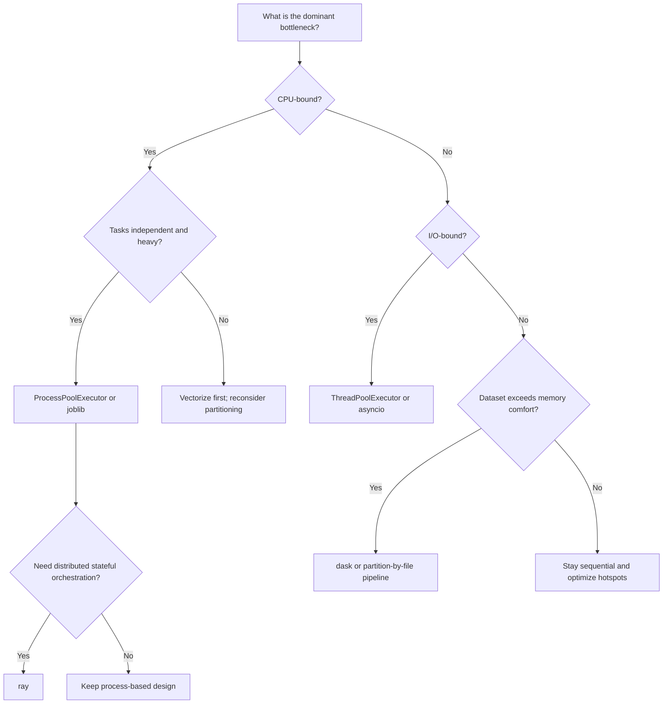

# Python for Expert R Users: A Comprehensive Migration Primer

## How to Use This Primer

This primer is written for experienced R users, especially people who already think in tidyverse verbs, purrr composition, and furrr execution plans. If that is your background, you do not need a generic beginner tutorial. You need a translation guide that respects what you already know, highlights where Python behaves differently, and gives you realistic patterns you can use in production.

You will notice a specific editorial choice in this document: we spend a lot of time on "why" and not only on "how". That is intentional. Syntax can be memorized quickly. What usually slows migration is an incomplete mental model of how Python code is expected to be structured, debugged, and operated in teams.

You can read this document linearly, but many people use it by chapter:

- If you are struggling with day-to-day wrangling translation, start with the wrangling chapter.
- If your biggest fear is losing your functional coding style, read the functional chapter first.
- If your current bottleneck is parallel execution, go straight to the multicore chapter.
- If your anxiety centers on charting quality, the visualization chapter is where you should spend time.

If you are reading under deadline pressure, use one more practical rule: read each chapter as a decision aid, not a syntax catalog. Every major section in this primer is organized around three recurring questions: what are you trying to preserve from your current R workflow, what breaks when Python defaults differ, and what implementation pattern gives you the most reliable result with the least operational overhead. Keeping those three questions in view makes the document much easier to navigate and helps you avoid over-optimizing for surface-level syntax resemblance.

## Migration Philosophy: Keep Your Standards, Change Your Surface Area

The most common mistake in R-to-Python migration is treating it as a literal syntax conversion project. The temptation is understandable: find the Python equivalent of each R function, port line by line, and call it done. In practice, that usually produces code that feels awkward, is hard to maintain, and does not feel native in either ecosystem.

A better framing is this: keep your standards and migrate your surface area.

Your standards include things like:

- clear, auditable transformation logic
- predictable missing-data behavior
- composable functional abstractions
- robust execution with explicit error handling
- communication-quality visual output
- reproducibility across machines and teammates

These are not style preferences. They are system-level quality properties. Teams that preserve these properties during migration usually ship faster and with fewer incidents, even if the first Python version looks more verbose than the original R version. Teams that optimize mostly for quick translation often get a short-term speed boost followed by slow, expensive cleanup when implicit assumptions begin to fail in production.

Those standards transfer directly to Python. What changes is the shape of the tooling and the places where explicitness is expected.

### Why Python Feels Different Even When Capability Is Similar

R with tidyverse gives you an unusually coherent grammar. The verbs feel unified, naming is consistent, and data-first pipelines are strongly reinforced by community style. Python gives you extraordinary breadth and depth, but less stylistic centralization. Instead of one dominant grammar layer, you often compose specialized tools.

That can feel fragmented at first. Over time, most advanced users discover it can be a strength. You can work at a high abstraction level for speed, then drop to lower-level APIs when you need control. The trade-off is that you must make more explicit decisions earlier.

### A Practical Default Stack for Experienced R Users

If you want a stable migration baseline, this stack works well for most analytics teams:

- pandas for default table workflows
- polars as a performance-oriented alternative when needed
- numpy for numeric primitives
- seaborn plus matplotlib for most static charts
- plotnine when grammar continuity with ggplot2 is strategically useful
- altair for interaction-first browser outputs
- scikit-learn and statsmodels for modeling pipelines
- concurrent.futures as a first-line parallel primitive

Do not treat this as a law. Treat it as a starting point with good operational ergonomics.

The phrase operational ergonomics is important here. It means your stack should be easy to run, easy to debug, and easy for another teammate to understand at 2 p.m. during a normal code review and at 2 a.m. during an incident. That practical standard is more valuable than theoretical elegance, especially in migration programs where confidence is built through repeated, boringly reliable execution.

## Python and R Differ in Core Defaults

Many migration frustrations are not about missing features. They are about default assumptions. This section covers the defaults that most often surprise expert R users.

### Object Identity, Mutation, and Copy Boundaries

In tidyverse workflows, users often experience pipelines as value-like transformations. Python makes object identity and mutation more visible much earlier. Two names can reference the same object; mutation through one name affects the other.

That is powerful when intentional and dangerous when accidental. For table workflows, explicit copy boundaries are one of the highest-value habits you can adopt.

```python
active = df.loc[df["status"] == "active", ["id", "value"]].copy()
active["value_norm"] = active["value"] / active["value"].max()
```

The `.copy()` call is not only for technical correctness. It is also documentation. It says, "this branch is intentionally independent." That simple signal prevents many subtle bugs.

### Missing Data Semantics: NA vs NaN, None, and Nullable dtypes

R users are used to a coherent `NA` story. Python historically had multiple null-like values (`None`, `NaN`) and now has improved consistency through nullable dtypes. If you ignore this topic, you will eventually get surprising behavior in joins, groupby operations, and type coercion.

A good baseline policy is:

- adopt nullable dtypes where nulls are expected
- centralize missing-value handling rules
- avoid direct equality checks for null logic

```python
df = df.astype({
    "customer_id": "Int64",
    "segment": "string",
    "is_active": "boolean",
})
missing = df["segment"].isna()
```

The earlier you standardize this, the less cleanup you do later.

### Index Behavior and Output Shapes

Tibbles de-emphasize row names. Pandas makes index state central. This is useful, but it creates output-shape surprises if you are not watching carefully.

When translating dplyr pipelines, a reliable pattern is to keep keys as explicit columns and opt out of index-heavy outputs unless needed:

```python
summary = (
    df.groupby(["region", "quarter"], as_index=False)
      .agg(revenue=("revenue", "sum"), customers=("customer_id", "nunique"))
)
```

This yields table-shaped outputs that are easier to reason about and easier to merge into downstream steps.

### Selection and Assignment Are More Explicit in Python

Tidyselect is compact and expressive. Python selection with `.loc` and `.iloc` is usually more explicit. Many migrating users perceive this as verbosity. In mature codebases, that explicitness usually pays for itself in readability and debuggability.

```python
mask = (df["status"] == "active") & (df["score"] > 0)
df.loc[mask, "score_z"] = (
    (df.loc[mask, "score"] - df.loc[mask, "score"].mean()) /
    df.loc[mask, "score"].std()
)
```

The intent is visible on the surface: row condition, target column, transformation.

### Joins and Validation Contracts

One underused Python feature that R users often appreciate once they discover it is join validation.

```python
enriched = orders.merge(
    customers,
    on="customer_id",
    how="left",
    validate="many_to_one",
)
```

If cardinality assumptions are wrong, the merge fails early instead of silently multiplying rows. This is exactly the kind of operational guard that helps migration projects avoid long debugging loops.

### Strings, Paths, and I/O Pragmatics

In Python, path and I/O handling is usually more explicit than in readr-first workflows. Explicitness here is good. It reduces ambiguity and improves portability.

```python
from pathlib import Path

base = Path("data")
raw = pd.read_csv(base / "transactions.csv", parse_dates=["txn_date"])
raw.to_parquet(base / "transactions.parquet", index=False)
```

Think of this style as "boring and durable." In production analytics, boring and durable wins.

## Translating Tidyverse Workflows in Practice

A translation table is useful, but workflow examples teach more. This chapter focuses on realistic side-by-side patterns.

As you read these examples, resist the urge to score them by line count alone. Some Python equivalents are longer, but they often expose assumptions that were implicit in the R version. That explicitness improves testability and incident response. A good migration mindset is to ask, for each translation: does this version make null handling, shape behavior, and join assumptions easier to verify?

### Example 1: Grouped Summary with Explicit Null Policy

R:

```r
summary_tbl <- sales %>%
  group_by(region, quarter) %>%
  summarise(
    revenue = sum(revenue, na.rm = TRUE),
    margin = mean(margin, na.rm = TRUE),
    customers = n_distinct(customer_id),
    .groups = "drop"
  )
```

Python:

```python
summary_tbl = (
    sales
    .groupby(["region", "quarter"], as_index=False)
    .agg(
        revenue=("revenue", "sum"),
        margin=("margin", "mean"),
        customers=("customer_id", "nunique"),
    )
)
```

Discussion:

Conceptually these are the same. The migration friction usually comes from output shape and dtype assumptions, not from the aggregation logic itself.

### Example 2: `case_when` Style Feature Engineering

R:

```r
scored <- scored %>%
  mutate(
    risk_band = case_when(
      churn_risk >= 0.80 ~ "critical",
      churn_risk >= 0.50 ~ "high",
      churn_risk >= 0.20 ~ "moderate",
      TRUE ~ "low"
    )
  )
```

Python:

```python
conditions = [
    scored["churn_risk"] >= 0.80,
    scored["churn_risk"] >= 0.50,
    scored["churn_risk"] >= 0.20,
]
choices = ["critical", "high", "moderate"]

scored = scored.assign(risk_band=np.select(conditions, choices, default="low"))
```

Discussion:

R is terser here. Python is more explicit. The advantage of explicit condition arrays is that they can be inspected, tested, and reused in separate validation checks.

### Example 3: Grouped Lag and Rolling Features

R:

```r
features <- txns %>%
  group_by(customer_id) %>%
  arrange(txn_date, .by_group = TRUE) %>%
  mutate(
    revenue_lag1 = lag(revenue, 1),
    revenue_roll3 = slider::slide_dbl(revenue, mean, .before = 2, .complete = TRUE)
  ) %>%
  ungroup()
```

Python:

```python
features = txns.sort_values(["customer_id", "txn_date"]).copy()
features["revenue_lag1"] = features.groupby("customer_id")["revenue"].shift(1)
features["revenue_roll3"] = (
    features.groupby("customer_id")["revenue"]
    .rolling(window=3, min_periods=3)
    .mean()
    .reset_index(level=0, drop=True)
)
```

Discussion:

The extra alignment mechanics in pandas can look noisy at first. Once learned, they are highly predictable and work well at scale.

### Example 4: Pivot and Reshape Equivalents

R:

```r
wide <- long_tbl %>%
  pivot_wider(names_from = metric, values_from = value)

long2 <- wide %>%
  pivot_longer(cols = starts_with("kpi_"), names_to = "metric", values_to = "value")
```

Python:

```python
wide = long_tbl.pivot(index="id", columns="metric", values="value").reset_index()

long2 = wide.melt(
    id_vars=["id"],
    value_vars=[c for c in wide.columns if c.startswith("kpi_")],
    var_name="metric",
    value_name="value",
)
```

Discussion:

Reshaping in Python is straightforward but expects explicit column lists more often. Many teams wrap common reshape patterns in helper functions to reduce repetition.

### Example 5: Join with Diagnostics

R workflows often check row counts after joins. In Python, combine the merge with diagnostic columns.

```python
joined = left.merge(
    right,
    on="customer_id",
    how="left",
    validate="one_to_one",
    indicator=True,
)

coverage = joined["_merge"].value_counts(dropna=False)
```

Discussion:

This gives immediate visibility into matched and unmatched records and helps prevent silent data quality regressions.

### Example 6: Nested Data and List-Column Style Work

R users often use list-columns with nested frames and map operations. Python can do similar work with object columns and helper functions.

```python
def summarize_frame(frame):
    return {
        "n": len(frame),
        "avg": frame["value"].mean(),
        "sd": frame["value"].std(),
    }

nested["summary"] = nested["data"].map(summarize_frame)
```

Discussion:

This pattern is perfectly viable, but for large workloads, many teams prefer explicit dictionary-of-dataframes or grouped iteration for clarity.

## Functional Programming: Deep Translation from purrr to Python

For many advanced R users, this is the heart of the migration. You are not just translating one-liners. You are translating an entire way of structuring code.

That is why this chapter should be read as architecture guidance, not as a collection of isolated language tricks. The core goal is to preserve the compositional confidence you get from purrr while adopting Python patterns that remain clear under scale, refactoring, and team handoff. If a functional pattern is clever but hard to test or difficult for teammates to reason about, it is usually the wrong pattern for migration work.

### Mental Model Shift: One Curated Namespace vs Distributed Primitives

Purrr gives a very elegant curated namespace for map-style programming. Python gives equivalent power through distributed primitives: comprehensions, built-in functions, itertools, functools, and local utilities.

This can feel less elegant at first. The key insight is that Python expects you to compose your own small local functional vocabulary. Once you do that, ergonomics improve dramatically.

### Mapping Family Equivalents with Real Patterns

Basic map-like operations:

```python
values = [1, 2, 3, 4]
squared = [x * x for x in values]
```

`map2` style:

```python
a = [1, 2, 3]
b = [10, 20, 30]
out = [x + y for x, y in zip(a, b)]
```

`pmap` style with dictionaries:

```python
rows = [
    {"x": 2, "y": 5},
    {"x": 3, "y": 7},
]
prod = [r["x"] * r["y"] for r in rows]
```

`reduce` and `accumulate`:

```python
from functools import reduce
from itertools import accumulate

vals = [1, 2, 3, 4]
total = reduce(lambda a, b: a + b, vals, 0)
running_total = list(accumulate(vals))
```

### Designing `possibly` and `safely` Equivalents Properly

A minimal wrapper is useful. A production wrapper is better. In production, capture context too.

```python
def safely_with_context(fn):
    def wrapped(*args, **kwargs):
        try:
            return {
                "ok": True,
                "result": fn(*args, **kwargs),
                "error": None,
                "args": args,
                "kwargs": kwargs,
            }
        except Exception as exc:
            return {
                "ok": False,
                "result": None,
                "error": str(exc),
                "args": args,
                "kwargs": kwargs,
            }
    return wrapped
```

This mirrors the spirit of purrr's safety helpers but adds operational details teams usually need when debugging distributed or batch failures.

### Closures as First-Class Architecture Tools

Closures are not only syntax tricks. They are a serious way to build configurable, testable behavior.

Parameterizing transforms:

```python
def make_winsorizer(lower_q=0.01, upper_q=0.99):
    def transform(series):
        lo = series.quantile(lower_q)
        hi = series.quantile(upper_q)
        return series.clip(lower=lo, upper=hi)
    return transform

winsorize_2pct = make_winsorizer(0.02, 0.98)
df["revenue_clipped"] = winsorize_2pct(df["revenue"])
```

Stateful metric accumulator:

```python
def make_metric_tracker():
    state = {"calls": 0, "errors": 0}

    def record(ok=True):
        nonlocal state
        state["calls"] += 1
        if not ok:
            state["errors"] += 1
        return state.copy()

    return record

tracker = make_metric_tracker()
tracker(ok=True)
tracker(ok=False)
```

Discussion:

R users already use this style implicitly in function factories. In Python, the same pattern helps enforce explicit configuration and local state without global variables.

### Higher-Order Functions in Data Pipelines

Higher-order functions become especially useful when applying repeated but parameterized logic.

```python
def apply_to_columns(columns, fn):
    def wrapped(df):
        out = df.copy()
        for c in columns:
            out[c] = fn(out[c])
        return out
    return wrapped

standardize_num = apply_to_columns(["x1", "x2", "x3"], lambda s: (s - s.mean()) / s.std())
clean = standardize_num(raw)
```

This gives you composable building blocks similar in spirit to tidyverse pipelines with custom verbs.

### Decorators for Cross-Cutting Concerns

Decorators are how Python often handles cross-cutting concerns that would otherwise be copy-pasted.

Timing decorator:

```python
import time
from functools import wraps


def timed(fn):
    @wraps(fn)
    def wrapped(*args, **kwargs):
        t0 = time.perf_counter()
        out = fn(*args, **kwargs)
        dt = time.perf_counter() - t0
        print(f"{fn.__name__} took {dt:.3f}s")
        return out
    return wrapped
```

Retry decorator for flaky I/O:

```python
import time


def retry(max_attempts=3, delay=0.5):
    def deco(fn):
        @wraps(fn)
        def wrapped(*args, **kwargs):
            last_err = None
            for _ in range(max_attempts):
                try:
                    return fn(*args, **kwargs)
                except Exception as exc:
                    last_err = exc
                    time.sleep(delay)
            raise last_err
        return wrapped
    return deco
```

These patterns are key when moving from exploratory notebooks to robust services.

### Generators and Lazy Pipelines

Generators are a major memory and architecture tool in Python. They let you stream data through stages instead of materializing everything at once.

```python
def read_json_lines(path):
    with open(path, "r", encoding="utf-8") as f:
        for line in f:
            yield json.loads(line)


def keep_active(records):
    for r in records:
        if r.get("status") == "active":
            yield r


def project_fields(records):
    for r in records:
        yield {"id": r.get("id"), "score": r.get("score")}

stream = project_fields(keep_active(read_json_lines("events.jsonl")))
```

Discussion:

If you come from tibble-first pipelines, this may initially feel lower-level. For large event streams, it is often exactly what you want.

### Context Managers and Resource Safety

Context managers make lifecycle boundaries explicit and safe.

```python
from contextlib import contextmanager


@contextmanager
def db_session(engine):
    conn = engine.connect()
    tx = conn.begin()
    try:
        yield conn
        tx.commit()
    except Exception:
        tx.rollback()
        raise
    finally:
        conn.close()
```

This style avoids leaked connections and partial writes. It is especially valuable in data engineering pipelines.

### Function Composition and Pipeline Builders

One reason purrr feels so productive is that it encourages a compositional style where each function does one clear thing and can be chained with confidence. Python can absolutely support this, but many teams do not codify it early enough.

A simple pattern is to define composable transformation functions and run them through an explicit pipeline executor.

```python
def drop_invalid_rows(df):
    return df.loc[df["customer_id"].notna()].copy()


def add_revenue_per_order(df):
    out = df.copy()
    out["rev_per_order"] = out["revenue"] / out["orders"].clip(lower=1)
    return out


def cap_extremes(df):
    out = df.copy()
    q01 = out["rev_per_order"].quantile(0.01)
    q99 = out["rev_per_order"].quantile(0.99)
    out["rev_per_order"] = out["rev_per_order"].clip(q01, q99)
    return out


def run_pipeline(df, steps):
    cur = df
    for step in steps:
        cur = step(cur)
    return cur


clean = run_pipeline(raw, [drop_invalid_rows, add_revenue_per_order, cap_extremes])
```

This gives you the same cognitive shape as chained dplyr verbs, while preserving Python's preference for explicit named function boundaries.

### Partial Application and Configurable Verb Families

In R, you may use closures and anonymous functions to specialize behavior. In Python, `functools.partial` is often a clean way to produce configurable "verb families" without introducing framework complexity.

```python
from functools import partial


def winsorize(series, lower_q, upper_q):
    lo = series.quantile(lower_q)
    hi = series.quantile(upper_q)
    return series.clip(lower=lo, upper=hi)


winsorize_light = partial(winsorize, lower_q=0.01, upper_q=0.99)
winsorize_strict = partial(winsorize, lower_q=0.05, upper_q=0.95)
```

When teams adopt this style intentionally, you get reusable building blocks that remain easy to test and reason about.

### Testing Functional Units the Way You Test dplyr Verbs

One migration anti-pattern is writing larger, stateful Python functions and then struggling to test them. If you keep transformation functions small and mostly pure, tests become straightforward and mirror how many R users mentally validate pipelines.

```python
def test_add_revenue_per_order_handles_zero_orders(sample_df):
    out = add_revenue_per_order(sample_df)
    assert out["rev_per_order"].notna().all()
    assert (out["orders"] >= 0).all()
```

The deeper point is architectural: functional decomposition is not only style. It is the easiest path to reliable test coverage in production analytics code.

### Practical Functional Style Guidelines

Prefer pure functions for transformation logic where feasible, and push side effects to clearly named boundaries such as I/O, logging, and persistence layers. Use closures for configuration and local state instead of scattering mutable globals through a codebase. Use decorators for cross-cutting concerns so behavior stays consistent across call sites and does not degrade into wrapper copy-paste. When a helper appears in multiple workflows, promote it into a shared module with tests and a short docstring contract. The deeper pattern is consistency: functional style helps most when it is applied as a team-level operating language rather than as a personal preference.

## Multicore and Parallelism: A Deep furrr-to-Python Guide

This chapter is intentionally detailed because multicore behavior is where many migrations either succeed brilliantly or become brittle.

Before diving into tools, anchor on one reality: parallelism is not a direct substitute for good workload design. It is a multiplier. If the underlying task boundary is clean and data movement is controlled, parallelism multiplies throughput. If boundaries are muddy and payloads are oversized, parallelism multiplies complexity and failure noise. Keep this framing in mind while reading every subsection below.

Use this decision flow as your first-pass executor chooser:



### Start with Workload Taxonomy

Before selecting tools, classify workload shape:

- CPU-bound numeric or model computation
- I/O-bound network or filesystem activity
- mixed workload with both heavy compute and external waits
- distributed stateful workflows

This classification determines execution model more than package preference.

In practice, most migration errors happen when a workflow is mislabeled here. A pipeline that appears CPU-bound may actually be dominated by serialization and file I/O once you instrument it. A workflow that appears I/O-bound may include one expensive transformation that determines end-to-end runtime. Treat taxonomy as an empirical classification step, not a guess. Run a quick stage-level profile, then choose execution strategy.

### The GIL in Practical Terms

The global interpreter lock limits parallel execution of Python bytecode in threads. This does not mean "threads are useless." It means thread pools are best for waiting-heavy tasks, while CPU-heavy tasks generally need process pools or native extensions.

Do not treat this as trivia. It is one of the main reasons naive parallel ports underperform.

### `ProcessPoolExecutor` as a Baseline

```python
from concurrent.futures import ProcessPoolExecutor


def heavy_transform(chunk):
    out = chunk.copy()
    out["score"] = out["x"] * out["y"]
    out["score2"] = out["score"] ** 0.5
    return out


chunks = [g for _, g in df.groupby("segment")]

with ProcessPoolExecutor(max_workers=8) as ex:
    parts = list(ex.map(heavy_transform, chunks, chunksize=2))

result = pd.concat(parts, ignore_index=True)
```

Key details that matter in real code:

- Task functions must be top-level importable functions for process pools.
- Large object transfer is expensive; chunk size selection is a performance lever.
- Worker startup overhead can dominate tiny tasks.

### `ThreadPoolExecutor` for I/O Bound Tasks

```python
from concurrent.futures import ThreadPoolExecutor


def fetch_json(url):
    return requests.get(url, timeout=20).json()


with ThreadPoolExecutor(max_workers=32) as ex:
    payloads = list(ex.map(fetch_json, urls))
```

Discussion:

For API harvesting, this pattern is often both faster and simpler than multiprocessing.

### `as_completed` for Control, Progress, and Partial Results

`map` is concise. `as_completed` gives more control for production behavior.

```python
from concurrent.futures import ProcessPoolExecutor, as_completed
from tqdm.auto import tqdm


def safe_heavy_transform(chunk):
    try:
        return {"ok": True, "data": heavy_transform(chunk), "err": None}
    except Exception as exc:
        return {"ok": False, "data": None, "err": str(exc)}


results = []
with ProcessPoolExecutor(max_workers=8) as ex:
    futs = [ex.submit(safe_heavy_transform, c) for c in chunks]
    for fut in tqdm(as_completed(futs), total=len(futs)):
        results.append(fut.result())
```

This allows:

- real-time progress
- partial completion handling
- explicit collection of failures

### Serialization and Data Movement Costs

Multiprocessing speedups can collapse if each task ships large DataFrames between processes. This is one of the most common surprises for furrr users migrating to Python.

Mitigation strategies:

- pass task descriptors (IDs, file paths), not full objects
- partition data to files and parallelize by partition
- use memory-mapped arrays when appropriate
- benchmark granularity before increasing worker count

### Start Method Differences and Platform Behavior

Python multiprocessing can use different start methods (`fork`, `spawn`, `forkserver`). Behavior and overhead differ by platform.

- Linux often defaults to `fork`.
- macOS and Windows commonly use `spawn` semantics in many contexts.

For portable code, assume stricter spawn-compatible patterns:

- top-level functions
- import-safe module initialization
- `if __name__ == "__main__":` guard where needed

### joblib: Excellent Midpoint for Model Loops

```python
from joblib import Parallel, delayed


def fit_one(seg_df):
    model = LogisticRegression(max_iter=200)
    x = seg_df[["x1", "x2"]]
    y = seg_df["y"]
    model.fit(x, y)
    return model.coef_


coefs = Parallel(n_jobs=8, backend="loky")(
    delayed(fit_one)(g) for _, g in df.groupby("segment")
)
```

joblib is often the fastest path from sequential loops to stable multicore behavior in analytics code.

### dask: Scaling DataFrame Workloads

```python
import dask.dataframe as dd


ddf = dd.from_pandas(df, npartitions=24)
summary = (
    ddf.groupby("segment")
       .agg({"revenue": "mean", "orders": "sum"})
       .compute()
)
```

Dask is useful when:

- data does not fit comfortably in memory
- you need parallel execution graphs
- you want pandas-like API continuity

### ray: Distributed Stateful Orchestration

```python
import ray

ray.init()

@ray.remote
def score_partition(path):
    part = pd.read_parquet(path)
    return part.assign(score=part["x"] * part["y"])

futs = [score_partition.remote(p) for p in partition_paths]
parts = ray.get(futs)
out = pd.concat(parts, ignore_index=True)
```

Ray is valuable when workload complexity starts to resemble distributed systems, not only parallel loops.

### Async I/O vs Thread Pools

For high-concurrency network workloads, async I/O can outperform thread pools with lower overhead. For many analytics teams, thread pools are easier to maintain. Choose based on complexity tolerance and required concurrency.

Minimal async example:

```python
import asyncio
import httpx


async def fetch_one(client, url):
    r = await client.get(url, timeout=20)
    return r.json()


async def fetch_all(urls):
    async with httpx.AsyncClient() as client:
        tasks = [fetch_one(client, u) for u in urls]
        return await asyncio.gather(*tasks)
```

### Cancellation, Timeouts, and Failure Budgets

Production parallel systems need explicit failure policy:

- task-level timeout
- retry policy for transient failures
- global failure budget threshold
- cancellation policy when downstream usefulness drops

Example pattern:

```python
from concurrent.futures import TimeoutError

try:
    value = future.result(timeout=30)
except TimeoutError:
    # mark task timed out and continue or abort per policy
    pass
```

### Reproducibility in Parallel Contexts

Set deterministic seeds per task rather than relying on global random state.

```python
def task_seed(base_seed, task_idx):
    return base_seed + task_idx
```

Use this seed inside each worker for reproducible simulation or model initialization.

### Parallel Benchmarking Methodology

When comparing strategies, benchmark with discipline:

1. Measure sequential baseline first.
2. Vary worker counts and chunk sizes.
3. Separate serialization overhead from compute time.
4. Measure memory footprint and wall-clock time together.
5. Repeat runs to control variance.

This avoids false conclusions such as "parallel is slower" when the real issue is task granularity.

### Decision Framework You Can Apply Quickly

Start with sequential vectorized code and prove correctness first. Then move to process pools for CPU-heavy independent tasks where each unit of work is large enough to amortize overhead. Use thread pools or async for high-latency I/O where waiting dominates compute. Adopt joblib when the workflow is mostly model loops and you want straightforward ergonomics with stable defaults. Adopt dask when dataframe size or execution graph complexity pushes beyond comfortable single-process operation. Adopt ray when your problem stops looking like "parallel loops" and starts looking like distributed orchestration with persistent state and richer scheduling concerns.

The most useful habit is to write down the reason for each escalation. A one-sentence note such as "moved from sequential to process pool because stage X consumed 82% runtime and each partition takes >2s" creates accountability and helps future maintainers avoid accidental over-engineering.

This progression keeps complexity proportional to actual need.

### Advanced Multicore Pattern: Partition-by-File Instead of Partition-by-Object

A lot of process-pool disappointment comes from serializing large in-memory DataFrames into worker processes. One robust alternative is to partition once to Parquet and parallelize by file path. That design usually transfers less data between processes and is easier to resume after failures.

```python
def score_partition_file(path):
    part = pd.read_parquet(path)
    part["score"] = part["x"] * part["y"]
    out_path = path.replace("/input/", "/output/")
    part.to_parquet(out_path, index=False)
    return out_path


with ProcessPoolExecutor(max_workers=8) as ex:
    done_paths = list(ex.map(score_partition_file, input_paths, chunksize=4))
```

This mirrors how many mature distributed data systems work: push partitions through deterministic workers, persist outputs, and compose the final dataset afterward.

### Advanced Multicore Pattern: Two-Stage Pipelines

In real workloads, tasks are often mixed: a high-latency fetch stage and a CPU-heavy transform stage. A two-stage approach can outperform one generic executor.

```python
with ThreadPoolExecutor(max_workers=32) as io_pool:
    payloads = list(io_pool.map(fetch_json, urls))

chunks = materialize_chunks(payloads)
with ProcessPoolExecutor(max_workers=8) as cpu_pool:
    features = list(cpu_pool.map(extract_features, chunks, chunksize=2))
```

Why this is often better than one pool for everything:

- threads hide I/O latency efficiently
- processes exploit multicore CPU for heavy transforms
- failure behavior is easier to localize by stage

### Advanced Multicore Pattern: Failure Bucketing and Retry Classes

Not all failures should be retried equally. Treating every exception as retryable leads to noisy and expensive pipelines.

```python
RETRYABLE = (TimeoutError, ConnectionError)


def run_task_with_policy(task):
    try:
        return {"ok": True, "value": do_task(task), "error": None, "task": task}
    except RETRYABLE as exc:
        return {"ok": False, "value": None, "error": str(exc), "task": task, "retry": True}
    except Exception as exc:
        return {"ok": False, "value": None, "error": str(exc), "task": task, "retry": False}
```

This lets you separate transient operational failures from deterministic logic/data failures and makes reruns much more efficient.

### Advanced Multicore Pattern: Instrumentation You Can Trust

For migration projects, performance claims should be evidence-based. Add lightweight instrumentation to every production parallel path:

- wall-clock runtime per stage
- task success and failure counts
- queue wait time if relevant
- bytes read and written per stage

Even simple CSV or JSONL run logs make postmortems dramatically faster and prevent debate about where runtime is actually going.

## Statistical Modeling in Python for R Users

For many R users, modeling is where migration confidence can either accelerate or stall. The good news is that Python has strong equivalents for both inference-first and prediction-first workflows. The key is understanding which stack maps to which R habit.

At a high level:

- if your current workflow looks like `lm()`, `glm()`, `summary()`, and coefficient interpretation, start with `statsmodels`
- if your workflow is primarily predictive and cross-validation-first, use `scikit-learn`
- if you want R-like formula notation in Python, use `statsmodels` formula API (built on `patsy`)

The migration risk in modeling is rarely that Python cannot fit the same model. The risk is that teams accidentally change split policy, null treatment, encoding choices, or threshold logic while focusing only on estimator syntax. Treat those surrounding decisions as first-class model components and parity becomes much more reliable.

If you are skimming this chapter under time pressure, use this route: start with the decision table below, jump to the `lm()` and `glm()` sections for formula parity, then read the validation and calibration sections before touching deployment.

### The Two Modeling Cultures in Python

R users often conflate "modeling" as one thing because base and tidy modeling workflows feel cohesive. In Python, there is a clearer split:

- `statsmodels` is inference-oriented: formula syntax, rich summaries, standard errors, hypothesis tests, confidence intervals
- `scikit-learn` is prediction-oriented: estimator API consistency, pipelines, preprocessing integration, model selection workflows

Neither is better in general. They are better for different intents.

### Not Everything Is `scikit-learn`: The Wider Modeling Ecosystem

This distinction is important enough to call out directly. Statistical modeling in Python is not all done through `scikit-learn`, and many teams get better outcomes when they choose libraries by modeling intent rather than by brand familiarity.

Use `scikit-learn` when your primary goal is prediction workflows: robust preprocessing pipelines, cross-validation, hyperparameter tuning, and consistent deployment interfaces. Use `statsmodels` when your primary goal is inference and interpretation: explicit formulas, standard errors, p-values, confidence intervals, and classical diagnostics.

Then layer in specialized libraries when the problem demands it. For Bayesian workflows, many teams use `PyMC` (or a Stan interface) to express hierarchical priors and full posterior uncertainty. For survival analysis, `lifelines` and `scikit-survival` cover common time-to-event patterns such as Cox models and competing-risk style workflows. For panel and econometric settings, `linearmodels` adds fixed-effects, random-effects, IV, and related estimators that are awkward to reproduce cleanly with generic ML tools.

The practical takeaway is simple: Python is an ecosystem, not one modeling package. `scikit-learn` is central for predictive engineering, but it is only one part of the modeling stack. If your work looks more like classical statistics or domain-specific inference, you should reach for the tool that preserves the right assumptions and diagnostics rather than forcing everything into one API.

Quick chooser by question type:

| Primary Question | First Library to Reach For | Why |
|---|---|---|
| "What is the estimated effect, and how certain are we?" | `statsmodels` | Built-in inference outputs: SEs, p-values, confidence intervals, diagnostics |
| "Which model predicts best on holdout data?" | `scikit-learn` | Pipeline-first CV, metrics, tuning, and production interfaces |
| "What is full uncertainty under hierarchical assumptions?" | `PyMC` (or Stan interface) | Posterior inference, priors, and hierarchical model structure |
| "What is time-to-event risk and hazard behavior?" | `lifelines` or `scikit-survival` | Survival-specific estimators and evaluation tools |
| "How do we model panel/econometric structures?" | `linearmodels` | Fixed effects, random effects, IV, and panel-oriented estimators |

### `lm()` Equivalent: OLS with Formula Notation

R:

```r
fit <- lm(y ~ x1 + x2 + group, data = df)
summary(fit)
```

Python (`statsmodels`):

```python
import statsmodels.formula.api as smf

fit = smf.ols("y ~ x1 + x2 + C(group)", data=df).fit()
print(fit.summary())
```

Key notes for formula users:

- `C(group)` marks a categorical variable explicitly
- an intercept is included by default, similar to R
- `- 1` removes intercept just like in R formulas

Extracting tidy-like outputs:

```python
coef_tbl = (
    fit.params.rename("estimate")
    .to_frame()
    .join(fit.bse.rename("std_error"))
    .join(fit.pvalues.rename("p_value"))
    .join(fit.conf_int().rename(columns={0: "conf_low", 1: "conf_high"}))
)
```

That table is close to what many users expect from `broom::tidy()`.

### Formula Syntax Parity and Differences

Common formula translations:

- interaction: `x1 * x2` in both ecosystems
- pure interaction only: `x1:x2`
- remove intercept: `y ~ x1 + x2 - 1`
- transformed terms: `I(x ** 2)` in Python formulas

R:

```r
fit2 <- lm(y ~ x1 * x2 + poly(age, 2), data = df)
```

Python:

```python
fit2 = smf.ols("y ~ x1 * x2 + I(age ** 2)", data=df).fit()
```

If you need spline-style terms, `patsy` and related libraries can cover most of that territory, but syntax is less unified than the R spline ecosystem.

Two practical cautions are worth making explicit. First, formulas can silently drop rows with missing values in referenced columns, so parity checks should compare effective training row counts between R and Python fits. Second, category reference levels can differ if preprocessing steps reorder labels or coerce types differently. During migration reviews, include a short "design-matrix sanity" check that verifies number of rows, number of generated columns, and key term names before interpreting coefficient differences.

When formulas become too contorted, stop early and move part of feature engineering upstream into explicit dataframe transforms. That usually improves readability and debugging, especially for teams sharing models across analyst and engineering roles.

### `glm()` Equivalent: Binomial, Poisson, and Beyond

R logistic regression:

```r
fit_glm <- glm(churned ~ orders + revenue + segment, data = df, family = binomial())
summary(fit_glm)
```

Python logistic GLM:

```python
import statsmodels.api as sm
import statsmodels.formula.api as smf

fit_glm = smf.glm(
    "churned ~ orders + revenue + C(segment)",
    data=df,
    family=sm.families.Binomial(),
).fit()

print(fit_glm.summary())
```

Poisson example:

```python
fit_pois = smf.glm(
    "claims ~ age + vehicle_power + C(region)",
    data=df,
    family=sm.families.Poisson(),
).fit()
```

The modeling ergonomics are very similar to R once you adopt formula syntax consistently.

### Offsets, Exposure, and Weights in GLM

Many applied modeling workflows in R rely on offsets/exposure terms (especially counts/rates). Python supports this too.

```python
fit_rate = smf.glm(
    "claims ~ age + C(region)",
    data=df,
    family=sm.families.Poisson(),
    exposure=df["policy_years"],
).fit()
```

Equivalent conceptual pattern to modeling rates rather than raw counts.

### Prediction Workflows and Probability Outputs

For inference models in `statsmodels`, prediction is direct:

```python
pred = fit_glm.get_prediction(new_df).summary_frame()
```

For prediction-focused workflows, `scikit-learn` often gives cleaner production ergonomics:

```python
from sklearn.compose import ColumnTransformer
from sklearn.linear_model import LogisticRegression
from sklearn.pipeline import Pipeline
from sklearn.preprocessing import OneHotEncoder

num_cols = ["orders", "revenue"]
cat_cols = ["segment"]

pre = ColumnTransformer([
    ("num", "passthrough", num_cols),
    ("cat", OneHotEncoder(handle_unknown="ignore"), cat_cols),
])

clf = Pipeline([
    ("pre", pre),
    ("model", LogisticRegression(max_iter=500)),
])

clf.fit(train_df[num_cols + cat_cols], train_df["churned"])
p = clf.predict_proba(test_df[num_cols + cat_cols])[:, 1]
```

This is where Python shines operationally: explicit preprocessing + model object + reproducible pipeline behavior.

### Mixed Effects Models (`lmer`-style) in Python

If you rely on mixed models in R, `statsmodels` has a mixed linear model implementation.

R:

```r
# lme4
fit_mixed <- lmer(y ~ x1 + x2 + (1 | group_id), data = df)
```

Python:

```python
fit_mixed = smf.mixedlm("y ~ x1 + x2", data=df, groups=df["group_id"]).fit()
print(fit_mixed.summary())
```

Coverage is good for many common patterns, but ecosystem breadth differs from R's mixed-model tooling. It is worth validating complex random-effect structures carefully.

### Model Diagnostics and Residual Workflows

If you are used to diagnostic plotting in R, keep that discipline in Python.

```python
resid = fit.resid
fitted = fit.fittedvalues

ax = sns.scatterplot(x=fitted, y=resid)
ax.axhline(0.0, linestyle="--", alpha=0.6)
ax.set_title("Residuals vs Fitted")
```

You can pair this with heteroskedasticity-robust covariance estimation when needed:

```python
fit_robust = fit.get_robustcov_results(cov_type="HC3")
```

### Formula Notation in `scikit-learn` Workflows

`scikit-learn` does not use formula syntax natively, but you can still bridge formula-based design matrices when you need compatibility with R-style modeling specs.

```python
from patsy import dmatrices
from sklearn.linear_model import LinearRegression

y, X = dmatrices("y ~ x1 + x2 + C(group)", data=df, return_type="dataframe")
reg = LinearRegression().fit(X, y.values.ravel())
```

This gives formula-driven feature construction with sklearn estimator APIs.

### Practical Modeling Guidance for Migration Teams

1. Start inference-heavy porting with `statsmodels` formulas to minimize conceptual friction.
2. Keep categorical treatment explicit (`C(...)`) and document reference-level choices.
3. Build tidy-like coefficient tables early so analysts can review models in familiar form.
4. Move prediction and deployment-oriented models into sklearn pipelines once parity is verified.
5. Keep a shared model-validation checklist across R and Python implementations.

If you follow this flow, modeling migration becomes a controlled engineering process rather than an endless argument about package preferences.

### Model Validation Workflow: R Habits to Python Equivalents

If you come from `rsample`, `yardstick`, `caret`, or `tidymodels`, the biggest migration question is often not fitting a model. It is preserving a rigorous validation workflow with reproducible folds, metric tracking, and honest holdout performance.

In Python, this is usually implemented with `scikit-learn` model-selection primitives and explicit metric functions.

```python
from sklearn.metrics import mean_absolute_error, roc_auc_score
from sklearn.model_selection import KFold, cross_val_predict


cv = KFold(n_splits=5, shuffle=True, random_state=42)
proba_oof = cross_val_predict(
    clf,
    train_df[num_cols + cat_cols],
    train_df["churned"],
    cv=cv,
    method="predict_proba",
)[:, 1]

auc_oof = roc_auc_score(train_df["churned"], proba_oof)
```

The important migration principle is to separate:

- model definition
- split strategy
- metric computation
- model selection policy

R ecosystems often make this separation feel implicit through workflow tooling. In Python, you typically define it more explicitly, which can improve auditability when experiments become numerous.

### Calibration and Threshold Policy

Many teams migrating logistic models discover an important operational gap: a model with a good AUC may still produce poorly calibrated probabilities for decision-making.

Python has strong calibration tooling for this:

```python
from sklearn.calibration import CalibratedClassifierCV


calibrated = CalibratedClassifierCV(clf, method="isotonic", cv=5)
calibrated.fit(train_df[num_cols + cat_cols], train_df["churned"])
p_cal = calibrated.predict_proba(test_df[num_cols + cat_cols])[:, 1]
```

Then define classification thresholds from business costs, not arbitrary defaults:

```python
threshold = 0.35
pred_label = (p_cal >= threshold).astype(int)
```

This maps well to mature R workflows where operating thresholds are policy decisions, not model defaults.

### Regularization Equivalents (`glmnet` mindset)

If your R stack uses `glmnet`, Python equivalents are straightforward in `scikit-learn`.

```python
from sklearn.linear_model import LogisticRegressionCV


reg = LogisticRegressionCV(
    Cs=20,
    cv=5,
    penalty="l1",
    solver="saga",
    scoring="roc_auc",
    max_iter=2000,
)

reg.fit(train_df[num_cols + cat_cols], train_df["churned"])
```

For linear regression regularization, use `LassoCV`, `RidgeCV`, or `ElasticNetCV`. The conceptual translation from `glmnet` is direct: tune shrinkage by cross-validation, then inspect sparsity and stability.

### Robust and Clustered Standard Errors

For inference-heavy teams, robust uncertainty estimates are often non-negotiable. `statsmodels` supports robust and clustered covariance settings.

```python
fit_cluster = smf.ols("y ~ x1 + x2 + C(region)", data=df).fit(
    cov_type="cluster",
    cov_kwds={"groups": df["customer_id"]},
)
```

This is especially important when panel-like dependence structures exist. The migration message is: do not stop at coefficient parity; carry over your inferential assumptions too.

### Classification Reports and Error Slicing

Advanced modeling workflows should include segment-level error analysis rather than only global metrics.

```python
from sklearn.metrics import classification_report


print(classification_report(test_df["churned"], pred_label))

segment_report = (
    test_df.assign(pred=pred_label)
    .groupby("segment", as_index=False)
    .agg(
        base_rate=("churned", "mean"),
        pred_rate=("pred", "mean"),
        n=("pred", "size"),
    )
)
```

This preserves the spirit of careful subgroup diagnostics that many expert R practitioners already use.

### Time-Aware Validation for Sequential Data

If your modeling data has temporal dependence, random folds can overstate performance.

```python
from sklearn.model_selection import TimeSeriesSplit


tscv = TimeSeriesSplit(n_splits=5)
```

Then evaluate only forward-in-time splits. This is analogous to disciplined rolling-origin validation in R forecasting workflows.

### Recommended Modeling Review Checklist

Before accepting parity between R and Python implementations, verify:

1. feature construction parity
2. categorical encoding parity
3. train/test split policy parity
4. metric definition parity
5. threshold policy parity
6. calibration quality parity
7. subgroup error behavior parity

Treat this checklist as part of migration quality assurance, not optional polish.

## Visualization Migration for ggplot2-Heavy Workflows

Visualization is often the emotional center of migration. The concern is legitimate: ggplot2 is exceptionally coherent. The good news is that Python can meet very high visual standards if you choose a layered strategy intentionally.

The practical mistake to avoid is treating plotting migration as a purely aesthetic task. Visualization parity is a decision-quality task. If axis transforms, faceting logic, and uncertainty communication drift during migration, business decisions drift too. That is why this section focuses on chart contracts and validation habits in addition to code snippets.

### Why One-to-One Replacement Is Usually the Wrong Goal

Trying to force one Python library to replace all ggplot2 use cases creates unnecessary frustration. Different chart classes and audiences benefit from different tools.

A robust approach is:

- plotnine for grammar continuity
- seaborn for rapid statistical plotting
- matplotlib for precision control
- altair for interactive storytelling

### Side-by-Side Examples with Commentary

Scatter with grouping:

```r
ggplot(df, aes(mpg, hp, color = factor(cyl))) +
  geom_point(size = 2.5, alpha = 0.8)
```

```python
sns.scatterplot(data=df, x="mpg", y="hp", hue="cyl", s=55, alpha=0.8)
```

Faceted line chart:

```r
ggplot(df, aes(date, value, color = group)) +
  geom_line() +
  facet_wrap(~ region)
```

```python
sns.relplot(data=df, x="date", y="value", hue="group", col="region", kind="line", col_wrap=3)
```

Box plus jitter:

```r
ggplot(df, aes(group, value)) +
  geom_boxplot(outlier.shape = NA) +
  geom_jitter(width = 0.15, alpha = 0.4)
```

```python
ax = sns.boxplot(data=df, x="group", y="value", showfliers=False)
sns.stripplot(data=df, x="group", y="value", alpha=0.4, jitter=0.15, ax=ax)
```

Heatmap from aggregated table:

```r
df %>% count(row_key, col_key) %>%
  ggplot(aes(col_key, row_key, fill = n)) +
  geom_tile()
```

```python
pivot = df.pivot_table(index="row_key", columns="col_key", values="n", fill_value=0)
sns.heatmap(pivot, cmap="Blues")
```

Interactive tooltip chart:

```python
import altair as alt

chart = alt.Chart(df).mark_point(size=70).encode(
    x="x:Q",
    y="y:Q",
    color="group:N",
    tooltip=["name:N", "x:Q", "y:Q"],
)
```

### Rebuilding Team Plot Style Consistency

A shared style module in matplotlib is the closest equivalent to team-wide ggplot themes.

```python
import matplotlib as mpl


def apply_house_style():
    mpl.rcParams.update({
        "figure.figsize": (8.5, 5.25),
        "figure.dpi": 120,
        "axes.titlesize": 14,
        "axes.labelsize": 12,
        "axes.spines.top": False,
        "axes.spines.right": False,
        "grid.alpha": 0.25,
        "font.family": "DejaVu Sans",
    })
```

This is where you preserve brand voice and reporting consistency across all Python charts.

To make that consistency durable, treat style as a tested dependency rather than an optional helper. In other words, call your house-style function in one place near workflow entry, and assert critical settings in lightweight tests so regressions are caught early.

```python
def test_house_style_has_expected_defaults():
    apply_house_style()
    assert mpl.rcParams["axes.spines.top"] is False
    assert mpl.rcParams["axes.spines.right"] is False
    assert tuple(mpl.rcParams["figure.figsize"]) == (8.5, 5.25)
```

Another high-value pattern is chart contracts. A chart contract is a short artifact that defines input schema, metric definitions, grouping policy, and formatting rules for one chart family. If you review contracts instead of ad-hoc screenshots, chart migration moves faster and disagreement drops.

```python
def validate_monthly_churn_contract(frame):
    required = {"month", "segment", "churn_rate", "churn_lo", "churn_hi"}
    missing = required.difference(frame.columns)
    assert not missing, f"missing columns: {sorted(missing)}"
    assert frame["churn_rate"].between(0, 1).all()
    assert (frame["churn_lo"] <= frame["churn_rate"]).all()
    assert (frame["churn_rate"] <= frame["churn_hi"]).all()
```

## Performance and Reliability Engineering

Performance work is where intuition often misleads. The reliable method is profile first, optimize second.

For experienced R users, one subtle migration trap is carrying over optimization instincts that were correct in one runtime context but less effective in another. In Python, the biggest wins frequently come from changing execution shape (vectorization, memory layout, batching strategy) rather than micro-optimizing syntax.

A practical way to think about performance in this ecosystem is:

- algorithm and data-shape choices first
- vectorized and compiled backends second
- parallel execution third
- low-level micro-tuning last

This ordering keeps optimization effort aligned with likely payoff.

To make this chapter operational, use a repeated loop: profile, reshape work, re-measure, then harden. The "reshape work" step includes vectorization, reducing intermediate object churn, and improving partition boundaries. Only after those changes should you escalate to multicore orchestration. This sequence prevents the most common migration failure mode: adding concurrency to a workflow whose bottleneck was never identified.

### Profile Before You Touch Code

```python
import cProfile
import pstats

with cProfile.Profile() as pr:
    run_pipeline(df)

pstats.Stats(pr).sort_stats("cumtime").print_stats(20)
```

Use line-level profiling for hotspots and avoid broad unspecific optimization.

In teams, it is useful to attach profile snapshots to pull requests when performance-sensitive code changes. That creates an evidence trail and prevents circular debates about whether a change actually improved anything.

### Vectorization Before Parallelization

Many workloads get major speedups by rewriting row loops as vectorized operations.

```python
df["aov"] = df["revenue"] / df["orders"].clip(lower=1)
```

This often beats naive multiprocessing with far less complexity.

It also reduces failure surface area. Vectorized operations are usually deterministic, compact, and easier to test than parallel wrappers around row loops. If you can remove ten lines of bespoke iteration and replace them with two vectorized expressions, you usually gain speed and reliability at the same time.

When vectorization is not obvious, a good intermediate strategy is to stage transformations column-by-column with explicit temporary features, then collapse them in a final projection. This approach is often easier to debug than complex one-liners and still leverages optimized kernels.

### Memory Is Often the Real Bottleneck

```python
df.info(memory_usage="deep")
```

Use dtype tuning, categorical conversion, and chunked I/O to stabilize memory behavior.

R users are often used to workflows where memory pressure appears later in the pipeline. In Python/pandas ecosystems, memory blowups can surface earlier because of intermediate object materialization, especially during joins and wide reshapes. You can reduce this risk by introducing explicit memory checkpoints at major boundaries.

```python
def memory_checkpoint(name, frame):
    mb = frame.memory_usage(deep=True).sum() / (1024 ** 2)
    print(f"{name}: {mb:.1f} MB")


memory_checkpoint("post-join", joined)
```

These checkpoints become very useful during migration because they quickly reveal where a Python implementation diverges from expected resource behavior.

```python
for chunk in pd.read_csv("large.csv", chunksize=200_000):
    process_chunk(chunk)
```

### Numba and Polars as Targeted Escalations

Use Numba for confirmed numeric hotspots that do not vectorize cleanly. Use polars when dataframe scale and expression execution become limiting in pandas.

```python
import numba as nb
import numpy as np


@nb.njit
def running_mean(x):
    out = np.empty_like(x)
    s = 0.0
    for i in range(x.shape[0]):
        s += x[i]
        out[i] = s / (i + 1)
    return out
```

Polars example for grouped compute with explicit expression planning:

```python
import polars as pl

agg = (
    pl.from_pandas(df)
    .group_by("segment")
    .agg([
        pl.col("revenue").mean().alias("avg_revenue"),
        pl.col("orders").sum().alias("orders_total"),
    ])
)
```

The goal is not to replace pandas everywhere. The goal is to identify workloads where expression engines or JIT-accelerated loops materially improve runtime and memory profiles.

### Reliability Engineering Is Part of Performance Engineering

In production analytics, "fast" is not enough. You also need predictable behavior under imperfect data and infrastructure conditions.

Practical guardrails:

- define explicit timeout policies for external dependencies
- persist intermediate outputs at expensive boundaries
- emit structured logs for task starts, finishes, retries, and hard failures
- add deterministic sampling mode for reproducible debugging

These practices reduce mean-time-to-resolution when something fails under load.

A practical extension is to attach basic performance telemetry to each run and store it alongside outputs. Even a small JSON summary with stage durations, row counts, and memory checkpoints can transform debugging quality and eliminate guesswork during performance regressions.

```python
run_summary = {
    "run_id": run_id,
    "stage_seconds": stage_seconds,
    "row_counts": row_counts,
    "peak_memory_mb": peak_memory_mb,
}
Path("artifacts") .mkdir(exist_ok=True)
Path("artifacts", f"run_summary_{run_id}.json").write_text(
    json.dumps(run_summary, indent=2),
    encoding="utf-8",
)
```

## Team Operating Model for Migration

Technical translation is only half the story. Migration quality depends on operating discipline.

Teams that succeed usually make this explicit: migration is not an ad-hoc cleanup project. It is an engineering program with acceptance criteria, instrumentation, and ownership.

This is where many technically strong teams still stumble. They make excellent local code decisions but leave governance implicit, so parity standards drift between contributors. The fix is not bureaucracy for its own sake. The fix is a lightweight operating model that keeps decisions consistent across workflows.

### Baseline Project Standards

- consistent environment tooling
- test coverage on transformation invariants
- lint/format enforcement
- typed interfaces for critical modules
- explicit data contracts and schema checks

It helps to convert these into an enforceable project template rather than leaving them as cultural recommendations. For example, treat missing tests or unchecked schema transitions as merge blockers for migration-critical workflows.

A practical way to implement this is to create a short checklist in pull request templates: parity checks attached, schema invariants updated, runtime envelope assessed, rollback note included. Keep the checklist short enough that people actually use it, but specific enough that reviewers can block risky changes with objective criteria.

### Interoperability Beats Big-Bang Rewrite

Use bridges (`reticulate`, `rpy2`, Parquet/Arrow boundaries) to migrate capability-by-capability instead of forcing a single cutover event.

This approach has two major advantages:

- you can compare R and Python outputs continuously during migration
- you can deploy value incrementally without waiting for full parity everywhere

A practical pattern is to choose one or two high-value workflows first, build high-confidence parity, then reuse the same migration playbook for neighboring workflows.

Example boundary contract in practice:

```python
baseline = pd.read_parquet("baseline_from_r.parquet")
candidate = run_python_pipeline(raw)

assert baseline.shape == candidate.shape
assert set(baseline.columns) == set(candidate.columns)
```

You can then add numeric tolerance checks on key metrics and distributions.

```python
delta = (baseline["revenue"].sum() - candidate["revenue"].sum())
assert abs(delta) < 1e-6
```

Interoperability also changes team psychology in a useful way. Instead of debating migration in the abstract, you can compare real outputs continuously and tighten tolerances over time. That turns migration from a high-risk cutover event into a sequence of low-risk proof points.

### Definition of Done per Workflow

A migrated workflow is complete when:

- statistical outputs match agreed tolerances against R baselines
- chart semantics and communication quality are preserved
- runtime and memory are acceptable at production scale
- failure modes are observable and actionable
- a teammate can run from a clean environment

A strong addition to this checklist is a rollback protocol. For each migrated workflow, document how to revert to the R implementation quickly if a production issue is discovered. Having that plan significantly reduces migration risk and team anxiety.

Another high-value addition is ownership clarity. Every migrated workflow should have a clear owner for:

- semantic correctness
- runtime/performance envelope
- operational reliability and on-call readiness

Migration quality is much easier to sustain when those responsibilities are explicit.

If you want this section to be actionable, define done status in three layers:

1. Behavioral parity: key outputs, metric definitions, and chart semantics meet agreed tolerances.
2. Operational readiness: runtime, memory, and failure-handling behavior are inside agreed envelopes.
3. Team readiness: ownership is assigned, runbook exists, and another teammate can execute from a clean environment.

A workflow is done only when all three layers pass. That standard is demanding, but it is also what keeps migrated systems from becoming fragile hand-crafted artifacts.

## End-to-End Case Study: Monthly Retention Pipeline

This case study combines wrangling, functional abstraction, multicore execution, and visualization into one operational flow.

Read this case study as a template you can adapt, not as a single canonical implementation. The sequence matters more than the exact code: define boundaries, enforce contracts, instrument behavior, and only then add complexity.

### Step 1: Feature Engineering

R:

```r
features <- txns %>%
  mutate(month = floor_date(txn_date, "month")) %>%
  group_by(customer_id, month) %>%
  summarise(
    orders = n(),
    revenue = sum(amount, na.rm = TRUE),
    avg_basket = mean(amount, na.rm = TRUE),
    .groups = "drop"
  )
```

Python:

```python
features = (
    txns
    .assign(month=lambda d: d["txn_date"].dt.to_period("M").dt.to_timestamp())
    .groupby(["customer_id", "month"], as_index=False)
    .agg(
        orders=("amount", "size"),
        revenue=("amount", "sum"),
        avg_basket=("amount", "mean"),
    )
)
```

### Step 2: Functional Safety Wrapper for Segment Scoring

This step is more than defensive programming. It establishes a stable contract for partial success, which becomes essential once scoring moves into parallel execution. Without a wrapper like this, one segment failure can hide useful successful outputs and make remediation unnecessarily expensive.

```python
from sklearn.linear_model import LogisticRegression


def safely(fn):
    def wrapped(*args, **kwargs):
        try:
            return {"ok": True, "result": fn(*args, **kwargs), "error": None}
        except Exception as exc:
            return {"ok": False, "result": None, "error": str(exc)}
    return wrapped


def score_segment(df_seg):
    x = df_seg[["orders", "revenue"]].fillna(0)
    y = df_seg["churned"]
    model = LogisticRegression(max_iter=200)
    model.fit(x, y)
    out = df_seg.copy()
    out["churn_risk"] = model.predict_proba(x)[:, 1]
    return out

safe_score = safely(score_segment)
scored = {seg: safe_score(g) for seg, g in features.groupby("segment")}
```

In production, extend this wrapper to capture stable task identifiers and an error class field so retry policies can distinguish transient failures from deterministic data issues.

### Step 3: Multicore Execution

This step should only happen after Step 2 contracts are stable. Otherwise, parallelization amplifies ambiguity about what failed and why.

```python
from concurrent.futures import ProcessPoolExecutor

segment_frames = [g for _, g in features.groupby("segment")]

with ProcessPoolExecutor(max_workers=8) as ex:
    scored_parallel = list(ex.map(score_segment, segment_frames, chunksize=2))
```

When segment sizes are highly uneven, add pre-dispatch size stats and rebalance oversized partitions. Tail latency from one giant segment is a common hidden bottleneck.

### Step 4: Reporting Chart

Treat this chart as a contract output, not a cosmetic endpoint. During migration review, verify that trend direction, confidence band semantics, and key thresholds match the legacy scorecard logic.

```python
ax = sns.lineplot(data=monthly_kpi, x="month", y="churn_rate", linewidth=1.8)
ax.fill_between(monthly_kpi["month"], monthly_kpi["churn_lo"], monthly_kpi["churn_hi"], alpha=0.2)
ax.set_title("Monthly Churn Rate")
ax.set_ylabel("Rate")
```

### Step 5: Operational Checks

- Validate row counts and join cardinality at every major boundary.
- Log segment-level failures from safety wrappers.
- Persist intermediate outputs to Parquet for reproducibility.
- Run regression tests against known R baseline outputs.

Add one more operational check that pays off quickly: persist a run summary artifact containing input snapshot ID, code version, stage durations, and top-level metric diffs from baseline. This gives incident responders immediate context when downstream users report anomalies.

The point of this case study is not strict syntax parity. The point is preserving workflow reliability and communicative output quality while adopting Python-native execution patterns.

### Variant A: OLS Revenue Model with Formula Workflow

Suppose a companion objective is estimating continuous customer revenue with interpretable coefficients.

R:

```r
fit_rev <- lm(revenue ~ orders + avg_basket + segment + region, data = model_df)
summary(fit_rev)
```

Python:

```python
fit_rev = smf.ols("revenue ~ orders + avg_basket + C(segment) + C(region)", data=model_df).fit()
print(fit_rev.summary())
```

Validation extension:

```python
pred_rev = fit_rev.predict(model_df)
mae = mean_absolute_error(model_df["revenue"], pred_rev)
```

Why this variant matters: it demonstrates that inference-first linear workflows with familiar formula notation are straightforward to port.

### Variant B: Logistic Churn Model with Calibration

If your primary objective is churn probability for intervention ranking, add explicit calibration and threshold governance.

```python
fit_churn = smf.glm(
    "churned ~ orders + revenue + recency_days + C(segment)",
    data=model_df,
    family=sm.families.Binomial(),
).fit()

p_raw = fit_churn.predict(model_df)
```

Then apply calibration in a predictive pipeline when needed:

```python
calibrated = CalibratedClassifierCV(clf, method="sigmoid", cv=5)
calibrated.fit(train_df[num_cols + cat_cols], train_df["churned"])
p_cal = calibrated.predict_proba(test_df[num_cols + cat_cols])[:, 1]
```

Why this variant matters: many migrations stop at fitting and forget the probability quality needed for downstream decisions.

### Variant C: Poisson Frequency Model with Exposure

For event-count modeling (claims, incidents, contact frequency), exposure-aware GLM parity is critical.

```python
fit_freq = smf.glm(
    "events ~ tenure + engagement + C(segment)",
    data=model_df,
    family=sm.families.Poisson(),
    exposure=model_df["active_months"],
).fit()

pred_rate = fit_freq.predict(model_df)
```

Why this variant matters: it shows direct support for rate modeling patterns that are common in mature R analytical workflows.

### What These Variants Demonstrate Together

Taken together, the three variants show that Python modeling can preserve the full lifecycle that expert R users care about:

- formula-driven model specification
- rigorous validation and diagnostics
- operational prediction workflows
- transparent reporting outputs

In other words, this is not a "toy parity" migration. It is full workflow parity.

## Common R-to-Python Anti-Patterns (and How to Fix Them)

This chapter exists because most painful migrations fail for repeated, recognizable reasons. If you can spot these patterns early, you save weeks.

### Anti-Pattern 1: Literal Syntax Porting Without Behavioral Tests

Symptom:

- code is ported line-by-line
- output "looks plausible"
- subtle semantic drifts are discovered later

Fix:

- build parity tests for key metrics and row-level invariants before trusting ports
- compare both summary and distribution-level outputs

```python
assert baseline.shape == candidate.shape
assert abs(baseline["revenue"].sum() - candidate["revenue"].sum()) < 1e-6
```

### Anti-Pattern 2: Overusing Row Loops (`iterrows`) in Data Paths

Symptom:

- slow pipelines
- hard-to-read transformation logic

Fix:

- rewrite using vectorized expressions or grouped operations
- profile before and after to validate gains

Why this pattern survives migration is understandable: row loops feel familiar when translating imperative snippets. The cost is usually not just speed. Loop-heavy code often hides null behavior and creates difficult-to-review branching logic. If a row-wise algorithm is truly required, isolate it in one well-named function and document why vectorization is not feasible.

### Anti-Pattern 3: Treating pandas Index as an Implicit Key Contract

Symptom:

- merge bugs and accidental misalignment after transformations

Fix:

- keep business keys as explicit columns
- reset and manage indexes intentionally

The subtle risk here is silent misalignment. Index state can drift through filtering, sorting, and merging in ways that remain invisible in quick spot checks. Explicit keys and reset points make shape changes auditable and reduce expensive debugging cycles later.

### Anti-Pattern 4: Multicore by Default Before Vectorization

Symptom:

- added complexity with little speedup
- brittle error handling and serialization overhead

Fix:

- optimize execution shape first (vectorization, memory layout)
- then parallelize only measured hotspots

Parallel-first migrations often create systems that are both slower and harder to operate. The overhead is paid in serialization, orchestration complexity, and noisy failures. Vectorization-first keeps architecture simple and usually uncovers the true hotspots that actually deserve concurrency.

### Anti-Pattern 5: Treating All Failures as Retryable

Symptom:

- noisy logs
- expensive reruns that do not converge

Fix:

- classify retryable vs deterministic failures
- bucket and report them separately

This classification changes operational behavior immediately. Deterministic failures should trigger data-quality or logic investigation, not repeated retries. Retryable failures should use capped retries with backoff and clear telemetry so incident responders can see failure pressure in real time.

### Anti-Pattern 6: Losing Formula-Level Readability Too Early

Symptom:

- immediate jump to opaque matrix code
- analysts lose trust and interpretability

Fix:

- start with `statsmodels` formulas for parity and readability
- move to pipeline-oriented sklearn code once behavior is validated

The core idea is sequencing. Preserve interpretability during parity work, then evolve toward production ergonomics once trust is established. Skipping that sequence often creates social resistance because stakeholders lose familiar review surfaces before they gain confidence in new ones.

### Anti-Pattern 7: Ignoring Calibration in Classification Workflows

Symptom:

- strong rank metrics but poor intervention outcomes

Fix:

- evaluate calibration and threshold policy explicitly
- review performance by segment and operating point

This matters because rank quality and decision quality are not the same thing. A model can rank risk well and still produce poor intervention outcomes if score calibration is off or thresholds are copied uncritically from legacy workflows.

### Anti-Pattern 8: No Ownership and No Rollback Path

Symptom:

- successful migration demo, fragile production handoff

Fix:

- define workflow owner, SLO envelope, and rollback protocol at migration time

When incidents happen, ambiguity about ownership is often more damaging than the original bug. Ownership and rollback clarity turn migration risk into manageable operational work instead of organizational confusion.

### Anti-Pattern 9: One Global "Python Way" Mandate Across All Workloads

Symptom:

- forcing one tool for every job (for example, one plotting library or one parallel framework)

Fix:

- adopt layered stack rules by workload class
- keep migration architecture flexible but explicit

A single-tool mandate usually optimizes for consistency theater rather than real maintainability. A layered standard gives teams clarity without forcing poor fit decisions for specialized workloads.

### Anti-Pattern 10: Confusing Notebook Convenience with Production Readiness

Symptom:

- notebook code copied into production without contracts, tests, or observability

Fix:

- extract stable functions/modules
- add tests, configuration, logging, and deterministic execution settings

Notebook convenience is valuable for exploration. Production readiness requires explicit contracts and repeatability under change. Treat notebooks as design surfaces and modules as operational surfaces, and migration quality improves quickly.

### A Simple Recovery Playbook If You Are Already Stuck

If your migration already feels messy, use this reset sequence:

1. pick one high-value workflow
2. define parity metrics and tolerances
3. rebuild with explicit functional boundaries
4. profile and tune only measured hotspots
5. add multicore only where justified
6. document validation, ownership, and rollback

This is usually enough to recover momentum and restore trust.

## Long-Form Companion: Real Migration Playbooks and Decision Narratives

This section is intentionally long, practical, and a little opinionated. The rest of the primer gives you the architecture and core patterns. This companion section gives you the day-to-day lived experience version: what usually works, what usually fails, and how experienced R teams can move with less drama.

If you only skim one part, skim this chapter and the anti-pattern chapter together. They are designed to work as a pair.

Navigation tip for this chapter: Playbooks 1 through 3 are execution mechanics (pipeline design, modeling workflow, and multicore strategy). Playbooks 4 through 6 are operational trust (visual parity, incident response, and team review habits). Playbooks 7 through 10 are program management (wave planning, FAQ, a 12-week ramp, and closing strategy).

### Playbook 1: Building a Data Pipeline the Python Way Without Losing tidyverse Clarity

One of the hardest things for experienced R users is not writing Python syntax. It is preserving the "pipeline clarity" you are used to. In tidyverse work, a well-written pipeline reads like a story: filter this, aggregate that, derive this feature, join to lookup, summarize outputs. A lot of novice Python code breaks this story into disjoint temporary variables, ad-hoc mutations, and unscoped helper snippets. The result feels messy, and teams conclude that Python itself is messy.

The better mental model is this: Python asks you to make architectural boundaries explicit. If you do that well, readability can be excellent.

A practical structure for a production-grade pipeline in Python is:

1. ingestion boundary
2. schema normalization boundary
3. transformation graph
4. quality checks and invariants
5. publish boundary

That sequence maps cleanly to how many R teams already work, even if tooling syntax differs.

Consider a monthly revenue-and-retention mart as an example. In R, you may use one or two long dplyr pipelines with occasional helper functions. In Python, a maintainable equivalent often uses named transformation functions with explicit contracts:

```python
def read_inputs(path_txn, path_dim):
    txns = pd.read_parquet(path_txn)
    dim = pd.read_parquet(path_dim)
    return txns, dim


def normalize_types(txns, dim):
    txns = txns.copy()
    dim = dim.copy()
    txns["txn_date"] = pd.to_datetime(txns["txn_date"], utc=True)
    txns["customer_id"] = txns["customer_id"].astype("Int64")
    dim["customer_id"] = dim["customer_id"].astype("Int64")
    return txns, dim


def build_features(txns):
    out = (
        txns
        .assign(month=lambda d: d["txn_date"].dt.to_period("M").dt.to_timestamp())
        .groupby(["customer_id", "month"], as_index=False)
        .agg(
            orders=("amount", "size"),
            revenue=("amount", "sum"),
            avg_basket=("amount", "mean"),
        )
    )
    out["revenue_per_order"] = out["revenue"] / out["orders"].clip(lower=1)
    return out


def attach_dimensions(features, dim):
    return features.merge(dim, on="customer_id", how="left", validate="many_to_one")
```

This style looks more verbose than a single long tidyverse pipeline. It also scales much better with team size. Each function can be tested and reviewed in isolation. In code reviews, reviewers can ask specific questions like:

- are type assumptions explicit?
- what happens with nulls?
- do join contracts enforce cardinality?
- do feature names remain stable across versions?

That level of targeted review is hard when logic is spread across one monolithic notebook cell.

Another useful pattern is to keep a "schema report" after each major stage. In R, teams often discover schema drift late, especially when adding new source fields. In Python, add lightweight checks early and keep them visible in logs.

```python
def schema_report(name, frame):
    print(f"[{name}] rows={len(frame)} cols={len(frame.columns)}")
    print(frame.dtypes.to_string())
```

This is one of those habits that feels like extra work for the first two weeks and then saves you repeatedly for the next two years.

A final note on pipeline readability: do not treat method chaining as a purity test. Some Python users over-index on chain length as an aesthetic marker. For migration teams, the best rule is simpler: chain when it improves local readability, break into named steps when it improves explainability. There is no prize for one-expression pipelines that nobody can maintain.

### Playbook 2: Translating Analytical Modeling Workflows, Not Just Individual Models

Teams often believe modeling migration means "fit the same model in Python and compare coefficients." That is necessary and not sufficient. Real modeling workflows include data prep assumptions, leakage controls, split policies, calibration, threshold governance, and monitoring. If you do not port those behaviors too, you may get a model that matches in-sample numbers but fails in operations.

A robust migration flow for an existing R modeling workflow usually looks like this:

1. establish baseline artifacts from R
2. recreate feature table in Python with parity checks
3. port model specification in inference-first style (statsmodels formulas)
4. port predictive workflow in pipeline-first style (scikit-learn)
5. align metrics, thresholds, and calibration checks
6. run subgroup diagnostics and drift checks

The reason for this two-track approach is practical. `statsmodels` gives familiar formula and inferential outputs, which helps analyst trust during migration. `scikit-learn` gives stronger operational ergonomics for production prediction pipelines. You usually need both.

For example, suppose your R process uses:

- `glm(churn ~ features, family=binomial)`
- cross-validated AUC
- a business threshold tuned to call-center capacity
- monthly scorecard reporting by segment

A Python migration with full parity should include all four pieces. You can start with formula parity:

```python
fit_formula = smf.glm(
    "churned ~ orders + revenue + recency_days + C(segment) + C(region)",
    data=train_df,
    family=sm.families.Binomial(),
).fit()
```

Then move to production pipeline parity:

```python
clf = Pipeline([
    ("pre", pre),
    ("model", LogisticRegression(max_iter=1000)),
])
```

Then validate with business metrics, not only AUC:

```python
def evaluate_threshold(y_true, p, threshold):
    y_hat = (p >= threshold).astype(int)
    tp = ((y_true == 1) & (y_hat == 1)).sum()
    fp = ((y_true == 0) & (y_hat == 1)).sum()
    fn = ((y_true == 1) & (y_hat == 0)).sum()
    precision = tp / max(tp + fp, 1)
    recall = tp / max(tp + fn, 1)
    return {"threshold": threshold, "precision": precision, "recall": recall}
```

This is where many migrations become more mature than the legacy implementation: by making threshold policy explicit and testable, teams reduce hidden business logic.

Another important discussion point is feature governance. R teams often carry implicit feature assumptions in analyst notes or old scripts. During migration, formalize those assumptions as code-level checks:

```python
assert train_df["recency_days"].ge(0).all()
assert train_df["orders"].ge(0).all()
assert train_df["segment"].notna().all()
```

These checks are not bureaucracy. They are guardrails that keep model behavior stable across data refreshes.

Finally, include explainability outputs that stakeholders already understand. If your current audience expects odds-ratio style interpretation from logistic models, preserve that framing:

```python
or_tbl = np.exp(fit_formula.params).rename("odds_ratio").to_frame()
```

Do not force stakeholders to adopt new interpretation conventions unless there is a strong reason. Migration should reduce risk and confusion, not create it.

### Playbook 3: Multicore and Parallel Migration Without the Usual Failure Spiral

Parallel migration tends to fail in one of two ways. Either teams over-parallelize too early and create complex, brittle workflows with little speed gain, or they stay sequential too long and assume Python cannot scale.

A better path is staged:

1. make sequential path correct and measurable
2. optimize vectorization and memory layout
3. parallelize independent hotspots with simple executors
4. introduce orchestration complexity only when justified

This sounds obvious. In practice, pressure for quick wins often skips step two.

Suppose you are porting a furrr workflow that scores 5,000 customer segments independently. In R, `future_map` may have been enough. In Python, a naive process-pool port can underperform if each segment is a large DataFrame chunk copied repeatedly between workers.

Instead, benchmark multiple partition strategies explicitly:

- by segment object in-memory
- by segment file partition
- by grouped numeric arrays

You may find that writing partitions once and processing by file path is materially faster and much easier to recover after failure.

A second practical recommendation is to design for partial success from the beginning. Mature furrr users often do this conceptually with `safely` patterns. In Python, make it first-class in your result schema:

```python
def task_result(task_id, ok, payload=None, error=None, retry=False):
    return {
        "task_id": task_id,
        "ok": ok,
        "payload": payload,
        "error": error,
        "retry": retry,
    }
```

Then aggregate outcomes by class:

```python
summary = pd.DataFrame(results).groupby(["ok", "retry"], as_index=False).size()
```

This gives operators immediate clarity: what succeeded, what failed, and what is worth retrying.

Another multicore migration issue worth calling out is observability debt. Teams often add parallel execution and forget that debugging parallel failures without structured logs is painful. Add structured stage logs early. At minimum include:

- run_id
- stage_name
- task_id
- start_ts and end_ts
- bytes_in and bytes_out
- error_class and error_message

A compact JSONL log with these fields can save days of ad-hoc debugging.

On async I/O, a realistic recommendation for most analytics teams is pragmatic: use thread pools first, move to async clients only when concurrency requirements are high enough to justify the additional complexity. Async is powerful; it also introduces cognitive overhead in code review and error handling. Use it where it pays.

A final point on multicore culture: establish performance SLOs for migrated workflows. It is much easier to argue constructively about architecture choices when teams agree on target envelopes (for example, "monthly job must finish under 30 minutes on standard build agent"). Without explicit targets, parallelization conversations drift into tool preference debates.

### Playbook 4: Visualization Parity and Why "Looks Similar" Is Not Enough

If your team uses visualization to drive decisions, the migration quality bar is higher than visual resemblance. You need semantic parity: the same metric definitions, the same subgroup structure, the same axis transforms and scales, the same annotation logic, and the same publication defaults. If any one of those drifts, people can make different decisions from charts that still look superficially similar.

One practical strategy is to define a chart contract for each high-value chart family. A useful contract specifies the input schema, metric function, grouping and faceting policy, formatting and labeling rules, and export settings such as dimensions and DPI. Once that contract exists, migration review shifts from "looks fine to me" toward objective checks against agreed chart behavior.

Then implement both R and Python versions against the same contract during migration validation.

For example, suppose you have a "monthly churn dashboard" chart family with line + interval ribbons. The migration review should not ask only "does it look okay?" It should ask:

- are intervals computed with the same formula?
- are missing months imputed consistently?
- does the faceting set match?
- are y-axis limits and transforms consistent?

That may sound strict. It is exactly the strictness that prevents decision drift.

Another recommendation from teams that migrate successfully: centralize plotting defaults as code, not human preference. In Python, this usually means one style module plus small helper functions per chart family.

```python
def line_with_band(ax, data, x, y, lo, hi, title):
    sns.lineplot(data=data, x=x, y=y, ax=ax, linewidth=1.8)
    ax.fill_between(data[x], data[lo], data[hi], alpha=0.2)
    ax.set_title(title)
```

Small helpers like this create consistency and reduce drift between analysts.

If you need interactive outputs, add the same contract discipline there too. Altair can make interaction clean and maintainable, but interaction logic still needs clear intent: what filters, what linked views, what tooltip policy, what default selection state. Without this, interactivity can become novelty rather than insight.

### Playbook 5: Debugging and Incident Response During Migration

Long migrations always involve incidents. Data breaks, model outputs drift, runtime spikes, and someone discovers that a key R assumption was never documented. Treat this as normal and prepare a response rhythm.

A useful triage rhythm is to classify issue type first (data, logic, model, runtime, or infrastructure), then establish blast radius (one workflow, one segment, or global impact), then decide rollback versus hotfix, and finally preserve evidence with a short post-incident note. That sequence keeps teams from rushing into fixes before they understand scope.

For Python migrations, a practical incident template should capture what changed, when the first bad run appeared, what parity diff showed versus the R baseline, what mitigation was applied, and what long-term prevention change was chosen. Teams that write this down consistently stop re-learning the same painful lessons.

This creates institutional memory and keeps repeat incidents from consuming the same debugging time.

Another habit that helps is keeping deterministic "debug mode" switches in migrated workflows, including fixed random seed control, reduced representative samples, single-worker execution mode, and verbose stage logging.

These switches let developers reproduce issues locally without running the full production payload every time.

### Playbook 6: Team Collaboration Patterns That Prevent Drift

Migration is not a solo craft exercise. It is a team behavior problem. Two patterns help a lot. First, define coding agreements for migrated Python workflows early, including where transformation functions live, how naming maps from existing R vocabulary, what typing level is expected, which tests are mandatory, and how parity checks are documented. Second, enforce review rituals for migration PRs so reviewers explicitly confirm semantic parity evidence, join and null-policy safety, performance/profile evidence for major changes, and rollback readiness for production workflows.

These rituals are lightweight compared with the cost of post-deploy surprises.

A pragmatic tip: preserve domain terminology from R systems where possible. If business users know a metric as `net_revenue_30d`, keep that name in Python. Avoid renaming just to sound Pythonic. Semantic continuity is a huge accelerant for cross-team trust.

### Playbook 7: Migration Planning by Wave Instead of by Technology Layer

Many migrations are planned as "first rewrite all wrangling, then all models, then all dashboards." That looks tidy and often fails because business value delivery is delayed too long.

A more robust strategy is wave-based by workflow value. Wave 1 should target high-value, medium-complexity workflows with strong testability so the team can build confidence quickly. Wave 2 should tackle high-value, high-complexity workflows after migration muscle is built. Wave 3 should include low-value or legacy workflows only when maintenance burden clearly justifies the effort.

Each wave should produce shippable outcomes and update your migration playbook based on actual lessons learned.

This approach also helps with change fatigue. Teams see continuous progress and fewer "all-or-nothing" cutover risks.

### Playbook 8: Extended FAQ for Experienced R Teams

The questions below come up repeatedly in real migrations.

**Do we have to stop using formulas if we move to Python?**

No. For inference workflows, `statsmodels` formula API is usually a very comfortable bridge. Keep formula readability where it adds analyst trust.

**Should we choose pandas or polars first?**

Choose pandas as baseline unless you have clear performance pressure or strong team preference for expression engines. Add polars where measured constraints justify it.

**Should we choose statsmodels or sklearn?**

Choose based on objective, not identity. Use statsmodels for inference-first parity and sklearn for operational prediction pipelines. Many teams should use both.

**How do we avoid multicore complexity early?**

Do not parallelize first. Measure sequential baseline, vectorize hotspots, then parallelize independent tasks with simple executors.

**How do we keep visualization quality high?**

Use layered stack intentionally and define chart contracts. Rebuild house style in code, not verbal convention.

**How do we know when migration is done?**

When parity is proven, operational SLOs are met, ownership is clear, and rollback is documented. Until then, it is still in transition.

**Do we need to migrate everything?**

No. Migrate where value, maintainability, and platform goals justify it. Keep stable R assets if they are serving their purpose well.

**What if analysts resist the migration?**

Expect this and respond with evidence, not rhetoric. Show parity results, improved reliability, and clear workflows. Preserve familiar concepts where possible.

### Playbook 9: A 12-Week Intensive Program to Reach Stable Python Fluency

If your team wants a concrete, aggressive plan, structure it in six two-week phases. In Weeks 1 to 2, establish environment and repository standards, define the parity-testing harness, and port one medium-complexity wrangling pipeline. In Weeks 3 to 4, port one inference-style model with formula parity and one prediction pipeline with sklearn, then validate metric and threshold parity. In Weeks 5 to 6, port one multicore workload with a process-pool baseline, instrument logs and performance checkpoints, and implement failure bucketing with retry policy. In Weeks 7 to 8, port a high-value dashboard chart family with contract tests, establish shared plotting helpers and house style, and validate visual semantics against R outputs. In Weeks 9 to 10, harden CI checks for schema, parity, and runtime regressions, codify ownership and rollback protocols, and run at least one failure drill. In Weeks 11 to 12, migrate a second high-value workflow end-to-end using the refined playbook, publish internal templates and migration guidance, and choose next-wave candidates from measured outcomes.

This plan is intense but feasible for motivated teams and creates lasting capability, not just one-off ports.

### Playbook 10: Closing Advice for Long Migrations

The biggest lesson across successful migrations is straightforward: do not optimize for ideological purity. Optimize for reliable outcomes, maintainable systems, and analyst trust.

Keep the parts of your R practice that are genuinely strong, including disciplined transformation logic, clear naming and metric semantics, honest model validation, and communication-quality visuals. Then adopt the parts of Python that solve the problems you actually face: explicit contracts and interfaces, robust execution control, scalable packaging of reusable components, and production-oriented model and pipeline tooling.

If you combine those wisely, your team does not lose identity by migrating. It upgrades capability.

## Extended Deep Dives: The Stuff That Usually Decides Whether Migration Succeeds

Up to this point, the primer gave you patterns and playbooks. This chapter goes one level deeper into the practical reality of long migrations. It is intentionally conversational and intentionally specific, because this is where teams usually get stuck. Not on syntax. Not on a missing package. On execution details that are easy to underestimate.

If you are already coding in Python and still feeling friction, this is likely the chapter that will make things click.

### Deep Dive 1: Turning Notebook Logic into Maintainable Python Modules

Many strong R analysts use notebooks as a productive exploration environment and then formalize stable scripts when needed. Python teams do the same, but migration often fails at the notebook-to-module boundary. Exploratory code grows organically, then someone tries to productionize it under deadline pressure, and all the hidden assumptions come out at once.

The issue is not notebooks themselves. The issue is when workflow boundaries are not explicit.

A good migration habit is to treat notebooks as hypothesis workspaces, not as ownership boundaries. As soon as a transformation or model behavior is stable enough that someone else depends on it, move it to a module with explicit inputs and outputs. Keep the notebook as a narrative and visual explanation layer, but let the reusable logic live in code that can be imported, tested, linted, and versioned.

Concretely, if a notebook cell does three things, split them:

- data loading and normalization
- transformation and feature derivation
- chart/model output generation

Then move each into named functions.

```python
def load_transactions(path):
    df = pd.read_parquet(path)
    df["txn_date"] = pd.to_datetime(df["txn_date"], utc=True)
    return df


def build_monthly_features(df):
    out = (
        df
        .assign(month=lambda d: d["txn_date"].dt.to_period("M").dt.to_timestamp())
        .groupby(["customer_id", "month"], as_index=False)
        .agg(revenue=("amount", "sum"), orders=("amount", "size"))
    )
    out["aov"] = out["revenue"] / out["orders"].clip(lower=1)
    return out


def make_churn_plot(frame):
    ax = sns.lineplot(data=frame, x="month", y="churn_rate", linewidth=1.8)
    ax.set_title("Monthly Churn Rate")
    return ax
```

This alone changes team dynamics. Suddenly people can review the pipeline without reading a 300-line notebook. CI can run tests on reusable logic. Another teammate can import the same functions in a batch job or API context. Bugs become easier to localize because failures happen at named boundaries.

One subtle but important difference from many R workflows is import behavior. In Python, module import side effects can create surprising runtime issues if code executes at import time. Keep module-level definitions lightweight and avoid heavy I/O or model loading outside explicit function calls. This becomes especially important for multiprocessing, where module import behavior is part of worker bootstrapping.

A practical migration policy that works well is:

1. no heavy execution at import time
2. notebook cells may call modules, modules should not depend on notebook state
3. every production transformation function has a unit test and one realistic fixture

This policy sounds strict. It reduces hidden coupling dramatically.

Another tip that pays off quickly: add one "trace mode" argument to key pipeline functions. In trace mode, log input shape, output shape, and key null rates. During migration, this gives you fast parity visibility without opening a debugger every time.

```python
def build_monthly_features(df, trace=False):
    if trace:
        print(f"input rows={len(df)}")
    out = ...
    if trace:
        print(f"output rows={len(out)}")
        print(out[["revenue", "orders"]].isna().mean())
    return out
```

In short: notebook productivity is a feature, not a bug. But durable migration requires module boundaries, import discipline, and explicit traceability.

### Deep Dive 2: Feature Engineering Governance and Versioning

Experienced R teams usually have rich feature logic spread across scripts, SQL snippets, and analyst conventions. During migration, one of the largest hidden risks is "semantic drift" where feature names stay the same but definitions quietly change.

Python does not cause this risk. Migration pressure exposes it.

The practical fix is to treat feature engineering as a versioned interface. If a feature definition changes, that should be a deliberate version event, not an accidental side effect of refactoring.

A simple convention can save huge time:

- keep feature builders in one module per domain
- include docstrings that define feature semantics in plain language
- add one parity test per critical feature against a frozen reference dataset

Example feature module pattern:

```python
def feature_recency_days(df, as_of_col="as_of_date", event_col="txn_date"):
    """Days since most recent event per entity relative to as_of_date.

    Assumes both columns are timezone-aware timestamps in UTC.
    """
    out = df.copy()
    out["recency_days"] = (out[as_of_col] - out[event_col]).dt.days
    return out
```

During migration, add a parity harness:

```python
def assert_feature_close(py, r, col, atol=1e-9):
    delta = (py[col] - r[col]).abs().max()
    assert delta <= atol, f"feature {col} drifted: max abs delta={delta}"
```

This keeps the conversation factual. Instead of arguing "looks close," you have measurable parity.

Another high-value strategy is to separate "raw feature columns" from "model-ready feature columns." In many legacy R pipelines, these phases blur together. In Python migrations, making the separation explicit improves reuse and debugging. Raw features are often stable across many downstream models. Model-ready transformations (scaling, encoding, clipping) may vary by model family and should be versioned independently.

That structure also reduces blast radius. If you change model-ready logic for one experiment, you do not accidentally rewrite raw feature semantics used by another team.

Finally, if you have multiple analysts adding features, define a lightweight feature review template:

- business meaning
- mathematical definition
- expected null behavior
- expected range
- known failure modes

This is the analytics equivalent of API review. It sounds formal. It prevents chaos.

### Deep Dive 3: Modeling Architecture Choices and Their Organizational Consequences

Tool selection is never purely technical. It shapes who can review, maintain, and trust the system.

For R-heavy teams, one of the best migration patterns is to keep an inference-facing path in statsmodels and an operations-facing path in sklearn. This is not duplication for duplication's sake. It is role alignment.

The inference-facing path helps analysts and statisticians evaluate coefficients, standard errors, and diagnostics in a language they recognize. The operations-facing path helps engineers deploy consistent preprocessing and scoring behavior with robust interfaces.

You can even formalize the relationship between the two:

- formula model for interpretive review
- sklearn pipeline for production scoring
- periodic parity checks on ranking and calibration

That approach lowers social friction between analyst and engineering groups.

A common question is whether this creates maintenance overhead. It can, if unmanaged. The way to keep it sane is to share feature generation and data splits across both paths. The "dual path" should diverge only where model API needs diverge.

Another often-overlooked choice is where to put preprocessing logic. In R workflows, some preprocessing lives in pipeline code and some inside modeling formulas. In Python, decide explicitly:

- if you need reproducible deployment and scoring consistency, keep preprocessing inside sklearn pipelines
- if you need high interpretability and formula transparency for review, keep transformation intent explicit in statsmodels data prep and formulas

There is no universal right answer. There is a right answer for your governance context.

One more organizational consequence: model artifact lifecycle. Python teams often mature faster when they treat model artifacts (coefficients, encoders, thresholds, calibration objects) as versioned outputs with metadata. In R, this may already exist informally through scripts and saved RDS objects. During migration, make it explicit.

Artifact metadata worth storing:

- training data snapshot ID
- feature set version
- random seed and split config
- metric summary
- threshold policy
- calibration method

This metadata is what makes postmortems and reproducibility practical months later.

### Deep Dive 4: Diagnostics Beyond the Usual Happy Path

Most migration guides show a clean model fit and a few metrics. Real systems need deeper diagnostics, especially when model outputs drive decisions.

For OLS-style workflows, residual inspection is only the starting point. You also need to think about leverage points, influence, heteroskedasticity, and whether transformed terms are carrying the signal you think they are.

In Python, you can pull influence diagnostics from statsmodels:

```python
influence = fit.get_influence()
leverage = influence.hat_matrix_diag
cooks_d = influence.cooks_distance[0]
```

This gives you direct handles for cases where a small subset of rows dominates parameter behavior.

For GLMs and classification, calibration and subgroup behavior are often more important operationally than global summary metrics. A model with good global AUC can still underperform materially on specific segments that matter to the business.

A useful pattern is to compute metrics by segment and by score bands. This can reveal threshold brittleness quickly.

```python
eval_df = test_df.assign(score=p_cal)
eval_df["band"] = pd.cut(eval_df["score"], bins=[0, 0.2, 0.4, 0.6, 0.8, 1.0])

segment_band = (
    eval_df
    .groupby(["segment", "band"], as_index=False)
    .agg(rate=("churned", "mean"), n=("churned", "size"))
)
```

This kind of table is very useful in stakeholder review because it speaks directly to decision policy and business impact.

Another practical diagnostic for migration projects is "R-versus-Python disagreement analysis." Instead of only comparing aggregate metrics, identify rows where model outputs differ materially and inspect feature-level causes.

```python
cmp = compare_df.assign(delta=lambda d: (d["score_py"] - d["score_r"]).abs())
top = cmp.sort_values("delta", ascending=False).head(100)
```

Reviewing top disagreements often reveals one of three things:

- encoding mismatch
- missing-value treatment mismatch
- subtle feature timing mismatch

These are fixable once visible.

In short, diagnostics should be treated as migration scaffolding, not optional polish. If you invest in them early, confidence builds quickly.

### Deep Dive 5: Temporal Data, Leakage, and Honest Backtesting

Time-aware modeling is where migrations often accidentally overstate gains. It is very easy to create leakage when feature generation and split policy are not tightly controlled.

In R, many teams have hard-earned intuition for this. Keep that discipline and make it explicit in Python code.

First principle: split policy belongs to the problem, not the model API. Define temporal cut rules in one place and reuse them across model variants.

```python
cut = pd.Timestamp("2025-01-01", tz="UTC")
train = model_df.loc[model_df["as_of_date"] < cut].copy()
test = model_df.loc[model_df["as_of_date"] >= cut].copy()
```

Second principle: feature computation windows must respect scoring timestamp. If a feature uses future information, performance will look great and fail in production.

A helpful code review question is: "Could this feature be computed at scoring time with only available data?" If the answer is unclear, document the availability assumption in code comments or feature metadata.

Third principle: evaluate drift by period, not only overall. Migration outputs can look stable in aggregate and still drift month-by-month.

```python
monthly_auc = (
    test.assign(score=p_cal)
    .groupby(test["as_of_date"].dt.to_period("M").astype(str), as_index=False)
    .apply(lambda d: roc_auc_score(d["churned"], d["score"]))
)
```

When you graph this over time, you often catch shifts that static summaries miss.

A final temporal recommendation: keep one frozen "simulation replay" dataset for regression testing. Whenever feature logic changes, rerun the same historical windows and verify metric movement is expected. This is incredibly useful for avoiding accidental regressions while still allowing iterative improvement.

### Deep Dive 6: Productionizing Parallel Workflows Without Creating Ops Debt

Parallel execution is seductive because speedups are visible. It is also where hidden ops debt can explode if process design is weak.

A healthy productionization pattern is to split responsibilities clearly:

- worker code is deterministic and stateless
- orchestration code handles retries, scheduling, and run metadata
- persistence boundaries are explicit and resumable

If you blend all three concerns in one script, failures become hard to recover and hard to reason about.

One practical architecture is run-folder isolation. For each run, write inputs, logs, partial outputs, and final manifests into a run-specific directory. This makes reruns and incident triage much easier.

```text
runs/
  2026-07-31T23-10-00Z/
    config.json
    tasks.parquet
    logs.jsonl
    outputs/
    manifest.json
```

Then make workers idempotent by design. If a task output already exists and integrity checks pass, worker should skip rather than recompute. That single behavior often saves huge compute during retries.

Another concern is queue starvation and hot partition imbalance. If one partition is vastly larger, tail latency dominates. Add basic partition stats before dispatch and split oversized partitions proactively.

```python
stats = tasks.groupby("partition_id", as_index=False).agg(rows=("id", "size"))
```

Use this to rebalance before scheduling.

On retries, avoid immediate retry storms. Use backoff and cap attempts. Also log retry reason classes so you can distinguish flaky infrastructure from deterministic data errors.

Lastly, think about operator ergonomics. A run that is technically correct but operationally opaque is still a liability. Expose simple run summaries automatically:

- tasks submitted
- tasks succeeded
- tasks failed
- retries attempted
- wall-clock runtime
- output row counts

Teams trust pipelines they can observe.

### Deep Dive 7: Communication and Change Management for Analyst-Led Teams

Migration resistance is rarely about syntax. It is about trust and cognitive load.

If analysts feel that migration means losing interpretability, losing velocity, or losing ownership, they will resist for rational reasons. The response is not persuasion theater. The response is structured evidence and inclusive process design.

Three tactics work consistently:

1. preserve familiar conceptual anchors (formulas, tidy-like outputs, consistent metric naming)
2. publish side-by-side parity artifacts during migration
3. involve domain analysts in acceptance criteria and not only in final sign-off

This changes migration from "engineering imposed a new stack" to "we jointly upgraded the workflow." That difference is huge.

Another practical approach is to run migration showcases focused on one workflow at a time. Show:

- original R output
- Python output
- parity checks
- runtime profile
- failure-handling behavior

Short, concrete demos build credibility faster than long technical arguments.

Also, make it socially safe to keep using R where it still makes sense. A rigid "everything must move now" message usually backfires. A value-first message works better: we migrate where reliability, maintainability, or platform goals clearly improve.

Finally, document wins and failures publicly. Teams learn faster when migration lessons are shared candidly, especially around mistakes.

### Deep Dive 8: A Practical Field Checklist for Your Next 90 Days

To close this chapter, here is a practical 90-day sequence you can operationalize immediately. In Week 1, pick one high-value workflow with manageable complexity, define parity metrics and tolerance thresholds, freeze a reference dataset with R baseline outputs, and scaffold a Python module with clear boundaries. In Week 2, port feature logic with explicit null and dtype policies, add parity tests for the most critical features, and establish one chart contract for a key output. In Week 3, port a baseline model in statsmodels formula style, produce tidy-like coefficient and confidence summaries, and compare diagnostics against the R baseline. In Week 4, implement a sklearn production variant, add cross-validation and calibration checks, and agree on threshold policy with stakeholders.

In Week 5, profile sequential runtime and memory checkpoints, vectorize hotspots, and document measured performance envelopes. In Week 6, parallelize one measured hotspot with a process pool, add structured failure buckets, and add resumable run metadata and logs. In Week 7, run a side-by-side parity demo with stakeholders, capture open gaps, and assign owners. In Week 8, harden CI checks for schema, parity, and runtime thresholds, add a rollback runbook, and define support ownership. In Weeks 9 through 12, repeat the cycle with a second high-value workflow, extract reusable helpers from custom glue code, and update migration guidance from real production behavior.

If you do this sequence with discipline, you will not just "port code." You will build a migration engine your team can reuse.

This is the real long-term win.

## Extended Worked Scenarios: From Analyst Workflow to Production Workflow

This chapter is a practical bridge between concepts and lived execution. Instead of talking about patterns in isolation, it walks through realistic scenarios that experienced R teams run into during migration.

If the earlier chapters are your map, this section is your field guide.

If you are choosing where to start, use this quick path: Scenario 1 for parity discipline, Scenario 3 for ingestion and throughput architecture, Scenario 6 for ongoing validation after cutover, and Scenario 9 for leadership-level KPI governance.

### Scenario 1: You Need a Monthly Churn Scorecard That Leadership Already Trusts

This is a very common migration pressure point. Leadership has a monthly scorecard they know well. They trust the trends, thresholds, and visual language. You are asked to move the pipeline to Python, but you are not allowed to lose trust in the output.

In this situation, the best migration strategy is not "rewrite everything fast." The best strategy is to preserve scorecard semantics while making implementation safer and more observable.

Start by writing down exactly what the scorecard means. This sounds obvious and is frequently skipped. Define what counts as churn, which lookback window sets feature recency, which segments are included or excluded, how missing periods are handled, and what thresholds trigger actions. That one-page definition prevents months of future drift.

Then build a parity harness with frozen input snapshots and baseline R outputs.

```python
baseline = pd.read_parquet("baseline/churn_scorecard_r.parquet")
candidate = run_python_scorecard(input_snapshot)

assert baseline.shape == candidate.shape
assert set(baseline.columns) == set(candidate.columns)
```

After shape parity, evaluate metric parity at both aggregate and segment level.

```python
agg_cols = ["churn_rate", "retention_rate", "high_risk_share"]
for c in agg_cols:
    delta = abs(baseline[c].mean() - candidate[c].mean())
    assert delta < 1e-6, f"aggregate drift in {c}: {delta}"

seg = (
    baseline.merge(candidate, on=["month", "segment"], suffixes=("_r", "_py"))
    .assign(delta=lambda d: (d["churn_rate_py"] - d["churn_rate_r"]).abs())
)
```

If aggregate parity passes and segment parity fails, you almost always have one of three issues:

- category encoding mismatch
- date boundary mismatch
- segment inclusion/exclusion mismatch

Fix those before touching model complexity.

Now move to visual parity. You are not trying to clone pixels exactly. You are preserving visual semantics and message reliability.

```python
fig, ax = plt.subplots(figsize=(10, 5))
sns.lineplot(data=candidate, x="month", y="churn_rate", hue="segment", ax=ax)
ax.set_title("Monthly Churn Rate by Segment")
ax.set_ylabel("Churn Rate")
ax.set_xlabel("Month")
```

The key review question with stakeholders should be: "Does this chart support the same decision quality as before?" not "Does every hex color match?" If you preserve decision quality and explain intentional visual changes, trust usually holds.

Finally, add operational checks that legacy R workflows often had implicitly but not explicitly: row-count checkpoints at major joins, null-rate checks on critical features, threshold-drift warnings, and run metadata that records timestamp, input snapshot ID, and code version.

Once those are in place, the Python version is often more robust than the legacy pipeline.

### Scenario 2: You Are Migrating a Financial Reporting Workflow with Strict Auditability

Financial reporting migrations create a different kind of pressure. Here, tiny numeric discrepancies can trigger lengthy audits. You need not only correctness but also a clean evidence trail.

In these contexts, one very effective strategy is dual-run mode for a fixed period. Run R and Python in parallel, store outputs side-by-side, and automate diff reports. Do not rely on ad-hoc manual checks.

Start with deterministic controls: a fixed input snapshot per run, explicit timezone handling, explicit rounding policy, and stable currency-conversion reference data.

Then create report-level and line-item-level reconciliation outputs.

```python
recon = (
    report_r.merge(report_py, on=["account", "period"], suffixes=("_r", "_py"))
    .assign(diff=lambda d: d["amount_py"] - d["amount_r"])
)

summary = recon["diff"].describe()
top_abs = recon.assign(abs_diff=lambda d: d["diff"].abs()).sort_values("abs_diff", ascending=False).head(50)
```

This gives auditors and stakeholders direct visibility into where differences exist.

A frequent source of financial drift during migration is floating-point handling in multi-step calculations. You can reduce noise by applying explicit rounding at business-defined boundaries rather than only at final outputs.

```python
df["tax_amount"] = (df["net_amount"] * df["tax_rate"]).round(2)
```

Another source is join multiplicity changes. Always use join validation where possible:

```python
tx = tx.merge(dim_accounts, on="account_id", how="left", validate="many_to_one")
```

If this fails, treat it as a data contract break, not a temporary nuisance.

For auditability, produce run manifests automatically with run ID, input snapshot ID, code commit hash, critical metric checksums, and reconciliation summary statistics.

These manifests become the backbone of incident review and external assurance.

One more practical lesson: keep human-readable reconciliation narrative. A short markdown summary per run that says "what changed and why" is often more useful than raw diff tables for decision-makers.

### Scenario 3: You Need High-Volume API Ingestion with Downstream Modeling

Some R teams migrate because upstream data acquisition has outgrown current tooling comfort. Maybe you are pulling large API volumes daily, normalizing payloads, and feeding feature pipelines.

Python can excel here, but only if you separate concerns cleanly across ingestion reliability, payload normalization, feature derivation, and model scoring.

If these are entangled, retries and debugging become painful.

For ingestion, thread pools are often a pragmatic first move. Keep request logic small, timeout-aware, and structured.

```python
def fetch_payload(url):
    try:
        r = requests.get(url, timeout=15)
        r.raise_for_status()
        return {"ok": True, "json": r.json(), "error": None}
    except Exception as exc:
        return {"ok": False, "json": None, "error": str(exc)}
```

Dispatch with a thread pool and write raw payload logs immediately so reruns can avoid repeated network cost where policy permits.

Then normalize payloads into stable schemas. This is where many migrations get messy because JSON structures vary across edge cases. Build explicit extraction helpers and fail with context when required fields are absent.

```python
def require_field(d, key, context):
    if key not in d:
        raise KeyError(f"missing key={key} context={context}")
    return d[key]
```

Now move into feature derivation. Do not put complex feature logic in the same module as network code. Keep transformation code independent so it can be tested offline with fixture payloads.

For scoring, batch at stable boundaries. If model scoring is CPU-heavy, hand off normalized batches to process pools. If scoring is lightweight but high-throughput, vectorized batch scoring in one process may outperform naive multiprocessing due to lower serialization overhead.

A useful production check is ingestion-to-score latency by stage. Track median and p95 separately for fetch, normalize, feature build, score, and persist so optimization work stays evidence-driven.

Without stage-level latency, you cannot optimize rationally.

Finally, establish replayability. If a downstream bug is found, you should be able to replay from persisted normalized payloads without re-calling external APIs. This is one of the most practical reliability upgrades Python migrations can deliver.

### Scenario 4: You Need to Explain Model Decisions to Non-Technical Stakeholders

Many migrations fail socially, not technically. A new Python model might be statistically stronger, but stakeholders do not trust it if explanations are unclear.

For inference-style communication, formula models are still your friend. Use statsmodels outputs to provide familiar narratives about direction and magnitude of effects, confidence intervals, and significance context where appropriate.

Then complement with practical outcome framing. Instead of saying, "coefficient for recency increased by 0.13," translate: "customers inactive for longer are materially higher risk, controlling for orders and segment."

For prediction workflows, use model-agnostic explanation summaries where helpful, but keep them grounded in business variables, not only abstract importance charts.

You can also generate local explanation snapshots for representative cases:

```python
examples = scored_df.sort_values("churn_risk", ascending=False).head(20)
```

Then annotate key feature values that drove ranking.

A communication pattern that works well is three-view reporting: an executive summary focused on decision impact, an analyst summary focused on metrics and calibration, and a technical appendix covering model specification, diagnostics, and run metadata.

This prevents one audience from forcing all others into the wrong abstraction level.

Another tip: preserve naming continuity from legacy reports. If a metric has been called "At-Risk 30D" for years, keep that name unless there is a compelling reason to change it. Renaming during migration creates avoidable confusion.

### Scenario 5: You Need to Train and Upskill a Mixed-Skill Team Quickly

A successful migration is not one person's technical victory. It is a team capability outcome.

The fastest path is usually role-specific learning tracks instead of one generic curriculum. Analysts should focus first on wrangling parity, formula-based modeling and diagnostics, and visualization strategy. Engineering contributors should focus on packaging, testing and CI, orchestration and observability, and reliability controls. Bridge contributors, usually senior staff who span both worlds, should focus on parity governance, model review standards, and incident handling.

Run short applied workshops around real internal workflows, not toy examples. Each workshop should start from a real R output, port one module to Python, run parity checks in front of the group, and openly discuss failure modes.

This format builds practical confidence much faster than abstract training.

A common mistake is forcing everyone to become full-stack Python experts immediately. You do not need that for migration success. You need clear collaboration surfaces and enough shared literacy to review each other's work constructively.

Another practical tactic is to publish a living migration-decisions document that records why specific patterns were chosen, such as why statsmodels formulas were selected for inference outputs, why sklearn pipelines were selected for production scoring, and why index state is treated as an implementation detail in most wrangling workflows.

This reduces repeated argument cycles and helps onboard new contributors quickly.

### Scenario 6: You Need Continuous Validation After Migration, Not Just at Cutover

Many teams treat migration as done once outputs match at launch. That is risky. Data systems evolve, dependencies update, and behavior drifts.

A mature migration posture includes ongoing validation checks after cutover.

At minimum, keep scheduled checks for schema-contract adherence, key metric parity envelopes versus historical baselines, runtime and memory SLO compliance, model calibration drift, and segment-level output stability.

Build these checks into CI/CD and runtime jobs, not manual dashboards that people may forget to inspect.

For model-serving workflows, keep champion/challenger capability where practical. This lets you test improvements without destabilizing primary outputs.

You can also keep a small "sentinel dataset" with known expected outputs and run it on every deployment. Sentinel tests are often the fastest way to catch gross breakages before full data processing begins.

```python
sentinel_in = pd.read_parquet("tests/sentinel_input.parquet")
sentinel_out = run_pipeline(sentinel_in)
expected = pd.read_parquet("tests/sentinel_expected.parquet")
assert sentinel_out.equals(expected)
```

As workflows grow, exact equality may be too strict for floating-point-heavy paths. In that case, move to tolerance-based comparisons with clear per-metric bounds.

The long-term message is simple: migration quality is a sustained practice, not a one-time milestone.

### Scenario 7: Building an Internal Toolkit So Future Projects Start Faster

After one or two successful migrations, the highest leverage move is to package reusable patterns into an internal toolkit. This prevents every new project from reinventing the same glue.

Useful toolkit components usually include data-contract checks, parity assertion helpers, structured run-logging helpers, chart style and export helpers, model evaluation and calibration utilities, and multicore task wrappers with retry and error schema support.

For example, a tiny parity helper module can standardize migration checks:

```python
def assert_shape_and_columns(a, b):
    assert a.shape == b.shape
    assert list(a.columns) == list(b.columns)


def assert_metric_close(a, b, col, atol=1e-6):
    delta = abs(a[col].sum() - b[col].sum())
    assert delta <= atol, f"{col} delta={delta} > {atol}"
```

This kind of utility is small and disproportionately helpful.

Package ergonomics matter too. Keep APIs boring and obvious. Your toolkit should reduce cognitive load, not create another learning curve.

Also version your toolkit and track adoption across teams. This gives visibility into which patterns are sticking and where additional documentation is needed.

### Scenario 8: What to Do When You Genuinely Hit a Hard Edge

Sometimes migration friction is not a process issue. It is a real ecosystem edge: a specialized R package with no mature Python equivalent, a mixed-model structure that is hard to reproduce exactly, or a visualization extension with no direct analog.

When this happens, avoid ideological arguments and use a decision matrix: keep the component in R behind an interoperable boundary, re-implement approximately in Python with documented trade-offs, or replace the requirement with an alternative that still satisfies business outcomes.

The right answer depends on maintenance burden, risk profile, and strategic direction.

For many teams, a hybrid architecture is the best near-term path. Keep rare specialist components in R while migrating high-throughput and integration-heavy components to Python. Over time, revisit as ecosystems evolve.

This is not failure. It is disciplined engineering prioritization.

### Scenario 9: Measuring Migration Success with the Right KPIs

If you do not define migration success metrics, progress assessments become opinion-based.

Useful KPIs include parity quality as percent of workflows within tolerance, delivery velocity as migration PR cycle time, reliability as post-cutover incident count and severity, performance as targeted runtime and memory gains, maintainability as test coverage and review latency, and team capability as the number of contributors confidently owning migrated paths.

Keep these KPIs visible in periodic review and connect them to wave planning. This helps leadership see that migration is producing durable operational value, not just technical novelty.

To make this actionable, define one measurement owner and one reporting cadence. For example, publish a weekly migration scorecard with threshold bands for each KPI and a short commentary on drivers of movement. This avoids the common failure mode where KPIs are listed once and never operationalized.

A lightweight schema for KPI tracking can live in a single table with columns such as `week_start`, `workflow`, `kpi_name`, `kpi_value`, `target`, and `status`. Once the data shape is stable, you can produce an executive summary automatically and keep migration governance evidence-based rather than anecdotal.

### Scenario 10: Final Advice for the Team That Wants to Move Fast Without Breaking Trust

When teams ask "How do we go fast?" the best answer is usually "go in tight feedback loops with explicit quality gates." Speed without feedback creates rework. Quality gates without pragmatism create stagnation.

A balanced operating rhythm uses short migration slices, automated parity checks, explicit failure analysis, continuous stakeholder review, and lightweight but firm ownership.

You already know how to build good analytical workflows in R. That is not lost. Python adds a different set of strengths around explicit interfaces, scalable packaging, and production-oriented tooling. If you combine both mindsets instead of replacing one with the other, you get better systems than either stack alone would typically produce.

That is the real destination of this migration: not just different code, but stronger practice.

## Concept Translation Glossary in Plain Language (R Mindset to Python Mindset)

This last long section is meant to be a practical decoder ring. It is not a dictionary of function names. It is a translation of habits.

When experienced R users say, "Python still feels weird," they are usually reacting to habit mismatch, not missing capability. The quickest way to reduce that friction is to name those habit differences explicitly.

### From Verb-Centric Pipelines to Boundary-Centric Pipelines

In tidyverse-heavy work, you often think in terms of clean verb flow: select, filter, mutate, summarize, join, arrange. The readability is in the sequence. In Python, readability often comes from boundaries: clear function names, explicit contracts, explicit shape changes, and explicit assignment points.

Neither is better by default. They optimize for different pressures. Verb-centric style shines for quick exploratory transformation reasoning. Boundary-centric style shines when many contributors must maintain logic over time.

The practical migration move is not to abandon one for the other. It is to blend them. Use method chains where local clarity is high, then break out to named functions at boundaries where contracts matter.

If you keep that blend in mind, Python will feel much more natural much more quickly.

### From "Tidy Evaluation Magic" to Explicit Parameter Passing

R and tidy evaluation let you write highly expressive code that feels close to a domain language. Python generally avoids that style and prefers explicit object and parameter passing.

At first this can feel like losing elegance. In larger systems, explicitness has benefits:

- easier static analysis
- clearer call signatures
- fewer hidden scoping surprises

When porting code, ask yourself: "What implicit context did this R expression rely on?" Then turn that context into explicit function arguments in Python.

```python
def summarize_by(frame, group_cols, value_col):
    return (
        frame.groupby(group_cols, as_index=False)
             .agg(total=(value_col, "sum"), avg=(value_col, "mean"))
    )
```

This kind of explicit signature is easy to test and easy to reuse.

### From Flexible Type Coercion to Deliberate Type Contracts

R users often develop strong intuition for coercion behavior through long practice. Python data workflows can be less forgiving when types are ambiguous, especially with object dtype columns and mixed values.

A simple but important migration habit is to make type contracts explicit near ingest boundaries. Do not wait until downstream failures to discover that an ID column was read as float or string inconsistently.

```python
schema = {
    "customer_id": "Int64",
    "segment": "string",
    "orders": "Int64",
    "revenue": "float64",
}

df = df.astype(schema)
```

Type contracts are one of the highest-leverage reliability tools you can adopt during migration.

### From "One Statistical Culture" to "Two Complementary Modeling Cultures"

In R, many teams experience modeling and inference as one continuous culture, even when packages differ. In Python, the split between inference-oriented and prediction-oriented tooling is more explicit. That can feel fragmented until you realize it maps nicely to real organizational roles.

Use statsmodels when you need interpretability artifacts that analysts trust: formula notation, coefficient tables, robust SE options, and familiar summary objects.

Use sklearn when you need deployable, reproducible prediction pipelines with explicit preprocessing and model selection machinery.

You do not have to pick a religion. You can run both intentionally in one workflow.

### From "Single-Language Confidence" to "Hybrid-System Confidence"

A lot of migration anxiety comes from feeling you must choose one language and abandon the other immediately. In reality, high-performing teams often run hybrid systems for meaningful periods, and that is fine.

The key is clean boundaries. If R and Python components exchange well-defined artifacts and validation checks are explicit, hybrid operation is not technical debt by default. It is an execution strategy.

The danger is not hybrid architecture. The danger is fuzzy contracts and undocumented assumptions.

### From "Quick Local Script" to "Explicit Operational Envelope"

R practitioners who have shipped serious workflows already know that local success is not production success. Python just makes that distinction harder to ignore because tooling surfaces operational details early.

A healthy migration mindset is to define an operational envelope for each critical workflow:

- expected runtime
- memory ceiling
- failure tolerance
- retry policy
- output freshness SLA

Then test against that envelope, not only against correctness metrics.

If your Python workflow is "correct" but misses runtime and reliability targets, it is not ready yet.

### From "Manual Diagnostics" to "Programmatic Diagnostics"

Many experienced analysts can diagnose issues quickly by eyeballing tables and charts. Keep that skill, but augment it with programmable diagnostics so checks run consistently.

```python
def quick_quality_report(frame):
    return {
        "rows": len(frame),
        "null_rates": frame.isna().mean().to_dict(),
        "dup_rate": frame.duplicated().mean(),
    }
```

This is not about replacing expertise. It is about making expertise repeatable at scale.

### From "Parallel Means Faster" to "Parallel Means Trade-Offs"

In migration conversations, "let's parallelize it" is often treated as a universal speed solution. In Python, the performance truth is more conditional.

Parallelism helps when:

- tasks are independent
- compute per task is substantial
- data movement cost is controlled
- failure handling is structured

Parallelism hurts when:

- task payloads are tiny
- serialization dominates runtime
- observability is missing
- retry behavior is naive

Treat parallelism as an engineering design choice, not a checkbox.

### From "Code Style Preference" to "Shared Team Operating Language"

A migration that lasts needs a shared operating language. This is more than lint rules. It includes naming conventions, validation expectations, failure semantics, and review criteria.

When teams skip this layer, every PR reopens foundational debates. When teams define it, review quality improves and velocity stabilizes.

You can start small. Write one page with answers to these questions:

- what does parity mean for us?
- what is our null policy?
- where do transformation functions live?
- what testing is mandatory?
- what makes a migrated workflow "done"?

Then use that page during reviews. This alone can reduce migration thrash dramatically.

### From "Knowledge in Heads" to "Knowledge in Artifacts"

Legacy R systems often rely on a lot of tacit knowledge held by a few experts. Migration is your chance to convert that into explicit artifacts.

Useful artifacts include:

- feature definition documents
- run manifests
- parity benchmark reports
- model review notes
- incident postmortems

This is not paperwork for its own sake. It is how you make systems maintainable when teams change.

### The Practical Emotional Side of Migration

This part is rarely written down, but it matters. Experienced analysts can feel "de-skilled" during migration because they lose some immediate fluency. That feeling is normal and temporary.

A good team culture acknowledges this directly:

- preserve familiar concepts where possible
- celebrate parity milestones
- avoid performative language wars about tool superiority
- keep feedback factual and evidence-based

Migration quality is partly technical and partly psychological. Respect both and you move faster.

### A Final Translation Rule of Thumb

When you are unsure how to port a piece of R workflow, ask three questions in this order:

1. What decision does this logic support?
2. What invariants must remain true for that decision to be trustworthy?
3. Which Python implementation makes those invariants easiest to test and monitor?

If you answer those questions honestly, the code choice usually becomes obvious.

That is the deepest translation from R to Python: not function names, but decision quality under change.

## Final Perspective

Experienced R users usually underestimate how much of their expertise is language-independent. Your strengths in analytical decomposition, evidence-based debugging, and communication-quality output transfer directly.

What Python asks of you is a different style of explicitness: explicit interfaces, explicit execution models, explicit resource and failure handling. That can feel heavier at first. In larger systems, it often becomes an advantage.

If you keep your standards high, adopt a clear default stack, and scale complexity only when justified by workload shape, your migration will be faster and calmer than most teams expect.
